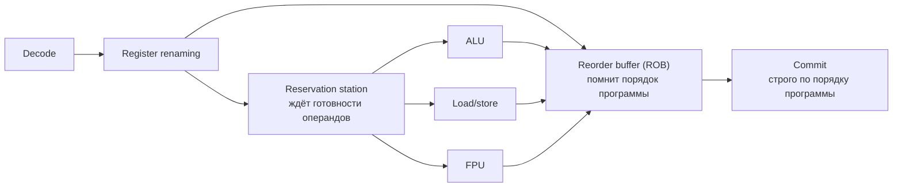

---
tags:
  - domain/computer
  - theme/performance
  - theme/internals
  - type/concept
aliases:
  - CPU
  - Central Processing Unit
  - Processor
  - Pipeline
order: 1
---

# Процессор

**Предпосылки:** [базовое программирование](../programming/programming.md) (переменные, циклы, функции).

[[computer/data-path/memory-hierarchy|Путь данных: Иерархия памяти]] | [[computer/programmer-model/isa|Программная модель: CISC и RISC]] →

Когда вы пишете программу, код не "выполняется сам". Команды нужно по одной прочитать, понять и применить к данным. Пока программа маленькая, об этом почти не думаешь: написал цикл, запустил, получил результат. Но как только возникает вопрос "почему эта программа вообще работает" или "почему простой код может работать медленно", быстро упираешься в одну и ту же сущность. Нужна часть компьютера, которая и занимается выполнением команд. Эта заметка объясняет, что это за часть, как она работает и почему её внутреннее устройство влияет на скорость программы.

## Что делает процессор

Процессор — это машина, которая умеет ровно одно: брать инструкцию из памяти, разбираться что она означает, и выполнять её. Потом следующую. Потом следующую. Миллиарды раз в секунду. Любая программа — на Ruby, Rust, C — в конечном счёте превращается в последовательность таких машинных инструкций. Каждая инструкция — элементарная операция: сложить два числа, загрузить значение из памяти, сравнить и перейти по другому адресу. Вся мощь компьютера — это комбинация этих примитивов на огромной скорости.

Возьмём простую задачу: просуммировать массив из миллиона целых чисел.

```c
int sum = 0;
for (int i = 0; i < 1000000; i++)
    sum += arr[i];
```

Компилятор превращает этот цикл в последовательность [машинных инструкций](../programming/assembler.md): загрузить элемент массива из памяти в регистр, прибавить к аккумулятору, увеличить индекс, проверить условие цикла, перейти к началу. Каждая итерация — 4–5 инструкций. Миллион итераций — около 5 миллионов инструкций. На процессоре с частотой 3 ГГц это должно занять... сколько? Ответ зависит от того, как процессор устроен внутри.

## Такт и регистры

**Такт** — минимальный временной шаг работы процессора. На частоте 3 ГГц один такт длится 1 / 3 000 000 000 = 0.33 наносекунды. Генератор посылает электрический импульс, и все блоки процессора синхронно делают один шаг своей работы.

Процессор не может складывать «два числа из оперативной памяти» напрямую. У него есть собственное крошечное хранилище — **регистры** (registers, буквально «ячейки-хранилища»). Доступ к регистру занимает порядка одного такта — доли наносекунды. Доступ к оперативной памяти — порядка 100 наносекунд, в сотни раз медленнее. Если бы процессор каждую операцию делал с RAM напрямую, он простаивал бы 99% времени в ожидании данных. Регистры — решение проблемы «память слишком далеко».

Обратная сторона: регистров мало. В архитектуре x86-64 доступно 16 регистров общего назначения, каждый по 64 бита — всего 128 байт. Эти 16 регистров вместе с несколькими специальными (`rip` — instruction pointer, указатель на текущую инструкцию; `rflags` — флаги состояния) образуют **регистровый файл** (register file) — внутреннюю память ядра, доступную за доли наносекунды. Всё, что не помещается в 128 байт регистров, живёт в оперативной памяти и должно быть явно загружено перед использованием и записано обратно после.

> [!info]- Откуда взялись имена регистров x86-64
> На Intel 8086 (1978) каждый 16-битный регистр имел предназначение: AX — accumulator (аккумулятор, основной регистр для арифметики), BX — base (базовый, для адресации памяти), CX — counter (счётчик циклов), DX — data (данные, расширение аккумулятора). Intel 80386 (1985) расширил регистры до 32 бит, добавив префикс E — Extended: EAX, EBX. AMD64 (2003) расширил до 64 бит с префиксом R — Register: RAX, RBX. Тогда же добавились безымянные R8–R15. В современном коде компилятор использует все 16 регистров без оглядки на исторические имена.

Разрыв между скоростью регистров (~0.33 нс) и скоростью RAM (~100 нс, то есть ~300 тактов простоя) — центральная проблема производительности, и большинство архитектурных решений в процессоре работают вокруг неё.

## Тактовая частота

Тактовая частота определяет, сколько тактов процессор выполняет в секунду. Но что именно помещается в один шаг — зависит от того, как устроен процессор внутри.

## Цикл «выбрать — декодировать — исполнить»

Процессор работает с инструкциями в цикле из трёх фаз. Fetch (выборка) — загрузить очередную инструкцию по адресу из счётчика инструкций (program counter, `rip` в x86-64). Decode (декодирование) — разобрать инструкцию на операцию и операнды: в `ADD rax, rbx` операция — сложение, а операнды — два регистра, чьи значения она складывает. Execute (исполнение) — в зависимости от инструкции выполнить одно действие: операцию в ALU (Arithmetic Logic Unit, арифметико-логическое устройство — блок, выполняющий арифметику и побитовые операции), обращение к памяти или переход.


Если каждая фаза занимает один такт, одна инструкция обрабатывается за 3 такта. Для нашего цикла суммирования это означает: 5 миллионов инструкций × 3 такта = 15 миллионов тактов. На 3 ГГц — 5 миллисекунд. Но за 9 тактов обрабатываются только 3 инструкции:

```
  Такт:       1     2     3     4     5     6     7     8     9
  Fetch:     [i1]   .     .    [i2]   .     .    [i3]   .     .
  Decode:     .    [i1]   .     .    [i2]   .     .    [i3]   .
  Execute:    .     .    [i1]   .     .    [i2]   .     .    [i3]
```

Пока блок Execute работает, блоки Fetch и Decode простаивают — две трети процессора не делают ничего.

## Конвейер

Проблема наивной модели в том, что три блока не могут работать одновременно над разными инструкциями. Pipeline (конвейер) решает это: пока Execute обрабатывает инструкцию N, Decode разбирает инструкцию N+1, а Fetch загружает N+2.

```
  Такт:       1     2     3     4     5     6     7
  Fetch:     [i1]  [i2]  [i3]  [i4]  [i5]   .     .
  Decode:     .    [i1]  [i2]  [i3]  [i4]  [i5]   .
  Execute:    .     .    [i1]  [i2]  [i3]  [i4]  [i5]
```

Первая инструкция по-прежнему выходит через 3 такта (это задержка — latency). Но начиная с третьего такта каждый следующий такт завершает одну инструкцию. Пропускная способность (throughput) выросла с одной инструкции за 3 такта до одной инструкции за 1 такт — втрое, при той же частоте. Конвейер не ускоряет отдельную инструкцию, но загружает все блоки процессора параллельно. Наш цикл суммирования теперь выполняется за ~5 миллионов тактов вместо 15 — примерно 1.7 миллисекунды вместо 5.

Аналогия: конвейер на заводе. Если один рабочий собирает машину от начала до конца — он тратит 3 часа на штуку. Если три рабочих встают в цепочку и каждый делает свою операцию — первая машина всё ещё выходит через 3 часа, но после этого каждый час готова ещё одна. Производительность выросла в 3 раза, хотя каждый рабочий работает с той же скоростью.

Реальные процессоры делят работу не на 3, а на 14–20+ стадий. Больше стадий — более мелкая работа на каждой, а значит можно поднять частоту (короткая стадия завершается быстрее, такт можно укоротить). Но длинный конвейер создаёт новую проблему: чем больше стадий, тем дороже обходится ситуация, когда конвейер не может работать на полную мощность.

## Конвейер ломается: зависимость по данным

Конвейер эффективен только пока все стадии заполнены. Когда следующая инструкция нуждается в результате предыдущей, конвейер вынужден ждать.

Data hazard (конфликт данных) — инструкция на стадии Decode нуждается в результате инструкции, которая ещё не дошла до конца Execute. Допустим, `i1: r1 = r2 + r3`, а `i2: r4 = r1 * 5` — второй инструкции нужен `r1`, который ещё вычисляется. Конвейер вынужден вставить «пузырь» (bubble) — пустой такт, пока данные не будут готовы:

```
  Такт:       1     2     3     4     5     6
  Fetch:     [i1]  [i2]  [i3]   .    [i4]  [i5]
  Decode:     .    [i1]  [i2]  [i2]  [i3]  [i4]
  Execute:    .     .    [i1]  bub   [i2]  [i3]
                               ^^^
                        пузырь: i2 ждёт результата i1
```

Частичное решение — forwarding (проброс): результат Execute передаётся напрямую на вход следующей стадии, минуя запись в регистровый файл. Как только `i1` завершает сложение, результат тут же подаётся на вход `i2` — без ожидания. Это спасает от одного-двух тактов задержки, но не помогает, когда результат приходит из памяти (load-use hazard): данные из RAM идут десятки и сотни тактов, и никакой проброс их не ускорит.

## Ветвления и предсказание переходов

Forwarding спасает от задержек внутри арифметики, но есть проблема дороже: условные переходы. В коде постоянно встречаются `if`, `for`, `while`. При команде `if (x > 0)` процессор на стадии Fetch не знает, какую инструкцию загружать следующей — ту, что в ветке `then`, или ту, что в ветке `else`. Результат сравнения станет известен только через несколько тактов, когда инструкция дойдёт до Execute.

Наивное решение — остановить конвейер и ждать результата. При 14 стадиях это означает простой в 14 тактов на каждом ветвлении. В типичном коде условный переход встречается каждые 5–7 инструкций. Если останавливаться каждый раз, конвейер пуст больше половины времени — от его преимуществ не остаётся ничего.

Branch prediction (предсказание переходов) — механизм, который угадывает направление перехода до того, как результат станет известен. Процессор загружает инструкции из предсказанной ветки и продолжает работу, как будто ответ уже получен. Если предсказание верное — никаких потерь. Если неверное — все инструкции, загруженные «по ошибке», сбрасываются, и конвейер заполняется заново. Штраф за промах (misprediction penalty) составляет ~15–20 тактов на современных процессорах — именно столько нужно, чтобы заново заполнить конвейер правильными инструкциями.

Ветвление в нашем цикле `sum += arr[i]` — лёгкий случай: переход на начало берётся 999 999 раз подряд, предсказатель ошибается только на последней итерации. Один промах на миллион — ничтожно, цикл суммирования branch prediction практически не замедляет. Тяжёлый случай — когда направление перехода зависит от данных:

```c
for (int i = 0; i < N; i++) {
    if (data[i] >= 128)   // условный переход
        sum += data[i];
}
```

Если массив отсортирован, переход образует паттерн: сначала все элементы меньше 128 (переход не берётся), потом все больше (переход берётся). Предсказатель выучивает паттерн и почти не ошибается. На неотсортированном массиве со случайными значениями направление перехода хаотично — предсказатель угадывает ~50% случаев. Результат: один и тот же код на отсортированных данных выполняется в 2–5 раз быстрее, чем на неотсортированных, и разница полностью определяется промахами предсказателя. Точность современных предсказателей на реальных программах — 95–99%.

> [!info]- Как устроен предсказатель: от статического к TAGE
> Простейший вариант — static prediction: переход назад (в начало цикла) считается взятым, переход вперёд — не взятым. Это даёт ~60–70% точности, потому что большинство обратных переходов — циклы.
>
> Современные процессоры используют динамическое предсказание. Branch history table (BHT, таблица истории переходов) хранит для каждого адреса перехода двухбитный счётчик с четырьмя состояниями:
>
> ```mermaid
> stateDiagram-v2
>     direction LR
>
>     state "Strongly not taken<br>сильно не взят" as SN
>     state "Weakly not taken<br>слабо не взят" as WN
>     state "Weakly taken<br>слабо взят" as WT
>     state "Strongly taken<br>сильно взят" as ST
>
>     SN --> SN: not taken
>     SN --> WN: taken
>     WN --> SN: not taken
>     WN --> WT: taken
>     WT --> WN: not taken
>     WT --> ST: taken
>     ST --> WT: not taken
>     ST --> ST: taken
> ```
>
> Два левых состояния предсказывают «не взят», два правых — «взят». Двухбитная схема устойчива к единичным аномалиям: если цикл на 1000 итераций один раз не берётся (при выходе), счётчик перейдёт из «сильно взят» в «слабо взят» — предсказание не сломается.
>
> Продвинутые предсказатели (TAGE — TAgged GEometric history length) учитывают не только прошлые результаты этого же перехода, но и глобальную историю — результаты других переходов, сработавших незадолго до него. Это позволяет улавливать корреляции между разными ветвлениями: «если предыдущие два if-а пошли по true, третий тоже».

> [!info]- Задача: оценить потери от промахов предсказания
> Процессор с конвейером в 16 стадий выполняет программу из 1000 инструкций, в которой каждая 6-я — условный переход. Предсказатель имеет точность 97%. Сколько тактов потеряно на промахах?
>
> **Частая ошибка:** считать только число промахов, забывая о длине конвейера.
>
> Переходов: 1000 / 6 ≈ 167. Промахов: 167 × 0.03 ≈ 5. Штраф за промах ≈ длина конвейера = 16 тактов. Потери: 5 × 16 = 80 тактов. При идеальном конвейере 1000 инструкций выполняются за ~1000 тактов (IPC = 1), так что 80 тактов — это ~8% замедления. С точностью 90% промахов было бы 17, потери — 272 такта, ~27% замедления. Отсюда видно, почему разница между 97% и 90% точности предсказания — не «незначительные 7%», а трёхкратное различие в потерях.

## Суперскалярное исполнение

Даже при идеальном предсказании переходов пропускная способность конвейера ограничена: одна инструкция за такт. При 3 ГГц — 3 миллиарда инструкций в секунду. Чтобы ускориться дальше, нужно выполнять несколько инструкций за один такт.

Конвейер сделал так, чтобы каждый блок работал на каждом такте. Суперскалярная архитектура (superscalar, буквально «сверхскалярная» — способная обрабатывать больше одного скалярного значения за такт) делает следующий шаг: дублирует исполнительные блоки. Вместо одного ALU процессор содержит несколько: два-три для целочисленных операций, два для операций с плавающей точкой (FPU, Floating Point Unit — блок вещественной арифметики), отдельные блоки для загрузки и записи в память. На каждом такте процессор выбирает, декодирует и отправляет на исполнение не одну, а несколько инструкций параллельно — столько, сколько позволяют независимые ресурсы.

```
  Такт:       1      2      3      4
  ALU 0:     [i1]   [i3]   [i5]   [i7]
  ALU 1:     [i2]   [i4]   [i6]   [i8]
  FPU:        .     [f1]   [f2]   [f3]
  Load:      [ld1]  [ld2]  [ld3]  [ld4]
```

Ширина суперскалярного процессора (issue width) — количество инструкций, которые он может запустить за один такт. Современные процессоры имеют ширину 4–6: Intel Golden Cove (Alder Lake, 2021) — до 6 микроопераций (внутренних команд процессора; подробнее ниже) за такт, Apple Firestorm (M1, 2020) — до 8.

Ключевая метрика — IPC (instructions per clock, инструкций за такт). Не суперскалярный конвейер даёт IPC = 1. Суперскалярный процессор с шириной 4 теоретически может дать IPC = 4, но на практике достигает 2–4 в зависимости от кода: не всегда удаётся найти 4 независимые инструкции подряд, не все исполнительные блоки загружены каждый такт, и зависимости по данным создают простои. Производительность процессора определяется формулой:

```
Производительность ≈ Частота × IPC
```

Процессор на 3 ГГц с IPC = 1 выполняет 3 миллиарда инструкций в секунду. Процессор на 3 ГГц с IPC = 3 — 9 миллиардов. Вот почему два процессора на одной частоте показывают разный результат: серверный процессор 2010-х с IPC ~1.5 и Apple M1 с IPC ~3–4 оба на 3 ГГц, но M1 выполняет вдвое-втрое больше работы за каждый такт.

Но загрузить все блоки удаётся не всегда. Structural hazard (конфликт ресурсов) возникает, когда две инструкции одновременно нуждаются в одном блоке — например, единственном делителе. Одна из них ждёт. Решается дублированием ресурсов, но каждый дополнительный блок стоит транзисторов и энергии, поэтому редко используемые блоки (делитель, криптографические инструкции) обычно не дублируют.

В нашем цикле суммирования зависимости внутри одной итерации распадаются на две независимые цепочки. Первая: загрузить `arr[i]` → прибавить к сумме (сложение ждёт загруженного значения). Вторая: увеличить индекс → сравнить с границей → перейти на начало (сравнение ждёт нового индекса, переход — сравнения). Суперскалярный процессор тянет обе цепочки параллельно на разных блоках: в первом такте стартуют загрузка и увеличение индекса, во втором — сложение и сравнение, в третьем — переход. Три такта на пять инструкций вместо пяти последовательных — IPC поднимается с 1 до ~5/3 ≈ 1.7, почти вдвое против скалярного конвейера.

Помимо целочисленных ALU и FPU, суперскалярный процессор может содержать и другие специализированные блоки — например, FMA (Fused Multiply-Add — совмещённое умножение-сложение) для задач линейной алгебры и блоки SIMD (Single Instruction, Multiple Data — одна инструкция, много данных) для обработки нескольких чисел одной инструкцией. Подробно об этом — в [[computer/programmer-model/simd|заметке о SIMD]].

На x86-процессорах сложные инструкции переменной длины на стадии Decode разбиваются на микрооперации (micro-ops, μops) — простые внутренние команды фиксированной длины, с которыми работают конвейер и суперскалярный движок. Подробнее о [[computer/programmer-model/isa|различиях наборов команд]] — CISC, RISC и их влиянии на энергоэффективность.

## Внеочерёдное исполнение

Суперскалярный процессор может запустить несколько инструкций параллельно, но только если они независимы — не используют результат друг друга. В коде `a = b + c; d = a * 2` вторая инструкция зависит от первой: значение `a` нужно, чтобы вычислить `d`. Параллельно их запустить нельзя. Чем больше зависимостей в коде, тем ниже реальный IPC. Нужен способ не ждать, а делать что-то полезное.

Out-of-order execution (OoO, внеочерёдное исполнение) разрешает процессору выполнять инструкции не в том порядке, в котором они записаны в программе, а в порядке готовности данных. Если инструкция N ждёт результата из памяти, а инструкции N+1, N+2, N+3 от неё не зависят — процессор находит их и запускает раньше.

Допустим, программа содержит такую последовательность:

```
1: load  r1, [addr_A]     # загрузить из памяти в r1 (~300 тактов)
2: add   r2, r1, 10       # r2 = r1 + 10  (зависит от r1)
3: load  r3, [addr_B]     # загрузить другой адрес (~300 тактов)
4: mul   r4, r3, 5        # r4 = r3 * 5   (зависит от r3)
5: add   r5, r6, r7       # r5 = r6 + r7  (не зависит ни от r1, ни от r3)
```

Процессор с выполнением по порядку (in-order) начинает `load r1` и ждёт ~300 тактов. Потом выполняет `add r2`, начинает `load r3`, снова ждёт ~300 тактов. Общее время — около 600 тактов, большая часть которых — ожидание:

```
In-order:
  такт:    0         300       301       600       601  602
  i1:      |--load r1--|
  i2:                   |add r2|
  i3:                           |---load r3---|
  i4:                                          |mul r4|
  i5:                                                  |add r5|
  итого: ~602 тактов
```

Процессор с OoO видит всю картину сразу. Он запускает `load r1` и `load r3` параллельно — оба обращения к памяти идут одновременно. Пока данные в пути, он исполняет `add r5 = r6 + r7`, потому что эта инструкция не зависит ни от одного загружаемого значения. Когда `r1` приходит — выполняется `add r2`. Когда `r3` — `mul r4`:

```
Out-of-order:
  такт:    0         1       300       301  302
  i1:      |---load r1------------|
  i3:      |---load r3------------|
  i5:      |add r5|                               (готова сразу)
  i2:                              |add r2|       (ждала r1)
  i4:                              |mul r4|       (ждала r3)
  итого: ~302 тактов
```

Вместо 600 тактов — ~300, потому что оба обращения к памяти перекрылись, а независимая арифметика выполнилась в «дырке» ожидания.

Внутри OoO-процессора инструкции проходят через три специальные структуры: **reservation station** (буфер ожидания операндов), **reorder buffer** (журнал исходного порядка) и **register renaming** (устранение ложных зависимостей). У каждой своя задача.

### Reservation station

После декодирования инструкция попадает в reservation station (RS, станция резервирования) — буфер ожидания, где она ждёт готовности своих операндов. Как только оба операнда доступны (вычислены предыдущими инструкциями или уже лежат в регистрах), RS отправляет инструкцию на свободный исполнительный блок. Это и есть внеочерёдная диспетчеризация: инструкции запускаются не в порядке программы, а в порядке готовности.

### Reorder buffer

Одновременно каждая инструкция получает запись в reorder buffer (ROB, буфер переупорядочивания). ROB запоминает исходный порядок инструкций. Внутри процессора инструкции могут выполняться в произвольном порядке, но результаты фиксируются (commit) строго по порядку программы — с головы ROB. Это гарантирует, что программа видит ожидаемое поведение: если возникнет прерывание или исключение, процессор откатывает все инструкции, выполненные «забегая вперёд», и состояние будет таким, как будто они никогда не запускались.

### Register renaming

Ещё одно препятствие для OoO — ложные зависимости. В коде `r1 = r2 + r3; r1 = r4 + r5` вторая инструкция не использует результат первой, данные независимы, но обе пишут в один и тот же регистр `r1`. Если OoO выполнит вторую раньше первой, а потом первую — первая затрёт результат второй, и в `r1` окажется `r2 + r3` вместо ожидаемого `r4 + r5`. Чтобы такого не произошло, наивный OoO вынужден сериализовать такую пару — хотя по данным они не зависят друг от друга.

Register renaming (переименование регистров) снимает это ограничение. Внутри процессор держит значительно больше физических регистров, чем видит программа (на x86-64 программе доступно 16 регистров общего назначения, физических внутри — 200+), и таблицу соответствия «архитектурный регистр, который видит код → текущий физический, в котором реально лежат данные». Инструкция, пишущая в `r1`, получает свежий физический слот (скажем, `P42`): результат пойдёт туда, а таблица сразу обновляется на `r1 → P42`. Любое последующее чтение `r1` сверяется с таблицей и забирает актуальный физический регистр. Когда появляется вторая запись в `r1`, ей выдаётся уже другой слот — скажем, `P57`, таблица обновляется на `r1 → P57`, но `P42` остаётся жить, пока на него есть читатели. Две записи в `r1` оказываются в разных физических местах, ложной зависимости между ними больше нет — они могут выполняться параллельно.



RS отвечает на вопрос «что уже готово к запуску?», ROB — на «в каком порядке результаты делать видимыми программе?», register renaming — на «как не дать одинаковым именам регистров создать ложную зависимость». Все три вместе позволяют выполнять независимые инструкции раньше, не ломая модель последовательного исполнения.

Путь инструкции через OoO-процессор: (1) decode разбирает инструкцию; (2) register renaming назначает физический регистр; (3) инструкция занимает запись в ROB и отправляется в reservation station; (4) RS ждёт готовности операндов; (5) как только операнды готовы, инструкция уходит на исполнительный блок; (6) результат записывается в физический регистр, инструкция помечается как завершённая в ROB; (7) когда инструкция оказывается на голове ROB (все более старые уже зафиксированы), происходит commit — результат становится архитектурно видимым, запись ROB освобождается.

Запись в ROB выделяется при декодировании и освобождается только при коммите. Если инструкция загрузки ждёт данные из памяти — как те 200 тактов в примере выше — её запись занята, и все более молодые инструкции за ней не могут зафиксироваться, даже если давно завершились. Старые записи висят, а процессор параллельно продолжает декодировать новые и выделять им следующие слоты — буфер постепенно заполняется. Когда свободных записей не остаётся, процессор останавливает декодирование — поток новых инструкций иссякает. Поэтому современные процессоры наращивают ROB: Intel Golden Cove — 512 записей, Apple M1 Firestorm — ~630. Чем больше буфер, тем дальше процессор заглядывает за застрявшую инструкцию и тем больше независимой работы находит.

В нашем цикле суммирования `sum += arr[i]` OoO не устраняет главную зависимость: каждое прибавление к `sum` ждёт результата предыдущего — это loop-carried dependency (зависимость между итерациями), которую перестановкой инструкций не обойти. Но OoO всё равно помогает: он перекрывает загрузку `arr[i+1]` с адресной арифметикой следующей итерации, пока текущее сложение вычисляется. Полезная работа заполняет «дырки» ожидания, даже если сама цепочка `sum` остаётся последовательной.

## Спекулятивное исполнение

Предсказание переходов говорит процессору, *куда* пойдёт ветвление. Внеочерёдное исполнение позволяет *выполнять* инструкции, не дожидаясь подтверждения. Вместе они образуют speculative execution (спекулятивное исполнение): процессор выполняет инструкции из предсказанной ветки до того, как условие вычислено. Если предсказание верное — результаты фиксируются в ROB как обычно. Если нет — ROB отбрасывает всё, что было сделано спекулятивно, и конвейер начинает заново с правильной ветки.

Спекулятивное исполнение критически важно для производительности: без него OoO-процессор останавливался бы на каждом условном переходе, не имея возможности заглянуть дальше. Учитывая, что переходы встречаются каждые 5–7 инструкций, без спекуляции [ROB](#reorder-buffer) быстро опустеет — нечего будет выполнять параллельно.

Помимо ветвлений, процессор оптимизирует и загрузки из памяти, следующие за ещё не зафиксированными записями. Главная трудность в том, что store может ещё не знать, в какую ячейку памяти он пишет, — и от этого зависит, как процессор работает со следующим за ним load'ом. Чтобы увидеть, откуда берётся такая неопределённость, надо разобраться, что вообще такое «адрес» в машинной инструкции. Возьмём цикл суммирования массива `sum += arr[i]` и посмотрим, во что его превращает компилятор.

В ассемблере x86-64 тело цикла выглядит примерно так:

```asm
loop:
    mov  eax, [rbx + rcx*4]   ; eax = arr[i]
    add  esi, eax             ; sum += eax
    inc  rcx                  ; i++
    cmp  rcx, rdi             ; i < n?
    jl   loop
```

Первая строчка — `mov eax, [rbx + rcx*4]`. Квадратные скобки означают обращение к памяти, но внутри них не номер ячейки, а **выражение**. Компилятор положил начало массива `arr` в регистр `rbx`, счётчик `i` — в `rcx`, и вписал адрес как `rbx + rcx*4` прямо в инструкцию (4 — размер `int` в байтах). На каждой итерации `rcx` разный, поэтому `rbx + rcx*4` каждый раз даёт другой результат — разные адреса для разных элементов массива. Одна машинная инструкция «ходит» по миллиону ячеек только потому, что регистр в её адресе на каждом шаге другой; без этого компилятору пришлось бы сгенерировать миллион отдельных `mov`'ов.

Чтобы это выражение стало конкретным номером ячейки, процессор его **считает**: умножает `rcx` на 4 и прибавляет к `rbx`. Арифметикой адресов занимается отдельный исполнительный блок — AGU (Address Generation Unit, блок вычисления адресов). Сама операция простая, один такт, но она возможна только когда **все регистры в выражении уже имеют значения**. В нашем цикле это почти всегда мгновенно: `rcx` обновляется быстрым `inc`. Но в более сложном коде задержка может быть существенной. Например, в `arr[indices[i]]` индекс сам читается из другой таблицы: адрес нижнего `mov`'а зависит от результата верхнего. Если верхний `mov` тянет значение из оперативной памяти (те самые ~100 нс, что мы уже видели в начале — около трёхсот тактов на 3 ГГц), нижний `mov` всё это время висит в [reservation station](#reservation-station): один из регистров в его адресном выражении ещё не произведён, и считать нечего. Store-инструкции ведут себя ровно так же — если в их адресном выражении есть регистр, который пока формирует какая-то инструкция выше по программе, store висит и не знает своего адреса.

### Store buffer

Когда store наконец получает операнды и считает свой адрес, у него на руках и адрес, и значение — всё, что нужно для записи в память. Но писать сразу он всё равно не будет. В OoO-процессоре store-инструкции после исполнения уходят в отдельное хранилище — **store buffer** (буфер записей), — и лежат там до коммита. Причина — та же, что у [ROB](#reorder-buffer): до коммита всё сделанное считается спекулятивным, а запись в память **необратима**, её нельзя откатить. Если позже выяснится, что store оказался на неверной ветке предсказания перехода, процессор должен иметь возможность выбросить его как не случившийся — а это возможно только пока запись не стала видимой снаружи. Поэтому сам момент записи откладывается до коммита: пока store не добрался до головы ROB, его адрес и значение живут только в store buffer, и снаружи их как будто не существует. Когда store доходит до головы ROB, запись становится неоткатываемой и может начать уходить дальше в иерархию памяти. Как тот же буфер взаимодействует с кешем и почему помогает скрывать задержку записи, разберём в [[computer/data-path/memory-hierarchy|иерархии памяти]].

ROB и store buffer не дублируют друг друга, а работают в паре. ROB помнит порядок **всех** инструкций и решает, **когда** разрешать коммит (по порядку программы). Store buffer помнит, **что** надо записать — физически держит адрес и значение store'а от момента исполнения до момента коммита. Одна store-инструкция имеет запись и в ROB (как любая инструкция), и в store buffer (потому что специфически является store'ом).

Ключевой вопрос для пары «store → load» — совпадают ли их адреса: от этого зависит, из какого места load должен брать значение.

### Store-to-load forwarding

Store-to-load forwarding (буквально «пересылка от записи к загрузке») работает в простом случае: адреса store'а и load'а уже известны и совпадают. Раз они совпадают, load должен прочитать ровно то значение, что записал этот store. Но в памяти его ещё нет — оно всё ещё висит в store buffer. Процессор берёт его напрямую оттуда и отдаёт загрузке, минуя поход в память.

### Memory disambiguation

Memory disambiguation (буквально «снятие неоднозначности по адресам памяти») решает более тонкий случай. Чтобы понять его, надо увидеть, какая зависимость скрывается между store и load. В программе store стоит **раньше** load. Если они обращаются к одному и тому же адресу памяти — то есть пишут и читают одну и ту же ячейку, — между ними возникает настоящая зависимость по данным: load обязан увидеть именно то значение, которое только что туда положил store, ровно как в обычной цепочке `b = a + 1; c = b + 1` вторая операция обязана видеть результат первой. Порядок «сначала store, потом load» в этом случае критичен, и нарушать его нельзя — load, исполненный раньше, прочитал бы не то. Если же адреса разные, никакой зависимости между store и load нет: они живут в разных ячейках памяти, друг другу не мешают, и могут исполняться в любом порядке — хоть load до store'а.

Вопрос «есть или нет зависимость» сводится к вопросу «совпадают ли адреса», и именно в этот вопрос процессор упирается. Load к исполнению готов (его адрес посчитан, регистры в адресном выражении все на месте), а вот у предшествующего store'а адрес ещё не вычислен — сам store висит в [reservation station](#reservation-station) и ждёт свои операнды. Один адрес из двух процессор знает, другого — нет, и совпадение никак не проверить. Ждать вычисления адреса — значит остановить load и всю цепочку инструкций, зависящих от его результата, на те такты, что store собирает операнды и считает адрес; в типичном коде это десятки тактов, а если адрес store сам опирается на загрузку из памяти — сотни. Поэтому процессор делает ставку: предполагает, что адреса **не** совпадут (то есть скрытой зависимости между этим store и этим load на самом деле нет), и запускает load прямо сейчас — тот идёт в память по своему собственному (и уже известному) адресу, как будто store рядом вообще не стоит. Если ставка сыграла, load стартует без задержки и получает правильное значение, а вся цепочка зависимых от него инструкций катится дальше без пауз — то самое ожидание на десятки-сотни тактов, о котором шла речь выше, здесь вообще не происходит. В типичном коде соседние store и load бьют по разным местам (`a[i] = x; y = b[j]`), так что ставка срабатывает почти всегда.

Проигрыш — это когда адреса всё-таки совпали. А раз совпали, значит, зависимость между store и load **была** настоящей: load должен был прочитать ровно то, что только что записал этот store, и порядок «сначала store, потом load» должен был быть соблюдён. Но мы его нарушили — запустили load раньше, не дождавшись store'а. В итоге обычная загрузка прочитала из памяти то, что лежало там **до** нашей записи: свежее значение, которое store только что отправил в store buffer, в память ещё не дошло, а в памяти сидит предыдущее. Это первая часть беды: load вернул неправильное число. Вторая часть хуже — процессор-то не знал, что число неправильное, и все инструкции после load'а, которые успели подхватить его результат и что-то на нём посчитать, тоже поработали с неправильными данными. Когда store наконец вычислит свой адрес и обнаружится совпадение, откатывать приходится не только сам load, а всю цепочку зависимостей за ним — как при промахе предсказания переходов. После отката load переисполняется уже через forwarding: адрес store теперь известен, совпадение очевидно, и свежее значение берётся напрямую из store buffer. Порядок «сначала store, потом load» на этот раз соблюдён — но ценой десятков тактов на откат и переигровку. Такой сценарий — редкий (совпадение адресов у соседних store и load нетипично), и эта цена с лихвой окупается теми десятками случаев, когда ставка выигрывала и load не ждал ни одного такта.

### Spectre и Meltdown

Сам принцип спекулятивного исполнения — выполнить инструкции до того, как известно, можно ли было, а потом откатить регистры при ошибке — стал причиной двух крупнейших аппаратных уязвимостей, Spectre и Meltdown, обнаруженных в январе 2018 года. Речь здесь уже не про memory disambiguation как частный случай, а про спекуляцию в целом: и про предсказание переходов, и про спекулятивный доступ к памяти в обход проверки прав. Общий принцип обеих атак: при спекулятивном выполнении процессор обращается к данным, к которым у программы нет доступа. Регистры потом откатываются, но побочный эффект — изменение состояния кеша (промежуточной памяти между процессором и RAM — подробно в [[computer/data-path/memory-hierarchy|следующей заметке]]) — остаётся. Кеш откату не подлежит: это отдельная структура, которую спекулятивный код успевает «испачкать» до того, как ошибка заметится. Атакующий измеряет тайминг доступа к кешу и по тому, какая кеш-линия «нагрета», восстанавливает секретные данные.

Исправления потребовали изменений в микрокоде, операционных системах и компиляторах. Совокупная цена — снижение производительности на 2–30% в зависимости от рабочей нагрузки. Вычислительные задачи почти не пострадали: они редко обращаются к ядру. Задачи с частыми [системными вызовами](../linux/foundations/cpu-modes-and-syscalls.md) (обращениями к операционной системе — базы данных, сетевые серверы) пострадали сильнее: PostgreSQL потерял 7–17% производительности на операциях SELECT.

> [!info]- Механизм атак Spectre/Meltdown
> Meltdown эксплуатирует конкретную ошибку реализации в процессорах Intel: при спекулятивном выполнении процессор читает данные из памяти ядра ОС, не дожидаясь проверки прав доступа. Атакующий спекулятивно загружает секретный байт из ядра, затем обращается к массиву по индексу, равному значению этого байта. После отката значение исчезает из регистров, но одна строка массива оказывается в кеше, остальные — нет. Измеряя время доступа (данные в кеше ≈ 4 нс, в RAM ≈ 100 нс), атакующий определяет индекс и восстанавливает секретный байт. Скорость: ~500 КБ/с.
>
> Spectre — более фундаментальная проблема: атакующий «обучает» предсказатель переходов чужого процесса так, чтобы тот спекулятивно выполнил код, читающий данные за границами массива. Spectre затрагивает все процессоры с предсказанием переходов — Intel, AMD, ARM.
>
> Исправления потребовались на трёх уровнях: обновления микрокода с барьерами спекуляции, изоляция адресных пространств на уровне ОС, замена уязвимых паттернов кода в компиляторах (retpoline — специальная последовательность для косвенных переходов).

Спекуляция превратила кеш из прозрачной оптимизации в поверхность атаки — и этот факт резко сделал его видимым для программиста. Но атаки Spectre/Meltdown показали более глубокую проблему: даже если спекулятивное исполнение безопасно, доступ к памяти остаётся узким местом. Каждый раз, когда процессор ждёт данные, конвейер останавливается. Несколько техник (OoO, спекулятивная загрузка) помогают скрывать ожидание, но полностью избежать его невозможно.

## Стена памяти

Конвейер, суперскалярность, OoO, спекулятивное исполнение — все эти техники увеличивают количество полезной работы, которую процессор выполняет за каждый такт. Но есть ограничение, которое они не могут преодолеть: скорость доступа к данным.

Каждая арифметическая операция требует операндов. Если операнды в регистрах — один такт, ~0.33 нс. Если в оперативной памяти — ~100 нс, что при 3 ГГц составляет ~300 тактов простоя. За эти 300 тактов суперскалярный процессор с шириной 6 мог бы выполнить до 1800 операций — но он ждёт одного числа из RAM.

Проблема глубже, чем кажется. Тактовая частота процессоров росла экспоненциально с 1980-х по середину 2000-х: от 5 МГц (Intel 8086, 1979) до 3.8 ГГц (Pentium 4, 2004) — рост в ~760 раз. Задержка оперативной памяти за то же время улучшилась лишь в ~1.5–2 раза. Разрыв между скоростью процессора и задержкой памяти увеличивается с каждым поколением — это и есть «стена памяти» (memory wall). Почему [[computer/data-path/ram|DRAM]] не может стать быстрее — вопрос физики хранения данных, разобранный в отдельной заметке.

Для нашего цикла суммирования это означает: даже с OoO-перекрытием загрузок, если массив не помещается в быстрое хранилище рядом с процессором, каждое обращение к `arr[i]` стоит сотни тактов. Вычисления упираются не в арифметику, а в ожидание данных.

Между регистрами и оперативной памятью необходим промежуточный слой — кеш-память (cache), которая хранит копии часто используемых данных ближе к процессору. Стена памяти ведёт к [[computer/data-path/memory-hierarchy|иерархии кешей]]. Но есть и другой вопрос: какой набор команд процессор предоставляет программе и как это влияет на энергоэффективность — [[computer/programmer-model/isa|CISC и RISC]].

## От одного ядра к нескольким

Всё вышеописанное — конвейер, суперскалярность, OoO, спекулятивное исполнение — это архитектура одного **ядра** (core). Ядро — независимая копия всего вычислительного конвейера внутри процессора: собственные регистры, собственные стадии fetch/decode/execute, собственные ближайшие уровни кешей. Каждое ядро исполняет свой поток инструкций полностью автономно, как если бы это был отдельный простой процессор. Современные процессоры помещают на один кристалл несколько таких ядер: 8–16 в десктопных, 64–128 в серверных.

Но если ядра работают с общими данными, возникают два вопроса: где именно лежат эти данные (в чьём кеше?) и как гарантировать, что все ядра видят одну и ту же версию? Ответы — в [[computer/data-path/memory-hierarchy|иерархии памяти]] и [[computer/data-path/cache-coherency|когерентности кешей]].

## Sources

- John L. Hennessy, David A. Patterson, 2017, *Computer Architecture: A Quantitative Approach* — 6th edition: https://www.elsevier.com/books/computer-architecture/hennessy/978-0-12-811905-1
- David A. Patterson, John L. Hennessy, 2020, *Computer Organization and Design RISC-V Edition* — 2nd edition
- Fog, Agner, 2024, *The microarchitecture of Intel, AMD, and VIA CPUs* — optimization reference: https://www.agner.org/optimize/microarchitecture.pdf
- Kocher, Paul et al., 2019, *Spectre Attacks: Exploiting Speculative Execution*: https://spectreattack.com/spectre.pdf
- Brendan Gregg, 2018, *KPTI/KAISER Meltdown Initial Performance Regressions* — PostgreSQL 7–17% degradation: https://www.brendangregg.com/blog/2018-02-09/kpti-kaiser-meltdown-performance.html

---

[[computer/data-path/memory-hierarchy|Путь данных: Иерархия памяти]] | [[computer/programmer-model/isa|Программная модель: CISC и RISC]] →
