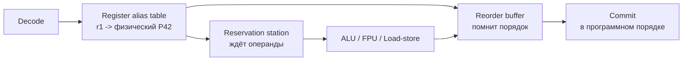

---
tags:
  - domain/computer
  - theme/performance
  - type/concept
aliases:
  - Out-of-order execution
  - OoO
  - Reservation station
  - Reorder buffer
  - Register renaming
  - Memory disambiguation
order: 1.5
---

# Внеочерёдное исполнение

**Предпосылки:** [процессор](../cpu.md) (конвейер, такт, зависимость по данным, суперскалярное исполнение, регистры, исполнительные блоки, инструкции load/store, IPC, спекуляция, предсказание переходов); [очередь](../../algorithms-and-data-structures/linear/stack-queue-deque.md) (FIFO: добавление в хвост, извлечение из головы; круговая очередь).

← [[computer/cpu|Процессор]]

Конвейер загружает все блоки ядра параллельно, и суперскалярная выдача снимает ещё один потолок — несколько инструкций за такт. Но обе техники опираются на одно и то же условие: между соседними инструкциями нет зависимостей по данным. Как только в коде встречается `b = a + 1; c = b * 2`, цепочка схлопывается обратно в последовательную: вторая инструкция ждёт результата первой, и весь параллелизм на этом участке исчезает. Если первая к тому же тянет значение из оперативной памяти, вторая простаивает сотни тактов — а за ней висит всё остальное.

Но за «застрявшей» инструкцией почти всегда стоят другие, которые от неё не зависят: их операнды уже готовы. Отдать им свободные блоки — значит занять полезной работой те такты, в которые конвейер иначе просто стоит. Весь вопрос в том, как разрешить процессору запускать инструкции по готовности данных, а не по порядку записи, — и при этом сохранить для программы видимость, будто всё шло строго по порядку.

## Зачем нужно выходить из программного порядка

Допустим, процессор выполняет последовательность:

```
1: load  r1, [A]       # ~300 тактов: данные в RAM
2: add   r2, r1, 10    # ждёт r1
3: load  r3, [B]       # ещё ~300 тактов: другой адрес
4: mul   r4, r3, 5     # ждёт r3
5: add   r5, r6, r7    # не зависит ни от r1, ни от r3
```

Прежде чем читать дальше — посмотрите на пять строк и прикиньте сами: где здесь уходит время впустую и насколько быстрее этот код мог бы пройти, если бы процессор не держался за порядок записи? Подсказка в комментариях: две загрузки по ~300 тактов и одна инструкция, которой ничьи результаты не нужны.

Исполнение в программном порядке (in-order) запускает `load [A]`, упирается в ожидание, после получения значения запускает `add r2`, дальше стартует `load [B]`, снова ждёт, и только в конце добирается до `add r5`. Две загрузки из памяти идут последовательно — около 600 тактов общего времени, почти всё — простой.

Если посмотреть на тот же код, не цепляясь за порядок записи, видна другая картина. Обе загрузки независимы между собой — значит, их можно запустить одновременно: память способна обслуживать несколько обращений сразу. Инструкция `5` не зависит ни от одной из них — её можно выполнить, пока память ещё не ответила. Итог: два ожидания перекрываются, в «дырке» укладывается полезная работа, общее время — около 300 тактов вместо 600.

```
Out-of-order:
  такт:    0                        300       301
  i1:      |--- load [A] (RAM) -----|
  i3:      |--- load [B] (RAM) -----|
  i5:      |add r5|                             (готова сразу)
  i2:                                |add r2|    (ждала r1)
  i4:                                |mul r4|    (ждала r3)
```

Чтобы этот выигрыш получить, процессор должен решить три задачи. Какую инструкцию можно запустить прямо сейчас — нужно отслеживать готовность операндов для каждой. В каком порядке фиксировать результаты — программа должна видеть такое же поведение, как при in-order исполнении, иначе исключения и отладка сломаются. И ещё одна, менее очевидная: одинаковые имена регистров в соседних инструкциях создают ложную видимость зависимости там, где по данным её нет, и с этим тоже нужно что-то сделать. В процессорах с внеочерёдным исполнением каждую задачу решает своя структура.

## Три записи на одну инструкцию

Как только инструкция прошла декодирование, она не уходит сразу на исполнительный блок. Вместо этого она получает три записи в трёх параллельных структурах ядра.

Первая — в **reservation station** (RS, станция резервирования): буфер ожидания, где инструкция стоит, пока не будут готовы её операнды. Как только оба операнда появляются (вычислены предыдущей инструкцией или уже лежат в регистре), RS отправляет инструкцию на свободный исполнительный блок. Отсюда и приходит «внеочерёдность»: из RS выходят те инструкции, что первыми дождались данных, — не те, что раньше пришли.

Вторая — в **reorder buffer** (ROB, буфер переупорядочивания): журнал в программном порядке. Сюда инструкции попадают ровно так, как их декодировал процессор, и покидают его тоже по порядку — с головы. Исполняться они могут в любом порядке, но фиксироваться (архитектурно видимым результатом) — только строго последовательно, как если бы никакого внеочерёдного исполнения не было.

Третья — в **register alias table** (RAT, таблица переименования регистров): отображение «архитектурный регистр, который видит программа → физический регистр, в котором реально лежат данные». Каждая запись в регистр получает свой свежий физический слот, и одно и то же имя `r1` в двух подряд идущих инструкциях превращается в два разных физических регистра. Ложные зависимости по именам на этом исчезают.



RS отвечает на «что запускать прямо сейчас», ROB — на «в каком порядке делать результат видимым», RAT — на «как не спутать записи с одним именем».

## Reservation station

Обычная [очередь](../../algorithms-and-data-structures/linear/stack-queue-deque.md) — FIFO: порядок входа определяет порядок выхода, элементы нельзя «пропустить». Reservation station устроена иначе: это **ассоциативный буфер**, где любая запись может уйти на исполнение, как только её операнды готовы, независимо от того, раньше или позже она пришла. Ближайшая знакомая аналогия — очередь с приоритетом, только приоритет задаётся не числом, а готовностью операндов.

Каждая запись в RS хранит: какая операция (add, mul, load…), на какой исполнительный блок она должна попасть, и два операнда. Операнд может быть уже значением (взят из регистра во время выделения записи) или **тегом** — идентификатором ещё не завершённой инструкции, которая этот операнд произведёт. Пока хотя бы один операнд — тег, запись ждёт.

Когда исполнительный блок завершает инструкцию, он не только записывает результат в физический регистр, но и объявляет на общей шине: «тег T готов, значение такое-то». Все записи в RS, у которых один из операндов был тегом T, одновременно его забирают — и те, у кого это был последний недостающий операнд, сразу становятся готовы к запуску. На следующий такт планировщик RS выбирает среди готовых, кому из них достанется свободный исполнительный блок, и отправляет.

Главное: RS не следит за тем, в каком порядке инструкции были выписаны в программе. Её задача — «кто прямо сейчас может работать» и «есть ли блок, на который это можно отправить». Программный порядок хранится в другом месте.

## Reorder buffer

Пока RS запускает инструкции вразнобой, ROB держит их в том порядке, в котором они декодировались. Это круговая [очередь](../../algorithms-and-data-structures/linear/stack-queue-deque.md) по FIFO: новая запись выделяется в хвосте при декодировании, старейшая живёт в голове, и фиксация (commit) возможна только для головы.

Каждая запись ROB содержит: тип инструкции, её физический регистр-назначение, флаг «завершена или нет», и для store-инструкций — дополнительные поля про запись в память. Когда исполнительный блок заканчивает работу, он помечает нужную запись ROB как завершённую, но сам commit не выполняет. Commit — отдельный этап, и происходит он строго по порядку: голова ROB проверяется каждый такт, и если запись отмечена как завершённая, архитектурное состояние обновляется (физический регистр становится видим программе под именем архитектурного регистра, запись освобождается, голова сдвигается).

Отсюда два полезных свойства. Первое — атомарность внешнего поведения: если между пятой и шестой инструкцией программы произошло исключение или обнаружился промах предсказания ветвления, все записи ROB после точки отката просто выбрасываются, и программа видит состояние ровно на начале шестой инструкции. Никакой из «забежавших вперёд» расчётов не оставил следа в архитектурном состоянии. Второе — обратная сторона этого свойства: запись в ROB занята от момента декодирования до момента коммита. Если инструкция загрузки ждёт данных из RAM 300 тактов, её запись в ROB всё это время висит, и все более молодые инструкции за ней не могут зафиксироваться, даже если давно завершились на своих блоках.

Когда буфер переполняется — в нём нет свободных записей, — процессор останавливает декодирование. Поток новых инструкций иссякает, и параллелизм съёживается. Поэтому современные процессоры наращивают ROB: Intel 12-го поколения — 512 записей, Apple M1 — около 630. Чем глубже буфер, тем дальше процессор заглядывает за застрявшую инструкцию и тем больше независимой работы находит.

## Register renaming

Даже если операнды все готовы, а ROB не переполнен, есть ещё один повод для лишнего ожидания — ложные зависимости по именам регистров. Рассмотрим:

```
i1: r1 = r2 + r3
i2: r1 = r4 + r5
```

По данным эти две инструкции независимы: вторая не использует результата первой, обе только пишут в одно и то же архитектурное имя `r1`. Но если выполнить их одновременно или поменять местами, итог в `r1` зависит от того, какая запись произошла последней физически, — и программа прочитает не то значение, которое ожидала. Такую ложную связь называют **WAW-зависимостью** (write-after-write), а её родственницу — ситуацию «сначала читаем старое значение, потом перезаписываем» — **WAR** (write-after-read). Настоящая зависимость по данным, которую нарушить нельзя, это **RAW** (read-after-write): инструкция читает то, что только что записала другая.

Наивный внеочерёдной процессор вынужден сериализовать WAW и WAR наравне с RAW — иначе программа увидит неверные значения. Но WAW и WAR — не зависимости по сути, а артефакт того, что в архитектуре ограниченное число имён регистров, и компилятор вынужден их переиспользовать.

Register renaming снимает это ограничение. Внутри процессор содержит значительно больше физических регистров, чем видно программе: на x86-64 программа оперирует 16 архитектурными регистрами общего назначения, физических внутри — 200 и больше. Каждая инструкция, пишущая результат, при декодировании получает свежий физический слот — скажем, P42, — и таблица RAT обновляется: архитектурный `r1 → P42`. Чтение `r1` сверяется с таблицей и забирает актуальный физический регистр. Когда появляется вторая запись в `r1`, ей выдаётся другой слот — P57, таблица обновляется на `r1 → P57`, но P42 остаётся жить, пока на него ссылаются читатели или пока инструкция-писатель не освобождена из ROB.

На примере выше: `i1` пишет в P42, `i2` — в P57. Две инструкции, пишущие формально в `r1`, оказываются в разных физических слотах. WAW исчезла. WAR тоже: даже если между ними стоит чтение `r1`, оно увязано с P42, а новая запись идёт в P57 — и никак не затирает то, что видит читатель. Две инструкции теперь могут выполниться параллельно или в обратном порядке; результат `r1`, который увидит программа после коммита обеих, — это содержимое P57, потому что именно этот слот в RAT помечен как текущий.

Когда `i2` коммитится, старое отображение (`r1 → P42`) становится ненужным, и P42 возвращается в пул свободных физических регистров. Этот возврат — тоже по программному порядку: не раньше, чем инструкции, которые могли ещё читать P42, зафиксировались.

## Путь инструкции через внеочерёдное ядро

Собирая все три структуры вместе, полный жизненный цикл одной инструкции выглядит так. Decode разбирает её и обращается к RAT: каждое чтение архитектурного регистра превращается в ссылку на физический, каждая запись получает свежий физический слот. Одновременно выделяется запись в ROB (в хвост, по программному порядку) и запись в RS (с тегами или значениями операндов).

Пока операнды не готовы, запись висит в RS. Как только последний тег разрешился — она уходит на свободный исполнительный блок. Блок считает результат, пишет его в назначенный физический регистр, широковещательно сообщает тег на шину результатов и отмечает соответствующую запись ROB как завершённую.

Фиксация (commit) идёт из головы ROB, каждый такт. Если запись на голове завершена — архитектурное состояние обновляется, RAT закрепляет отображение, старый физический слот уходит в пул свободных, запись ROB освобождается, голова сдвигается. Если голова не завершена — весь поток commit'а останавливается, пока она не завершится. Так внеочерёдное исполнение внутри и последовательное поведение снаружи удаётся удерживать одновременно.

В цикле суммирования `sum += arr[i]` всё это работает следующим образом. Главную цепочку — `arr[i]` → прибавление к `sum` — OoO не ускоряет: это та самая RAW-зависимость, зацепляющая итерации одна за другую (loop-carried), и перестановкой её не убрать. Зато OoO успевает сделать рядом много полезной работы: пока текущее сложение ждёт загрузку `arr[i]`, RS уже запустила вычисление адреса `arr[i+1]`, инкремент индекса и следующую загрузку. Независимая арифметика следующей итерации заполняет такты ожидания данных из текущей — и суммарно цикл идёт в темпе, с которым кеш отдаёт значения, а не в темпе последовательной арифметики.

## Memory disambiguation: ставка на непересечение адресов

До сих пор про загрузки и записи думали в одних и тех же терминах, что и про арифметику. Но с памятью есть тонкий момент, который обычное переименование регистров не решает. Рассмотрим пару инструкций:

```
s1: store  [rax + rcx*4], r8     # записать r8 по адресу (rax + rcx*4)
l1: load   r9, [rbx + rdx*4]     # прочитать из адреса (rbx + rdx*4) в r9
```

В программном порядке store идёт первым. Можно ли `l1` запустить раньше `s1`? Ответ зависит от того, совпадают ли их адреса. Если адреса одинаковы, между ними настоящая RAW-зависимость (load обязан увидеть ровно то значение, которое только что положил store), и порядок нарушать нельзя. Если адреса разные — зависимости нет, load живёт в другой ячейке памяти и может идти хоть первым.

Проблема: адреса вычисляются отдельным исполнительным блоком (address generation unit, блок вычисления адресов) и становятся известны уже после декодирования, когда все регистры в адресном выражении — `rax`, `rcx` для store, `rbx`, `rdx` для load — будут готовы. Load готов прямо сейчас (все его регистры вычислены), а адрес store ещё собирается: `rax` производит какая-то предыдущая инструкция, которая сама ждёт данных из памяти. Ждать store — значит задержать load и всю цепочку зависимых от него инструкций на десятки, а то и сотни тактов.

Процессор делает **ставку**: предполагает, что адреса не совпадут (скрытой зависимости между ними нет), и запускает load прямо сейчас. Load идёт в память по своему собственному — уже известному — адресу, как будто store рядом вообще не стоит. Если ставка сыграла, load стартует без задержки, полученное значение уходит в физический регистр, а зависимые от него инструкции продолжают работу.

```
Ставка выиграла:
  store: адрес вычисляется... (ждёт операндов)
  load:  адрес готов -> запуск -> значение в r9 -> дальнейший код идёт
  позже: адрес store -> совпадает ли с l1? -> НЕТ -> всё корректно
```

Ставка проигрывает, когда адреса всё-таки совпали. А раз совпали — значит, зависимость была настоящей: load должен был прочитать ровно то, что положил store, и порядок должен был соблюдаться. Но мы его нарушили: запустили load раньше store. Обычная загрузка прочитала из памяти **старое** значение — то, что лежало до записи. Свежее значение store ещё висит в отдельном буфере ожидающих записей и в саму ячейку памяти не дошло; канонический разбор этого буфера — в [[computer/data-path/cache-internals#Store buffer: запись не останавливает конвейер|store buffer]], здесь важно только то, что до коммита запись обратима. Хуже того: все инструкции после load, которые успели подхватить его результат и построить на нём свои вычисления, тоже поработали с неверными данными.

```
Ставка проиграла:
  store: адрес вычисляется...
  load:  адрес готов -> запуск -> старое значение в r9 -> цепочка продолжает
  позже: адрес store -> совпадает с l1!
         -> ОТКАТ: load и все зависимые после него выбрасываются из ROB
         -> load переисполняется, значение берётся напрямую из буфера записи
         -> цепочка начинается заново
```

Штраф за откат сопоставим с промахом предсказания переходов — десятки тактов на сброс конвейера и повторное исполнение. Но выигрыш окупается: в типичном коде соседние store и load почти всегда бьют по разным местам (один пишет в `a[i]`, другой читает `b[j]`), так что ставка срабатывает на большинстве пар — каждая из которых сэкономила десятки тактов ожидания. Эта техника называется **memory disambiguation** (снятие неоднозначности по адресам памяти): процессор не ждёт разрешения вопроса «совпадут ли адреса», а угадывает и откатывается на редких промахах.

Важная деталь про откат: чтобы он вообще был возможен, store к моменту, когда load использовал его адрес, ещё не должен был изменить саму память. В OoO-ядре это гарантировано тем, что store-запись живёт в отдельном буфере ожидающих записей вплоть до коммита соответствующей записи ROB. Если после обнаружения совпадения load переисполняется, свежее значение берётся напрямую из этого буфера, минуя кеш. Сам буфер и его взаимодействие с кешем разбираются в [[computer/data-path/cache-internals#Store buffer: запись не останавливает конвейер|store buffer]].

## Цена OoO

Все три структуры — RS, ROB, RAT — плюс широковещательная шина результатов и логика спекулятивных load'ов стоят процессору дорого. Транзисторы: чем больше физических регистров и чем глубже ROB, тем больше площадь кристалла занято служебной логикой, которая никаких полезных вычислений не делает. На современных процессорах десятки процентов площади ядра уходят на OoO-инфраструктуру.

Энергия: каждая инструкция теперь проходит через больше стадий и больше структур, в каждой из которых её запись надо периодически читать и обновлять. Ассоциативный поиск в RS — каждый такт, по всему содержимому буфера, сравнение тегов с объявлениями готовых результатов — одна из самых затратных операций в ядре. Это одна из причин, почему небольшие ядра (Intel Atom E-core, ARM Cortex-A55) используют упрощённые или урезанные версии OoO: ширина RS в единицы записей, малый ROB, или вовсе in-order исполнение — ради энергоэффективности на мобильных и встроенных нагрузках.

Верификация: формальная проверка того, что все мыслимые комбинации отката, спекулятивного исполнения и порядка коммита дают корректное поведение, — отдельная инженерная дисциплина. История с уязвимостями класса Spectre показала, что даже тщательно спроектированный OoO оставляет побочные эффекты в состоянии кеша, которые формально не входят в архитектурный контракт — но наблюдаемы снаружи. Общая картина спекуляции и её последствий — в разделе про [[computer/cpu#Спекулятивное исполнение|спекулятивное исполнение]].

Отдача всё это оправдывает. Без OoO суперскалярный процессор на типичном коде выдаёт IPC около 1–1.5 (инструкций за такт) — большую часть времени он ждёт данных. С OoO тот же код на той же частоте даёт IPC 3–4: задержки памяти маскируются независимой работой из окна ROB, ложные зависимости растворяются в переименовании, ветвления перекрываются предсказателями, редкие промахи memory disambiguation съедают единицы процентов. То, насколько агрессивно ядро умеет искать параллелизм в последовательном коде, и определяет производительность, которую в конце концов видит программа.

## Sources

- John L. Hennessy, David A. Patterson, 2017, *Computer Architecture: A Quantitative Approach* — 6th edition, главы о Tomasulo, ROB, speculation
- Fog, Agner, 2024, *The microarchitecture of Intel, AMD, and VIA CPUs*: https://www.agner.org/optimize/microarchitecture.pdf
- Shen, Lipasti, 2013, *Modern Processor Design: Fundamentals of Superscalar Processors*

---

← [[computer/cpu|Процессор]]
