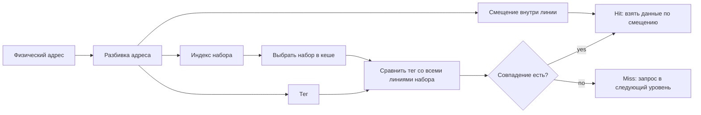
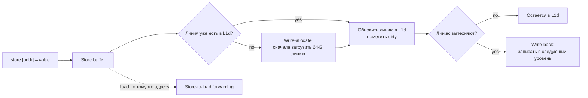

# Иерархия памяти и кеш

**Предпосылки:** [процессор](../00-cpu.md) (конвейер, суперскалярность, IPC).

← [Процессор](../00-cpu.md) | [Когерентность кешей](01-cache-coherency.md) →

Конвейер и суперскалярное выполнение разгоняют процессор до 2–4 инструкций за такт. Но эта скорость достижима, только если данные уже лежат в регистрах. Обращение к оперативной памяти (RAM, Random Access Memory — память произвольного доступа) занимает порядка 60–100 нс, а один такт процессора при частоте 3 ГГц — 0.33 нс. Это ~200–300 тактов простоя конвейера на каждом промахе: все стадии стоят и ждут, пока данные придут из RAM.

Решение — промежуточный буфер между процессором и RAM: маленький и быстрый. Он перехватывает большинство обращений, потому что программы читают одни и те же данные повторно (temporal locality — временна́я локальность) и читают данные, лежащие рядом (spatial locality — пространственная локальность). Этот буфер — **кеш** (cache, буквально «тайник, запас»). Кеш из быстрой статической памяти перехватывает 95–99% обращений, и до медленной RAM доходят единицы процентов. Как именно он устроен и почему работает — тема этой заметки.

Что это значит на практике? Возьмём перемножение двух матриц размером 1024 × 1024 из `double` (8 байт). Одна матрица занимает 8 МБ. Пока алгоритм работает с матрицей 256 × 256 (512 КБ), IPC держится на уровне 2.5 — данные помещаются в кеш, конвейер загружен. Как только матрица вырастает до 1024 × 1024, она перестаёт помещаться целиком, и IPC проседает до 0.3–0.5. Процессор тот же, инструкции те же, но большую часть времени он ждёт данные из RAM.

## Почему нельзя просто сделать RAM быстрее

У памяти два конкурирующих параметра: скорость (latency — задержка доступа) и объём (capacity — ёмкость). Физика не позволяет получить оба одновременно.

**SRAM (Static RAM — статическая память)** хранит бит в схеме из шести транзисторов (six-transistor cell), которая сохраняет состояние без подзарядки. Это даёт задержку доступа порядка 1–2 нс, но каждый бит стоит дорого: шесть транзисторов занимают примерно в 30 раз больше площади на кристалле, чем один бит DRAM. На весь чип помещается максимум десятки мегабайт SRAM.

**DRAM (Dynamic RAM — динамическая память)** хранит бит в одном транзисторе и одном конденсаторе. Конденсатор крохотный, заряд утекает за миллисекунды — контроллер памяти должен постоянно перечитывать и перезаписывать каждую ячейку (refresh, обновление), примерно каждые 64 мс. Зато один бит занимает минимум площади, и на чип помещаются гигабайты. Цена — задержка доступа порядка 60–100 нс.

60–100 нс — это не время пролёта сигнала (электрический сигнал проходит модуль DIMM за ~1 нс). Задержка складывается из внутренней логики DRAM: активация строки (~13 нс) — чтение конденсаторов в усилители считывания, выбор столбца (~13 нс), передача данных по шине (~5 нс), плюс накладные расходы контроллера памяти. Суммарная задержка даёт те самые ~60–80 нс. Производители маркируют модули тактовой частотой (DDR5-5600), но задержка за 20 лет почти не изменилась — росла только пропускная способность. Подробная арифметика таймингов — в [оперативной памяти](02-ram.md).

Стоимость тоже отличается на порядки. SRAM, из которой состоит кеш процессора, обходится примерно в $5–10 за мегабайт (в составе процессора, по оценке площади кристалла). DRAM — порядка $3–5 за гигабайт, то есть в 1000–3000 раз дешевле на единицу объёма. Сделать 128 ГБ из SRAM — это кристалл площадью в несколько квадратных метров при текущем техпроцессе. Физически невозможно.

Между этими полюсами и зажата архитектура: нужна память со скоростью SRAM и объёмом DRAM. Единственный выход — многоуровневая система, где маленький, быстрый кеш из SRAM перехватывает большинство обращений, а медленная, ёмкая DRAM обслуживает остальные.

## Иерархия: от регистров до оперативной памяти

Современный процессор организует память слоями. Каждый следующий слой больше по объёму, но медленнее по доступу.

```text
              Объём         Задержка       Где / тип памяти
            ───────────────────────────────────────────────
Регистры      ~128 Б        ~0.25 нс       в ядре CPU
L1 кеш       32–64 КБ       ~1 нс          SRAM, в ядре
L2 кеш      256 КБ – 1 МБ   4–7 нс         SRAM, в ядре
L3 кеш       8–64 МБ        10–30 нс       SRAM, общий
RAM          8–128 ГБ       60–100 нс      DRAM, отдельные модули
```

Числа зависят от конкретного процессора, но порядок величин устойчив уже двадцать лет. У Intel Core i7-12700 (2022): L1d = 48 КБ на ядро, L2 = 1.25 МБ на ядро, L3 = 25 МБ общий. У Apple M2 (2022): L1d = 64 КБ на ядро, L2 = 16 МБ на кластер. У AMD EPYC 9654 (2022): L3 = 384 МБ (распределённый по чиплетам).

Обратите внимание: L1 и L2 — per-core (у каждого ядра свой), L3 — общий (shared) между всеми ядрами. Это критически важно для многоядерных программ: два потока, работающих на разных ядрах, имеют независимые L1 и L2, но делят L3. Поток, занимающий весь L3 потоковым сканированием, вытесняет из него данные всех остальных потоков — это называется **cache pollution** (загрязнение кеша). На 16-ядерном процессоре один «плохой» поток может замедлить остальные 15.

Каждый слой перехватывает обращения к следующему. Когда CPU запрашивает адрес, запрос идёт сначала в L1. Если данные там — hit (попадание), задержка ~1 нс. Если нет — miss (промах), запрос уходит в L2 (+4–7 нс). Промах L2 — запрос в L3 (+10–30 нс). Промах L3 — запрос в RAM (+60–100 нс). Задержки складываются: промах по всем уровням стоит ~80–140 нс суммарно.

```text
CPU запрашивает адрес 0x7FFF00012340
           |
           v
       [ L1 кеш ]  -- hit? --> данные за ~1 нс
           |
         miss (~4 нс штраф)
           |
           v
       [ L2 кеш ]  -- hit? --> данные за ~5 нс суммарно
           |
         miss (~10 нс штраф)
           |
           v
       [ L3 кеш ]  -- hit? --> данные за ~15 нс суммарно
           |
         miss (~70 нс штраф)
           |
           v
       [   RAM   ]  ----------> данные за ~80–140 нс суммарно
```

Механизм работает, потому что промахи редки. У типичного кода hit rate (доля попаданий) L1 держится на уровне 95–97%, у L2 — 80–95%. Даже если L3 перехватывает всего 70–80% оставшихся запросов, до RAM доходит 1–5% обращений. Средняя задержка для кода с хорошей локальностью — порядка 2–4 нс вместо 60–100 нс.

Посчитаем конкретно для матрицы 256 × 256 (512 КБ). L1d = 32 КБ: промахи L1 неизбежны, но L2 = 256 КБ — половина матрицы помещается, рабочий блок строк влезает целиком. L1 hit rate ~95%, L2 hit rate ~90%, до RAM доходит ~0.5%. Средняя задержка = 0.95 × 1 + 0.045 × 5 + 0.004 × 15 + 0.001 × 80 ≈ 1.3 нс. Для матрицы 1024 × 1024 (8 МБ): не помещается даже в L3 = 8 МБ, L2 и L3 промахи становятся массовыми. Средняя задержка вырастает до 30–50 нс — и это та самая пропасть между IPC 2.5 и IPC 0.3.

## Почему это работает: локальность обращений

Кеш полезен, только если программа обращается к одним и тем же адресам повторно или к адресам рядом друг с другом. Это свойство называется **локальность** (locality). Два её вида работают в паре.

**Временная локальность** (temporal locality): если программа обратилась к адресу, она скорее всего обратится к нему снова в ближайшее время. Пример — счётчик цикла `i`. Цикл из 1000 итераций читает и пишет `i` на каждой итерации: одна загрузка `i` в L1 обслуживает все 1000 обращений.

**Пространственная локальность** (spatial locality): если программа обратилась к адресу N, она скорее всего обратится к адресам N+1, N+2, N+3. Пример — последовательный обход массива. Массив из 10 миллионов `int32` (40 МБ) обходится поэлементно: элементы лежат в памяти подряд, и обращение к `arr[0]` подтягивает в кеш заодно `arr[1]`...`arr[15]`, потому что кеш загружает данные не побайтно, а блоками. Об этих блоках — дальше.

Два вида локальности часто сочетаются. Рассмотрим типичный цикл обработки массива структур:

```c
struct Point { float x, y, z; int flags; };  // 16 байт
struct Point points[1000000];                 // ~16 МБ

float sum = 0;
for (int i = 0; i < 1000000; i++)
    sum += points[i].x;                       // читаем только x
```

Временная локальность: переменная `sum` и счётчик `i` живут в регистрах, обращений к памяти за ними нет. Пространственная локальность: элементы `points` лежат подряд, каждая кеш-линия (64 байта) содержит 4 структуры — обращение к `points[0].x` загружает также `points[1]`, `points[2]`, `points[3]` целиком. Но из каждой структуры используется только поле `x` (4 байта из 16) — 75% загруженных данных бесполезны. Если вместо массива структур (Array of Structures, AoS) использовать структуру массивов (Structure of Arrays, SoA), где все `x` лежат подряд, все `y` подряд и так далее — кеш-линия будет содержать 16 полезных значений `x` вместо 4. Разница на такой задаче — 2–4 раза. Это классический компромисс: AoS удобнее для кода, SoA эффективнее для кеша на задачах, обрабатывающих одно поле у всех элементов.

## Кеш-линия: минимальная единица обмена

Кеш не умеет загружать один байт или одно четырёхбайтовое слово. Минимальная единица, которую кеш читает из памяти и хранит у себя — **кеш-линия** (cache line), она же строка кеша. На современных x86-64 и большинстве ARM-процессоров размер кеш-линии — 64 байта. Это можно проверить:

```bash
getconf LEVEL1_DCACHE_LINESIZE    # выведет 64
```

Почему именно 64 байта? Это компромисс между тремя силами.

Слишком маленькая линия (скажем, 16 байт) загружала бы только запрошенный элемент и его ближайших соседей. Пространственная локальность работала бы слабо: для обхода массива из `int32` (4 байта) каждые 4 элемента вызывали бы новый запрос в память.

Слишком большая линия (скажем, 256 байт) загружала бы много данных за раз, но у этого три проблемы. Первая — время загрузки: при пропускной способности шины L1-L2 порядка 64 байт за такт, загрузка 256 байт занимает 4 такта вместо 1. Вторая — впустую потраченный объём: если программа обращается к одному `int32` и больше не трогает окрестность — остальные 252 байта загружены зря, а из кеша вытеснена потенциально полезная линия. Третья — при записи в любой байт линии нужно инвалидировать (обесценить) всю линию на других ядрах — чем больше линия, тем чаще возникает ложный конфликт (false sharing), об этом подробнее в [когерентности кешей](01-cache-coherency.md).

64 байта — точка баланса, найденная эмпирически и устоявшаяся в индустрии с середины 2000-х: хватает для 16 элементов `int32` или 8 элементов `double`, шина не перегружается, false sharing терпимый.

Эффект кеш-линии легко наблюдать экспериментально. Если обходить массив с шагом (stride, буквально «шаг» — расстояние между обращениями), читая каждый N-й элемент, производительность резко падает при шаге, кратном размеру линии. Шаг 4 байта (каждый `int32`) — все 16 элементов линии используются, один промах обслуживает 16 обращений. Шаг 64 байта — каждое обращение попадает в новую линию, полезен только один элемент из 16, количество промахов увеличивается в 16 раз. Шаг 128 байт — аналогично, но ещё хуже: prefetcher начинает путаться в паттерне. Классический тест: обход массива 64 МБ с шагами от 4 до 4096 байт. При шаге 64 пропускная способность падает примерно в 16 раз по сравнению с шагом 4, а при шагах больше 4096 (когда данные перестают помещаться в TLB) — ещё в 2–3 раза.

## Последовательный vs случайный обход: 30–50 раз

Кеш-линия объясняет, почему порядок обхода данных влияет на производительность больше, чем алгоритмическая сложность.

Возьмём массив из 10 миллионов `int32` (40 МБ). Массив не помещается в L3 (типичный L3 — 8–32 МБ), поэтому обход создаёт нагрузку на RAM.

**Последовательный обход** (`arr[0]`, `arr[1]`, `arr[2]`, ...). Первое обращение к `arr[0]` промахивается по кешу и загружает линию с `arr[0]`...`arr[15]` (64 байта = 16 элементов по 4 байта). Следующие 15 обращений — попадания, бесплатно. Один промах на 16 обращений. Процессор, кроме того, замечает последовательный паттерн и включает **hardware prefetch** (аппаратную предвыборку): начинает загружать следующие линии до того, как программа их запросит. Это скрывает задержку RAM почти полностью. Итог: 5–10 мс на весь массив, пропускная способность 4–8 ГБ/с.

**Случайный обход** (обход в перемешанном порядке: `arr[7392841]`, `arr[284]`, `arr[9104822]`, ...). Каждое обращение — к случайному адресу. Вероятность, что нужная линия уже в кеше — мизерная (массив 40 МБ, кеш 8–32 МБ, и данные из предыдущего обращения не помогают). Hardware prefetch бесполезен: паттерна нет, предсказать следующий адрес невозможно. Каждый доступ — промах в RAM, ~100 нс. 10 миллионов × 100 нс = 1 секунда. На практике чуть быстрее за счёт параллелизма контроллера памяти (memory-level parallelism, MLP — способность контроллера обрабатывать несколько промахов одновременно, на Skylake до ~10 параллельных запросов): 200–500 мс. Пропускная способность падает до 80–200 МБ/с.

Разница — 30–50 раз при одной и той же алгоритмической сложности O(n). Кеш-линии и prefetch создают пропасть между «данные лежат подряд» и «данные разбросаны».

Этот эффект объясняет, почему массив часто обгоняет связный список даже на операциях, где список асимптотически лучше. Вставка в середину массива — O(n) из-за сдвига элементов, в [связный список](../../algorithms-and-data-structures/linear/03-linked-list.md) — O(1) при известном указателе. Но сдвиг массива — это `memmove` последовательных байт, попадающий в кеш-линии и prefetch. Вставка в связный список требует обхода узлов, разбросанных по памяти, с промахом на каждом узле. На практике для списков до ~10 000 элементов массив обычно быстрее даже с учётом сдвига.

## Три типа промахов

У промахов три разные причины, и каждая требует своей стратегии борьбы (три C, three Cs of cache misses).

**Compulsory miss** (обязательный промах, cold miss) — первое обращение к линии. Данные никогда не были в кеше, промах неизбежен. Единственный способ уменьшить — prefetch: загрузить данные заранее, до первого обращения.

**Capacity miss** (промах ёмкости) — рабочий набор данных (working set) не помещается в кеш. Линии вытесняются не из-за конфликтов, а потому что кеш физически меньше, чем данные. Обход массива 40 МБ при L3 = 8 МБ неизбежно вытесняет ранее загруженные линии. Способ борьбы — уменьшить рабочий набор: компактные структуры данных, блочные алгоритмы (tiling), отложенная обработка.

**Conflict miss** (конфликтный промах) — два адреса попадают в один набор и вытесняют друг друга, хотя кеш в целом не заполнен. Типичный сценарий: два массива расположены в памяти так, что элементы с одинаковым индексом попадают в один набор кеша. Для L1 32 КБ с 64 наборами это происходит, когда адреса отличаются на кратное 32 КБ. Способ борьбы — увеличение ассоциативности (8-way вместо 4-way) и смещение (padding) массивов, чтобы разбить конфликт.

На реальных нагрузках capacity misses и conflict misses часто пересекаются: когда рабочий набор чуть больше кеша, конфликтные промахи усиливают эффект. Полезный мысленный приём: если заменить кеш на полностью ассоциативный того же размера и промахи исчезают — это были conflict misses. Если промахи остаются — capacity misses. Если промахи возникают даже на бесконечном кеше — compulsory misses.

Диагностика: счётчики производительности процессора (hardware performance counters) через [`perf stat`](../../linux/infrastructure/02-tracing.md) в Linux показывают количество L1/L2/L3 промахов. Команда `perf stat -e L1-dcache-load-misses,LLC-load-misses ./program` выдаёт абсолютные числа промахов по уровням. Для более детального анализа `perf record -e mem_load_retired.l3_miss` записывает адреса промахов — можно найти конкретные строки кода, вызывающие промахи L3.

## Устройство кеша: тег, индекс, смещение

До сих пор кеш был «чёрным ящиком». Чтобы понять, почему одни паттерны доступа создают промахи, а другие — нет, нужно разобраться, как кеш находит данные за один такт.

Кеш работает по тому же принципу, что и [хеш-таблица](../../algorithms-and-data-structures/linear/05-hash-table.md) в программе. У хеш-таблицы: хеш от ключа определяет номер бакета, в бакете лежит пара «ключ-значение», при коллизии сравниваем ключ. Кеш устроен аналогично, но реализован в аппаратуре: ключ — это физический адрес памяти, «бакет» — набор линий (set, набор), а «сравнение ключа» — сверка тегов (tag). Вычислять хеш не нужно: роль хеш-функции играют биты самого адреса.

Физический адрес, по которому CPU обращается к памяти, разбивается на три поля:

```text
|<----- тег ----->|<-- индекс -->|<-- смещение -->|
|   старшие биты  |  средние биты |  младшие биты  |

Смещение (offset):  какой байт внутри линии.
                     При линии 64 байта — 6 бит (2^6 = 64).

Индекс (index):     номер набора (set) в кеше.
                     Аналог номера бакета в хеш-таблице.

Тег (tag):          оставшиеся старшие биты адреса.
                     Аналог ключа: позволяет отличить линии,
                     попавшие в один набор.
```

Механизм поиска: CPU берёт биты индекса, мгновенно находит нужный набор (это адресация в аппаратном массиве — за один такт). Внутри набора параллельно сравнивает тег запроса с тегами всех линий. Совпал — hit, данные отдаются по смещению. Не совпал ни один — miss.



Индекс отвечает за быстрый выбор набора, тег — за проверку, что в наборе лежит именно нужная линия, а смещение — за выбор байтов внутри уже найденной линии. За один такт кеш успевает и адресовать набор, и сравнить все теги этого набора параллельно.

## Ассоциативность: сколько линий в одном наборе

Количество линий в наборе называется **ассоциативностью** (associativity, буквально — степень группировки) и определяет, сколько разных адресов могут сосуществовать в одном наборе.

**Кеш прямого отображения** (direct-mapped, ассоциативность 1). Каждый набор содержит ровно одну линию. Если два адреса попадают в один набор — один из них вытесняется. Плюс: простота и скорость, проверка одного тега. Минус: конфликтные промахи. Если цикл обращается попеременно к двум адресам с одинаковым индексом, каждое обращение вытесняет предыдущее — hit rate падает до 0%. Классический пример: два массива по 32 КБ, выровненные по 32 КБ — в direct-mapped кеше на 32 КБ элемент `A[i]` и `B[i]` всегда попадают в один набор и вытесняют друг друга.

**Полностью ассоциативный кеш** (fully associative). Линия может занять любую позицию — набор один, и в нём все линии. Конфликтных промахов нет. Минус: при каждом обращении нужно сравнить тег со всеми линиями. При 512 линиях — 512 параллельных сравнений. Аппаратно это дорого и не масштабируется, поэтому полностью ассоциативные кеши используются только для маленьких структур вроде TLB (Translation Lookaside Buffer — буфер трансляции адресов, кеш таблицы страниц виртуальной памяти) на 64–128 записей.

**Множественно-ассоциативный кеш** (set-associative) — компромисс. Каждый набор содержит N линий: 4-way, 8-way, 16-way. У большинства современных L1 кешей ассоциативность 8 (8-way set-associative): 8 параллельных сравнений за такт — это аппаратно реализуемо, а конфликтные промахи на порядок реже, чем у direct-mapped.

## Конкретный пример: L1d 32 КБ, 8-way

Разберём арифметику для типичного L1d кеша ядра Intel Skylake.

Данные: объём 32 КБ, размер линии 64 байта, ассоциативность 8.

Общее количество линий: 32 КБ / 64 байта = 512 линий.

Количество наборов: 512 линий / 8 (ассоциативность) = 64 набора.

Разбивка адреса для 64-битной системы:

```text
|<------- тег (52 бита) ------->|<- индекс (6 бит) ->|<- смещение (6 бит) ->|
|                                |    0..63 (набор)   |   0..63 (байт)      |
```

Смещение: log2(64) = 6 бит (позиция внутри линии). Индекс: log2(64 набора) = 6 бит. Тег: оставшиеся 64 - 6 - 6 = 52 бита (на практике физический адрес может быть 48 бит, тогда тег = 36 бит).

Как работает обращение. CPU выполняет `mov rax, [0x7FFF00012340]`. Младшие 6 бит (`0x00`, т.е. `000000`) — смещение: нулевой байт линии. Следующие 6 бит (`001101`, т.е. набор 13) — индекс. Кеш мгновенно обращается к набору 13 и параллельно сравнивает тег с восемью тегами линий в этом наборе. Если один совпал — hit, данные возвращаются за 1 такт (4–5 тактов, если считать полный цикл конвейера). Если не совпал ни один — miss, запрос уходит в L2.

Восемь параллельных сравнений — это восемь аппаратных схем сравнения, работающих одновременно. Это фиксированная стоимость: увеличение ассоциативности до 16 потребовало бы 16 таких схем, больше площади на кристалле и потенциально более длинный критический путь. Поэтому 8-way — устоявшийся компромисс для L1.

Обращение к L1 устроено как конвейер: пока одна инструкция ожидает результат сравнения тегов, следующая уже адресует набор. На Intel Skylake L1d поддерживает два чтения и одну запись за такт (2 load ports + 1 store port). Это значит, что при полной загрузке конвейера L1d обрабатывает до 3 обращений одновременно — при условии, что все попадают.

## Вытеснение: что удалить, когда кеш полон

Когда в наборе заняты все 8 позиций и приходит промах, кеш должен выбрать жертву для вытеснения. Идеальная стратегия — убрать линию, которая не понадобится дольше всех (алгоритм Белади). Но он требует знания будущего, которого у аппаратуры нет.

**[LRU](../../algorithms-and-data-structures/linear/06-lru-cache.md) (Least Recently Used — наименее недавно используемый)** — выбирает линию, к которой не обращались дольше всех. Для 8 линий точный LRU требует хранить полный порядок последних обращений — это 8! возможных перестановок, то есть log2(40320) ≈ 15 бит метаданных на набор, и обновлять порядок при каждом попадании. Для L1 с тактовой задержкой меньше наносекунды это слишком дорого.

**Pseudo-LRU (приближённый LRU)** — аппроксимация, используемая в реальных процессорах. Для 8-way кеша хранится бинарное дерево из 7 бит на набор. Дерево работает так:

```text
          [бит 0]
         /       \
     [бит 1]    [бит 2]
     /    \      /    \
  [б3]  [б4]  [б5]  [б6]
  / \   / \   / \   / \
 L0 L1 L2 L3 L4 L5 L6 L7     <-- 8 линий набора
```

Каждый бит указывает направление (0 = лево, 1 = право) к «наименее недавно использованной» стороне. При попадании в линию биты на пути к ней переключаются в противоположную сторону — «отталкивая» путь от только что использованной линии. При вытеснении дерево указывает путь к жертве за 3 шага (log2(8) = 3 бита из 7 определяют путь). Точность ниже, чем у настоящего LRU, но разница в hit rate — 1–2%, а экономия — 7 бит на набор вместо 15. Для 64 наборов L1 это 448 бит (56 байт) вместо 960 бит (120 байт), что критично, когда каждый квадратный микрометр на кристалле на счету.

В L3 кешах, где наборы содержат 12–16 линий, Intel использует **adaptive replacement** — вариацию, которая учитывает и частоту, и давность обращений, адаптируясь к паттерну нагрузки.

Практическое следствие: если программа последовательно сканирует массив больше L3 (например, полный обход таблицы 1 ГБ), каждая новая линия вытесняет старую, и весь кеш «промывается» (cache thrashing). После скана L3 заполнен данными из конца массива, а все ранее кешированные горячие данные потеряны. Именно поэтому базы данных (PostgreSQL, MySQL) используют стратегию clock-sweep вместо LRU для своего буферного кеша: она устойчива к последовательным сканам. На уровне аппаратного кеша аналогичную проблему решает insertion policy: Intel начиная с Sandy Bridge не помещает новые линии сразу в MRU-позицию (Most Recently Used), а ставит их ближе к LRU-концу. Если линия используется повторно — она продвигается. Если нет — быстро вытесняется, не разрушая горячие данные.

## Разделение L1: инструкции отдельно, данные отдельно

L1 обслуживает два потока одновременно: стадия Fetch читает инструкции, а стадия Execute читает и пишет данные. Если бы оба конкурировали за один кеш, пришлось бы либо чередовать доступ, либо удваивать порты. Поэтому L1 кеш разделён на два независимых кеша: **L1i** (instruction cache — кеш инструкций) и **L1d** (data cache — кеш данных). На Intel Skylake: L1i = 32 КБ, L1d = 32 КБ, оба 8-way.

Почему не один общий? Конвейер процессора одновременно выполняет две операции с памятью на каждом такте: стадия fetch читает инструкцию, а стадия execute может читать или писать данные. Если бы L1 был единым, fetch и execute конкурировали бы за один порт кеша — пришлось бы либо чередовать доступ (потеря половины пропускной способности), либо делать двухпортовый кеш (удвоение площади и потребления).

Разделение решает проблему: L1i обслуживает fetch, L1d обслуживает execute, оба работают параллельно без конфликтов. Это возможно, потому что инструкции и данные редко пересекаются: программа не модифицирует свой собственный код в обычной ситуации (самомодифицирующийся код — экзотика, и он крайне дорог: требует сброса L1i, что стоит десятки тактов).

Размер L1i — не менее критичен, чем L1d. Программы с большим количеством ветвлений и виртуальных вызовов (интерпретаторы, JVM, большие C++ проекты с шаблонами) могут испытывать промахи L1i: код не помещается в 32 КБ, и fetch стадия ждёт загрузки инструкций из L2. Это **instruction cache miss** — менее очевидная, но реальная проблема. JIT-компиляторы (V8, YJIT в Ruby) стараются генерировать компактный машинный код именно по этой причине: каждый лишний килобайт сгенерированных инструкций увеличивает давление на L1i. Meta отмечает, что в крупных production-сервисах процессор тратит до 30% времени на доставку инструкций из памяти — промахи L1i и связанные задержки фронтенда конвейера.

L2 и L3 кеши — **unified** (объединённые): хранят и инструкции, и данные. На этих уровнях задержка уже достаточно велика (4–30 нс), чтобы один порт с арбитражем не создавал узкого места, а объединение позволяет гибко распределять объём между инструкциями и данными в зависимости от нагрузки.

Помимо L1i и L1d, у каждого ядра есть **L1 TLB** (Translation Lookaside Buffer — буфер трансляции адресов). TLB кеширует маппинг виртуальных адресов в физические (подробнее — в заметке о [виртуальной памяти](../../linux/foundations/05-virtual-memory.md)). L1 DTLB на Intel Skylake содержит 64 записи для страниц 4 КБ и 32 записи для страниц 2 МБ. Промах TLB запускает page table walk (проход по таблице страниц) — 4 последовательных обращения к памяти, каждое может промахнуться по кешу. Стоимость промаха TLB — 10–50 нс. При случайном доступе к массиву, занимающему тысячи страниц, промахи TLB добавляются поверх промахов кеша данных. Это объясняет, почему огромные страницы (huge pages, 2 МБ вместо 4 КБ) ускоряют приложения с большим рабочим набором: 64 записи TLB покрывают 64 × 2 МБ = 128 МБ вместо 64 × 4 КБ = 256 КБ.

## Inclusive vs exclusive: политика между уровнями

L1 разделён, L2 и L3 — объединённые. Между уровнями возникает вопрос: если линия есть в L1, должна ли копия оставаться в L2? У этой связи есть два полярных варианта.

**Inclusive** (включающий): L2 содержит копию всего, что есть в L1. L3 содержит копию всего, что есть в L2. Плюс: когда другое ядро проверяет, есть ли линия у соседа, достаточно проверить L3 — это упрощает протокол когерентности. Минус: эффективный объём L2 меньше на размер L1 (часть данных дублируется).

**Exclusive** (исключающий): линия хранится ровно на одном уровне. Вытеснение из L1 помещает линию в L2, а не удаляет. Плюс: суммарная ёмкость = L1 + L2 + L3 без дублирования. Минус: при промахе L1, если данные найдены в L2, их нужно переместить (swap): линия из L2 уходит в L1, а вытесненная из L1 — в L2. AMD (Zen 1–4) использует mostly-exclusive схему для L3: линии попадают туда преимущественно при вытеснении из L2, а новые данные из памяти идут сразу в L2, минуя L3. Строгого исключения нет — shared-линии и instruction fetches могут дублироваться в L2 и L3 одновременно. L2 при этом inclusive по отношению к L1.

**NINE (Non-Inclusive Non-Exclusive)** — гибрид, используемый в Intel начиная со Skylake-SP для серверных процессоров. L3 не гарантирует ни включения, ни исключения: линия может быть в L1 и не быть в L3. Когерентность поддерживается дополнительной структурой — snoop filter, хранящей метаданные о том, какие ядра могут иметь копию. Это позволяет масштабировать L3 на десятки ядер без дублирования данных.

## Запись в кеш: write-back и write-allocate

До сих пор речь шла о чтении. Запись устроена сложнее: нужно не только поместить данные в линию, но и решить, когда обновлять нижние уровни. Когда процессор записывает данные, кеш может вести себя двумя способами.

**Write-through** (сквозная запись): каждая запись в кеш одновременно записывается в следующий уровень (L2 или RAM). Данные всегда консистентны между уровнями, но каждая инструкция `mov [addr], rax` генерирует трафик к L2 — это дорого.

**Write-back** (отложенная запись): запись изменяет только линию в кеше и помечает её **dirty** (грязная, изменённая). Грязная линия записывается в следующий уровень только при вытеснении. Это радикально уменьшает трафик: если программа пишет в одну ячейку 100 раз подряд (например, инкрементирует счётчик в цикле), только последнее значение уедет в L2 — при вытеснении линии. Все современные процессоры используют write-back для L1d.

При промахе на запись кеш применяет **write-allocate** (запись с размещением): сначала загружает линию из памяти в кеш, потом модифицирует в кеше. Это может показаться расточительным — зачем читать данные, если мы собираемся их перезаписать? Но кеш оперирует линиями по 64 байта, а запись часто меняет лишь 4–8 байт. Без загрузки остальные байты линии были бы потеряны. Альтернатива — **no-write-allocate** (запись мимо кеша): запись идёт напрямую в следующий уровень, без загрузки в кеш. No-write-allocate используется для потоковых записей (streaming stores), когда данные точно не будут перечитаны — например, при заполнении большого буфера, который сразу отправляется по сети. На x86-64 для этого есть инструкции `movntps`/`movntdq` (non-temporal store — непоследовательная запись, обходящая кеш).

Комбинация write-back + write-allocate — стандарт де-факто для L1d. Но у неё есть неочевидное следствие: обнуление большого массива (`memset(arr, 0, size)`) генерирует чтение из RAM для каждой линии, хотя программа собирается записать нули поверх. Для массивов, не помещающихся в кеш, `memset` со streaming stores (через `movntps`) может быть в 2 раза быстрее обычного, потому что не тратит bandwidth на чтение старых данных. Glibc на x86-64 автоматически переключается на non-temporal stores для `memset` при размере, превышающем определённую долю L3 (порог зависит от версии glibc и микроархитектуры).

## Store buffer: как запись не останавливает конвейер

Запись в кеш устроена сложнее, чем чтение. При чтении процессор может выдать адрес и ждать данных (или, чаще, выполнять другие инструкции из-за out-of-order execution). При записи нужно не только поместить данные в линию, но и пометить её dirty, а при промахе — сначала загрузить линию из памяти (write-allocate). Если каждая запись ждала бы завершения этих операций, конвейер простаивал бы на каждом `mov [addr], rax`.

**Store buffer** (буфер записи) решает эту проблему. Инструкция записи помещает данные в буфер — небольшую очередь на 42–56 записей (Intel Skylake: 56 записей), после чего конвейер продолжает выполнение. Буфер «сливает» (drain) записи в L1d в фоне, по мере освобождения портов кеша. Если следующая инструкция читает только что записанный адрес, данные берутся напрямую из store buffer (store-to-load forwarding — пересылка из записи в чтение), без обращения к кешу.



Буфер отделяет момент, когда инструкция записи считается выполненной для конвейера, от момента, когда изменённая линия действительно попадает в L1d и позже уезжает вниз по иерархии. Именно поэтому частые записи не стопорят фронтенд сразу, а переполнение store buffer уже стопорит.

Store buffer имеет конечный размер. Если программа генерирует записи быстрее, чем буфер сливает их в кеш (например, при массовом заполнении массива с промахами), буфер переполняется и конвейер стопорится. Это ещё один механизм, через который промахи кеша замедляют не только чтение, но и запись.

## Hardware prefetch: предсказание будущих обращений

Запись мы скрыли буферизацией. Для чтения буферизовать нечего — данные нужны прямо сейчас. Поэтому процессор не просто реагирует на промахи — он пытается их предотвратить. **Hardware prefetcher** (аппаратный предвыборщик) отслеживает паттерн обращений к памяти и загружает линии до того, как программа их запросит.

Основной механизм — **stride prefetch** (предвыборка с шагом). Если процессор замечает последовательность обращений к адресам A, A+64, A+128 (шаг 64 = размер линии), он начинает загружать A+192, A+256 заранее. Это работает идеально для обхода массивов и полей структур. Intel описывает два уровня prefetcher'ов: один на уровне L1 (L1 DCU prefetcher), другой — на уровне L2 (L2 streamer), способный предвыборку до 20 линий вперёд.

Prefetch работает в фоне: загруженные линии размещаются в кеше, не блокируя выполнение инструкций. Если предсказание верное — когда программа обратится к адресу, данные уже в L1/L2, промаха нет. Если предсказание ошибочное — линия просто займёт место в кеше и будет вытеснена позже. Цена ошибки — потраченная полоса пропускания и одна бесполезная линия в кеше, но не остановка конвейера.

Prefetch бессилен против случайного доступа (нет паттерна для обнаружения) и непрямого доступа вида `arr[index[i]]` (адрес зависит от значения, которое само должно быть загружено из памяти). Именно поэтому обход связного списка, где указатель `next` в каждом узле лежит по случайному адресу, не получает выгоды от prefetch и работает со скоростью промахов L3/RAM.

Программист может помочь prefetcher'у явно, через интринсик (intrinsic — встроенная функция компилятора, отображающаяся на конкретную инструкцию процессора). В C/C++ это `__builtin_prefetch(addr)` (GCC/Clang), в Rust — `core::arch::x86_64::_mm_prefetch`. Смысл: программа знает, что через несколько итераций понадобится адрес X, и просит процессор начать загрузку заранее. Классический пример — обход хеш-таблицы: при обработке бакета N можно запросить prefetch бакета N+4, давая процессору 3–4 итерации (~100–200 нс) на загрузку. В реальных реализациях хеш-таблиц (например, в SwissTable от Google, используемой в Abseil и Rust `HashMap`) software prefetch даёт 10–30% ускорения на больших таблицах, не помещающихся в L3.

## Пропускная способность памяти

Prefetch скрывает задержку, но не создаёт пропускную способность. Если нижние уровни не успевают подвозить линии, процессор упирается уже не в latency, а в bandwidth. Задержка — не единственное ограничение. Даже если промахи неизбежны (рабочий набор больше L3), важно, сколько байт в секунду система может доставить из RAM в кеш. Это **пропускная способность** (bandwidth, memory bandwidth).

Современная DDR5-5600 в двухканальной конфигурации даёт теоретический пик порядка 89 ГБ/с (5600 МТ/с × 8 байт × 2 канала). На практике утилизация — 60–80%, то есть 50–70 ГБ/с реальной пропускной способности. Для DDR4-3200 в двух каналах — ~51 ГБ/с теоретического, ~35–40 ГБ/с реально.

Пропускная способность ограничивает не только RAM. Каждый уровень кеша имеет свой bandwidth. L1d Intel Skylake обеспечивает ~192 ГБ/с (два чтения по 32 байта за такт при ~3 ГГц). L2 — ~50–70 ГБ/с. L3 — ~30–40 ГБ/с на всё кольцо (ring bus). RAM — ~40–50 ГБ/с.

Если код упирается в bandwidth (а не в latency), увеличение кеша не поможет — данные просто не успевают приходить. Типичный пример: суммирование массива `double` (8 байт). Одно сложение за такт, 3 ГГц = 3 × 10^9 сложений/с × 8 байт = 24 ГБ/с потребности. Если массив в L1 — bandwidth ~192 ГБ/с, узкое место — ALU. Если массив в RAM — bandwidth 40 ГБ/с, операция ограничена памятью (memory-bound), и более быстрый процессор не ускорит её. Для диагностики: на Intel можно использовать счётчик [`perf stat`](../../linux/infrastructure/02-tracing.md) `-e offcore_response.demand_data_rd.l3_miss.any_snoop`, показывающий количество запросов, дошедших до RAM (имена счётчиков зависят от микроархитектуры).

## Блочный обход данных

Вернёмся к матрице 1024 × 1024 из `double`. Размер — 8 МБ. Наивное перемножение `C[i][j] += A[i][k] * B[k][j]` при обходе по `k` читает столбец `B` — элементы `B[0][j]`, `B[1][j]`, `B[2][j]`, ... Между соседними элементами столбца — 1024 × 8 = 8192 байта (целая строка матрицы). Каждое обращение к `B[k][j]` промахивается: следующий элемент находится через 128 кеш-линий от предыдущего, prefetch не может обнаружить полезный паттерн в рамках L1/L2.

Решение — **блочное перемножение** (tiling, loop tiling). Матрица разбивается на блоки, помещающиеся в L1/L2, и перемножение идёт блоками. Размер блока подбирается так, чтобы три блока (из A, B и C) помещались в L1d: при L1d = 32 КБ — блок 32 × 32 из `double` (32 × 32 × 8 = 8 КБ, три блока = 24 КБ, остаётся место для кеш-линий инструкций и стека). Схема наивного vs блочного обхода:

```text
Наивный: столбец B           Блочный: блок B
B[0][j]                      B[0][0] B[0][1] ... B[0][31]
   |  (8192 Б между          B[1][0] B[1][1] ... B[1][31]
   v   элементами)            ...
B[1][j]                      B[31][0]      ... B[31][31]
   |                          ^^^^^^^^^^^^^^^^^^^^^^^^^^^^
   v                          все в пределах 8 КБ,
B[2][j]                       линии используются полностью
   ...
```

Внутри блока обход линеен — кеш-линии используются полностью, prefetch работает, IPC возвращается к 2–3. Разница между наивной и блочной реализацией для матрицы 1024 × 1024 — 5–10 раз.

Библиотеки линейной алгебры (BLAS: Basic Linear Algebra Subprograms) именно этим и занимаются: подбирают размер блока под конкретные размеры L1/L2 текущего процессора и генерируют код с оптимальным обходом. DGEMM (Double-precision GEneral Matrix Multiply) из Intel MKL достигает 90–95% теоретического пика вычислительной производительности (FLOPS) — и это в первую очередь результат правильной работы с кешем, а не арифметических оптимизаций.

Тот же принцип работает не только в линейной алгебре. Сортировка слиянием (merge sort) на массивах больше L3 проигрывает кеш-ориентированным вариантам: стандартный merge sort обходит два больших подмассива параллельно, создавая промахи на каждом шаге слияния. Timsort и его варианты (используются, в частности, в Python и Java) использует тот же подход: сначала сортирует блоки, помещающиеся в кеш (runs), методом вставок (insertion sort — сортировка вставками, особенно эффективная на почти отсортированных данных), потом сливает готовые блоки. Минимальный размер run в Timsort — 32–64 элемента, что не случайно: это как раз помещается в несколько кеш-линий L1.

Ещё один пример из реальных систем: [B-tree](../../algorithms-and-data-structures/non-linear/05-b-tree.md) в базах данных. Каждый узел B-tree содержит десятки или сотни ключей в отсортированном массиве. Поиск внутри узла — бинарный поиск по этому массиву: данные лежат подряд, кеш-линии работают, prefetch работает. Если бы вместо B-tree использовалось обычное бинарное дерево поиска (BST), каждый узел содержал бы один ключ и два указателя, разбросанных по памяти — каждый шаг поиска был бы промахом кеша. Для дерева из 10 миллионов элементов глубина BST — ~23, каждый шаг — промах в RAM (~100 нс), итого ~2.3 мкс. У B-tree с узлами по 256 ключей глубина — ~3, каждый шаг — промах в RAM + бинарный поиск внутри узла по кеш-линиям, итого ~0.5 мкс. Разница — 4–5 раз, и почти вся она объясняется кешем.

## NUMA: не вся RAM одинаково близка

Вся иерархия строится на идее «расстояние до данных стоит времени». Это верно и внутри самой RAM: на серверах с несколькими процессорными сокетами обращение к памяти «своего» сокета стоит ~80 нс, а к памяти соседнего — ~130 нс (в 1.5–2 раза дороже). Это архитектура NUMA (Non-Uniform Memory Access), где каждый сокет имеет свой контроллер памяти. Подробная архитектура NUMA, политика first-touch и инструменты — в [оперативной памяти](02-ram.md).

## Когерентность: проблема общих данных

Кеш решает проблему доступа к данным для одного ядра. Но у каждого ядра свой L1 и L2, а данные — общие. Когда два ядра записывают по одному адресу, каждое видит свою копию в своём L1 — и эти копии расходятся. Чтобы система оставалась корректной, нужен механизм, гарантирующий, что все ядра видят согласованное состояние памяти. Как устроен протокол когерентности — в [следующей заметке](01-cache-coherency.md).

## Sources

- John L. Hennessy, David A. Patterson, 2017, *Computer Architecture: A Quantitative Approach* — 6th edition, Chapter 2: Memory Hierarchy Design
- Ulrich Drepper, 2007, *What Every Programmer Should Know About Memory* — Red Hat, Inc.
- `getconf LEVEL1_DCACHE_LINESIZE` — размер cache line на текущей машине
- Intel, 2023, *Intel 64 and IA-32 Architectures Optimization Reference Manual* — Chapter 2: Intel Microarchitecture Code Name Skylake
- Maksim Panchenko, 2018, *Accelerate large-scale applications with BOLT* — front-end stalls в datacenter-нагрузках: https://engineering.fb.com/2018/06/19/data-infrastructure/accelerate-large-scale-applications-with-bolt/

---

← [Процессор](../00-cpu.md) | [Когерентность кешей](01-cache-coherency.md) →
