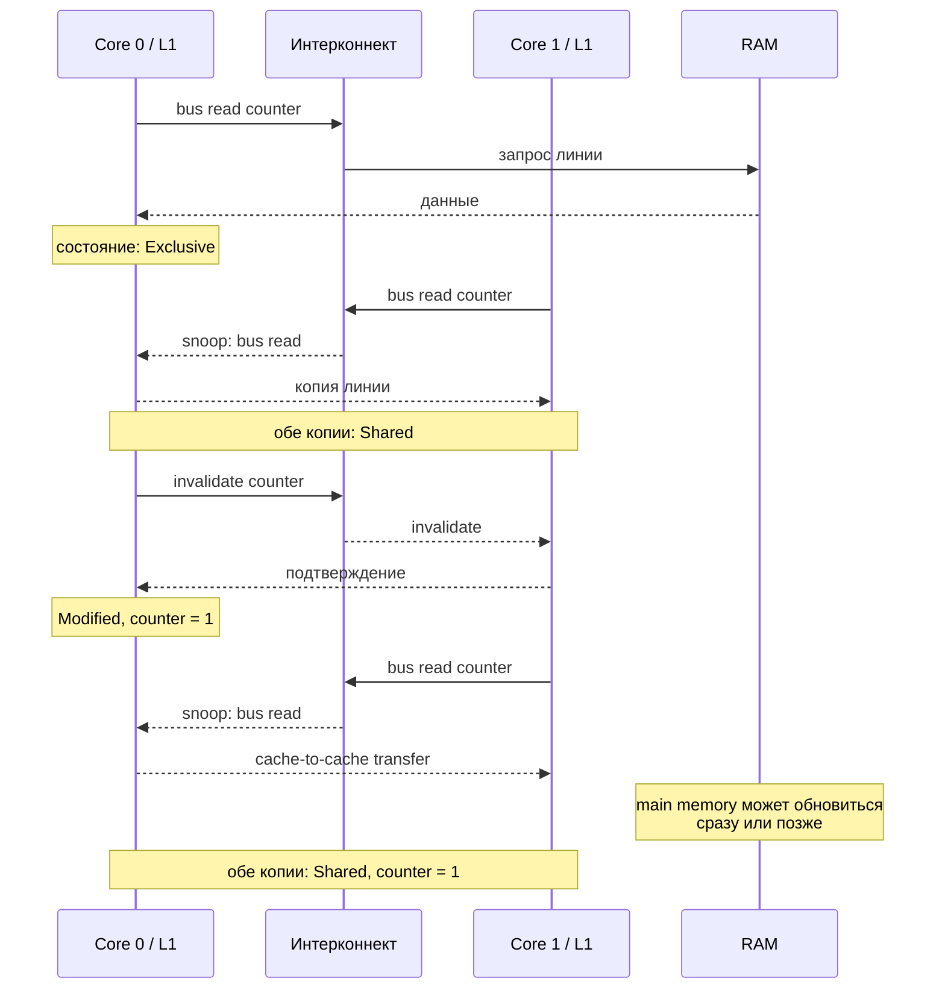
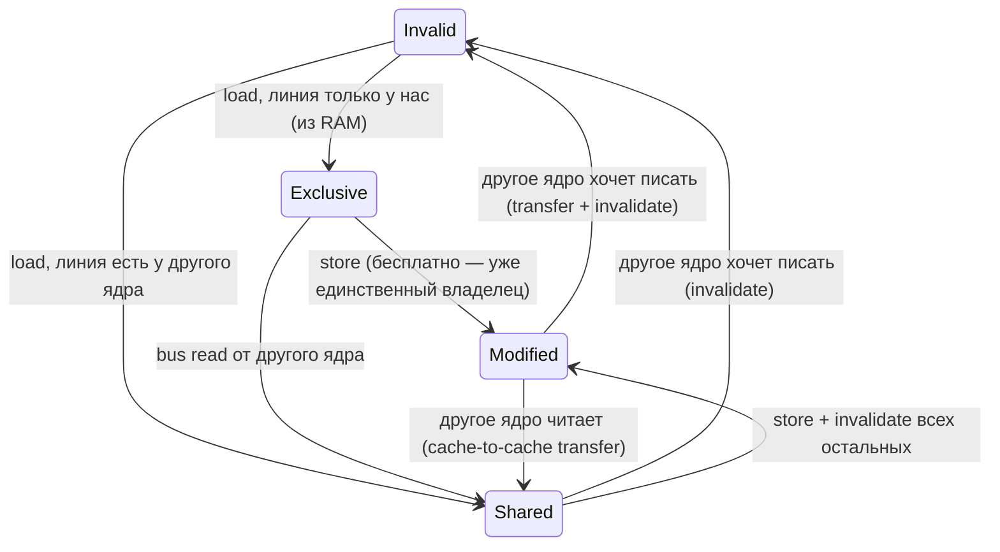
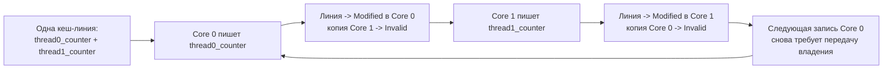

# Когерентность кешей

**Предпосылки:** [иерархия памяти и кеш](00-memory-hierarchy.md) (cache line, L1/L2 per core, L3 shared).

← [Иерархия памяти](00-memory-hierarchy.md) | [Оперативная память](02-ram.md) →

Кеш решил проблему доступа к данным для одного ядра: вместо ~100 нс на каждое обращение к RAM — ~1 нс из L1. Но в многоядерном процессоре у каждого ядра свой L1 и L2. Что происходит, когда два ядра работают с одним и тем же адресом?

Ядро 0 записывает `counter = 1` в свой L1. Ядро 1 читает ту же переменную из своего L1, где по-прежнему `counter = 0`. Два ядра видят разные значения одного адреса — кеши рассогласованы. Без аппаратного механизма согласования многоядерность принципиально сломана: результат программы зависит от того, какое ядро когда прочитало свою копию.

## Когерентность: аппаратная гарантия единого представления памяти

Представим электронную таблицу, которую два человека редактируют одновременно. Один меняет ячейку B5, другой читает ту же ячейку. Если второй видит старое значение — данные рассогласованы. В обычных приложениях (Google Docs, например) за согласование отвечает сервер. В процессоре аналогичную задачу решает аппаратура: каждое ядро имеет свой кеш, и если одно ядро изменило значение, все остальные должны увидеть изменение. За это приходится платить — согласование между ядрами стоит десятки наносекунд.

**Когерентность кешей** (cache coherence, буквально «связность», «согласованность») — аппаратный протокол, который гарантирует: если одно ядро записало значение по адресу X, все остальные ядра при чтении адреса X увидят это новое значение. Кеш не врёт — каждое ядро видит актуальные данные, даже если физически они хранятся в L1 другого ядра.

Без когерентности программист не мог бы рассуждать о поведении программы на нескольких ядрах. Любая запись могла бы остаться невидимой другим ядрам на неопределённое время. Когерентность — не опция, а фундаментальное свойство всех современных многоядерных процессоров.

Чтобы обеспечить эту гарантию, каждая кеш-линия должна нести состояние: кто ей владеет, кто может читать, была ли она изменена. Протокол MESI (Modified — изменённая, Exclusive — исключительная, Shared — разделяемая, Invalid — недействительная) кодирует это четырьмя состояниями.

## Протокол MESI: четыре состояния кеш-линии

Каждая кеш-линия (64 байта данных) в L1/L2 каждого ядра помечена одним из четырёх состояний:

**Modified (M, «изменённая»)** — линия изменена только в этом кеше. Копия в RAM устарела. Ни у одного другого ядра этой линии нет. Ядро — единоличный владелец и обязано записать данные в RAM (или передать другому ядру) при вытеснении.

**Exclusive (E, «исключительная»)** — линия присутствует только в этом кеше и совпадает с RAM. Ни одно другое ядро её не кеширует. Отличие от Modified: данные чистые, при вытеснении записывать не нужно. Ключевое свойство: переход E -> M происходит мгновенно — ядро уже единственный владелец, оповещать другие ядра не нужно.

**Shared (S, «разделяемая»)** — линия может присутствовать в кешах нескольких ядер. Все копии совпадают с RAM. Чтение — бесплатно. Запись требует инвалидации всех остальных копий.

**Invalid (I, «недействительная»)** — линия невалидна, данных в этом кеше нет. Любое обращение к этому адресу потребует загрузки из RAM или из кеша другого ядра.

```text
Состояния кеш-линии в протоколе MESI

  ┌──────────┐    ┌──────────┐    ┌──────────┐    ┌──────────┐
  │ Modified │    │Exclusive │    │  Shared  │    │ Invalid  │
  │          │    │          │    │          │    │          │
  │ только   │    │ только   │    │ несколько│    │ данных   │
  │ здесь,   │    │ здесь,   │    │ ядер,    │    │ нет      │
  │ грязная  │    │ чистая   │    │ чистая   │    │          │
  └──────────┘    └──────────┘    └──────────┘    └──────────┘
  запись: да       запись: да      запись: нет     запись: нет
  чтение: да       чтение: да      чтение: да      чтение: нет
  RAM актуальна:   RAM актуальна:  RAM актуальна:
  нет              да              да
```

## MESI на практике: два ядра и один счётчик

Проследим сценарий с переменной `counter` шаг за шагом. Переменная находится по адресу `0x7f00`, который попадает в кеш-линию, охватывающую адреса `0x7f00`–`0x7f3f` (64 байта, выровненные по границе 64).

### Шаг 1: Core 0 читает counter

Core 0 выполняет `load [0x7f00]`. Адреса нет ни в одном кеше. Core 0 посылает когерентный запрос на **интерконнект** (interconnect — общий канал связи между ядрами). В протоколе MESI такой запрос называется **bus read** (чтение через шину) — название сохранилось с эпохи, когда ядра были связаны общей шиной, хотя в современных процессорах топология другая. Ни одно ядро не кеширует эту линию, поэтому данные приходят из RAM. Кеш-линия загружается в L1 ядра 0 в состоянии **Exclusive** — только Core 0 имеет копию, и она совпадает с RAM.

```text
Core 0 L1:  [0x7f00-0x7f3f]  состояние = E   counter = 0
Core 1 L1:  ---              состояние = I
RAM:        [0x7f00-0x7f3f]                  counter = 0
```

Чтение из Exclusive обходится в ~1 нс — обычный L1 hit.

### Шаг 2: Core 1 читает counter

Core 1 выполняет `load [0x7f00]`. Адреса в его кеше нет. Core 1 посылает bus read. Core 0 видит этот запрос на интерконнекте (механизм **snooping**, буквально «подслушивание»: контроллер кеша каждого ядра отслеживает адреса всех транзакций на интерконнекте и сверяет их со своими кеш-линиями — если адрес совпадает, ядро реагирует по правилам MESI). Core 0 обнаруживает, что у него есть эта линия в состоянии E. Оба ядра переводят свои копии в **Shared**.

```text
Core 0 L1:  [0x7f00-0x7f3f]  состояние = S   counter = 0
Core 1 L1:  [0x7f00-0x7f3f]  состояние = S   counter = 0
RAM:        [0x7f00-0x7f3f]                  counter = 0
```

Теперь оба ядра могут читать counter за 1 нс. Данные идентичны.

### Шаг 3: Core 0 записывает counter = 1

Core 0 выполняет `store [0x7f00], 1`. Линия в состоянии Shared — значит, у другого ядра есть копия. Прежде чем записать, Core 0 посылает на интерконнект **invalidate** — сообщение «я буду писать по этому адресу, все остальные — сбросьте свои копии».

Core 1 видит invalidate, переводит свою копию в **Invalid**. Core 0 получает подтверждение (invalidate acknowledge), переводит свою линию в **Modified** и выполняет запись.

```text
Core 0 L1:  [0x7f00-0x7f3f]  состояние = M   counter = 1
Core 1 L1:  [0x7f00-0x7f3f]  состояние = I   (данные невалидны)
RAM:        [0x7f00-0x7f3f]                  counter = 0  (устарела!)
```

Обратите внимание: RAM не обновлена. В состоянии Modified свежие данные существуют только в L1 ядра 0 — RAM содержит устаревшую копию, пока ядро не отдаст линию ([write-back](./00-memory-hierarchy.md#запись-в-кеш-write-back-и-write-allocate)).

### Шаг 4: Core 1 читает counter

Core 1 выполняет `load [0x7f00]`. Его копия — Invalid. Core 1 посылает bus read. Core 0 видит запрос через snooping и обнаруживает, что линия в состоянии Modified — значит, в RAM устаревшие данные, и нужно отдать свою копию. Core 0 отвечает данными напрямую — данные идут из кеша одного ядра в кеш другого, минуя RAM (cache-to-cache transfer). Обе копии переходят в **Shared**. Главное здесь не то, успела ли уже обновиться RAM, а то, что Core 1 получил свежие данные не из устаревшей памяти, а от владельца линии. Будет ли RAM обновлена немедленно или позже при write-back — зависит от реализации протокола.

```text
Core 0 L1:  [0x7f00-0x7f3f]  состояние = S   counter = 1
Core 1 L1:  [0x7f00-0x7f3f]  состояние = S   counter = 1
RAM:        [0x7f00-0x7f3f]                  копия может обновиться сейчас или позже
```

Core 1 получил актуальное значение. Когерентность сработала: запись ядра 0 стала видна ядру 1.



Важный момент в этой последовательности: интерконнект нужен не для каждого чтения, а только в точках смены владения или когда другой кеш уже держит более свежую копию, чем RAM. Пока линия локальна и не оспаривается, чтения и записи обходятся в ~1 нс — обычный L1 hit без дополнительной задержки на когерентный протокол.

## Полная диаграмма переходов MESI

Сценарий показал четыре основных перехода. Полная диаграмма собирает все восемь, включая обратные.



## Порядок записей по одному адресу

Если два ядра одновременно хотят записать по одному адресу, протокол когерентности разрешает конфликт: одно получит Modified первым, второе подождёт. Топология соединений между ядрами зависит от процессора, но принцип тот же: для каждого адреса все ядра видят записи в одном порядке. Два ядра не могут одновременно держать состояние Modified для одной линии — протокол физически это запрещает.

Когерентность не определяет порядок между записями в **разные** адреса — это задача [модели памяти](../../linux/concurrency/01-memory-ordering.md).

Производители расширяют базовый MESI дополнительными состояниями для оптимизации частых случаев, но четыре состояния MESI остаются основой.

## Когерентность — не атомарность

Когерентность гарантирует видимость каждой отдельной записи. Но операция `counter++` — это не одна запись, а три шага: load (прочитать текущее значение), add (прибавить 1), store (записать результат). Атомарная операция (atomic operation) — операция, которую процессор выполняет целиком, не позволяя другому ядру вмешаться между её шагами. Когерентность не даёт атомарности: она гарантирует, что каждый отдельный store станет виден, но не запрещает другому ядру вклиниться между load и store.

```text
Core 0                 Core 1
──────                 ──────
load counter   (= 5)
                       load counter   (= 5)
add 1          (= 6)
                       add 1          (= 6)
store counter  (= 6)
                       store counter  (= 6)

Ожидалось: 7. Получилось: 6. Потерян один инкремент.
```

Когерентность здесь работает корректно: каждый store виден другим ядрам. Проблема в том, что последовательность load-add-store не атомарна — другое ядро может вклиниться между load и store. Эта ситуация называется гонкой (race condition) — результат зависит от того, в каком порядке ядра чередуют свои шаги.

Процессор предоставляет для этого [атомарные инструкции](../atomic-instructions.md): они выполняют read-modify-write как единое целое, не позволяя другим ядрам вмешаться. Поверх аппаратных атомарных инструкций строятся [программные примитивы синхронизации](../../linux/concurrency/00-synchronization.md), обеспечивающие неделимость произвольных блоков кода.

## Цена когерентности в наносекундах

Порядок величин задержек на типичном серверном процессоре (~2020):

```text
Операция                                    Задержка
──────────────────────────────────────────────────────
L1 hit (линия в E или M)                    ~1 нс
L2 hit                                      ~4 нс
L3 hit (локально)                           ~12 нс
Чтение линии Modified у другого ядра         ~20-70 нс
  (cache-to-cache transfer)
Запись в линию Shared                        ~20-50 нс
  (invalidate + acknowledgement)
Промах по всем кешам (из RAM)                ~80-100 нс
```

Чтобы атомарная инструкция была неделимой, процессор должен получить эксклюзивный доступ к кеш-линии на всё время операции. На процессорах с MESI-подобным протоколом это означает перевод линии в Modified и удержание до конца read-modify-write. Если линию держит другое ядро, каждый такой захват стоит ~40-70 нс.

Что это значит на практике? Два потока на двух ядрах, каждый выполняет атомарный инкремент общего счётчика 100 миллионов раз:

```text
shared counter = 0

поток 0 (Core 0):           поток 1 (Core 1):
  повторить 100M раз:         повторить 100M раз:
    atomic_increment(counter)    atomic_increment(counter)
```

Один поток с обычным (неатомарным) инкрементом выполняет 100 миллионов итераций за доли секунды — данные всё время в L1. Два потока с атомарным инкрементом — в десятки раз медленнее. Причина — не сама атомарная инструкция (она добавляет лишь несколько тактов), а когерентный протокол: каждый инкремент вынуждает одно ядро забрать кеш-линию у другого.

Грубая оценка: 200 миллионов передач владения × ~50 нс = ~10 секунд. Почти всё время программа ждёт, пока кеш-линия перелетает между ядрами. Это и есть **ping-pong** — линия непрерывно мечется между кешами двух ядер, никогда не задерживаясь надолго.

## Store buffer: запись без ожидания

Если бы ядро останавливалось на каждой записи и ждало подтверждения invalidate, производительность была бы ещё хуже. Для обычных (не атомарных) записей процессор использует **store buffer** (буфер записи, рассмотренный в [иерархии памяти](00-memory-hierarchy.md), секция «Store buffer») — здесь он выполняет аналогичную роль, но скрывает задержку когерентного протокола, а не записи в кеш. Ядро помещает запись в буфер (порядка 56 записей на Intel Skylake), не дожидаясь когерентного протокола.

Ядро записывает значение в store buffer и продолжает выполнение. Когерентная транзакция (invalidate, получение Modified) происходит в фоне. Когда она завершится, данные из store buffer переместятся в кеш-линию.

Store buffer позволяет скрыть задержку когерентности для обычного кода. Но для атомарных инструкций он не помогает — процессор должен дождаться полного завершения когерентной транзакции, чтобы гарантировать неделимость.

У этой оптимизации есть побочный эффект: на некоторых архитектурах (ARM, RISC-V) записи из store buffer могут стать видны другим ядрам не в программном порядке. Когда и почему это происходит — определяет [модель памяти](../../linux/concurrency/01-memory-ordering.md).

## False sharing: ловушка скрытого разделения

Пинг-понг в примере с общим счётчиком ожидаем: оба ядра действительно записывают в один адрес. Но существует ситуация, когда два потока работают с **разными** переменными, и производительность всё равно деградирует в десятки раз. Это false sharing (ложное разделение) — одна из самых коварных проблем многоядерного программирования.

Два потока, каждый инкрементирует свой собственный счётчик. Логически — никакого разделения данных:

```c
struct counters {
    int64_t thread0_counter;  // байты 0-7
    int64_t thread1_counter;  // байты 8-15
};

static struct counters c;

void *worker0(void *arg) {
    for (int i = 0; i < 100000000; i++)
        c.thread0_counter++;
    return NULL;
}

void *worker1(void *arg) {
    for (int i = 0; i < 100000000; i++)
        c.thread1_counter++;
    return NULL;
}
```

Каждый поток пишет в свою переменную. Никакой гонки данных. Можно ожидать, что два потока отработают за то же время, что один — каждое ядро инкрементирует свою переменную в своём L1.

На практике два потока с этой структурой работают в десятки раз медленнее одного потока. При полном отсутствии логического разделения данных.

### Причина: кеш работает линиями, а не байтами

`thread0_counter` занимает байты 0-7 структуры, `thread1_counter` — байты 8-15. Размер структуры — 16 байт, а кеш-линия — 64. Допустим, `c` начинается по адресу `0x7f80` — началу кеш-линии. Тогда оба поля попадают в одну линию:

```text
Кеш-линия 64 байта
┌────────────────────────────────────────────────────────────────┐
│ thread0_counter │ thread1_counter │        (пустые байты)      │
│   байты 0-7     │   байты 8-15    │        байты 16-63         │
└────────────────────────────────────────────────────────────────┘
```

Протокол MESI оперирует целыми кеш-линиями. Когда Core 0 записывает в `thread0_counter`, он инвалидирует **всю** линию в кеше Core 1. Core 1 при следующей записи в `thread1_counter` обнаруживает, что линия в состоянии Invalid, и вынужден запрашивать актуальную копию у Core 0. Получает, переводит в Modified, записывает — и инвалидирует линию у Core 0. Пинг-понг, идентичный тому, что происходит с настоящим общим счётчиком.



Процессор не знает и не может знать, что два потока пишут в разные байты одной линии. Гранулярность когерентности — 64 байта: для протокола это не «два независимых счётчика», а одна неделимая единица владения. Всё, что попало в одну линию, разделяется целиком.

### Масштаб проблемы

С ростом числа ядер ситуация ухудшается: каждый invalidate требует подтверждения от ядер, кеширующих эту линию, и когерентный трафик на интерконнекте растёт.

## Устранение false sharing: выравнивание по кеш-линии

Решение — разнести переменные в разные кеш-линии. Если каждая переменная начинается с границы 64 байт, она гарантированно не делит линию ни с чем. Выравнивание (alignment) — размещение данных по адресам, кратным их размеру: четырёхбайтовый `int` по адресу, кратному 4. Подробнее — в [ABI и размещении данных](../programmer-model/01-abi-and-data-layout.md). Здесь тот же принцип, но цель не корректность доступа, а производительность.

В C с помощью `_Alignas` (C11):

```c
struct counters {
    _Alignas(64) int64_t thread0_counter;  // линия 0: байты 0-63
    _Alignas(64) int64_t thread1_counter;  // линия 1: байты 64-127
};
```

Размер структуры вырос с 16 байт до 128 байт (две кеш-линии). Зато каждый поток работает со своей линией, пинг-понг прекращается, и время работы возвращается к ожидаемому — столько же, сколько один поток. Аналогичные механизмы выравнивания есть в Rust (`#[repr(align(64))]`), C++ (`alignas(64)`), Java (`@Contended`), Go (padding).

> [!info]- Как обнаружить false sharing: perf c2c и HITM
> False sharing коварен тем, что код выглядит корректно: никаких гонок данных, никаких ошибок. Единственный симптом — необъяснимое замедление при увеличении числа потоков.
>
> Инструменты: `perf c2c` (из семейства [`perf`](../../linux/infrastructure/02-tracing.md)) на Linux показывает кеш-линии с высоким уровнем когерентного трафика между ядрами. Intel VTune выделяет «contested cache lines» в профиле. Ключевая метрика — **HITM (Hit Modified)**: количество раз, когда ядро обнаруживало, что запрошенная линия находится в состоянии Modified в кеше другого ядра.
>
> ```text
> $ perf c2c record -a -- ./benchmark
> $ perf c2c report
>
>   Shared Data Cache Line Table
>   ─────────────────────────────────────────────────
>   Total     Remote    LLC       Store  ...
>   Records   HITM      Miss
>   ─────────────────────────────────────────────────
>   52312     48901     112       51003  0x7f00 (struct counters)
> ```
>
> Высокое значение Remote HITM на одном адресе — верный признак false sharing или истинного разделения. Дальше нужно смотреть, какие поля структуры по этому адресу модифицируют разные потоки.

> [!info]- Задача: два потока обновляют разные поля одной структуры, производительность деградирует в 20 раз
> **Типичная ошибка:** искать гонку данных или проблему с блокировками.
>
> ```c
> struct stats {
>     int64_t reads;   // обновляется потоком 1
>     int64_t writes;  // обновляется потоком 2
> };
> ```
>
> Гонки нет — потоки пишут в разные поля. Блокировок нет — они не нужны. Но если оба поля попали в одну кеш-линию (а 16-байтная структура легко помещается в 64 байта линии), каждая запись инвалидирует линию у другого ядра.
>
> **Решение:**
>
> ```c
> struct stats {
>     _Alignas(64) int64_t reads;
>     _Alignas(64) int64_t writes;
> };
> ```
>
> Размер структуры вырос с 16 до 128 байт. Производительность вернулась к ожидаемой.

## Когерентность в иерархии кешей

Когерентность между L1 двух ядер — базовый случай. В реальности иерархия глубже: L1 → L2 → L3 (shared) → RAM. L3 помогает когерентному протоколу: поскольку L3 общий для всех ядер, он может отслеживать, какое ядро кеширует какую линию, и направлять запросы адресно, а не рассылать всем. Это снижает трафик на интерконнекте.

На практике для программиста абстракция остаётся той же: запись одного ядра видна другим через когерентный протокол. Конкретная аппаратная реализация влияет на задержку cache-to-cache transfer (от ~20 нс между соседними ядрами до ~70 нс между далёкими), но не на корректность.

## Сводка задержек

Задержки когерентности встречались в разных секциях — сведём их в одну таблицу.

```text
Операция                            L1     L2     L3     RAM
───────────────────────────────────────────────────────────────
Чтение (локальный hit)              1 нс   4 нс   12 нс  100 нс
Чтение (Modified у другого ядра)    ---    ---    20-70 нс  ---
Запись (Exclusive -> Modified)      1 нс   ---    ---    ---
Запись (Shared -> Modified)         20-50 нс (invalidate + ack)
Атомарная RMW (Read-Modify-Write, без конкуренции)  ~6 нс
Атомарная RMW (с конкуренцией)      40-70 нс
```

Закономерность: любая операция, требующая когерентной транзакции с другим ядром, стоит 20-70 нс — сопоставимо с промахом в RAM. Кеш помогает только когда данные локальны для ядра. Как только два ядра начинают писать в одну линию, кеш превращается из ускорителя в накладной расход на передачу владения.

Мы многократно использовали «~100 нс из RAM» как данность — откуда берётся это число? Почему последовательное чтение из RAM в 50 раз быстрее случайного? Ответ — в устройстве DRAM: строках, столбцах, банках и таймингах, из которых складывается задержка каждого обращения.

## См. также

- [Когерентность прикладных кешей](../../system-design/07-caching.md) — аналогичная проблема согласованности на уровне архитектуры: как поддерживать консистентность между локальным кешем приложения и источником данных

## Sources

- John L. Hennessy, David A. Patterson, 2017, *Computer Architecture: A Quantitative Approach* — Chapter 5: Memory Hierarchy Design, Section 5.2: Cache Coherence
- Intel, 2024, *Intel 64 and IA-32 Architectures Software Developer's Manual* — Volume 3, Chapter 11 (Memory Cache Control)
- Ulrich Drepper, 2007, *What Every Programmer Should Know About Memory* — Section 3.3.4: Cache Coherency

---

← [Иерархия памяти](00-memory-hierarchy.md) | [Оперативная память](02-ram.md) →
