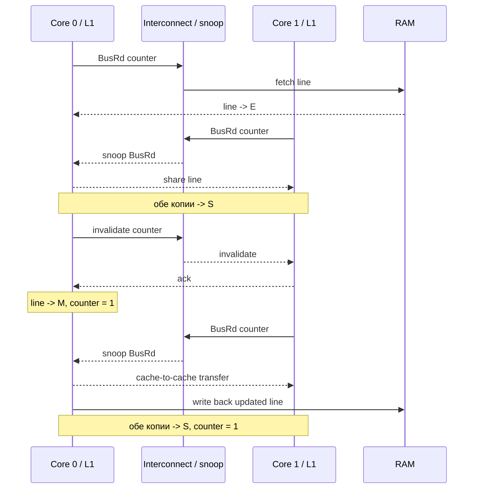
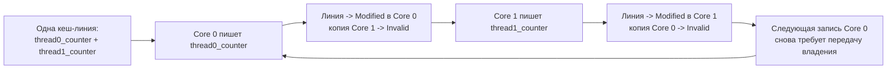

# Когерентность кешей

**Предпосылки:** [иерархия памяти и кеш](00-memory-hierarchy.md) (cache line, L1/L2 per core, L3 shared).

← [Иерархия памяти](00-memory-hierarchy.md) | [Оперативная память](02-ram.md) →

Кеш решил проблему доступа к данным для одного ядра: вместо 100 нс на каждое обращение к RAM — 1 нс из L1. Но в многоядерном процессоре у каждого ядра свой L1 и L2. Ядро 0 записывает `counter = 1` в свой L1. Ядро 1 читает ту же переменную из своего L1, где по-прежнему `counter = 0`. Два ядра видят разные значения одного адреса. Без аппаратного механизма согласования многоядерность принципиально сломана — результат программы зависит от того, какое ядро когда прочитало свою копию.

## Атомарный счётчик на двух потоках

Два потока инкрементируют общий счётчик 100 миллионов раз каждый. Код на C:

```c
#include <stdatomic.h>
#include <pthread.h>

static atomic_int counter = 0;

void *worker(void *arg) {
    for (int i = 0; i < 100000000; i++) {
        atomic_fetch_add(&counter, 1);
    }
    return NULL;
}
```

Результат корректный: `counter == 200000000`. Атомарная операция гарантирует, что ни один инкремент не потеряется. Но время выполнения — 12 секунд на двух ядрах. Один поток с обычным `counter++` (без атомарности) выполняет 100 миллионов итераций за 0.3 секунды. Два потока с атомарным инкрементом — в 40 раз медленнее одного потока. Корректность достигнута, но цена чудовищная.

Причина — не в самой атомарной инструкции. `lock xadd` на x86 добавляет лишь несколько тактов накладных расходов. Узкое место — когерентность кешей (cache coherence): при каждом инкременте одно ядро забирает кеш-линию у другого, и это занимает 20-70 нс вместо 1 нс из L1. 100 миллионов таких передач и дают 12 секунд.

## Когерентность: аппаратная гарантия единого представления памяти

Представим электронную таблицу, которую два человека редактируют одновременно. Один меняет ячейку B5, другой читает ту же ячейку. Если второй видит старое значение — данные рассогласованы. В обычных приложениях (Google Docs, например) за согласование отвечает сервер. В процессоре аналогичную задачу решает аппаратура: каждое ядро имеет свой кеш, и если одно ядро изменило значение, все остальные должны увидеть изменение. За это приходится платить — те самые 40x из сценария выше.

**Когерентность кешей** (cache coherence, буквально «связность», «согласованность») — аппаратный протокол, который гарантирует: если одно ядро записало значение по адресу X, все остальные ядра при чтении адреса X увидят это новое значение. Кеш не врёт — каждое ядро видит актуальные данные, даже если физически они хранятся в L1 другого ядра.

Без когерентности программист не мог бы рассуждать о поведении программы на нескольких ядрах. Любая запись могла бы остаться невидимой другим ядрам на неопределённое время. Когерентность — не опция, а фундаментальное свойство всех современных многоядерных процессоров.

Чтобы обеспечить эту гарантию, каждая кеш-линия должна нести состояние: кто ей владеет, кто может читать, была ли она изменена. Протокол MESI (Modified, Exclusive, Shared, Invalid) кодирует это четырьмя состояниями.

## Протокол MESI: четыре состояния кеш-линии

Каждая кеш-линия (64 байта данных) в L1/L2 каждого ядра помечена одним из четырёх состояний:

**Modified (M)** — линия изменена только в этом кеше. Копия в RAM устарела. Ни у одного другого ядра этой линии нет. Ядро — единоличный владелец и обязано записать данные в RAM (или передать другому ядру) при вытеснении.

**Exclusive (E)** — линия присутствует только в этом кеше и совпадает с RAM. Ни одно другое ядро её не кеширует. Отличие от Modified: данные чистые, при вытеснении записывать не нужно. Ключевое свойство: переход E -> M происходит бесплатно, без обращения к шине — ядро уже единственный владелец.

**Shared (S)** — линия может присутствовать в кешах нескольких ядер. Все копии совпадают с RAM. Чтение — бесплатно. Запись требует инвалидации всех остальных копий.

**Invalid (I)** — линия невалидна, данных в этом кеше нет. Любое обращение к этому адресу потребует загрузки из RAM или из кеша другого ядра.

```text
Состояния кеш-линии в протоколе MESI

  ┌──────────┐    ┌──────────┐    ┌──────────┐    ┌──────────┐
  │ Modified │    │Exclusive │    │  Shared  │    │ Invalid  │
  │          │    │          │    │          │    │          │
  │ только   │    │ только   │    │ несколько│    │ данных   │
  │ здесь,   │    │ здесь,   │    │ ядер,    │    │ нет      │
  │ грязная  │    │ чистая   │    │ чистая   │    │          │
  └──────────┘    └──────────┘    └──────────┘    └──────────┘
  запись: да       запись: да      запись: нет     запись: нет
  чтение: да       чтение: да      чтение: да      чтение: нет
  RAM актуальна:   RAM актуальна:  RAM актуальна:
  нет              да              да
```

## MESI на практике: два ядра и один счётчик

Проследим сценарий с атомарным счётчиком шаг за шагом. Переменная `counter` находится по адресу `0x7f00`, который попадает в кеш-линию, охватывающую адреса `0x7f00`–`0x7f3f` (64 байта, выровненные по границе 64).

### Шаг 1: Core 0 читает counter

Core 0 выполняет `load [0x7f00]`. Адреса нет ни в одном кеше. Core 0 посылает запрос на шину (bus read). RAM отвечает данными. Кеш-линия загружается в L1 ядра 0 в состоянии **Exclusive** — только Core 0 имеет копию, и она совпадает с RAM.

```text
Core 0 L1:  [0x7f00-0x7f3f]  состояние = E   counter = 0
Core 1 L1:  ---               состояние = I
RAM:        [0x7f00-0x7f3f]                    counter = 0
```

Чтение из Exclusive обходится в ~1 нс — обычный L1 hit.

### Шаг 2: Core 1 читает counter

Core 1 выполняет `load [0x7f00]`. Адреса в его кеше нет. Core 1 посылает bus read. Core 0 видит этот запрос на шине (механизм **snooping**, буквально «подслушивание» — каждое ядро отслеживает все транзакции на шине). Core 0 обнаруживает, что у него есть эта линия в состоянии E. Оба ядра переводят свои копии в **Shared**.

```text
Core 0 L1:  [0x7f00-0x7f3f]  состояние = S   counter = 0
Core 1 L1:  [0x7f00-0x7f3f]  состояние = S   counter = 0
RAM:        [0x7f00-0x7f3f]                    counter = 0
```

Теперь оба ядра могут читать counter за 1 нс. Данные идентичны.

### Шаг 3: Core 0 записывает counter = 1

Core 0 выполняет `store [0x7f00], 1`. Линия в состоянии Shared — значит, у другого ядра есть копия. Прежде чем записать, Core 0 посылает на шину **invalidate** — сообщение «я буду писать по этому адресу, все остальные — сбросьте свои копии».

Core 1 видит invalidate, переводит свою копию в **Invalid**. Core 0 получает подтверждение (invalidate acknowledge), переводит свою линию в **Modified** и выполняет запись.

```text
Core 0 L1:  [0x7f00-0x7f3f]  состояние = M   counter = 1
Core 1 L1:  [0x7f00-0x7f3f]  состояние = I   (данные невалидны)
RAM:        [0x7f00-0x7f3f]                    counter = 0  (устарела!)
```

Обратите внимание: RAM не обновлена. В состоянии Modified свежие данные существуют только в L1 ядра 0. RAM будет обновлена позже — при вытеснении линии из кеша или при запросе от другого ядра.

### Шаг 4: Core 1 читает counter

Core 1 выполняет `load [0x7f00]`. Его копия — Invalid. Core 1 посылает bus read. Core 0 видит запрос через snooping и обнаруживает, что линия в состоянии Modified — значит, в RAM устаревшие данные, и нужно отдать свою копию. Core 0 отвечает данными напрямую (cache-to-cache transfer, также известный как **intervention**). Обе копии переходят в **Shared**. RAM тоже обновляется.

```text
Core 0 L1:  [0x7f00-0x7f3f]  состояние = S   counter = 1
Core 1 L1:  [0x7f00-0x7f3f]  состояние = S   counter = 1
RAM:        [0x7f00-0x7f3f]                    counter = 1  (обновлена)
```

Core 1 получил актуальное значение. Когерентность сработала: запись ядра 0 стала видна ядру 1.



Важный момент в этой последовательности: шина нужна не для каждого чтения, а только в точках смены владения или когда другой кеш уже держит более свежую копию, чем RAM. Пока линия локальна и не оспаривается, чтения и записи идут по цене обычного L1 hit.

## Полная диаграмма переходов MESI

```text
                 bus read от
                другого ядра
           ┌───────────────────┐
           │                   v
     ┌──────────┐        ┌──────────┐
     │Exclusive │------->│  Shared  │
     └──────────┘        └──────────┘
        ^    │              │    ^
        │    │ store        │    │ bus read от
        │    │ (бесплатно)  │    │ другого ядра
        │    v              │    │
     ┌──────────┐           │ ┌──────────┐
     │ Modified │<----------┘ │ Invalid  │
     └──────────┘  store      └──────────┘
        │    ^     (invalidate)  ^    │
        │    │                   │    │
        │    └───────────────────┘    │
        │      bus read от            │
        │      другого ядра           │
        │      (intervention)         │
        └─────────────────────────────┘
          вытеснение / write-back

  Ключевые переходы:
  I -> E :  load, линия только у нас (из RAM)
  I -> S :  load, линия есть у другого ядра
  E -> M :  store (без шины — уже единственный владелец)
  E -> S :  другое ядро читает
  S -> I :  другое ядро хочет писать (invalidate)
  S -> M :  store + invalidate всех остальных
  M -> S :  другое ядро читает (intervention)
  M -> I :  другое ядро хочет писать (intervention + invalidate)
```

## Арбитраж шины: сериализация когерентных операций

Два ядра не могут одновременно послать invalidate по одному адресу — шина сериализует все когерентные транзакции. В каждый момент времени только одно ядро может выиграть арбитраж шины (bus arbitration) и отправить своё сообщение. Остальные ждут.

На практике в современных процессорах шина заменена кольцевым интерконнектом (ring interconnect) или mesh-сетью, но принцип тот же: протокол обеспечивает глобальный порядок когерентных транзакций. Два ядра не могут одновременно получить состояние Modified для одной линии — протокол физически это запрещает.

В процессорах Intel начиная с Sandy Bridge используется вариант MESIF (F — Forward, выделенное ядро отвечает на запросы чтения вместо RAM). AMD использует MOESI (O — Owned, позволяет делиться грязными данными без записи в RAM). Оба расширения оптимизируют частые случаи, но базовые четыре состояния MESI остаются основой.

## Цена когерентности в наносекундах

Вернёмся к сценарию с атомарным счётчиком. Каждый `atomic_fetch_add` на x86 транслируется в инструкцию `lock xadd`. Префикс `lock` гарантирует, что ядро получит эксклюзивный доступ к кеш-линии на время выполнения инструкции. Если линия в состоянии Shared или Invalid, ядро должно послать invalidate, дождаться подтверждений и только после этого выполнить операцию.

Стоимость операций на типичном процессоре (Intel Xeon, ~2020):

```text
Операция                                    Задержка
──────────────────────────────────────────────────────
L1 hit (линия в E или M)                    ~1 нс
L2 hit                                      ~4 нс
L3 hit (линия в другом ядре, Shared)         ~12 нс
Чтение линии Modified у другого ядра         ~20-70 нс
  (cache-to-cache transfer / intervention)
Запись в линию Shared                        ~20-50 нс
  (invalidate + acknowledgement)
Промах по всем кешам (из RAM)                ~80-100 нс
```

Атомарный инкремент общего счётчика — самый тяжёлый случай. Ядро 0 выполняет `lock xadd`: получает линию в Modified, записывает. Ядро 1 выполняет `lock xadd`: линия в Invalid (ядро 0 только что инвалидировало её), запрашивает, ждёт 40-70 нс, получает в Modified, записывает. Ядро 0 снова выполняет `lock xadd`: линия в Invalid, снова ждёт 40-70 нс. И так 200 миллионов раз.

Грубая оценка: 200 000 000 инкрементов * 50 нс = 10 секунд. Плюс накладные расходы на сами инструкции и арбитраж — получаем наблюдаемые 12 секунд. Почти всё время программа ждёт, пока кеш-линия перелетает между ядрами. Это и есть **ping-pong** — линия непрерывно мечется между кешами двух ядер, никогда не задерживаясь надолго.

## Store buffer: запись без ожидания

Если бы ядро останавливалось на каждой записи и ждало подтверждения invalidate, производительность была бы ещё хуже. Для обычных (не атомарных) записей процессор использует **store buffer** (буфер записи) — небольшую очередь (порядка 56 записей на Intel Skylake), куда ядро помещает запись, не дожидаясь когерентного протокола.

Ядро записывает значение в store buffer и продолжает выполнение. Когерентная транзакция (invalidate, получение Modified) происходит в фоне. Когда она завершится, данные из store buffer переместятся в кеш-линию.

Store buffer позволяет скрыть задержку когерентности для обычного кода. Но для атомарных операций (`lock xadd`) он не помогает — `lock` заставляет ядро дождаться полного завершения когерентной транзакции, чтобы гарантировать атомарность.

## False sharing: ловушка скрытого разделения

Пинг-понг в примере с атомарным счётчиком ожидаем: оба ядра действительно записывают в один адрес. Но существует ситуация, когда два потока работают с **разными** переменными, и производительность всё равно деградирует в десятки раз. Это false sharing (ложное разделение) — одна из самых коварных проблем многоядерного программирования.

Два потока, каждый инкрементирует свой собственный счётчик. Логически — никакого разделения данных:

```c
struct counters {
    int64_t thread0_counter;  // байты 0-7
    int64_t thread1_counter;  // байты 8-15
};

static struct counters c;

void *worker0(void *arg) {
    for (int i = 0; i < 100000000; i++)
        c.thread0_counter++;
    return NULL;
}

void *worker1(void *arg) {
    for (int i = 0; i < 100000000; i++)
        c.thread1_counter++;
    return NULL;
}
```

Каждый поток пишет в свою переменную. Никакой гонки данных. Можно ожидать, что два потока отработают за то же время, что один — каждое ядро инкрементирует свою переменную в своём L1.

Замер: один поток выполняет 100 миллионов инкрементов за 0.3 секунды. Два потока с этой структурой — 10 секунд. Замедление в 30 раз при полном отсутствии логического разделения данных.

### Причина: кеш работает линиями, а не байтами

`thread0_counter` занимает байты 0-7, `thread1_counter` — байты 8-15. Структура `counters` имеет размер 16 байт. Кеш-линия — 64 байта. Обе переменные гарантированно попадают в одну кеш-линию.

```text
Кеш-линия 64 байта
┌────────────────────────────────────────────────────────────────┐
│ thread0_counter │ thread1_counter │        (пустые байты)      │
│   байты 0-7     │   байты 8-15    │        байты 16-63         │
└────────────────────────────────────────────────────────────────┘
```

Протокол MESI оперирует целыми кеш-линиями. Когда Core 0 записывает в `thread0_counter`, он инвалидирует **всю** линию в кеше Core 1. Core 1 при следующей записи в `thread1_counter` обнаруживает, что линия в состоянии Invalid, и вынужден запрашивать актуальную копию у Core 0. Получает, переводит в Modified, записывает — и инвалидирует линию у Core 0. Пинг-понг, идентичный тому, что происходит с настоящим общим счётчиком.



Процессор не знает и не может знать, что два потока пишут в разные байты одной линии. Гранулярность когерентности — 64 байта: для протокола это не «два независимых счётчика», а одна неделимая единица владения. Всё, что попало в одну линию, разделяется целиком.

### Масштаб проблемы

На сервере с 8 ядрами, где 8 потоков пишут в 8 соседних полей одной структуры, деградация может достичь 50-70 раз по сравнению с версией без false sharing. При 64 ядрах ситуация ещё хуже: каждый invalidate должен быть подтверждён всеми ядрами, а арбитраж интерконнекта становится узким местом.

## Устранение false sharing: выравнивание по кеш-линии

Решение — разнести переменные в разные кеш-линии. Если каждая переменная начинается с границы 64 байт, она гарантированно не делит линию ни с чем.

В C с помощью `_Alignas` (C11):

```c
struct counters {
    _Alignas(64) int64_t thread0_counter;  // линия 0: байты 0-63
    _Alignas(64) int64_t thread1_counter;  // линия 1: байты 64-127
};
```

Размер структуры вырос с 16 байт до 128 байт (два кеш-линии). Зато каждый поток работает со своей линией, и пинг-понг прекращается.

Замер: два потока с выровненной структурой — 0.3 секунды. Столько же, сколько один поток. Ускорение по сравнению с наивной версией — 30 раз.

В Rust:

```rust
use std::sync::atomic::{AtomicI64, Ordering};

#[repr(align(64))]
struct AlignedCounter {
    value: AtomicI64,
}

static COUNTERS: [AlignedCounter; 2] = [
    AlignedCounter { value: AtomicI64::new(0) },
    AlignedCounter { value: AtomicI64::new(0) },
];
```

В C++ (начиная с C++17):

```cpp
struct alignas(64) AlignedCounter {
    std::atomic<int64_t> value{0};
};
```

Java и Go имеют аналогичные механизмы. В Java — `@Contended` (с JDK 8), в Go — ручной padding через массив `[CacheLinePad]byte`. Принцип один: убедиться, что переменные, к которым обращаются разные потоки, не попадают в одну кеш-линию.

### Как обнаружить false sharing

False sharing коварен тем, что код выглядит корректно: никаких гонок данных, никаких ошибок. Единственный симптом — необъяснимое замедление при увеличении числа потоков.

Инструменты: `perf c2c` на Linux показывает кеш-линии с высоким уровнем когерентного трафика между ядрами. Intel VTune выделяет «contested cache lines» в профиле. Ключевая метрика — **HITM (Hit Modified)**: количество раз, когда ядро обнаруживало, что запрошенная линия находится в состоянии Modified в кеше другого ядра.

```text
$ perf c2c record -a -- ./benchmark
$ perf c2c report

  Shared Data Cache Line Table
  ─────────────────────────────────────────────────
  Total     Remote    LLC       Store  ...
  Records   HITM      Miss
  ─────────────────────────────────────────────────
  52312     48901     112       51003  0x7f00 (struct counters)
```

Высокое значение Remote HITM на одном адресе — верный признак false sharing или истинного разделения. Дальше нужно смотреть, какие поля структуры по этому адресу модифицируют разные потоки.

## Когерентность — не атомарность

Когерентность гарантирует, что отдельная запись станет видна всем ядрам. Но операция `counter++` — это не одна запись. Это три операции: load (прочитать текущее значение), add (прибавить 1), store (записать результат). Между load и store другое ядро может выполнить свой load — и оба ядра прибавят 1 к одному значению, потеряв один инкремент.

```text
Core 0                 Core 1
──────                 ──────
load counter   (= 5)
                       load counter   (= 5)
add 1          (= 6)
                       add 1          (= 6)
store counter  (= 6)
                       store counter  (= 6)

Ожидалось: 7. Получилось: 6. Потерян один инкремент.
```

Когерентность здесь работает корректно: каждый store виден другим ядрам. Проблема в том, что последовательность load-add-store не атомарна — другое ядро может вклиниться между load и store.

Для атомарности последовательности операций нужны другие механизмы: атомарные инструкции (`lock xadd`, `cmpxchg`), спинлоки, мьютексы. Все они опираются на когерентность как фундамент, но добавляют поверх неё гарантию неделимости. Эти механизмы — тема синхронизации и примитивов параллельности.

<details>
<summary>Задача: два потока обновляют разные поля одной структуры, производительность деградирует в 20 раз</summary>

**Типичная ошибка:** искать гонку данных или проблему с блокировками.

```c
struct stats {
    int64_t reads;   // обновляется потоком 1
    int64_t writes;  // обновляется потоком 2
};
```

Гонки нет — потоки пишут в разные поля. Блокировок нет — они не нужны. Но оба поля лежат в одной кеш-линии, и каждая запись инвалидирует линию у другого ядра.

**Решение:**

```c
struct stats {
    _Alignas(64) int64_t reads;
    _Alignas(64) int64_t writes;
};
```

Размер структуры вырос с 16 до 128 байт. Производительность вернулась к ожидаемой.

</details>

## Когерентность в иерархии кешей

Когерентность между L1 двух ядер — базовый случай. В реальности иерархия глубже: L1 -> L2 -> L3 (shared) -> RAM. Как когерентность работает на нескольких уровнях?

L3 в большинстве современных процессоров (Intel начиная с Nehalem, AMD начиная с Zen) — **inclusive** или **non-inclusive**. В inclusive-дизайне L3 содержит копии всех линий из L1 и L2. Когда одно ядро инвалидирует линию у другого, L3 знает, в каком ядре эта линия находится — не нужно рассылать запрос всем. Это снижает трафик на интерконнекте. В non-inclusive дизайне (Intel Skylake-SP и новее) L3 не хранит копии всех вышестоящих линий и **селективно** принимает часть L2-evictions. Когерентность обеспечивает snoop filter — отдельная структура, отслеживающая, какое ядро кеширует какую линию.

На практике для программиста абстракция остаётся той же: запись одного ядра видна другим через когерентный протокол. Детали — inclusive vs non-inclusive, ring vs mesh — влияют на задержку (20 нс vs 70 нс для cache-to-cache transfer в зависимости от расстояния между ядрами на кристалле), но не на корректность.

## Сводка задержек

```text
Операция                            L1     L2     L3     RAM
───────────────────────────────────────────────────────────────
Чтение (локальный hit)              1 нс   4 нс   12 нс  100 нс
Чтение (Modified у другого ядра)    ---    ---    20-70 нс  ---
Запись (Exclusive -> Modified)      1 нс   ---    ---    ---
Запись (Shared -> Modified)         20-50 нс (invalidate + ack)
Атомарная RMW (Read-Modify-Write, без конкуренции)  ~6 нс
Атомарная RMW (с конкуренцией)      40-70 нс
```

Закономерность: любая операция, требующая когерентной транзакции с другим ядром, стоит 20-70 нс — сопоставимо с промахом в RAM. Кеш помогает только когда данные локальны для ядра. Как только два ядра начинают писать в одну линию, кеш превращается из ускорителя в накладной расход на передачу владения.

Мы многократно использовали «~100 нс из RAM» как данность — откуда берётся это число? Почему последовательное чтение из RAM в 50 раз быстрее случайного? Ответ — в устройстве DRAM: строках, столбцах, банках и таймингах, из которых складывается задержка каждого обращения.

## Sources

- John L. Hennessy, David A. Patterson, 2017, *Computer Architecture: A Quantitative Approach* — Chapter 5: Memory Hierarchy Design, Section 5.2: Cache Coherence
- Intel, 2024, *Intel 64 and IA-32 Architectures Software Developer's Manual* — Volume 3, Chapter 11 (Memory Cache Control)
- Ulrich Drepper, 2007, *What Every Programmer Should Know About Memory* — Section 3.3.4: Cache Coherency

---

← [Иерархия памяти](00-memory-hierarchy.md) | [Оперативная память](02-ram.md) →
