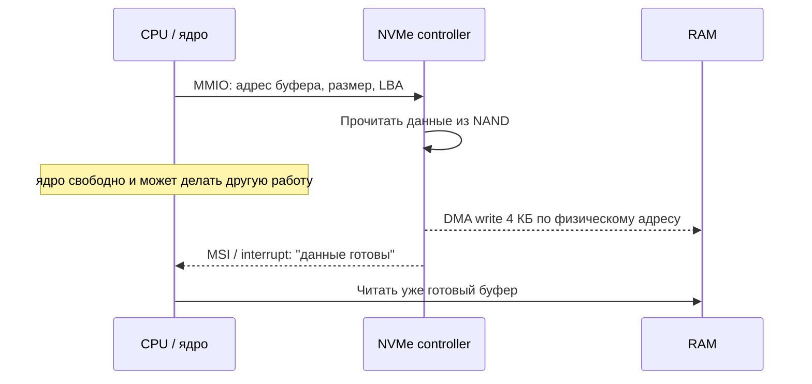

---
tags:
  - domain/computer
  - theme/storage
  - theme/performance
  - type/concept
aliases:
  - DMA
  - Direct Memory Access
  - PCIe
  - Bus
order: 8
---

# Шины и DMA

**Предпосылки:** [хранилище](storage.md) (SSD IOPS, NVMe, PCIe), [когерентность кешей](cache-coherency.md) (MESI, snoop).

← [Устройство flash](flash-internals.md) | [Хранилище](storage.md)

NVMe SSD способен выполнять сотни тысяч операций ввода-вывода в секунду; латентность отдельного чтения — десятки микросекунд. Но между SSD и процессором — десятки сантиметров медных дорожек. Данные не появляются в регистрах процессора сами по себе: их нужно физически переместить. CPU, RAM, SSD, сетевая карта — это отдельные микросхемы, каждая со своей внутренней логикой. Между ними лежат проводники — **шины (buses)**, — и протоколы, определяющие, кто, когда и как передаёт данные. У того, где теряется время, две независимых грани: кто именно переносит байты между устройством и RAM (рабочий агент) и по какому физическому пути идут команды и данные (маршрут).

## Кто переносит данные

Рабочий агент выбирается из двух исторических вариантов. Либо процессор читает устройство сам и сам же перекладывает данные в RAM. Либо устройство работает с памятью напрямую, а процессор только запускает операцию и получает уведомление о завершении.

### Programmed I/O: [процессор](../cpu.md) копирует сам

Простейший — и исторически первый — способ передать данные от устройства в память: **programmed I/O (программный ввод-вывод, PIO)**. [Процессор](../cpu.md) сам читает данные из регистров или буфера устройства и сам же записывает их в RAM. Каждая порция — отдельная инструкция, отдельное обращение к шине.

Такой режим не описывает тип шины, а только распределение работы: полезные данные двигает именно CPU. Исторически так работали медленные устройства и ранние дисковые контроллеры. Для клавиатуры или статусного регистра это приемлемо. Для передачи крупных блоков данных — нет.

### Почему этого недостаточно

Современный NVMe не заставляет процессор вытаскивать полезные данные из устройства порция за порцией: команды и статус у него обмениваются отдельно, а сами данные устройство кладёт в память без участия ядра CPU. Но мысленный эксперимент с PIO хорошо показывает масштаб проблемы.

Если бы быстрый накопитель отдавал блок 4 КБ через PIO, [процессору](../cpu.md) пришлось бы выполнить 4096 отдельных чтений по байту, каждое занимает порядка 100 нс — итого ~400 мкс только на копирование. Для сравнения, задержка чтения страницы NAND flash внутри SSD — порядка 100 мкс. При использовании PIO [процессор](../cpu.md) тратит в 4 раза больше времени на перетаскивание данных, чем устройство — на их подготовку. Суммарная задержка — ~500 мкс, из которых 80% — бессмысленная работа [процессора](../cpu.md).

Для крупных блоков ситуация ещё хуже. Чтение 1 МБ: 1 048 576 отдельных чтений по байту по ~100 нс = ~105 мс. Всё это время ядро [процессора](../cpu.md) не может заниматься ничем другим — ни вычислениями, ни обработкой сетевых пакетов. [Процессор](../cpu.md) превращается в грузчика, который таскает байты вместо того, чтобы считать. При этом само устройство могло бы отдать 1 МБ по PCIe за ~125 мкс. Programmed I/O превращает быстрое устройство в медленное.

Если читать не по одному байту, а по 4 байта за раз, блок 4 КБ потребует 1024 операций вместо 4096. Но каждая по-прежнему стоит порядка ~100 нс, итого ~100 мкс. Выигрыш в 4 раза не меняет картину принципиально: [процессор](../cpu.md) по-прежнему занят копированием на всё время передачи.

Programmed I/O появился в эпоху, когда устройства были медленными: клавиатура генерирует один скан-код за нажатие (1 байт), последовательный порт работает на килобитных скоростях. Для таких задач [процессору](../cpu.md) несложно скопировать несколько байтов. Но современные устройства — SSD, сетевые карты с пропускной способностью 100 Гбит/с, GPU — генерируют гигабайты данных в секунду. [Процессор](../cpu.md) физически не успевает их перекладывать. Нужен механизм, при котором устройство само читает или пишет RAM, а [процессор](../cpu.md) не занимается переносом каждого байта.

### DMA: устройство пишет в память напрямую

**DMA (Direct Memory Access, прямой доступ к памяти)** — механизм, при котором устройство передаёт данные в оперативную память (или читает из неё) без участия [процессора](../cpu.md). [Процессор](../cpu.md) только даёт команду «начни передачу», а дальше занимается другой работой.

Передача 4 КБ через DMA по шине PCIe занимает порядка 0.5 мкс — в 800 раз быстрее, чем programmed I/O. [Процессор](../cpu.md) тратит ~0.5–1 мкс на настройку передачи (записать адрес, размер, направление в управляющие регистры устройства) и ~1–5 мкс на обработку прерывания (сигнал от устройства [процессору](../cpu.md): «передача завершена»; [[#Прерывания: устройство зовёт процессор|подробнее ниже]]) после завершения. Итого ~2–7 мкс накладных расходов вместо 400 мкс, и всё это время — короткие операции, между которыми ядро свободно.

Ключевое отличие: при programmed I/O [процессор](../cpu.md) занят 100% времени передачи. При DMA [процессор](../cpu.md) занят только на настройку и обработку результата — доли процента. Остальное время он выполняет полезную работу: другие потоки, другие процессы, вычисления.

DMA отвечает на вопрос «кто переносит данные». Но этого ещё недостаточно. Нужно понять, по какому физическому пути идут команды к устройству и по какому пути потом едут сами данные.

## По какому пути идут данные

К устройствам путь обычно проходит через PCIe, к оперативной памяти — через DDR и контроллер памяти процессора. DMA не альтернатива PCIe: DMA определяет, кто выполняет перенос, а PCIe — по каким проводам устройство физически связано с процессором и памятью.

### MMIO: как CPU разговаривает с устройством

DMA требует настройки: CPU должен записать адрес буфера, размер и команду в регистры устройства. Но как процессор общается с PCIe-устройством? Через **MMIO (Memory-Mapped I/O, ввод-вывод, отображённый в память)**. Регистры устройства отображаются на определённые физические адреса в адресном пространстве. Запись по адресу `0xFE000000` — это не запись в RAM, а команда устройству. Чтение оттуда — не чтение из RAM, а получение статуса устройства.

С точки зрения [процессора](../cpu.md) MMIO выглядит как обычные инструкции `mov` по определённым адресам. Но [процессор](../cpu.md) по диапазону адреса определяет, куда направить обращение: доступы к RAM идут в сторону DRAM через контроллер памяти (компонент внутри [процессора](../cpu.md), отвечающий за чтение и запись в DRAM; подробнее — [[#Контроллер памяти: RAM — не PCIe|в секции ниже]]), а MMIO-диапазоны уходят через PCIe Root Complex (буквально «корневой узел» — PCIe-контроллер внутри [процессора](../cpu.md); подробнее — [[#Топология: как всё соединено|в разделе Топология]] ниже). Обращение к MMIO стоит дороже, чем к RAM: ~100–500 нс вместо ~70 нс, потому что проходит через PCIe.

У современных SSD и сетевых карт MMIO — это путь управления: записать команду, уведомить устройство через регистр, прочитать статус. Сами данные при этом всё равно идут через DMA.

Старый способ общения с устройствами — инструкции `in`/`out` через отдельное пространство портов ввода-вывода (I/O ports) — сохраняется для совместимости, но новые устройства используют исключительно MMIO.

### Четыре шага DMA-передачи

Рассмотрим чтение блока 4 КБ с NVMe SSD.

Шаг 1: [процессор](../cpu.md) записывает в управляющие регистры контроллера NVMe описание запроса — физический адрес буфера в RAM, куда положить данные, размер блока и номер логического блока (LBA) на диске. Адрес должен быть физическим, а не виртуальным: устройство не знает о [[linux/foundations/virtual-memory#Виртуальные адреса: у каждого процесса своё пространство|виртуальной памяти]] процесса и работает напрямую с физическими адресами (если нет [[#IOMMU: защита DMA от устройств|IOMMU]] — о нём ниже). Настройка занимает несколько обращений к MMIO (memory-mapped I/O) — порядка 0.5–1 мкс.

Шаг 2: контроллер NVMe принимает команду и начинает читать данные из NAND-чипов. [Процессор](../cpu.md) в этот момент свободен. Он может переключиться на другой поток, обработать сетевой пакет, выполнить вычисление — что угодно.

Шаг 3: контроллер NVMe записывает прочитанные 4 КБ в RAM по указанному адресу. Данные идут по шине PCIe напрямую в контроллер памяти, минуя [процессорные ядра](../cpu.md).

Шаг 4: передача завершена. Контроллер сигнализирует [процессору](../cpu.md) через прерывание: «данные готовы». [Процессор](../cpu.md) просыпается, обрабатывает прерывание и передаёт буфер с данными запросившему процессу.



Эта последовательность показывает главный выигрыш DMA: CPU не стоит в цикле копирования, пока данные едут с устройства в память. Его участие сведено к коротким точкам входа и выхода: настройка через MMIO и обработка завершения.

### Оценка затрат по шагам

Для блока 4 КБ на NVMe SSD:

```
Настройка DMA (шаг 1):      ~0.5-1 мкс
Чтение NAND (шаг 2):        ~100 мкс     <-- доминирует
Передача по PCIe (шаг 3):   ~0.5 мкс
Доставка прерывания (шаг 4): ~1-5 мкс
-----------------------------------------
Итого:                       ~103 мкс
```

Задержка определяется физикой NAND, а не копированием. Для сравнения: с programmed I/O было бы ~500 мкс, из которых 400 мкс — чистые потери CPU.

Для блока 1 МБ по PCIe 4.0 x4 (~8 ГБ/с): передача по шине занимает ~125 мкс. С programmed I/O тот же блок требовал бы ~105 мс — в 800 раз дольше.

Для HDD всё те же шаги, но задержка NAND заменяется временем позиционирования головки: ~8 мс. На фоне 8 мс накладные расходы DMA (~5 мкс) незаметны.

### Scatter-Gather DMA

Простейший DMA передаёт непрерывный блок: один адрес, один размер. Но часто данные в памяти разбросаны по нескольким буферам. Сетевая карта принимает пакет, который ядро ОС (операционная система, kernel) хочет разложить: заголовок в один буфер, полезные данные (payload) — в другой. Или файловая система читает несколько блоков, разбросанных по разным страницам виртуальной памяти, которые не обязаны быть соседними в физической.

Без поддержки нескольких фрагментов передача данных в 8 разрозненных буферов по 512 байтов потребовала бы 8 отдельных DMA-настроек (8 мкс) и 8 прерываний (8–40 мкс). Каждый фрагмент — отдельная операция.

**Scatter-Gather DMA** (scatter — буквально «разбросать», gather — «собрать») решает эту задачу. Процессор передаёт устройству не один адрес, а список дескрипторов: каждый содержит физический адрес и размер фрагмента. Устройство последовательно записывает (scatter — разбросать) или читает (gather — собрать) фрагменты по списку. Один запрос на настройку, одно прерывание по завершению — вместо отдельной DMA-операции на каждый фрагмент. С scatter-gather — одна настройка и одно прерывание: ~2–6 мкс.

NVMe использует scatter-gather повсеместно. Каждая команда NVMe содержит **PRP (Physical Region Page — страница физического региона)** или **SGL (Scatter Gather List — список фрагментов)** — список физических адресов и размеров. Когда приложение читает файл через `read()`, ядро ОС разбивает виртуальный буфер на физические страницы (которые могут быть разбросаны по RAM) и передаёт их список контроллеру NVMe. Контроллер раскладывает данные по нужным физическим страницам за одну операцию.

## Прерывания: устройство зовёт процессор

DMA решает проблему передачи данных, но создаёт другую: как [процессор](../cpu.md) узнаёт, что передача завершена? Он не стоит рядом и не ждёт — он занят другой работой.

**Interrupt (прерывание)** — аппаратный сигнал от устройства к [процессору](../cpu.md): «обрати на меня внимание». [Процессор](../cpu.md) получает сигнал, приостанавливает текущую работу, выполняет обработчик прерывания (interrupt handler — небольшая функция, зарегистрированная операционной системой) и возвращается к прерванной задаче.

Для понимания прерываний достаточно различать два режима работы [процессора](../cpu.md). В [[linux/foundations/cpu-modes-and-syscalls#Кольца привилегий|пользовательском режиме]] работают обычные программы — им запрещено обращаться к устройствам напрямую. В [[linux/foundations/cpu-modes-and-syscalls#Кольца привилегий|режиме ядра]] (kernel mode) работает операционная система с полным доступом к оборудованию.

Механизм прерывания:

1. Устройство отправляет сигнал прерывания. На x86-64 это **MSI (Message Signaled Interrupt, буквально «прерывание, сигнализированное сообщением»)** — специальная запись в память по адресу, который контроллер прерываний мониторит. В отличие от старых прерываний по выделенным проводам (IRQ-линии, Interrupt Request — запрос прерывания), MSI не требует отдельных физических линий — сигнал идёт по тем же PCIe-линиям, что и данные
2. [Процессор](../cpu.md) завершает текущую инструкцию — не бросает её на полпути — и переключается в режим ядра
3. [Процессор](../cpu.md) вызывает зарегистрированный обработчик прерывания (interrupt handler)
4. Обработчик делает нужную работу: помечает I/O-запрос как завершённый, будит [процесс](../../linux/foundations/processes.md), ждущий данных, или ставит задачу в очередь отложенной обработки
5. [Процессор](../cpu.md) возвращается к прерванной работе с точки, где остановился

Как именно CPU находит нужный обработчик, сохраняет состояние и возвращается к прерванной работе — разобрано в [Прерываниях ядра](../../linux/kernel/interrupts.md).

Доставка прерывания и вход в обработчик занимает ~1–5 мкс. Это цена за то, что [процессор](../cpu.md) не простаивает в ожидании.

### Interrupt coalescing: не дёргать на каждую операцию

Быстрый NVMe SSD способен выдавать ~500 000 операций в секунду (мелкие 4 КБ чтения в несколько очередей). Если каждое завершение порождает отдельное прерывание, процессор тратит 500k * 3 мкс = 1.5 секунды процессорного времени в секунду — полтора ядра заняты только приёмом прерываний, не обработкой данных. Сетевая карта на 10 Гбит/с с мелкими пакетами даёт ещё более жёсткое соотношение. Обработка прерываний поглотила бы CPU полностью.

**Interrupt coalescing (объединение прерываний)** — устройство накапливает несколько завершённых операций и генерирует одно прерывание на группу. Контроллер ждёт, пока не накопится N событий или не пройдёт T микросекунд (обычно 50–100 мкс), и только тогда отправляет прерывание. Обработчик за один вызов разбирает всю очередь готовых операций.

Цена — дополнительная задержка: событие, пришедшее первым в группе, ждёт до T мкс, пока не будет обработано. Для высокочастотной торговли или low-latency трейдинга это неприемлемо — там используют polling или активное ожидание (busy-wait). Для веб-сервера или массовой обработки блоков 50 мкс лишней задержки незаметны, зато CPU разгружается на порядок.

### Альтернатива: polling

Без прерываний [процессор](../cpu.md) мог бы проверять статусный регистр устройства в цикле: «готово? нет. готово? нет. готово? да». Это **polling (опрос)**. Каждая проверка — обращение к MMIO, порядка 100–500 нс. Если устройство занято 100 мкс, [процессор](../cpu.md) выполнит ~200–1000 бесполезных проверок, тратя ядро целиком.

Polling оправдан в одном случае: когда устройство отвечает настолько быстро, что накладные расходы прерывания (1–5 мкс) сравнимы со временем ожидания. Для NVMe при высокой нагрузке ядро Linux может использовать polling для конкретных запросов: вместо ожидания прерывания [процессор](../cpu.md) опрашивает очередь завершений (completion queue) контроллера, потому что следующий ответ приходит через несколько микросекунд и выходить из обработчика прерывания, чтобы сразу войти в следующий, неэффективно. Для запросов, не требовательных к задержке, — по-прежнему прерывания, чтобы не жечь ядро впустую.

Итого три стратегии уведомления — чистые прерывания, чистый polling и interrupt coalescing — образуют спектр. Выбор зависит от отношения «время ответа устройства / стоимость прерывания». Чем быстрее устройство, тем ближе к polling. Чем медленнее — тем выгоднее прерывания.

### Прерывания без DMA

Не все прерывания связаны с передачей данных. Для некоторых устройств DMA не нужен, потому что объём данных ничтожен.

Клавиатура: при нажатии клавиши контроллер генерирует прерывание. Обработчик читает один скан-код (1 байт) из порта ввода-вывода инструкцией `inb`. Один байт через programmed I/O — ~100 нс. Настраивать DMA-передачу для одного байта бессмысленно: подготовка займёт больше, чем сама операция.

Таймер: аппаратный таймер периодически генерирует прерывание. Данных нет вообще — только сигнал. Операционная система использует его для переключения процессов (time-sharing), обновления системного времени, проверки таймаутов.

Закрытие крышки ноутбука: контроллер управления питанием генерирует прерывание. Данные — один бит: «крышка закрыта». ОС переводит систему в спящий режим.

Ошибки оборудования: если ECC-память (Error Correction Code — код коррекции ошибок) обнаружила неисправимую ошибку, контроллер генерирует [[linux/kernel/interrupts#NMI: немаскируемые прерывания|NMI (Non-Maskable Interrupt, немаскируемое прерывание)]]. В отличие от обычных прерываний, NMI нельзя отключить — процессор обязан его обработать. ОС обычно записывает информацию об ошибке и останавливает систему (kernel panic), потому что продолжать работу с повреждёнными данными в RAM опасно.

Общая закономерность: DMA оправдан при передаче десятков и более байтов. Для штучных байтов и чистых сигналов прерывание + programmed I/O дешевле.

Прерывания — это ещё и механизм обработки ошибок. Если SSD обнаружил неисправимую ошибку чтения, он генерирует прерывание с кодом ошибки в статусном регистре. Обработчик считывает код, отмечает запрос как неудачный, и ядро ОС возвращает ошибку вызвавшему процессу. Без прерываний процессор узнал бы об ошибке только при следующем polling-цикле — или не узнал бы вовсе, если polling не ведётся.

## PCIe: шина между CPU и устройствами

[Процессор](../cpu.md), память, SSD и сетевая карта — отдельные микросхемы на материнской плате. Данные между ними ходят по шинам — наборам проводников с определённым протоколом передачи.

Основная шина устройств в современных компьютерах — **PCIe (Peripheral Component Interconnect Express, буквально «экспресс-соединение периферийных компонентов»)**. В отличие от старой шины PCI (2001 и ранее), где все устройства делили один набор проводов (как общий Ethernet-хаб — одно устройство передаёт, остальные ждут), PCIe использует **соединения точка-точка (point-to-point)**: каждое устройство получает выделенный канал к процессору. На общей шине PCI суммарная пропускная способность делилась между всеми устройствами — 133 МБ/с на всех. На PCIe каждое устройство получает свою полосу независимо от остальных.

### Линии и пропускная способность

Сколько пропускной способности нужно NVMe SSD, GPU, сетевой карте — и сколько предоставляет каждая конфигурация линий? Канал PCIe состоит из **линий (lanes)**. Одна линия — это одна пара проводов на приём и одна на передачу (полный дуплекс: устройство может одновременно отправлять и принимать данные). Устройство подключается через x1, x2, x4, x8 или x16 линий — чем больше линий, тем шире канал. Число линий обозначается буквой «x»: x4 = четыре линии.

Пропускная способность одной линии зависит от поколения:

```
Поколение     На линию     x4 (NVMe SSD)    x16 (GPU)
----------------------------------------------------------
PCIe 3.0      ~1 ГБ/с      ~4 ГБ/с           ~16 ГБ/с
PCIe 4.0      ~2 ГБ/с      ~8 ГБ/с           ~32 ГБ/с
PCIe 5.0      ~4 ГБ/с      ~16 ГБ/с          ~64 ГБ/с
```

NVMe SSD обычно подключается через x4 линии. На PCIe 4.0 это ~8 ГБ/с — сравнимо с последовательной пропускной способностью самого SSD. GPU занимает x16 линий, потому что перемещает текстуры и буферы кадров размером в гигабайты.

Сетевая карта на 25 Гбит/с (~3.1 ГБ/с) обходится x4 или даже x2 линиями. Карта на 100 Гбит/с (~12.5 ГБ/с) требовала x16 на PCIe 3.0; на PCIe 4.0 хватает x8 — это следует из таблицы выше.

Каждое поколение PCIe удваивает пропускную способность на линию. Обратная совместимость сохраняется: устройство PCIe 3.0 работает в слоте PCIe 5.0, но на скорости 3.0. На mainstream-десктопах число прямых PCIe-линий от процессора ограничено: у Intel Raptor Lake это 16 линий PCIe 5.0 плюс 4 линии PCIe 4.0, у AMD Socket AM5 / Ryzen 7000 — до 24 usable линий PCIe 5.0 для устройств. Поэтому типичная схема x16 под GPU и x4 под NVMe быстро съедает почти все прямые CPU-линии, а дополнительные слоты и контроллеры часто висят уже за чипсетом. Серверные процессоры предлагают больше — до 128 линий PCIe 5.0, потому что серверу нужно подключить несколько NVMe, несколько сетевых карт и, возможно, GPU-ускорители одновременно.

## Контроллер памяти: RAM — не PCIe

Все устройства — SSD, сетевая карта, GPU — подключены к процессору через PCIe. Оперативная память — исключение. Оперативная память не подключена через PCIe. Она использует отдельную шину — **DDR (Double Data Rate)**. До ~2008 года контроллер памяти располагался в отдельном чипе на материнской плате — **northbridge (северный мост)**. Путь данных был: процессор -> фронтальная шина (FSB, Front Side Bus) -> northbridge -> DDR -> RAM. Northbridge добавлял ~20–30 нс задержки к каждому обращению.

Начиная с Intel Nehalem (2008) и AMD K8 (ещё раньше, 2003), контроллер памяти переехал прямо внутрь [процессора](../cpu.md) — **IMC (Integrated Memory Controller — встроенный контроллер памяти)**. Путь стал короче: [процессор](../cpu.md) -> DDR -> RAM. Задержка снизилась до ~50–70 нс для полного цикла чтения (от запроса до получения данных), из которых бо́льшая часть — физика работы DRAM-ячеек. Интеграция контроллера памяти — одно из самых значительных архитектурных изменений 2000-х: она не только уменьшила задержку, но и убрала northbridge как точку конкуренции между ядрами за доступ к памяти.

Отдельная шина DDR нужна, потому что к памяти обращаются все ядра [процессора](../cpu.md) на каждой инструкции, работающей с данными. Пропускная способность DDR5-5600 с двумя каналами — порядка 90 ГБ/с. PCIe 5.0 x16 даёт ~64 ГБ/с, и это максимальный слот. Память требует и большей полосы, и меньшей задержки, чем может дать PCIe.

В серверах с несколькими [процессорами](../cpu.md) (NUMA — Non-Uniform Memory Access) каждый [процессор](../cpu.md) имеет свой контроллер памяти и свою «локальную» RAM. Обращение к памяти другого [процессора](../cpu.md) идёт через межпроцессорное соединение (Intel UPI — Ultra Path Interconnect, или AMD Infinity Fabric) и стоит дороже: ~120–150 нс вместо ~70 нс. DMA-устройство, подключённое к PCIe одного [процессора](../cpu.md), но пишущее в память другого, тоже платит эту надбавку. Операционная система старается выделять DMA-буферы в локальной памяти того [процессора](../cpu.md), к чьему PCIe Root Complex подключено устройство.

## Топология: как всё соединено

Путь к устройствам через PCIe и путь к RAM через контроллер памяти сходятся в одной точке — внутри самого процессора. Внутри [CPU](../cpu.md) находятся ядра с [кешами](memory-hierarchy.md) L1/L2, общий [кеш](memory-hierarchy.md) L3, контроллер памяти и **PCIe Root Complex** (буквально «корневой узел») — контроллер, через который [процессор](../cpu.md) общается со всеми PCIe-устройствами. Root Complex — корень дерева PCIe: от него расходятся линии к устройствам.

```
        +---------------------------+
        |           CPU             |
        |  +------+  +----------+   |
        |  | Ядра |  |Контроллер|   |
        |  |L1/L2 |  | памяти   |   |
        |  +--+---+  +----+-----+   |
        |     |   L3       |        |
        |  +--+------------+---+    |
        |  |    PCIe Root      |    |          DDR
        |  |    Complex        +----+--------> RAM
        |  +---+-----+----+----+    |
        +------+-----+----+---------+
               |     |    |
              x4    x16   x1
               |     |    |
             NVMe   GPU   NIC
             SSD          (сеть)
```

Контроллер памяти соединён с RAM напрямую через DDR. PCIe Root Complex раздаёт линии устройствам. Ядра и контроллеры связаны внутренней шиной [процессора](../cpu.md).

Когда NVMe SSD выполняет DMA-запись в RAM, данные проходят путь: SSD -> PCIe линии -> PCIe Root Complex -> внутренняя шина CPU -> контроллер памяти -> DDR -> RAM. [Процессорные](../cpu.md) ядра при этом не участвуют — данные проходят «мимо» них через общую инфраструктуру внутри кристалла.

Обратный путь — DMA-чтение из RAM (устройство забирает данные) — проходит тем же маршрутом в обратном направлении. Сетевая карта, отправляющая пакет, читает данные из RAM через DMA: контроллер памяти -> PCIe Root Complex -> PCIe линии -> NIC. [Процессор](../cpu.md) заранее подготовил буфер с пакетом и передал его адрес карте.

Прямая передача между устройствами (peer-to-peer DMA) — ещё один вариант: данные идут от одного PCIe-устройства к другому, минуя RAM полностью. GPU может напрямую читать данные с NVMe SSD через PCIe, не загружая их сначала в оперативную память. Это используется в NVIDIA GPUDirect Storage для обхода узкого места «SSD -> RAM -> GPU». Данные проходят путь: NVMe -> PCIe Root Complex -> PCIe -> GPU, экономя одно копирование и полосу DDR.

## DMA и [когерентность](cache-coherency.md) кешей

DMA создаёт ситуацию, которой не бывает при обычном выполнении программ: данные в RAM меняются без ведома [процессорных](../cpu.md) ядер. Устройство записало 4 КБ по адресу `0x1000` через DMA, но ядро может хранить старое значение этого адреса в [кеше](memory-hierarchy.md) L1 или L2. Если ядро прочитает данные из [кеша](memory-hierarchy.md), оно получит устаревшую версию — stale data.

На **x86-64** эту проблему решает аппаратура. DMA-транзакции проходят через тот же механизм [когерентности](cache-coherency.md), что и обычные обращения к памяти. Когда устройство делает DMA-запись, запрос попадает в домен [когерентности](cache-coherency.md): системная логика проверяет, нет ли этой [кеш-линии](memory-hierarchy.md) в LLC или в приватных кешах ядер, и при необходимости рассылает **snoop-запросы** (тот же [MESI-протокол](cache-coherency.md), что и между ядрами). Если у ядра есть чистая копия линии (например, в состоянии Exclusive), её инвалидируют. Если копия грязная (Modified), домен когерентности добивается передачи актуальных данных из кеша в общую систему когерентности, а затем делает DMA-запись видимой и инвалидирует старую копию в кеше. При следующем чтении ядро получит уже свежие данные.

Это прозрачно для программиста: на x86-64 после завершения DMA-прерывания данные гарантированно видны [процессору](../cpu.md) без дополнительных действий.

На **ARM** ситуация сложнее. Многие ARM-[процессоры](../cpu.md) не гарантируют аппаратную [когерентность](cache-coherency.md) для DMA. Устройство может записать данные в RAM, но [кеш](memory-hierarchy.md) [процессора](../cpu.md) об этом не узнает. Программист (или, точнее, автор драйвера) обязан явно выполнить **cache flush (сброс кеша)** перед DMA-чтением из буфера и **cache invalidate (инвалидация кеша)** после DMA-записи. Пропуск этих операций — источник трудноуловимых багов: данные «иногда» оказываются устаревшими, в зависимости от того, попали ли они в [кеш](memory-hierarchy.md).

Это одна из причин, почему написание драйверов устройств для ARM сложнее, чем для x86-64. На x86-64 аппаратура берёт [когерентность](cache-coherency.md) на себя, платя за это некоторой сложностью контроллера памяти и дополнительной шинной нагрузкой (каждая DMA-транзакция порождает snoop-трафик). ARM экономит транзисторы и энергию, перекладывая ответственность на программиста — осознанный компромисс для мобильных и встроенных систем, где энергоэффективность важнее удобства разработки.

Что если нужна когерентность, но ручные flush неприемлемы? ARM-системы с [когерентным](cache-coherency.md) интерконнектом решают эту проблему аппаратно — устройства ввода-вывода подключены к [когерентному](cache-coherency.md) домену наравне с ядрами. DMA-транзакции проходят через тот же snoop-протокол, что и обращения между ядрами — аналогично x86. SMMU (System MMU — системный блок трансляции адресов) — ARM-аналог IOMMU — решает отдельную задачу: трансляцию адресов и изоляцию устройств (подробнее — [[#IOMMU: защита DMA от устройств|в следующем разделе]]). Но старые и встроенные ARM-чипы по-прежнему требуют ручного управления [кешем](memory-hierarchy.md).

## IOMMU: защита DMA от устройств

DMA даёт устройству прямой доступ к физической памяти. Без ограничений это означает, что неисправное или вредоносное устройство может читать и писать любой адрес в RAM — данные ядра, других процессов, криптографические ключи. То же самое касается виртуализации: если гостевая ОС управляет PCIe-устройством напрямую, её устройство через DMA доберётся до памяти хоста и других виртуальных машин.

**IOMMU (Input-Output Memory Management Unit)** — аппаратный блок, который стоит между устройством и контроллером памяти и транслирует адреса по той же логике, что и MMU для процессора. Операционная система настраивает таблицы IOMMU так, что каждое устройство видит только выделенные ему области. Попытка обратиться за пределы вызывает аппаратную ошибку.

IOMMU добавляет ~100–200 нс на трансляцию каждой DMA-транзакции (с кешированием в буфере трансляций аналоге TLB). На фоне ~100 мкс самой передачи NVMe это незаметно.

> [!info]- Вендорные имена и механика трансляции
> - У Intel механизм называется **VT-d** (Virtualization Technology for Directed I/O), у AMD — **AMD I/O Virtualization Technology** (часто пишут **AMD-Vi**), у ARM — **SMMU** (System MMU). Функционально это аналоги одного и того же.
> - Устройство обращается не к физическому адресу, а к **DVA** (Device Virtual Address). IOMMU транслирует DVA в физический адрес, проверяя права. Кеш переводов — **IOTLB** (I/O Translation Lookaside Buffer), аналог [[linux/foundations/virtual-memory#TLB: кеш трансляций|TLB]] для устройств.
> - В облаке виртуальные машины получают доступ к NVMe SSD через **PCIe passthrough**. IOMMU гарантирует, что SSD виртуальной машины A не может через DMA добраться до памяти виртуальной машины B. В AWS эту изоляцию обеспечивает аппаратура Nitro, построенная вокруг IOMMU и отдельных карт ввода-вывода.

## Оценка затрат: когда DMA окупается

```
Операция                                      Programmed I/O    DMA
-----------------------------------------------------------------------
4 КБ чтение блока с быстрого устройства (*)   ~500 мкс          ~103 мкс
1 МБ чтение блока с быстрого устройства (*)   ~105 мс           ~225 мкс
1 байт с клавиатуры                           ~100 нс           ~1-5 мкс (**)
Прерывание таймера                            n/a               n/a

(*) мысленный эксперимент: так видно, почему современные NVMe и NIC не возят полезные данные через CPU
(**) настройка DMA для 1 байта дороже самого копирования
```

Точка перелома — десятки байтов. Для блоков в килобайты и мегабайты DMA выигрывает на порядки. Для единичных байтов — programmed I/O дешевле. Современные устройства хранения и сетевые карты используют DMA для всех передач данных. Legacy PS/2-клавиатуры и простые датчики по-прежнему используют programmed I/O, но современные USB-клавиатуры и мыши, несмотря на малый объём данных (8 байт за отчёт), передают их через DMA: USB-контроллер (xHCI) самостоятельно записывает данные в буфер в RAM.

Для веб-сервера, обрабатывающего HTTP-запросы: каждый входящий пакет принимается NIC через DMA, сигнализируется прерыванием, обрабатывается ядром, а ответ отправляется обратно через DMA. Каждый запрос к PostgreSQL — чтение страницы с NVMe через DMA. Весь путь от сетевого пакета до данных на диске и обратно проходит через шины, DMA и прерывания. Разница между «процессор копирует байты» и «устройства общаются с RAM напрямую» — это разница между сервером, который обрабатывает 1000 запросов в секунду, и сервером, который обрабатывает 100 000.

Шины, DMA-контроллеры и прерывания — аппаратный фундамент, на котором строится операционная система. Ядро ОС управляет этими механизмами: настраивает DMA-буферы, регистрирует [обработчики прерываний](../../linux/kernel/interrupts.md), распределяет линии PCIe. Без понимания аппаратного уровня невозможно понять, почему ядро устроено определённым образом: зачем нужен [режим ядра](../../linux/foundations/cpu-modes-and-syscalls.md), как работают [системные вызовы](../../linux/kernel/syscall-internals.md), почему [драйверы устройств](../../linux/kernel/devices-and-drivers.md) — самая сложная часть ОС.

## Sources

- John L. Hennessy, David A. Patterson, 2017, *Computer Architecture: A Quantitative Approach* — 6th edition, Appendix D: Storage Systems, Section D.3: I/O Performance (DMA, bus bandwidth)
- Intel, 2024, *Intel 64 and IA-32 Architectures Software Developer's Manual* — Volume 3, Chapter 11: Memory Cache Control (MMIO, DMA coherence)
- Jonathan Corbet, Alessandro Rubini, Greg Kroah-Hartman, 2005, *Linux Device Drivers* — 3rd edition, Chapter 15: Memory Mapping and DMA
- PCI-SIG, 2022, *PCI Express Base Specification, Revision 6.0* — pcisig.com (lanes, bandwidth)
- Jonathan Corbet, 2016, *Block-layer I/O polling* — LWN.net (polling vs прерывания для блочных устройств)
- NVIDIA, 2024, *GPUDirect Storage Design Guide* — docs.nvidia.com/gpudirect-storage/design-guide/ (peer-to-peer DMA SSD→GPU)
- Arm, 2021, *Arm CoreLink CMN-600 Coherent Mesh Network Technical Reference Manual* — (когерентный mesh-интерконнект ARM)
- AWS, 2023, *The Security Design of the AWS Nitro System* — (IOMMU-изоляция в облачной виртуализации)
- `lspci -vv` — PCIe-топология и link width/speed на текущей машине

---

← [Устройство flash](flash-internals.md) | [Хранилище](storage.md)
