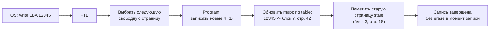
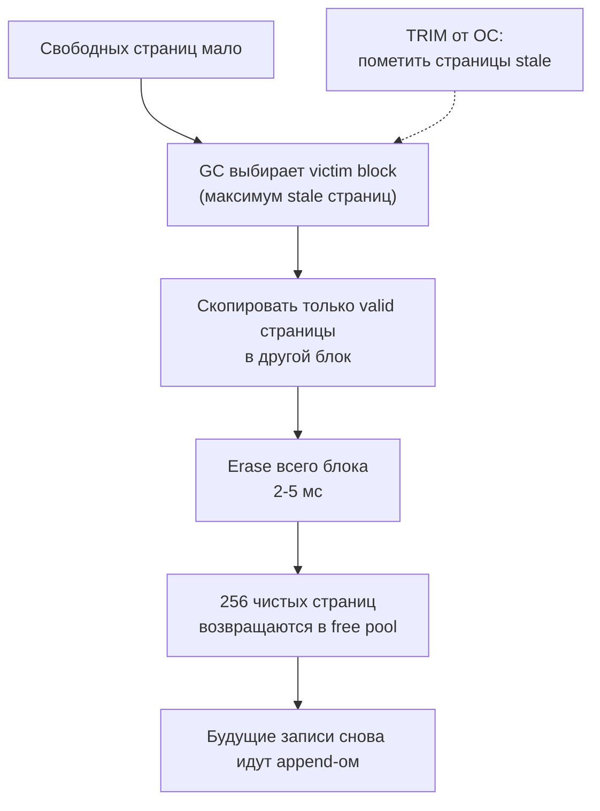

---
tags:
  - domain/computer
  - theme/storage
  - theme/performance
  - type/concept
aliases:
  - Flash
  - NAND flash
  - FTL
  - Garbage Collection
  - TRIM
  - Wear Leveling
  - Write Amplification
order: 7
---

# Устройство flash

**Предпосылки:** [хранилище](storage.md) (SSD/NAND flash как замена механики, страница и блок NAND, асимметрия read/write/erase как имя, IOPS, LBA, write amplification и tail latency как названные эффекты).

← [Хранилище](storage.md) | [Шины и DMA](buses-and-dma.md) →

SSD выдаёт 500 000 IOPS и прячет за обычным блочным интерфейсом целый механизм: чтение, запись и стирание — три разные операции с разными единицами и разной стоимостью; записать можно только в уже стёртую страницу, а ячейки изнашиваются при каждой перезаписи. Ничего из этого операционная система не видит: она обращается к диску как к плоскому массиву секторов, пишет, читает и рассчитывает получить ответ за десятки микросекунд. Между «обычным диском» для ОС и физикой NAND стоит прошивка контроллера SSD — она превращает асимметрию и износ в управляемые компромиссы.

## Ячейка NAND: электрон в ловушке

Ячейка NAND flash — транзистор с дополнительным слоем, **плавающим затвором** (floating gate): это буквально островок проводника, изолированный со всех сторон слоями оксида. Электроны, попавшие на этот островок, не могут никуда утечь — оксид не проводит ток. Именно это и даёт энергонезависимость: заряд держится годами без питания, и состояние ячейки сохраняется после отключения.

Чтобы записать «0», на управляющий затвор подаётся высокое напряжение — электроны проходят сквозь тонкий слой оксида (квантовым туннелированием) и застревают в плавающем затворе. Заряженный плавающий затвор повышает пороговое напряжение транзистора (минимальное напряжение, при котором транзистор пропускает ток) — при чтении это детектируется как конкретный уровень заряда, то есть конкретный бит. Чтобы стереть — подаётся напряжение обратной полярности, и электроны выталкиваются обратно в подложку.

Оксидный слой — и есть слабое место. Каждый проход электронов сквозь него повреждает структуру: электроны застревают в дефектах, немного смещая пороговое напряжение ячейки. Операция сама по себе считанные наносекунды, но след остаётся — капля воды, точащая камень. После нескольких тысяч циклов записи-стирания уровни «размываются»: пороговые напряжения разных состояний начинают перекрываться, и ячейка перестаёт надёжно отличать 0 от 1. Контроллер SSD использует коды коррекции ошибок (ECC, Error Correction Code), способные исправить десятки бит на страницу, но по мере износа число ошибок растёт, ECC справляется всё хуже, и в какой-то момент блок объявляется мёртвым. Именно этим определяется **P/E cycles** (Program/Erase cycles, циклы записи-стирания) — ресурс ячейки.

## SLC, MLC, TLC, QLC: плотность против ресурса

Внутри ячейки можно хранить не один бит. Если контроллер научится различать не два уровня заряда, а четыре — один транзистор несёт два бита; восемь уровней — три бита; шестнадцать — четыре. Плотность растёт кратно, но различать близкие уровни всё труднее, и ошибок становится больше. На этом компромиссе и держится вся линейка:

| Тип | Бит на ячейку | Уровней заряда | P/E cycles | Где применяется |
|---|---|---|---|---|
| SLC (Single-Level Cell) | 1 | 2 | ~100 000 | серверные SSD с экстремальной записью |
| MLC (Multi-Level Cell) | 2 | 4 | ~3 000–10 000 | серверные среднего уровня |
| TLC (Triple-Level Cell) | 3 | 8 | ~1 000–3 000 | большинство потребительских и серверных |
| QLC (Quad-Level Cell) | 4 | 16 | ~100–1 000 | read-heavy, архивы, дёшево и ёмко |

Чем больше бит на ячейку, тем больше ёмкость при том же числе транзисторов, но тем ниже ресурс и медленнее запись (нужна точная настройка заряда). Фундаментальный компромисс NAND — плотность × ресурс × скорость: выиграть везде нельзя, только выбрать приоритет.

Чтобы наращивать ёмкость, не жертвуя ресурсом, современные NAND-чипы укладывают ячейки не в плоскости, а в вертикальные стопки: 3D NAND (или V-NAND) размещает 200–300+ слоёв ячеек друг над другом. Это позволяет каждой отдельной ячейке оставаться крупной — чем крупнее ячейка, тем толще оксидный слой, тем больше P/E cycles. Переход от планарного NAND к 3D одновременно увеличил ёмкость и улучшил ресурс — редкий случай, когда компромисс удалось сдвинуть в обе стороны.

Ещё одна особенность — ячейки внутри чипа соединены последовательно в цепочки (NAND string, откуда и имя технологии — производное от NOT-AND по способу соединения). Чтобы прочитать одну ячейку, контроллер «открывает» все остальные в цепочке, пропуская через них ток, и измеряет напряжение на целевой. Это компактнее, чем адресовать каждую ячейку отдельно, но медленнее для доступа к отдельным байтам. NAND оптимизирован для постраничного доступа: прочитать 4 КБ целиком быстрее, чем 4 КБ по одному байту.

## Асимметрия операций: читать, писать, стирать

Чтение, запись и стирание — три разные физические процесса, и их характеристики радикально различаются.

**Чтение (read)**. Подать напряжение на управляющий затвор, измерить ток — есть заряд в плавающем затворе или нет. Единица чтения — страница (page) размером 4–16 КБ. Время — 50–100 мкс для TLC. Самая быстрая из трёх.

**Запись (program)**. Чтобы записать бит, нужно протолкнуть электроны сквозь оксид в плавающий затвор — для этого требуется высокое напряжение и точный контроль, чтобы попасть в нужный уровень заряда (особенно при TLC и QLC с восемью и шестнадцатью уровнями). Единица записи — тоже страница. Время — 200–500 мкс для TLC. Критическое ограничение: записать можно только в чистую, уже стёртую страницу. «Переписать» данные поверх существующих нельзя — это физически невозможно.

**Стирание (erase)**. Электроны выталкиваются из плавающих затворов обратно в подложку. Единица стирания — блок (block), содержащий 128–512 страниц. Стереть одну страницу нельзя — стирается целый блок. Время — 2–5 мс для TLC.

```
  Блок (block): 256 страниц, ~1 МБ
 +------+------+------+------+-----+------+
 |page 0|page 1|page 2|page 3| ... |p. 255|
 +------+------+------+------+-----+------+
 | 4 KB | 4 KB | 4 KB | 4 KB |     | 4 KB |
 +------+------+------+------+-----+------+

 read:  50-100 мкс  (одна страница)
 write: 200-500 мкс (одна страница, только в стёртую)
 erase: 2-5 мс      (весь блок целиком)
```

Несоразмерность масштабов бросается в глаза: стирание в 40 раз медленнее чтения, но затрагивает в 256 раз больше данных. Это как если бы для замены одной плитки на стене пришлось бы разобрать весь этаж.

И теперь вопрос, ради которого всё это и затевалось. ОС хочет обновить 4 КБ по логическому адресу 12345 — изменить одну страницу. На HDD это просто: головка переезжает к нужному сектору и перезаписывает его. На NAND записать «поверх» нельзя — в странице уже лежат старые данные, а пишут только в стёртую. Прежде чем читать дальше, попробуйте собрать обновление одной страницы из трёх доступных операций (read, program в стёртую, erase целого блока): какой ценой NAND даст изменить эти 4 КБ?

Прямого пути нет. Чтобы освободить страницу под новые данные, её надо стереть, но стирание берёт не страницу, а весь блок из 256 страниц — а в остальных 255 лежат чужие живые данные. Значит, их пришлось бы вычитать в буфер, стереть блок целиком, записать 255 обратно и только потом — наши 4 КБ. Одно логическое обновление 4 КБ разворачивается в чтение и перезапись целого мегабайта плюс стирание на 2–5 мс: катастрофически медленно и убийственно для ресурса. Нужна прослойка, которая превратит «перезаписать страницу» во что-то, что NAND физически может сделать быстро.

## FTL: прослойка, которая делает SSD похожим на диск

Прослойка называется FTL — Flash Translation Layer, слой трансляции flash-памяти. Это прошивка контроллера SSD, которая решает проблему асимметрии между «записать 4 КБ в LBA 12345», как это видит ОС, и «записать в стёртую страницу», как это требует NAND. Для ОС FTL показывает обычный блочный диск: приходит запрос «запиши 4 КБ в LBA 12345» — через микросекунды приходит ответ «записал». Внутри FTL этот запрос выглядит совсем иначе.

Когда приходит запись, FTL не трогает ту физическую страницу, где раньше лежали данные с LBA 12345. Вместо этого он выбирает следующую свободную (стёртую) страницу в одном из блоков, куда сейчас идёт запись, записывает новые данные туда и обновляет внутреннюю таблицу маппинга: «LBA 12345 → блок 7, страница 42». Старую страницу — «блок 3, страница 18» — FTL помечает как устаревшую (stale). Никакого стирания в момент записи не происходит: запись становится чистым append-ом в свободное пространство. Эта схема похожа на то, как работает log-structured merge tree в базах и append-only WAL: вместо обновления на месте — дописывание в конец. FTL, по сути, реализует log-structured файловую систему на уровне прошивки, скрытую от ОС.

```
Таблица маппинга FTL (в DRAM контроллера):
  LBA      Физ. страница
  12345  -->  блок 7, стр. 42   (текущая)
  12345  x    блок 3, стр. 18   (stale, старая версия)
  12346  -->  блок 7, стр. 43
  ...
```



Именно эта замена «перезаписать» на «append + переназначить в таблице» делает случайные 4 КБ записи на NAND вообще возможными. Стирания и перекопирование вытесняются из критического пути в фоновую работу — сборку мусора, за которую отвечает отдельный алгоритм контроллера.

Таблица маппинга живёт в DRAM контроллера — отсюда и отдельная микросхема RAM на печатной плате SSD (обычно 256 МБ — 2 ГБ, пропорционально ёмкости). Для диска на 1 ТБ при страницах 4 КБ таблица содержит около 250 миллионов записей; при 4 байтах на запись — порядка 1 ГБ. Бюджетные SSD без собственного DRAM (DRAM-less) хранят таблицу в самом NAND и кешируют лишь горячую часть в маленьком SRAM-буфере контроллера (быстрая память на самом чипе, на порядки меньше DRAM). При промахе по маппингу контроллер сначала читает нужный фрагмент таблицы из NAND (~75 мкс), потом сами данные — латентность удваивается. На случайных нагрузках DRAM-less SSD проигрывают моделям с DRAM в 2–3 раза по IOPS, хотя используют тот же тип NAND.

## Garbage collection: уборка невалидных страниц

Записи идут в свободные страницы, старые помечаются как stale — со временем блоки накапливают смесь живых и устаревших страниц, а общий запас стёртых страниц тает. Когда свободного места становится мало, FTL запускает сборку мусора (garbage collection, GC).

GC выбирает блок-жертву — тот, где больше всего stale-страниц (жадная стратегия: максимум выгоды за один erase). Копирует живые страницы из этого блока в другой блок, где ещё есть место. Стирает освободившийся блок целиком (2–5 мс). В нём снова 256 чистых страниц, готовых к записи.

Проблема: если в блоке-жертве 200 из 256 страниц ещё живы, GC читает и переписывает 200 страниц ради 56 освобождённых. Это лишняя нагрузка на flash-ячейки, которую никто не запрашивал — ни пользователь, ни ОС. Она и есть **write amplification** (усиление записи): реальный объём записи на NAND превышает то, что попросила ОС. Коэффициент write amplification (WAF) в идеале равен 1.0 (записали ровно столько, сколько попросили). На практике — от 1.1 при последовательной нагрузке до 3–10 при случайной записи на заполненный диск.

Write amplification бьёт дважды. Она снижает производительность: контроллер тратит каналы на перекопирование, которое конкурирует с пользовательскими запросами за общий ресурс (отсюда и проседание IOPS на заполненном диске). И она ускоряет износ: каждый лишний P/E цикл приближает ячейку к концу ресурса. Высокий WAF означает, что диск износится в несколько раз быстрее, чем если бы GC мог выбирать блоки с одними stale-страницами.



GC — главная причина tail latency SSD. Средняя латентность чтения 75 мкс, но если операция совпала со стиранием блока (2–5 мс), она ждёт. 99.9-й перцентиль латентности оказывается в 20–50 раз выше среднего. Для систем, где хвост распределения важнее средней, — это существенный параметр. Серверные SSD ограничивают продолжительность пауз GC и распределяют стирания мелкими порциями; некоторые контроллеры реализуют deterministic GC — стирание только в заранее выделенные окна времени или равномерным потоком, чтобы tail оставался предсказуемым.

## TRIM: помощь от ОС

Когда пользователь удаляет файл, ОС просто помечает блоки файловой системы свободными в своих метаданных — не обращаясь к SSD. С точки зрения SSD по этим LBA всё ещё хранятся данные, которые нужно беречь и перекопировать при GC. Контроллер не знает, что они уже никому не нужны, и честно тратит P/E cycles на перенос мёртвого груза.

Команда **TRIM** (буквально «подрезать лишнее»; в NVMe — Deallocate) закрывает этот разрыв. ОС явно говорит SSD: «данные по этим LBA больше не нужны». FTL помечает соответствующие физические страницы как stale — при следующем GC их не нужно копировать в новый блок, и он освобождается эффективнее. Write amplification падает, ресурс расходуется медленнее.

Контраст виден на практике. На заполненном диске без TRIM GC вынужден перекопировать все страницы, включая те, что ОС уже считает удалёнными. Свежий SSD выдаёт заявленные 100 000 IOPS, но после месяцев случайной записи без TRIM — 20 000–30 000. Включённый TRIM возвращает производительность ближе к номинальной.

В Linux TRIM работает в двух режимах. **Continuous TRIM** (`discard` mount option) — команда отправляется синхронно при каждом удалении файла; добавляет задержку к каждой операции удаления, но поддерживает диск в максимально ухоженном состоянии. **Periodic TRIM** (утилита `fstrim`, обычно запускается раз в неделю через systemd timer) — все свободные блоки отдаются SSD разом. Для серверов предпочтительнее periodic: накладные расходы предсказуемы и не влияют на рабочую нагрузку.

## Wear leveling: равномерный износ

У GC остаётся ещё одна проблема. FTL выбирает жертвой блок с максимумом stale-страниц — а такими чаще оказываются блоки с часто обновляемыми данными. Приложение постоянно переписывает одни и те же ключи — их страницы регулярно устаревают — GC выбирает эти блоки — они стираются снова и снова. «Горячие» блоки накапливают P/E cycles непропорционально быстро. Блок TLC с ресурсом 3000 P/E cycles при десяти перезаписях в день проживёт меньше года, а соседний блок с холодными данными, которые давно не менялись, — десятилетия. Диск теряет ёмкость задолго до исчерпания совокупного ресурса NAND — не потому что износились все ячейки, а потому что износились несколько самых загруженных.

**Wear leveling** (выравнивание износа) — алгоритм FTL, распределяющий записи равномерно по всем блокам. Стратегий две. **Динамическое выравнивание**: при каждой записи FTL выбирает для размещения данных блок с наименьшим числом P/E cycles — новые записи направляются в наименее изношенные блоки. **Статическое выравнивание**: FTL периодически перемещает холодные данные (которые давно не менялись) из свежих блоков в изношенные, освобождая свежие блоки под горячие данные. Без статического выравнивания холодные блоки никогда не изнашиваются, горячие — исчерпывают ресурс в десятки раз быстрее; динамики недостаточно, нужны обе стратегии вместе.

Обе стратегии — это дополнительная внутренняя запись и, соответственно, ещё немного write amplification. Но без них одни блоки умирали бы раньше других на порядки, и ёмкость диска падала бы куда стремительнее, чем при равномерном износе.

## NVMe: параллелизм наружу

Физика NAND, FTL, GC, TRIM, wear leveling — всё это живёт внутри SSD и невидимо для ОС. Но быстро хранить данные — только половина дела. Внутри контроллера — 4–16 независимых каналов, каждый обслуживает несколько чипов, каждый чип разделён на 2–4 плоскости (planes), способные обрабатывать операции одновременно. Это как [[computer/data-path/ram#Три уровня параллелизма: банки, ранги, каналы|банки и ранги DRAM]]: пока один канал стирает блок (3 мс), остальные продолжают отдавать данные. Именно этот параллелизм превращает 13 000 IOPS одного канала в 500 000+ IOPS на уровне диска. Чтобы вытащить его наружу, нужен интерфейс, способный одновременно принять от ОС столько запросов, сколько контроллер может раскидать по каналам.

Протокол NVMe именно это и делает. В отличие от AHCI (протокола SATA, доставшегося по наследству от HDD с его единственной очередью на 32 команды), NVMe поддерживает до 65 535 очередей по 65 535 команд в каждой. На сервере с 64 ядрами каждое ядро получает собственные submission queue и completion queue — без блокировок, без конкуренции за единственную точку входа. Контроллер SSD обрабатывает команды из разных очередей параллельно и раскидывает их по внутренним каналам. Пропускная способность PCIe 4.0 x4 — 8 ГБ/с, PCIe 5.0 x4 — 16 ГБ/с; протокольные накладные расходы ~2.5 мкс против ~6 мкс у AHCI. Тот же NAND-чип, подключённый через SATA, выдаёт 50 000 IOPS; через NVMe — 500 000–1 000 000. Железо то же, разница — в интерфейсе, который не мешает параллелизму выйти наружу.

## Практические следствия

Из устройства flash следует несколько параметров, которые влияют на настройку систем поверх.

**Ресурс и TBW.** Возьмём SSD на 1 ТБ TLC с ресурсом 3000 P/E cycles. С учётом over-provisioning (часть NAND, зарезервированная контроллером под нужды GC и недоступная ОС) полная ёмкость — 1.1 ТБ NAND. Максимальный объём записи за жизнь — 1.1 × 3000 = 3300 ТБ. При WAF = 3 (типичная случайная нагрузка) полезная запись от ОС — 1100 ТБ, или ~1100 TBW (Terabytes Written). При 50 ГБ в день диск проживёт ~22 000 дней (60 лет); при 500 ГБ/день (интенсивная база) — около шести лет. Производители указывают TBW в спецификации и гарантируют 1–3 DWPD (Drive Writes Per Day — полных перезаписей в день) в течение 5 лет для серверных моделей.

**Tail latency.** Средний отклик на чтение 75 мкс, но если чтение попало в стирание блока — 2–5 мс. 99.9-й перцентиль в 20–50 раз выше среднего. Для баз и онлайн-сервисов, где SLA измеряется в p99.9, этот параметр важнее среднего. Серверные SSD указывают 99.99-й перцентиль в спецификации (обычно ~500 мкс при среднем ~100 мкс); потребительские — нет.

**Предсказуемость записи.** Burst-запись идёт на полной скорости за счёт SLC-кеша — выделенной области flash, работающей в SLC-режиме (1 бит на ячейку, быстро, но ёмкость маленькая). После исчерпания SLC-кеша скорость падает до нативной TLC/QLC — иногда в 3–10 раз. Для рабочих нагрузок с устойчивым потоком записи (а не короткими всплесками) нужно смотреть на sustained write speed, а не на peak.

**Заполненность.** На SSD, заполненном на 90%+, свободных стёртых блоков почти нет. GC работает агрессивнее, WAF растёт, пользовательские записи конкурируют за каналы с внутренним копированием. Производительность записи падает в 2–5 раз. Серверные SSD резервируют 10–28% ёмкости под over-provisioning именно для этого: гарантировать контроллеру свободное пространство, даже когда с точки зрения ОС диск заполнен полностью.

**Параллелизм и GC-штормы.** Полмиллиона IOPS держатся на одновременной работе всех 4–16 каналов и чипов внутри них. Если GC стартует сразу на нескольких каналах (массовая случайная запись на почти полный диск), число доступных для пользователя каналов временно сокращается, и IOPS на пользовательских запросах резко падает. Отсюда рекомендация держать SSD под активной записью не заполненным больше чем на 70–80%.

## Sources

- John L. Hennessy, David A. Patterson, 2017, *Computer Architecture: A Quantitative Approach* — 6th edition, Appendix D.4: Storage Devices
- Remzi H. Arpaci-Dusseau, Andrea C. Arpaci-Dusseau, *Operating Systems: Three Easy Pieces* — Chapter 44: Flash-based SSDs (ostep.org)
- Micron, *NAND Flash 101: An Introduction to NAND Flash and How to Design It In to Your Next Product* — Technical Note TN-29-19
- NVM Express, 2024, *NVM Express Base Specification, Revision 2.1* — nvmexpress.org
- Bux & Iliadis, 2010, *Performance of greedy garbage collection in flash-based solid-state drives* — Performance Evaluation 67(11)

---

← [Хранилище](storage.md) | [Шины и DMA](buses-and-dma.md) →
