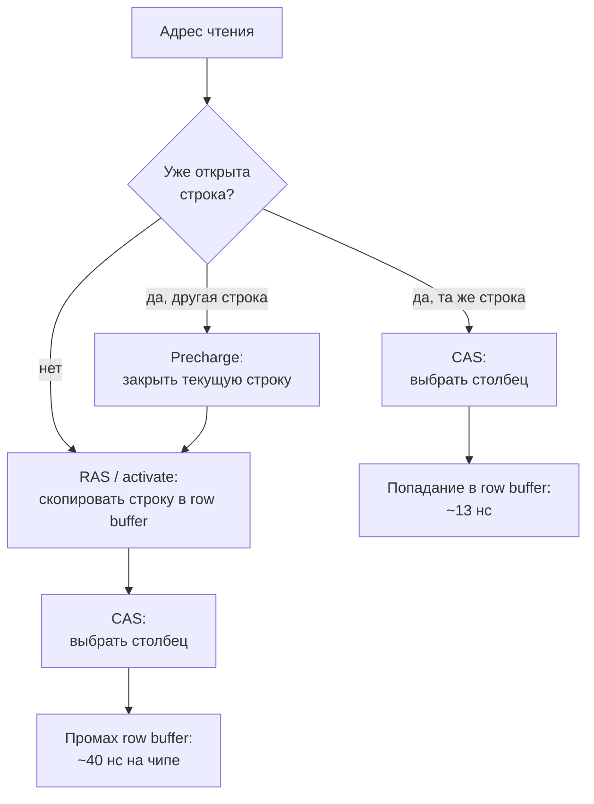
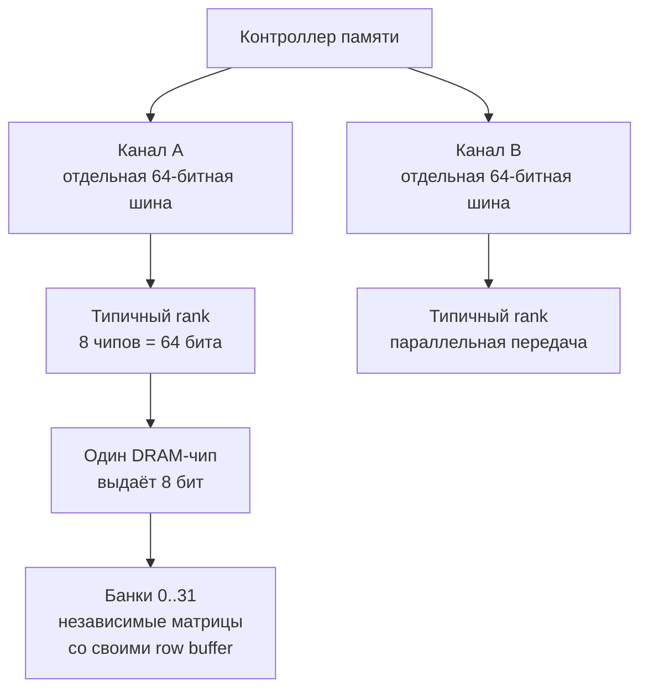
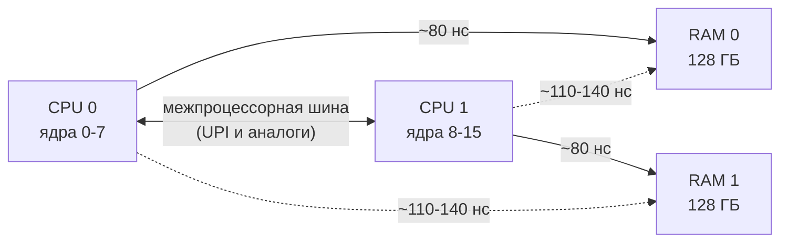

---
tags:
  - domain/computer
  - theme/memory
  - theme/performance
  - type/concept
aliases:
  - RAM
  - Random Access Memory
  - DRAM
  - DDR
order: 4
---

# Оперативная память

**Предпосылки:** [бит, байт](../../foundations/binary-and-bytes.md), [когерентность кешей](cache-coherency.md) (cache line, MESI, false sharing).

← [Когерентность кешей](cache-coherency.md) | [Хранилище](storage.md) →

Когерентность решила проблему согласованности данных между ядрами. Но во всех предыдущих обсуждениях «~100 нс доступ к RAM» фигурировало как магическое число. Пора разобраться, откуда оно берётся и почему оно не всегда 100 нс.

Возьмём конкретный эксперимент. Программа копирует 1 ГБ данных — массив, который гарантированно не помещается ни в какой кеш. Последовательное копирование (`memcpy` по непрерывному блоку) даёт пропускную способность около 40 ГБ/с. Случайное чтение тех же данных (по произвольным адресам) — около 0.8 ГБ/с. Разница в 50 раз. Кеш-промахи объясняют часть этого разрыва, но не весь: даже если каждый доступ идёт в RAM, последовательное чтение всё равно на порядок быстрее случайного. Причина — во внутреннем устройстве DRAM.

## DRAM-ячейка: один конденсатор — один бит

В основе DRAM — простейшая ячейка: крошечный конденсатор (хранит заряд — это бит «1», разряжен — бит «0») и один транзистор (ключ, открывающий доступ к конденсатору). Одна ячейка — один бит. Это радикально проще, чем SRAM (static RAM — статическая память), где один бит хранится в защёлке из 6 транзисторов. Именно поэтому DRAM настолько плотнее и дешевле: на том же кристалле помещается в разы больше бит.

За простоту приходится платить двумя вещами.

**Чтение разрушает данные.** Чтобы прочитать бит, нужно «выпустить» заряд из конденсатора на линию данных и измерить напряжение. Конденсатор при этом разряжается — заряд перетекает и рассеивается. Аналогия: чтобы узнать, есть ли вода в стакане, нужно его перевернуть. После каждого чтения ячейку нужно перезаписать — восстановить заряд. Это называется **restore** (восстановление) и занимает дополнительное время. Restore происходит автоматически как часть цикла чтения, но удлиняет его.

**Заряд утекает.** Конденсатор теряет заряд за миллисекунды из-за токов утечки. Если не обновлять — данные пропадут. Поэтому контроллер памяти периодически (каждые ~64 мс) проходит по всем строкам и перезаписывает их: активирует строку (заряд считывается во внутренний буфер), затем записывает обратно (restore). Эта операция называется **refresh** (регенерация). Во время refresh строка недоступна для чтения и записи. Refresh проходит по всем 65 536 строкам за 64 мс — это примерно 1 мкс на строку. Суммарная потеря составляет примерно 1-5% всего времени — небольшая, но постоянная и неустранимая. С ростом плотности чипов (больше строк) доля refresh растёт — это одна из проблем масштабирования DRAM.

## Матрица: строки и столбцы

Одна ячейка и refresh объясняют, почему DRAM медленнее SRAM. Но не объясняют конкретных ~60 нс — для этого нужно понять, как миллиарды ячеек адресуются и читаются.

Ячейки DRAM организованы в двумерную матрицу — строки (rows) и столбцы (columns). Типичная матрица: 65 536 строк x 8 192 столбца = полмиллиарда бит (около 64 МБ на одну матрицу, до масштабирования чипами). Такая организация не случайна: она позволяет адресовать огромное количество ячеек, используя всего два координатных провода — номер строки и номер столбца. Для 65 536 строк нужно 16 бит адреса, для 8 192 столбцов — 13 бит. Итого 29 бит вместо миллиарда отдельных проводов. Без матричной структуры адресация такого количества ячеек была бы физически невозможна.

Чтение происходит в два этапа.

**Row activation** (активация строки). Контроллер памяти посылает номер строки (RAS — row address strobe, сигнал выбора строки). Вся строка — тысячи бит — копируется из матрицы конденсаторов в специальный буфер: **row buffer** (строковый буфер). Row buffer — быстрый буфер, хранящий копию одной строки. Этот этап медленный: ~13 нс (tRCD — row-to-column delay, задержка от строки до столбца). Именно здесь происходит физический процесс считывания заряда с конденсаторов.

**Column read** (чтение столбца). Контроллер посылает номер столбца (CAS — column address strobe, сигнал выбора столбца). Из row buffer выбираются нужные биты. Это быстрее: ~13 нс (CL — CAS latency, задержка строба столбца). Row buffer уже содержит усиленные данные, и чтение из него намного проще, чем из конденсаторов.

Суммарная задержка первого чтения: tRCD + CL + накладные расходы на передачу составляют примерно 40-60 нс только на уровне микросхемы. Плюс задержка передачи по шине данных от модуля до контроллера памяти CPU — итого те самые ~60-100 нс. Для DDR5-5600 типичный CAS latency — 40 тактов шины; при тактовой частоте 2800 МГц это 40 / 2800 × 10^6 ≈ 14.3 нс. Суммарная задержка (tRCD + CAS + контроллер) — ~70-90 нс. Заряд конденсатора крохотный — его нужно усилить специальной схемой (**sense amplifier**, усилитель считывания), которая определяет «0» или «1». Именно sense amplifier формирует данные в row buffer, и его работа — основной вклад в tRCD.

```text
Контроллер            DRAM-чип
памяти
   |                  ┌─────────────────────────────┐
   |--- RAS --------->│ Активация строки #4712      │
   |                  │ (вся строка -> row buffer)  │  ~13 нс (tRCD)
   |                  │                             │
   |--- CAS --------->│ Чтение столбца #256         │
   |                  │ (из row buffer)             │  ~13 нс (CL)
   |<-- данные -------│                             │
   |                  └─────────────────────────────┘
```

## Row buffer hit vs miss: источник 50-кратного разрыва

После row activation строка уже скопирована в row buffer. Если следующее чтение попадает в ту же строку, активация не нужна — достаточно только column read (~13 нс). Это **row buffer hit** (попадание в строковый буфер).

Если следующее чтение попадает в другую строку, нужно сначала закрыть текущую — записать содержимое row buffer обратно в конденсаторы (напомним: при активации конденсаторы разрядились). Эта операция называется **precharge** (предзарядка — восстановление строки матрицы и сброс row buffer в исходное состояние), занимает ~13 нс (tRP — row precharge time, время предзарядки строки). Только после precharge можно активировать новую строку. Это **row buffer miss** — полный цикл из трёх шагов:

```text
Row buffer miss (другая строка):

precharge          row activation       column read
текущей строки     новой строки         из row buffer
    ~13 нс      +      ~13 нс       +      ~13 нс      = ~40 нс на чипе

Row buffer hit (та же строка):

                                        column read
                                        из row buffer
                                            ~13 нс
```



Разница — тройная. И именно она объясняет эксперимент из начала.

Row buffer hit выигрывает потому, что row buffer уже держит нужную строку. При miss приходится либо открыть строку с нуля, либо сначала закрыть чужую, а потом открыть нужную — именно эти дополнительные шаги и съедают десятки наносекунд.

## Последовательное чтение vs случайное: разбор по шагам

В матрице выше одна строка — 8 192 столбца = 8 192 бита ≈ 1 КБ. При чтении подряд идущих адресов контроллер может сделать одну row activation, а затем десятки column read из той же строки без единого precharge — вся строка обслуживается из row buffer. Последовательное чтение большого массива проходит по памяти подряд — десятки обращений подряд попадают в одну строку. Каждое из них стоит только CL (~13 нс), без precharge и без activate. Row buffer hits доминируют, и узкое место смещается с латентности отдельного запроса на пропускную способность шины. Результат: 30-50 ГБ/с — близко к теоретическому максимуму канала.

Случайное чтение — противоположная картина. Каждое обращение с высокой вероятностью попадает в другую строку. Каждый запрос проходит полный цикл: precharge + activate + column read. На уровне чипа это ~40 нс, плюс передача по шине — итого ~80-100 нс на каждый запрос. Шина передаёт 64 байта (одну cache line) за несколько наносекунд, а потом простаивает ~80 нс в ожидании следующего ответа.

Проверим числами. При случайном доступе ~100 нс на запрос, каждый запрос приносит 64 байта (одну cache line). 10^9 нс / 100 нс = 10^7 запросов в секунду. 10^7 x 64 байта = 640 МБ/с. Канал способен на ~50 ГБ/с — используется около 1% пропускной способности. В реальности параллелизм внутри чипа и prefetch немного улучшают картину (до 1-3 ГБ/с при случайном доступе), но порядок величин остаётся тем же: десятки процентов утилизации для последовательного доступа и единицы процентов для случайного.

Вернёмся к эксперименту из начала. Последовательный `memcpy` 1 ГБ при ~40 ГБ/с завершается за ~25 мс. Случайное чтение 1 ГБ при ~640 МБ/с — за ~1.5 с. Разница в 60 раз, и бо́льшая часть этого разрыва — row buffer misses в DRAM, а не кеш-промахи.

Последовательный доступ упирается в bandwidth (пропускную способность). Случайный — в latency (задержку). Это фундаментальный паттерн, который повторяется не только в RAM, но и в SSD (Solid State Drive — твердотельный накопитель), и в HDD (Hard Disk Drive — жёсткий диск).

## Banks: параллелизм внутри одного чипа

Если бы вся DRAM была одной матрицей, она могла бы обслуживать только один запрос за раз: пока одна строка активирована, другие запросы ждут. Один bank (банк — независимая матрица со своим row buffer) обслуживает один запрос за раз. При латентности ~40 нс на запрос и одном bank максимальная частота запросов — 25 миллионов в секунду, независимо от ширины шины. Даже если шина способна передавать 50 ГБ/с, одна матрица не может генерировать данные с такой скоростью — она «занята» подготовкой очередного чтения.

Решение: чип DRAM разделён на несколько **банков** (bank, буквально «отдел», «группа» — независимая матрица со своим row buffer). Типичное число — 8–16 банков на чип, в DDR5 — 32. Каждый банк — отдельная матрица со своим row buffer. Банки работают параллельно: пока банк 0 делает row activation, банк 1 может выполнять column read, банк 2 — precharge. Контроллер памяти чередует запросы по банкам, скрывая задержки одного банка за работой другого.

```text
Время:     t0      t1      t2      t3      t4      t5
Bank 0:  [activ] [ CAS ] [данные]
Bank 1:          [activ] [ CAS ] [данные]
Bank 2:                  [activ] [ CAS ] [данные]
Bank 3:                          [activ] [ CAS ] [данные]
                                    ^
                          шина не простаивает —
                          каждый такт кто-то отдаёт данные
```

Это **bank-level parallelism** (параллелизм на уровне банков) — одна из причин, почему реальная пропускная способность RAM намного выше, чем можно было бы ожидать от латентности одного запроса.

Обратная сторона: если несколько запросов подряд попадают в один и тот же банк (разные строки одного банка), параллелизм не работает — запросы сериализуются. Это **bank conflict** (конфликт банков). Контроллер памяти старается распределять адреса по банкам равномерно, используя младшие биты адреса для выбора банка. Но паттерны доступа с фиксированным шагом (stride) могут систематически попадать в один банк. Например, если шаг обхода неудачно совпадает с адресными битами, по которым контроллер выбирает банк — обращения систематически попадают в один банк, остальные простаивают. На практике это редкий, но болезненный случай: пропускная способность падает в разы при определённых шагах обхода, и причина не очевидна без знания банковой структуры.

## Ranks: набрать ширину шины

Один DRAM-чип имеет вывод данных шириной 8 бит (у него физически столько выводов — ног микросхемы). А шина памяти между контроллером и модулем — 64 бита. Один чип не может заполнить 64-битную шину за один трансфер.

Решение: 8 чипов объединяют в **rank** (ранг, буквально «ряд» — группа чипов, отвечающих на запрос одновременно). Контроллер посылает один запрос (номер строки, номер столбца), и все 8 чипов отвечают параллельно, каждый выдаёт свои 8 бит. Вместе — 64 бита за один трансфер.

Rank — это не уровень иерархии для хранения данных. Это способ набрать ширину шины из узких чипов. Данные не дублируются, а распределяются: каждый чип в rank хранит свою «полоску» каждого 64-битного слова.

```text
64-битное слово в памяти: [байт0][байт1][байт2]...[байт7]
                             |      |      |          |
                           чип0   чип1   чип2  ...  чип7
                           <--------- один rank ---------->
```

При записи 64-битного числа каждый чип получает свои 8 бит; при чтении контроллер собирает 8 ответов обратно в одно слово. Контроллер отправляет один запрос (номер строки, номер столбца), и все 8 чипов rank выполняют его параллельно — каждый в одном и том же банке, на одной и той же строке, в одном и том же столбце своей матрицы.

На уровне rank одна строка покрывает ~8 КБ (8 чипов × 1 КБ на чип). Каждый column read приносит 64 байта — один cache line (8 чипов × 8 байт). Одна row activation — до 128 column read без precharge (8 КБ / 64 байта). Вот почему «десятки обращений» из предыдущей секции на практике дают до 8 КБ последовательных данных за одну активацию.

Важно не путать чипы внутри rank с банками. Чипы в rank — 8 штук, работают параллельно над одним запросом, каждый отдаёт свои 8 бит. Банки внутри одного чипа — 8-32 штуки, каждый хранит разные данные (разные адреса) и может обрабатывать свой запрос независимо. Банки решают проблему параллелизма запросов. Rank решает проблему узкого вывода чипа.

Модуль памяти (DIMM, Dual Inline Memory Module — та планка, которую вставляют в материнскую плату) обычно содержит 1 или 2 rank. Два rank на одном модуле хранят разные данные по разным адресам — не дублируют и не нарезают. Rank 0 хранит одну часть адресного пространства, rank 1 — другую. Контроллер памяти знает, какой адрес в каком rank, и отправляет запрос нужному. В каждый момент времени на шине отвечает только один rank — шина одна, и два rank не могут передавать данные одновременно. Выигрыш в другом: пока один rank занят внутренней работой (precharge, activate — операции, не требующие шины), второй может передавать данные. Контроллер чередует запросы между ними, прячет внутренние задержки одного за ответом другого.

```text
Время:     t0      t1      t2      t3          t4      t5
Rank 0:  [activ] [ CAS ] [шина]  [precharge]  [activ] ...
Rank 1:          [activ] [ CAS ]     [шина]            ...
                                        ^
                              пока rank 0 занят
                              precharge, rank 1
                              использует шину
```

Rank решил проблему узкого вывода — 8 чипов набирают ширину шины. Но пропускная способность по-прежнему ограничена одной 64-битной шиной: все rank на одном канале делят её по очереди.

## Channels: отдельная шина — удвоение пропускной способности

**Channel** (канал) — это отдельная 64-битная шина данных от контроллера памяти к модулям. У каждого канала свои провода, свой независимый путь передачи данных. Два канала — двойная пропускная способность, потому что данные передаются параллельно по двум физически независимым путям.

Вот почему «в какой слот вставить память» имеет значение. На десктопной материнской плате с двухканальным контроллером слоты памяти окрашены в два цвета (или промаркированы A1/A2, B1/B2). Два модуля в слотах одного канала делят одну шину — чередуются, но полоса та же. Два модуля в слотах разных каналов — пропускная способность удваивается. На практике это разница между ~25 ГБ/с (одноканальный режим) и ~50 ГБ/с (двухканальный) для DDR4-3200.

```text
           Контроллер памяти (внутри CPU)
          /                               \
    Канал A (64 бит)                Канал B (64 бит)
         |                                |
     [DIMM A1]                        [DIMM B1]
     [DIMM A2]                        [DIMM B2]

    Один канал:  25.6 ГБ/с (DDR4-3200)
    Два канала:  51.2 ГБ/с
```

Контроллер памяти современного CPU обычно поддерживает 2 канала (десктоп) или 4-8 каналов (серверный). Серверный Intel Xeon с 8 каналами DDR5-4800 имеет теоретическую полосу 8 x 38.4 = 307 ГБ/с — этого достаточно, чтобы кормить десятки ядер одновременно.

Вернёмся к эксперименту с `memcpy` 1 ГБ. Двухканальная конфигурация удваивает полосу — последовательное копирование получает ~50 ГБ/с вместо ~25 ГБ/с. Случайное чтение почти не выигрывает — оно ограничено латентностью, а не шириной шины.

Разница между банками, rank и каналами — в уровне параллелизма. Банки внутри одного чипа обрабатывают разные запросы независимо, но делят внутренние ресурсы чипа. Rank объединяет чипы для набора ширины шины. Каналы — полностью независимые шины. Все три уровня работают вместе: контроллер памяти одновременно чередует запросы между каналами, rank внутри канала и банками внутри чипов, выжимая максимум параллелизма из физически медленных DRAM-ячеек.



Эта иерархия отвечает на три разных вопроса. Канал даёт дополнительную полосу пропускания. Rank набирает ширину шины из узких чипов. Банки дают параллелизм внутри каждого чипа, чтобы скрывать `activate` / `precharge` задержки.

## Контроллер памяти: кто управляет оркестром

Три уровня параллелизма — банки, rank, каналы — требуют оркестрации. Кто решает, в какой банк направить запрос и когда сделать refresh?

Контроллер памяти (memory controller) — это аппаратный блок внутри CPU, который принимает запросы от ядер и кешей и превращает их в последовательности команд для DRAM-модулей: activate, read, write, precharge, refresh. Программист не видит контроллер напрямую, но именно его решения определяют, будет ли конкретный паттерн доступа быстрым или медленным.

Контроллер решает несколько задач одновременно. Он распределяет адреса по каналам, rank и банкам — от выбора схемы адресации зависит, как часто возникают bank conflict. Он переупорядочивает запросы в очереди: если в очереди стоят запросы к разным строкам одного банка и запрос к той же строке, что уже активирована, — контроллер может пропустить «попадание» вперёд, чтобы получить row buffer hit. Он планирует refresh так, чтобы он совпадал с моментами низкой нагрузки, минимизируя видимое влияние на латентность.

В результате реальная производительность RAM зависит не только от характеристик чипов (tRCD, CL, частота), но и от качества контроллера памяти. Один и тот же модуль DDR5 может показывать разную пропускную способность на разных процессорах — потому что контроллеры по-разному переупорядочивают запросы и распределяют адреса по банкам.

## DDR: поколения и их компромиссы

DDR расшифровывается как **double data rate** (удвоенная скорость передачи): данные передаются и по фронту, и по спаду тактового сигнала, то есть дважды за такт. До DDR (просто SDRAM — Synchronous DRAM, синхронная динамическая память) данные передавались только по фронту — DDR удвоила пропускную способность без удвоения частоты. Каждое следующее поколение увеличивает частоту и ширину prefetch (сколько бит забирается из матрицы за одно обращение внутри чипа).

DDR4-3200 работает на частоте шины 1600 МГц. Два трансфера за такт дают 3200 МТ/с (мегатрансферов в секунду). При ширине шины 8 байт: 3200 x 8 = 25.6 ГБ/с на канал.

DDR5-5600 — 5600 МТ/с, ~44.8 ГБ/с на канал. DDR5 также удвоила число банков (32 вместо 16) и разделила каждый модуль на два независимых подканала (sub-channel) по 32 бита каждый — больше параллелизма при той же ширине модуля. Два подканала обслуживают запросы независимо, что особенно помогает при случайном доступе: два разных адреса могут обрабатываться параллельно даже в пределах одного DIMM.

```text
Поколение      МТ/с    ГБ/с/канал    Банков/чип    Латентность
──────────────────────────────────────────────────────────────
DDR3-1600      1600    12.8          8             ~50-70 нс
DDR4-3200      3200    25.6          16            ~60-80 нс
DDR5-5600      5600    44.8          32            ~70-90 нс
──────────────────────────────────────────────────────────────
Пропускная способность:  x3.5 за два поколения
Латентность:              практически без изменений
```

При этом латентность почти не изменилась между поколениями. DDR3, DDR4, DDR5 — все дают примерно 60-100 нс до первого байта. Причина фундаментальна: латентность определяется физикой конденсаторов — временем, за которое заряд перетекает на линию данных, усиливается sense amplifier и фиксируется в row buffer. Эти физические процессы не ускоряются от повышения тактовой частоты шины. Bandwidth увеличивается за счёт параллелизма (больше банков, подканалов) и частоты передачи, но latency остаётся на том же уровне.

Это объясняет, почему кеш остаётся критически важным вне зависимости от поколения DDR. Кеш прячет латентность, которую RAM не может уменьшить. Без L1/L2/L3 процессор простаивал бы ~100 нс на каждом обращении к данным — при такте в 0.3 нс это 300 тактов впустую. DDR3 выпущена в 2007, DDR5 — в 2020. За 13 лет bandwidth вырос в 3.5 раза, латентность не изменилась. Процессоры за то же время увеличили число ядер с 4 до 32 и частоту с 3 до 5 ГГц. Разрыв между скоростью процессора и задержкой памяти продолжает расти — и кеш остаётся единственным способом его компенсировать.

## Три явления, где внутреннее устройство RAM проступает наружу

Всё предыдущее — внутренняя механика DRAM, которую программист не видит напрямую. Но эта механика проступает в трёх конкретных сценариях, где программисты сталкиваются с неожиданной разницей в производительности.

**Последовательный vs случайный доступ — 50-кратный разрыв.** Мы разобрали это выше: последовательное чтение даёт row buffer hits, случайное — misses. Эксперимент из начала (40 ГБ/с vs 0.8 ГБ/с) полностью объясняется row activation, precharge и банковой структурой. Без понимания того, что значит row buffer, этот разрыв выглядит магией — «какой-то баг в контроллере памяти».

**Паттерны с конкретным шагом доступа — bank conflict.** Если программа обходит массив с шагом (stride), который неудачно совпадает со схемой адресации контроллера по банкам, каждое обращение попадает в один и тот же банк. Остальные банки простаивают, параллелизм сломан. На практике это выглядит так: цикл с шагом 128 байт работает быстро, с шагом 512 байт — в несколько раз медленнее, с шагом 1024 байта — снова быстро. Профилировщик не подсказывает банки, и причина видна только при знании внутренней структуры.

**Слоты памяти на материнской плате — удвоение или нет?** Два модуля памяти в разные каналы удваивают пропускную способность (25 ГБ/с → 50 ГБ/с на DDR4-3200). Два модуля в один канал — не удваивают, они просто чередуют запросы на одной шине. Многие пользователи интуитивно ставят две планки подряд (обычно слоты 0 и 1) и удивляются, что никакого выигрыша нет, пока не прочитают мануал материнской платы: «для двухканальной конфигурации ставьте в слоты A и B» (или DIMM1 и DIMM3).

## NUMA: когда у каждого процессора «своя» RAM

До сих пор подразумевалось, что контроллер памяти один. На однопроцессорной системе так и есть — но серверы часто имеют два и более процессоров, каждый со своим контроллером и своей RAM.

На однопроцессорной системе (один физический CPU, пусть и с 8-16 ядрами) контроллер памяти встроен в CPU и подключён ко всей RAM напрямую. Все ядра имеют одинаковое время доступа к любому адресу — это **UMA** (uniform memory access — однородный доступ к памяти).

На сервере с двумя или более физическими процессорами картина меняется. У каждого CPU свой контроллер памяти и своя «локальная» RAM. Если ядру на CPU 0 нужны данные из RAM, подключённой к CPU 1, запрос идёт через межпроцессорную шину (Intel UPI — Ultra Path Interconnect, или аналогичный канал у AMD). Это дополнительные ~30-60 нс поверх обычной латентности.



Это **NUMA** (non-uniform memory access — неоднородный доступ к памяти). Время доступа зависит от того, к чьей RAM обращается ядро. ОС (операционная система) и рантаймы (среды исполнения языков) стараются размещать данные потока в «локальной» памяти того процессора, на котором поток выполняется. По умолчанию Linux применяет **first-touch policy** (политику первого касания): физическая страница выделяется на том NUMA-узле, где работает поток, первым обратившийся к виртуальному адресу (как устроена трансляция виртуальных адресов в физические — в [иерархии памяти](memory-hierarchy.md)). Если этого не делать — программа может работать вдвое медленнее из-за удалённых обращений, хотя по метрикам «память не занята» и «кеш-промахов немного».

На практике NUMA проявляется неожиданно. База данных (PostgreSQL, MySQL) на двухсокетном сервере показывает нестабильные задержки: одни запросы выполняются за 2 мс, другие — за 5 мс. Профилирование показывает одинаковое число кеш-промахов, одинаковую нагрузку на CPU. Причина: планировщик ОС иногда мигрирует поток на другой сокет, и данные, выделенные при старте процесса в локальной памяти CPU 0, оказываются «удалёнными» для CPU 1. Каждое обращение к этим данным стоит ~140 нс вместо ~80 нс — на 75% дольше. При тысячах обращений на запрос разница накапливается.

Ещё один типичный случай: сервер с 256 ГБ RAM (128 ГБ на каждом сокете). Приложение выделяет большой буфер при старте. ОС по умолчанию может разместить его целиком в памяти одного сокета. Потоки, работающие на другом сокете, получают удалённый доступ ко всему буферу. Результат: половина потоков работает вдвое медленнее.

Инструменты вроде `numactl` (привязка процесса к конкретному NUMA-узлу), системные вызовы `mbind` и `set_mempolicy` позволяют контролировать размещение памяти. Команда `numactl --hardware` показывает топологию NUMA-узлов и расстояния между ними. Команда `numastat -p <pid>` показывает, сколько памяти процесса размещено на каждом узле — локально и удалённо. Подробнее о NUMA-политиках и инструментах — в [управлении памятью в Linux](../../linux/programming/memory-management.md).

NUMA — это ещё одно проявление принципа «расстояние стоит времени», который проходит через всю иерархию памяти. Регистр быстрый потому, что он физически внутри ядра. L1 — на том же кристалле, но дальше. L3 — общий для всех ядер, ещё дальше. RAM — на отдельном модуле за шиной данных. Удалённая RAM на другом сокете — ещё один переход через межпроцессорную связь, ещё одна задержка. Каждый уровень удалённости добавляет десятки наносекунд.

## Эффективная пропускная способность: seq vs random

Таблицу задержек и размеров по всей иерархии (от регистров до RAM) можно найти в [иерархии памяти](memory-hierarchy.md). Устройство DRAM добавляет к ней одно важное различие: пропускная способность RAM зависит от паттерна доступа.

```text
Паттерн доступа     Латентность     Эффективная пропускная способность
─────────────────────────────────────────────────────────────────────
RAM (seq)           ~60-100 нс      ~25-50 ГБ/с
RAM (random)        ~60-100 нс      ~0.5-3 ГБ/с*
─────────────────────────────────────────────────────────────────────
* ограничена латентностью, а не шиной
```

Латентность одинакова — ~60-100 нс до первого байта. Но при последовательном доступе row buffer hits позволяют шине работать почти на полной скорости. При случайном — каждый запрос проходит полный цикл precharge + activate + CAS, и шина простаивает ~80 нс между трансферами. Результат: одна и та же RAM выдаёт 25-50 ГБ/с или 0.5-3 ГБ/с в зависимости от порядка обращений.

> [!info]- Задача: массив 1 ГБ, не помещается в кеш. Последовательный обход vs случайный — где узкое место в каждом случае?
> **Частая ошибка:** «последовательный — латентность, случайный — пропускная способность, потому что много запросов создают нагрузку на шину».
>
> Ошибка в том, что при последовательном доступе латентность отдельного запроса скрыта за непрерывным потоком данных, а при случайном — именно латентность определяет скорость, потому что шина простаивает между редкими ответами.
>
> **Правильный вариант:**
>
> **Последовательный обход.** Row buffer hits — почти каждое обращение попадает в уже активированную строку. Данные льются потоком, CPU и контроллер выставляют запросы быстрее, чем шина передаёт данные. Узкое место — **bandwidth** шины (~25-50 ГБ/с).
>
> **Случайный обход.** Каждое обращение — новая строка, полный цикл ~80-100 нс. Шина передаёт 64 байта за несколько наносекунд, потом простаивает ~80 нс. Узкое место — **latency** каждого отдельного запроса. Bandwidth используется на ~1%.

## Паттерн: sequential vs random

Разделение на bandwidth-bound и latency-bound — не специфика RAM. В RAM последовательный доступ упирается в пропускную способность шины (~40 ГБ/с), случайный — в латентность row buffer miss (~100 нс на запрос, ~0.6 ГБ/с эффективно). Этот же паттерн повторяется в SSD и HDD, где разрыв между последовательным и случайным доступом ещё больше. Подробные числа — в [следующей заметке](storage.md).

Для программиста из этого следует конкретное правило: структуры данных и алгоритмы, обеспечивающие последовательный доступ к памяти, работают быстрее не только из-за кеша, но и из-за row buffer в DRAM. [Массив](../../algorithms-and-data-structures/linear/array.md) быстрее [связного списка](../../algorithms-and-data-structures/linear/linked-list.md) не только потому, что элементы массива попадают в одну cache line — они ещё и попадают в одну строку DRAM. Даже при промахе кеша массив даёт row buffer hit, а связный список — row buffer miss на каждом переходе по указателю.

Тот же принцип объясняет, почему [B-tree](../../algorithms-and-data-structures/non-linear/b-tree.md) (используемый в базах данных и файловых системах) предпочтительнее бинарного дерева поиска для больших объёмов данных. Узел B-tree хранит десятки ключей подряд — последовательный доступ внутри узла. Бинарное дерево — один ключ на узел, каждый переход — потенциально новая строка DRAM. При миллионах записей разница в скорости обхода может достигать 10x, и row buffer — один из факторов наряду с кешем.

Всё, что обсуждалось до сих пор — volatile-память: пропало питание — данные исчезли. Для персистентного хранения нужен другой уровень иерархии, и паттерн sequential-vs-random проявляется там ещё острее.

## Sources

- John L. Hennessy, David A. Patterson, 2017, *Computer Architecture: A Quantitative Approach* — 6th edition, Chapter 2: Memory Hierarchy Design (DRAM timing, banks, channels): https://www.elsevier.com/books/computer-architecture/hennessy/978-0-12-811905-1
- Bruce Jacob, Spencer Ng, David Wang, 2007, *Memory Systems: Cache, DRAM, Disk* — Morgan Kaufmann, Chapter 3: DRAM (cell, row buffer, banks, ranks), Chapter 8: Advanced DRAM Topics (DDR generations): https://www.elsevier.com/books/memory-systems/jacob/978-0-12-379751-3
- Ulrich Drepper, 2007, *What Every Programmer Should Know About Memory* — Section 2: Commodity Hardware Today (DRAM internals, NUMA topology): https://people.freebsd.org/~lstewart/articles/cpumemory.pdf

---

← [Когерентность кешей](cache-coherency.md) | [Хранилище](storage.md) →
