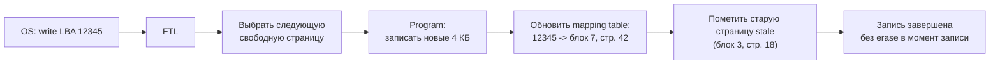
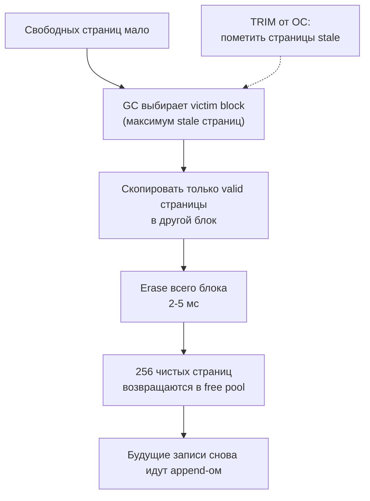

---
tags:
  - domain/computer
  - theme/storage
  - theme/performance
  - type/concept
aliases:
  - Storage
  - HDD
  - SSD
  - NVMe
order: 5
---

# Хранилище

**Предпосылки:** [оперативная память](ram.md) (DRAM, row buffer, bandwidth vs latency).

← [Оперативная память](ram.md) | [Шины и DMA](buses-and-dma.md) →

Всё, что мы разбирали до сих пор — регистры, кеши, оперативная память — объединяет одно свойство: при отключении питания данные исчезают. Регистры и SRAM-кеши теряют содержимое мгновенно, DRAM — за миллисекунды (конденсаторы разряжаются). Для выполнения программы это не проблема: загрузил, выполнил, результат отдал. Но база данных хранит таблицу заказов на 500 ГБ. Пользователь нажал «оплатить» — транзакция зафиксирована. Через секунду в дата-центре пропало питание. Если данные были только в RAM — заказ потерян. Нужно хранилище, которое переживает сбои: энергонезависимое (non-volatile), достаточно ёмкое и при этом экономически доступное. Цена этой энергонезависимости — переход из мира наносекунд в мир миллисекунд.

Два типа технологий делят этот рынок. HDD (Hard Disk Drive, жёсткий диск) — магнитное хранилище с вращающимися пластинами и механической головкой: ёмко и дёшево, но случайный доступ стоит миллисекунды. SSD (Solid State Drive, твердотельный накопитель) — электронное хранилище без движущихся частей: случайный доступ в 100 раз быстрее, но ячейки изнашиваются при записи. Оба на порядки медленнее оперативной памяти, но SSD сокращает разрыв настолько, что меняет правила проектирования баз данных.

## HDD: механика вращающихся пластин

Начнём с HDD — его ограничения определяют, почему SSD устроен именно так. Жёсткий диск (HDD, hard disk drive) — старейший тип энергонезависимого хранилища, используемый с 1956 года. Первый HDD — IBM 350 RAMAC — весил больше тонны, содержал 50 пластин диаметром 61 см и хранил 3.75 МБ. Современный серверный диск вмещает 20+ ТБ в корпусе 3.5 дюйма — рост ёмкости в 5 миллиардов раз за 70 лет. Но принцип работы остался тем же.

Данные хранятся как намагниченные участки на вращающихся металлических пластинах (platters). Чтение и запись выполняет головка (read/write head), которая парит над поверхностью пластины на высоте ~10 нм — в 5000 раз тоньше человеческого волоса. Если масштабировать головку до размеров Boeing 747, она летала бы на высоте ~1 мм над землёй на скорости 300 км/ч — любая пылинка означает крушение. Именно поэтому внутренний объём HDD герметичен (заполнен гелием в современных моделях высокой ёмкости — гелий в 7 раз легче воздуха, что снижает турбулентность и позволяет разместить пластины ближе друг к другу).

Поверхность пластины разделена на концентрические дорожки (tracks). Каждая дорожка — замкнутое кольцо данных. Дорожки делятся на секторы (sectors) — минимальные единицы чтения и записи. Исторически сектор равен 512 байтам; с 2010-х годов диски перешли на Advanced Format с секторами по 4 КБ.

```
     вид сверху на пластину
  ___________________________
 /     ______sector______    \
|    /  _______________  \    |
|   |  /               \  |   |
|   | |    дорожка 0    | |   |    <-- головка
|   | |    дорожка 1    | |   |        двигается
|   | |    дорожка 2    | |   |        по радиусу
|   |  \ ______________/  |   |
|    \____________________/   |
 \___________________________/
             шпиндель
          (ось вращения)
```

Набор дорожек с одинаковым радиусом на всех пластинах образует цилиндр (cylinder). Это понятие важно для понимания стоимости перемещения: переключиться на другую поверхность того же цилиндра — электронная операция (наносекунды), а перейти на другой цилиндр — механическое движение актуатора (миллисекунды).

Серверный диск обычно содержит 2–5 пластин (4–10 рабочих поверхностей), вращающихся на одном шпинделе. Скорость вращения определяет класс диска: 5400 RPM (Revolutions Per Minute, оборотов в минуту) для десктопов, 7200 RPM для серверов общего назначения, 10000–15000 RPM для высокопроизводительных серверных массивов. Чем быстрее вращение — тем меньше rotational latency, но больше энергопотребление, нагрев и шум. Диски 15000 RPM потребляют 15–25 Вт и требуют активного охлаждения; 5400 RPM — 3–5 Вт.

## Три составляющих задержки

Чтобы прочитать конкретный сектор, HDD должен выполнить три физических действия, и каждое стоит времени.

**Seek time (время позиционирования)** — головка перемещается к нужной дорожке. Актуатор (рычаг с головкой) физически двигается по радиусу пластины. Типичное время для серверного диска 7200 RPM: 4–8 мс для случайного доступа, 0.5–1 мс для соседних дорожек. Для десктопных дисков 5400 RPM — 8–12 мс. Это механическое движение, и оно определяет нижнюю границу латентности random I/O.

**Rotational latency (задержка вращения)** — после того как головка встала на нужную дорожку, нужно дождаться, пока вращающаяся пластина подведёт нужный сектор под головку. В среднем приходится ждать половину оборота. При 7200 RPM один полный оборот занимает 1/120 секунды = 8.33 мс, половина — ~4.17 мс. При 15000 RPM (серверные диски) — ~2 мс. При 5400 RPM — ~5.6 мс.

**Transfer time (время передачи)** — собственно чтение данных с поверхности. Для 4 КБ данных при скорости вращения 7200 RPM и типичной плотности записи — порядка 0.02 мс. Ничтожно по сравнению с seek и rotational latency.

Итого для случайного чтения 4 КБ на диске 7200 RPM: ~6 мс (seek) + ~4 мс (rotation) + ~0.02 мс (transfer) ≈ 10 мс. Для сравнения: чтение из DRAM — ~100 нс. Разница — в 100 000 раз. Это как если бы чтение из RAM занимало 1 секунду, а чтение с HDD — чуть больше суток.

Seek и rotational latency доминируют настолько, что размер запроса почти не влияет на время при случайном доступе. Прочитать 4 КБ — ~10 мс. Прочитать 64 КБ — ~10.3 мс. Прочитать 256 КБ — ~11.3 мс. Почти вся латентность — это ожидание, пока головка доберётся до нужного места. Именно поэтому HDD-ориентированные системы стараются читать крупными блоками: если уж заплатил 10 мс за позиционирование — прочитай побольше за один визит.

## IOPS: сколько операций в секунду

Если одна случайная операция стоит ~10 мс, максимум случайных операций в секунду: 1000 мс / 10 мс = 100 IOPS (Input/Output Operations Per Second — операций ввода-вывода в секунду). На практике серверный диск 7200 RPM выдаёт 75–150 IOPS random, 15000 RPM — 180–210 IOPS.

Вернёмся к нашему сценарию. База данных обрабатывает запрос пользователя, и планировщик решил прочитать 1000 случайных страниц по 8 КБ (index scan — чтение по индексу, когда нужные строки разбросаны по диску). На HDD 7200 RPM это 1000 / 100 IOPS = 10 секунд чистого ожидания I/O. Один пользовательский запрос — 10 секунд. Если в систему приходит 100 таких запросов в секунду, одного диска не хватит даже на один запрос за секунду.

Именно поэтому до эпохи SSD в продакшене использовали RAID-массивы (Redundant Array of Independent Disks). RAID 10 из 8 дисков суммирует IOPS: 8 × 100 = 800 IOPS. Это не увеличивает скорость одного запроса, но позволяет обслуживать несколько параллельно. Стоимость: 8 дисков вместо одного, причём половина ёмкости уходит на зеркалирование.

Запись на HDD подчиняется той же арифметике: seek + rotation + transfer. Случайная запись 4 КБ — те же ~10 мс, те же ~100 IOPS. Но есть нюанс: при записи с гарантией целостности (системный вызов (system call — способ, которым программа просит операционную систему выполнить действие, недоступное ей напрямую: записать данные на диск, выделить память, отправить пакет по сети) `fsync`) диск должен убедиться, что данные физически попали на пластину, а не застряли в аппаратном буфере. HDD с включённым write cache принимает запись за ~0.1 мс (в буфер), но при сбое питания содержимое буфера теряется. Без write cache (или с force unit access, FUA) — честные 10 мс на операцию. Базы данных при записи журнала предзаписи — [WAL](../../databases/postgresql/durability/wal.md) (Write-Ahead Log) — требуют именно честного `fsync`, поэтому latency WAL-записи на HDD — ~10 мс, что ограничивает транзакции примерно сотней коммитов в секунду на одном диске.

## Последовательный доступ: другая арифметика

Всё меняется, когда данные читаются последовательно. Seek выполняется один раз, дальше головка остаётся на месте и читает данные потоком. Типичная скорость последовательного чтения на HDD 7200 RPM: 150–200 МБ/с с внешних (быстрых) дорожек, 80–100 МБ/с с внутренних.

Контраст со случайным доступом: 100 IOPS × 4 КБ = 400 КБ/с случайно, против 150 МБ/с последовательно. Разница — около 400 раз. Это ещё более экстремальная версия того, что мы видели в RAM с row buffer hit/miss, но здесь вместо разницы в 10–30 раз — разница в сотни раз, потому что механическое позиционирование на порядки дороже электронного переключения строк DRAM.

Этот разрыв между последовательным и случайным доступом определил архитектуру хранения данных на десятилетия. Log-structured подход в базах данных (последовательная дозапись изменений вместо перезаписи на месте, в т.ч. WAL), выбор между последовательным и случайным чтением при обращении к таблице, физическое упорядочивание данных на диске по ключу — все эти решения существуют потому, что на HDD последовательное чтение на два-три порядка быстрее случайного.

Почему внешние дорожки быстрее внутренних? Пластина вращается с постоянной угловой скоростью. Внешняя дорожка длиннее внутренней, и за один оборот под головкой проходит больше данных. На современных дисках с зонной записью (Zoned Bit Recording, ZBR) внешние зоны содержат больше секторов на дорожку, чем внутренние. Результат: скорость последовательного чтения с внешних дорожек — 180–200 МБ/с, с внутренних — 80–100 МБ/с. Файловые системы и ОС об этом знают: «начало диска» (низкие LBA-адреса (Logical Block Address — логический адрес блока)) соответствует внешним, быстрым дорожкам.

## I/O scheduler: попытка спрятать seek

Когда от приложений приходит поток случайных запросов, ОС (операционная система) не обязана передавать их диску в том порядке, в котором они поступили. Планировщик ввода-вывода (I/O scheduler) переупорядочивает запросы, чтобы минимизировать суммарное перемещение головки — по аналогии с алгоритмом лифта (elevator algorithm): головка двигается в одном направлении, обслуживая все запросы по пути, потом разворачивается.

Для HDD это даёт ощутимый выигрыш: вместо хаотичного seek на каждый запрос, головка проходит по дорожкам в одном направлении. Реальный IOPS может вырасти в 1.5–3 раза по сравнению с наивным FIFO. В Linux для HDD используется планировщик `mq-deadline`, который балансирует между переупорядочиванием и задержкой отдельных запросов (ни один запрос не ждёт дольше настроенного таймаута).

Для SSD переупорядочивание запросов менее полезно — нет головки и нет seek. Поэтому Linux для NVMe-дисков (NVMe — Non-Volatile Memory Express, высокоскоростной интерфейс для SSD) обычно использует планировщик `none`: запросы передаются устройству напрямую, без посредника. Проверить текущий планировщик: `cat /sys/block/nvme0n1/queue/scheduler`. На большинстве нагрузок `none` оптимален для NVMe — `mq-deadline` добавляет накладные расходы на переупорядочивание, которые не окупаются без механического seek. Исключение — нагрузки, где нужны гарантии латентности для определённых классов I/O: `mq-deadline` позволяет ограничить время ожидания отдельного запроса.

## SSD: убираем механику

Твердотельный накопитель (SSD, Solid State Drive) не имеет движущихся частей. Данные хранятся в NAND flash (от логического элемента NOT-AND, определяющего способ соединения ячеек) — полупроводниковой памяти на основе транзисторов с плавающим затвором (floating gate transistors). Электроны, запертые в плавающем затворе, сохраняются без питания годами — это и обеспечивает энергонезависимость.

Нет пластин, нет головки, нет seek time, нет rotational latency. Чтение произвольной ячейки — это электрический процесс: подать напряжение, измерить пороговое напряжение транзистора, определить бит. Случайное чтение одной страницы (4–16 КБ) занимает 50–100 мкс. Это в 100 раз быстрее HDD. При этом, в отличие от HDD, латентность случайного чтения на SSD практически не зависит от адреса — нет понятия «близко» или «далеко». Страница в начале диска и страница в конце читаются за одно и то же время.

Пересчитаем сценарий. Те же 1000 случайных чтений по 8 КБ: 1000 × 75 мкс = 75 мс. Вместо 10 секунд на HDD — 75 миллисекунд. Запрос, который был невозможен на одном диске, выполняется за время моргания глаза.

IOPS: если одна операция ~75 мкс, теоретический максимум одного канала — ~13 000 IOPS. Но контроллер SSD работает с десятками каналов параллельно (от 4 каналов в бюджетных моделях до 8–16 в серверных), поэтому реальные цифры для SATA SSD — 75 000–100 000 IOPS random read, для NVMe SSD — 500 000–1 000 000 IOPS. Внутренний параллелизм SSD определяет его IOPS точно так же, как банки и ранги определяют пропускную способность DRAM: множество независимых блоков работают одновременно, а контроллер мультиплексирует запросы между ними.

Последовательное чтение тоже радикально быстрее: SATA SSD — до 550 МБ/с (упирается в интерфейс), NVMe SSD — 3–7 ГБ/с, топовые модели с PCIe 5.0 (PCI Express — высокоскоростная шина для подключения устройств к процессору) — до 14 ГБ/с. Но главное отличие от HDD: разница между последовательным и случайным доступом на SSD — в 2–5 раз, а не в 400 раз. Случайное чтение больше не катастрофа.

Это изменило правила проектирования баз данных. На HDD планировщик PostgreSQL предпочитал sequential scan (последовательное чтение всей таблицы) даже при чтении 10–20%, потому что случайные IOPS стоили в 400 раз дороже. На SSD index scan выгоден вплоть до 30–50% таблицы. Конфигурационный параметр [`random_page_cost`](../../databases/postgresql/query-processing/planner.md) в PostgreSQL по умолчанию = 4.0 (предполагает HDD: случайное чтение в 4 раза дороже последовательного с учётом кеша страниц ОС (page cache)). Для SSD рекомендуется 1.1–1.5. Неправильное значение приводит к тому, что планировщик выбирает sequential scan вместо index scan — и запрос вместо 5 мс занимает 500 мс.

## NAND flash: устройство ячейки

SSD даёт 500 000 IOPS, но цена этой скорости — сложная запись и ограниченный ресурс ячеек. Почему — зависит от физики самой ячейки, и именно эта физика порождает всю дальнейшую архитектуру SSD.

Ячейка NAND flash — это транзистор с дополнительным слоем: **плавающим затвором** (floating gate), изолированным со всех сторон. Чтобы записать «0», на управляющий затвор подаётся высокое напряжение, электроны проходят через тонкий слой оксида (изолятор между затворами) и застревают в плавающем затворе. Заряженный плавающий затвор повышает пороговое напряжение транзистора (минимальное напряжение, при котором он пропускает ток) — при чтении это детектируется как «0» (или конкретный уровень заряда). Чтобы стереть — подаётся напряжение обратной полярности, электроны выталкиваются обратно.

Этот оксидный слой — ключевое место. Каждый проход электронов через него повреждает структуру оксида: электроны застревают в дефектах, смещая пороговое напряжение. После определённого числа циклов записи-стирания оксид деградирует настолько, что ячейка перестаёт надёжно удерживать заряд — пороговые напряжения «расплываются» и соседние уровни начинают перекрываться, вызывая ошибки чтения. Контроллер SSD использует коды коррекции ошибок (ECC, Error Correction Code), способные исправить десятки бит на страницу. По мере износа число ошибок растёт, ECC справляется всё хуже, и в какой-то момент блок помечается как неиспользуемый. Это определяет ресурс ячейки.

Типы ячеек отличаются количеством бит на транзистор:

SLC (Single-Level Cell) — 1 бит на ячейку. Два уровня заряда: «заряжен» / «не заряжен». Максимальная надёжность и скорость, минимальная плотность. Ресурс: ~100 000 P/E cycles (Program/Erase, циклы записи-стирания). Используется в серверных SSD с экстремальными требованиями к записи.

MLC (Multi-Level Cell) — 2 бита на ячейку. Четыре уровня заряда. Нужно различать 4 состояния вместо 2, поэтому чтение медленнее и ошибки чаще. Ресурс: ~3 000–10 000 P/E cycles.

TLC (Triple-Level Cell) — 3 бита на ячейку. Восемь уровней заряда. Ещё медленнее, ещё менее износостойко. Ресурс: ~1 000–3 000 P/E cycles. Большинство потребительских SSD сегодня.

QLC (Quad-Level Cell) — 4 бита на ячейку. Шестнадцать уровней. Ресурс: ~100–1 000 P/E cycles. Дёшево, ёмко, но медленно на запись и быстро изнашивается. Подходит для read-heavy нагрузок.

Больше бит на ячейку — больше ёмкость при том же числе транзисторов, но меньше ресурс и медленнее запись. Это фундаментальный компромисс NAND: плотность vs ресурс vs скорость.

Современные NAND-чипы укладывают ячейки не в плоскости, а в вертикальные стопки: 3D NAND (или V-NAND) размещает 100–200+ слоёв ячеек друг над другом. Это позволяет наращивать ёмкость без уменьшения размера отдельной ячейки — чем крупнее ячейка, тем толще оксидный слой и тем больше P/E cycles она выдерживает. Переход от планарного NAND к 3D NAND одновременно увеличил ёмкость и улучшил ресурс.

Ещё одна особенность NAND — ячейки соединены последовательно в цепочки (NAND string). Для чтения одной ячейки контроллер должен «открыть» все остальные ячейки в цепочке, пропустив через них ток, и измерить напряжение на целевой ячейке. Это проще и компактнее, чем адресовать каждую ячейку отдельно, но медленнее для произвольного доступа к отдельным байтам. NAND оптимизирован для постраничного доступа — прочитать 4 КБ целиком быстрее, чем 4 КБ по одному байту.

## Асимметрия операций: читать, писать, стирать

NAND flash имеет три операции с радикально разными характеристиками, и эта асимметрия — центральная проблема, определяющая всю архитектуру SSD.

**Чтение (read)** — самая быстрая операция. Подать напряжение на управляющий затвор, измерить ток — заряжен плавающий затвор или нет. Единица чтения — страница (page), обычно 4–16 КБ. Время: 50–100 мкс для TLC.

**Запись (program)** — медленнее. Нужно протолкнуть электроны через оксид в плавающий затвор, что требует высокого напряжения и точного контроля. Единица записи — тоже страница. Время: 200–500 мкс для TLC. Критическое ограничение: записать можно только в чистую (стёртую) страницу. Нельзя «переписать» данные в странице, где уже что-то есть — сначала нужно стереть.

**Стирание (erase)** — самая медленная операция. Электроны выталкиваются из плавающих затворов обратно. Единица стирания — блок (block), который содержит 128–512 страниц. Стереть одну страницу невозможно — стирается целый блок. Время: 2–5 мс для TLC.

```
  Блок (block): 256 страниц, ~1 МБ
 +------+------+------+------+-----+------+
 |page 0|page 1|page 2|page 3| ... |p. 255|
 +------+------+------+------+-----+------+
 | 4 KB | 4 KB | 4 KB | 4 KB |     | 4 KB |
 +------+------+------+------+-----+------+

 read:  50-100 us  (одна страница)
 write: 200-500 us (одна страница, только в стёртую)
 erase: 2-5 ms     (весь блок целиком)
```

Несоразмерность масштабов видна в числах: чтение одной страницы — 75 мкс, стирание блока из 256 страниц — 3 мс. Операция стирания в 40 раз медленнее чтения, но затрагивает в 256 раз больше данных. Это как если бы для замены одной плитки на стене нужно было разобрать весь этаж.

Представим ситуацию: нужно обновить 4 КБ данных в странице 5 блока. На HDD это просто: головка переезжает к нужному сектору и перезаписывает его. На NAND это невозможно — страница 5 уже содержит данные. Чтобы записать новую версию, нужно стереть весь блок (256 страниц), а перед этим — скопировать 255 оставшихся страниц куда-то, чтобы не потерять их. Это было бы катастрофически медленно и убийственно для ресурса ячеек. Нужен промежуточный слой, который скроет эту асимметрию от ОС.

## FTL: прослойка, которая делает SSD похожим на диск

FTL (Flash Translation Layer — слой трансляции flash-памяти) — прошивка контроллера SSD, которая решает проблему асимметрии. Для операционной системы SSD выглядит как обычный блочный диск: ОС говорит «запиши 4 КБ по адресу (LBA) 12345», и FTL это выполняет. Но внутри FTL не записывает данные по указанному физическому адресу — он использует стратегию log-structured writes (журнальная запись).

Когда ОС посылает запись в LBA 12345, FTL не трогает физическую страницу, где раньше лежали данные с этим адресом. Вместо этого он записывает новые данные в следующую свободную (стёртую) страницу, а в таблице маппинга (mapping table) обновляет запись: «LBA 12345 → физическая страница N». Старая страница помечается как невалидная (stale). Каждая запись — append в свободное пространство, никаких стираний в момент записи.

Эта схема похожа на то, как работает log-structured merge tree (LSM-дерево) в базах данных или append-only журнал WAL: вместо обновления данных на месте — дописывание в конец. FTL, по сути, реализует log-structured файловую систему на уровне firmware, скрытую от ОС.

```
Таблица маппинга FTL (в DRAM контроллера):
  LBA      Физ. страница
  12345  -->  блок 7, стр. 42   (текущая)
  12345  x    блок 3, стр. 18   (stale, старая версия)
  12346  -->  блок 7, стр. 43
  ...
```



Ключевая идея FTL в том, что запись становится append-операцией, а не обновлением на месте. Именно это делает случайные 4 КБ записи вообще возможными на NAND: erase и перекопирование выталкиваются из критического пути записи в фоновую работу GC.

Эта таблица хранится в DRAM контроллера SSD (именно поэтому SSD имеет собственную микросхему RAM — обычно от 256 МБ до 2 ГБ на потребительских моделях, пропорционально ёмкости). Для диска на 1 ТБ при страницах 4 КБ — около 250 миллионов записей. При 4 байтах на запись это ~1 ГБ таблицы.

Бюджетные SSD без DRAM-буфера (DRAM-less) хранят таблицу маппинга в самом NAND и кешируют только горячую часть в небольшом SRAM-буфере контроллера. При cache miss по маппингу контроллер сначала читает нужный фрагмент таблицы из NAND (~75 мкс), а потом — сами данные. Латентность удваивается. На случайных нагрузках DRAM-less SSD могут проигрывать модели с DRAM в 2–3 раза по IOPS, хотя используют тот же NAND.

## Garbage collection: уборка невалидных страниц

Со временем блоки заполняются смесью валидных и невалидных (stale) страниц. Свободных стёртых страниц становится всё меньше. Когда свободное пространство заканчивается, FTL запускает сборку мусора (garbage collection, GC).

GC выбирает блок с наибольшей долей невалидных страниц (greedy-стратегия — жадный алгоритм, всегда выбирающий блок с максимальным выигрышем). Копирует валидные страницы из этого блока в другой блок (со свободным местом). Стирает освободившийся блок целиком — 2–5 мс на операцию стирания. Теперь в нём 256 чистых страниц, готовых к записи.

Проблема: если в блоке 200 из 256 страниц ещё валидны, GC должен прочитать и переписать 200 страниц ради 56 освобождённых. Это дополнительная нагрузка на flash-ячейки, которую не запрашивал ни пользователь, ни ОС. Это явление называется **write amplification** (усиление записи) — реальный объём записи на NAND превышает объём, запрошенный ОС. Write amplification factor (WAF) в идеале = 1.0 (записали ровно столько, сколько попросили). На практике — от 1.1 при последовательной нагрузке до 3–10 при случайной записи на заполненный диск.

Write amplification бьёт дважды: снижает производительность (контроллер тратит время на перекопирование, конкурируя за каналы с пользовательскими запросами) и ускоряет износ (каждый лишний P/E цикл приближает ячейку к смерти).



TRIM помогает не записью данных, а уменьшением объёма копирования перед erase. Чем больше страниц FTL уже знает как stale, тем дешевле GC и тем ниже write amplification.

Посчитаем на конкретном примере. SSD на 1 ТБ TLC с ресурсом 3000 P/E cycles. Полная ёмкость с учётом over-provisioning (англ. «избыточное выделение» — часть NAND, зарезервированная под нужды GC и недоступная ОС) — допустим, 1.1 ТБ NAND. Максимальный объём записи за жизнь: 1.1 ТБ × 3000 = 3300 ТБ. Если WAF = 3 (типичная случайная нагрузка), то полезная запись от ОС — 3300 / 3 = 1100 ТБ, или ~1100 TBW (Terabytes Written). При записи 50 ГБ в день (активный сервер) диск проживёт 1100 ТБ / 50 ГБ = ~22 000 дней ≈ 60 лет. При записи 500 ГБ/день (интенсивная база) — 6 лет. Спецификации производителей указывают TBW с учётом типичного WAF; серверные модели гарантируют 1–3 DWPD (Drive Writes Per Day — полных перезаписей в день) в течение 5 лет.

## TRIM: помощь от ОС

Когда ОС удаляет файл, она просто помечает блоки файловой системы как свободные в своих метаданных. SSD об этом не знает — с его точки зрения, по этим LBA всё ещё хранятся данные, которые нужно беречь и перекопировать при GC. Команда **TRIM** (буквально «подрезать лишнее»; в NVMe — Deallocate) позволяет ОС сообщить SSD: «данные по этим LBA больше не нужны». FTL помечает соответствующие физические страницы как невалидные, и при следующем GC их не нужно копировать — блок освобождается эффективнее, write amplification снижается.

Без TRIM на заполненном диске GC вынужден копировать все страницы, включая те, что ОС уже считает удалёнными. SSD деградирует: свежий накопитель выдаёт заявленные 100 000 IOPS, а после месяцев случайной записи без TRIM — 20 000–30 000. Включённый TRIM возвращает производительность ближе к номинальной.

В Linux TRIM поддерживается в двух режимах. Continuous TRIM (`discard` mount option) — команда TRIM отправляется при каждом удалении файла, синхронно. Это добавляет задержку к каждой операции удаления. Periodic TRIM (`fstrim`) — утилита `fstrim` запускается по расписанию (обычно раз в неделю через systemd timer) и отправляет TRIM для всех свободных блоков разом. Periodic TRIM предпочтительнее для серверов: накладные расходы предсказуемы и не влияют на рабочую нагрузку.

## Wear leveling: равномерный износ

Если FTL всегда записывает в одни и те же блоки (например, «горячие» блоки с часто обновляемыми данными), эти блоки исчерпают ресурс P/E раньше остальных. Блок с 3000 P/E cycles (TLC) при 10 перезаписях в день проживёт меньше года, а соседний блок с холодными данными — десятилетия.

**Wear leveling** (выравнивание износа) — алгоритм FTL, который распределяет записи равномерно по всем блокам. Существует две стратегии. Динамическое выравнивание: при каждой записи FTL выбирает для размещения данных блок с наименьшим числом P/E cycles — новые записи направляются в наименее изношенные блоки. Статическое выравнивание: FTL периодически перемещает холодные данные (которые давно не менялись) из «свежих» блоков в «изношенные», освобождая свежие блоки для горячих данных. Без статического выравнивания блоки с холодными данными никогда не изнашиваются, а горячие блоки исчерпывают ресурс в десятки раз быстрее.

Обе стратегии — это дополнительная внутренняя запись (и, соответственно, write amplification). Но без wear leveling одни блоки умирали бы в сотни раз раньше других, и диск терял бы ёмкость задолго до выработки совокупного ресурса NAND.

## NVMe vs SATA: один и тот же NAND, разный интерфейс

Первые SSD подключались через интерфейс SATA (Serial ATA, последовательный ATA), который был спроектирован для HDD. SATA — последовательный интерфейс с пропускной способностью 600 МБ/с (SATA III) и протоколом AHCI (Advanced Host Controller Interface), который поддерживает одну очередь команд глубиной 32. Для HDD с его 100 IOPS 32 команды в очереди — с запасом. Для SSD, способного выполнить 500 000 операций в секунду — узкое горлышко.

**NVMe** (Non-Volatile Memory Express, буквально «экспресс-доступ к энергонезависимой памяти») — протокол, разработанный специально для flash-хранилищ. NVMe работает поверх шины PCIe напрямую, без посредников. Ключевые отличия:

Пропускная способность: PCIe 4.0 x4 — до 8 ГБ/с, PCIe 5.0 x4 — до 16 ГБ/с. Против 600 МБ/с у SATA — разница в 13–26 раз.

Очереди: NVMe поддерживает до 65 535 очередей по 65 535 команд в каждой. Это позволяет каждому ядру CPU иметь собственную submission queue и completion queue, без блокировок и конкуренции за общий ресурс. На сервере с 64 ядрами каждое ядро отправляет команды в свою очередь, и контроллер SSD обрабатывает их параллельно. SATA с одной очередью на 32 команды вынуждает ядра конкурировать за единственную точку входа — при 64 ядрах конкуренция становится узким местом, и производительность не масштабируется.

Латентность: SATA-команда проходит через контроллер AHCI, который добавляет ~6 мкс накладных расходов. NVMe обращается к контроллеру SSD через [memory-mapped I/O](buses-and-dma.md) (регистры контроллера отображены в адресное пространство памяти CPU), накладные расходы — ~2.5 мкс. При латентности самого NAND в 50–100 мкс это не критично, но при дальнейшем снижении латентности энергонезависимых носителей (Intel Optane с ~10 мкс) протокольные накладные расходы SATA становились бы доминирующими.

Тот же NAND-чип, подключённый через SATA, упирается в 550 МБ/с и ~50 000 IOPS. Через NVMe — отдаёт полную скорость: 3–7 ГБ/с и 500 000–1 000 000 IOPS. Аналогия: это как подключить магистральную трубу к крану через садовый шланг — давление есть, но расход ограничен шлангом.

Форм-фактор NVMe-дисков — обычно M.2 (компактная плата 22×80 мм, подключается напрямую к разъёму на материнской плате) или U.2 (2.5-дюймовый корпус для серверов, с отдельным кабелем). Оба форм-фактора используют один и тот же протокол NVMe поверх PCIe. Важно не путать форм-фактор с протоколом: существуют M.2-диски с SATA-интерфейсом (ограниченные 550 МБ/с) и M.2-диски с NVMe (3–7 ГБ/с). Одинаковый разъём — радикально разная производительность.

## Целостность при сбое питания

Энергонезависимость NAND не означает автоматическую защиту от потери данных при сбое. В момент записи данные проходят три стадии: сначала попадают в DRAM-буфер контроллера SSD, затем записываются на flash-страницу, и наконец обновляется таблица маппинга. Если питание пропадёт между первой и третьей стадией, данные могут быть записаны частично или таблица маппинга может остаться в неконсистентном состоянии.

Серверные SSD оснащены конденсаторами (power loss capacitors), которые хранят достаточно энергии, чтобы при потере внешнего питания контроллер успел сбросить содержимое DRAM-буфера на flash — обычно за 10–50 мс. Потребительские SSD такой защиты не имеют. На практике это означает, что потребительский SSD может потерять данные последних записей при внезапном отключении питания, даже если ОС уже получила подтверждение от диска. Для баз данных на потребительских SSD это реальный риск повреждения данных — некоторые модели могут вернуть «успех» на fsync, хотя данные ещё не достигли NAND, а находятся в volatile DRAM-буфере контроллера.

## Практические следствия

Характеристики SSD не постоянны — они зависят от состояния диска и характера нагрузки.

**Заполненность.** Когда SSD заполнен на 90%+, свободных блоков почти нет. GC вынужден работать агрессивнее, write amplification растёт, а пользовательские записи конкурируют за каналы с внутренним копированием. Производительность записи может упасть в 2–5 раз. Серверные SSD резервируют 10–28% ёмкости (over-provisioning), которые недоступны ОС, но обеспечивают GC свободным пространством даже при полной «видимой» заполненности.

**Tail latency.** Средняя латентность чтения SSD — 75 мкс. Но если чтение совпало с GC, который стирает блок (2–5 мс), операция ждёт. 99.9-й перцентиль латентности может оказаться в 20–50 раз выше среднего. Для баз данных, где P99.9 латентности важнее средней — это существенно. Серверные SSD ограничивают продолжительность GC-пауз и распределяют стирание мелкими порциями. Некоторые серверные контроллеры реализуют deterministic GC: стирание выполняется только в заранее выделенные временные окна или равномерно распределяется, чтобы tail latency оставалась предсказуемой. Спецификации серверных SSD обычно указывают не только средний IOPS, но и 99.99-й перцентиль — типичные значения порядка 500 мкс при среднем ~100 мкс.

**Предсказуемость записи.** HDD при записи предсказуем: seek + rotation + transfer, всегда одна формула. SSD при записи может быть быстрым (пока есть стёртые страницы) или резко замедлиться (когда FTL вынужден сначала стереть блок). Burst-запись до нескольких ГБ идёт на полной скорости — контроллер использует SLC-кеш (выделенная область flash, работающая в SLC-режиме, т.е. 1 бит на ячейку — быстро, но ёмкость маленькая). После исчерпания SLC-кеша скорость падает до «нативной» скорости TLC/QLC — иногда в 3–10 раз.

**Параллелизм внутри SSD.** Контроллер SSD работает не с одним чипом NAND, а с массивом из 4–16 каналов, на каждом канале — 2–8 чипов. Каждый чип внутри разделён на 2–4 плоскости (planes), способные обрабатывать операции одновременно. Это похоже на банки DRAM: пока один канал выполняет стирание блока (3 мс), остальные обслуживают пользовательские чтения. Именно этот параллелизм превращает 13 000 IOPS одного канала в 500 000+ IOPS на уровне диска. Но если GC запускается на нескольких каналах одновременно (при массовой случайной записи на заполненный диск), параллелизм для пользовательских запросов резко сокращается — отсюда и падение производительности.

## Комбинированные развёртывания

В продакшен-системах HDD и SSD часто работают вместе. SSD обслуживает горячие данные — индексы базы данных, активные таблицы, [WAL-журнал](../../databases/postgresql/durability/wal.md), метаданные файловой системы — всё, где критичен random IOPS и низкая латентность. HDD обслуживает холодные: архивы, бэкапы, логи и данные, которые читаются последовательно и редко — стоимость за терабайт у HDD в 5–10 раз ниже, чем у SSD.

Как разница в IOPS и латентности между HDD и SSD влияет на реальный выбор носителя — показывает расчёт ниже.

> [!info]- Практический пример: выбор SSD и HDD для базы данных
> Типичная конфигурация сервера баз данных: 2–4 NVMe SSD в RAID для активной базы, массив HDD для бэкапов и [WAL-архивов](../../databases/postgresql/durability/wal.md). В распределённых системах: горячий слой на SSD (последние 7 дней данных), тёплый/холодный слой на HDD (история за годы).
>
> База данных получает 10 000 запросов в секунду. Каждый запрос порождает в среднем 5 случайных чтений (поиск по индексу + чтение нужной страницы основной таблицы) при условии, что большая часть данных не попала в буферный кеш. Итого 50 000 random read IOPS. На HDD 7200 RPM: 50 000 / 100 = нужно 500 дисков только для чтения. На одном NVMe SSD с 500 000 IOPS — 10% нагрузки. Разница в инфраструктуре: стойка серверов с HDD-массивами или один NVMe-диск ценой в $150.
>
> На практике [буферный кеш](../../databases/postgresql/durability/buffer-cache.md) базы данных и [page cache](../../linux/foundations/filesystems.md) ОС обслуживают 90–99% чтений из RAM, и до диска доходит лишь малая доля запросов. Но даже оставшиеся 1% при 10 000 QPS — это 500 random IOPS, что на одном HDD означает задержку в секунды для части запросов. SSD обслуживает эти «промахи кеша» за микросекунды, делая хвост распределения латентности предсказуемым.

## Полная картина: иерархия задержек

Теперь можно собрать всю иерархию от регистров до HDD:

```
Уровень         Латентность     Пропускная способность   Ёмкость
-------         -----------     ----------------------   -------
Регистры        ~0.3 нс (1т)   --                       128 Б
L1 кеш          ~1 нс (3-4т)   > 1 ТБ/с                 32-48 КБ
L2 кеш          ~3-4 нс        ~500 ГБ/с                256 КБ-1 МБ
L3 кеш          ~10-20 нс      ~200 ГБ/с                8-64 МБ
DRAM            ~60-100 нс     30-50 ГБ/с (DDR5)        16-512 ГБ
SSD (NVMe)      ~75 мкс        3-7 ГБ/с                 0.5-8 ТБ
SSD (SATA)      ~75 мкс        0.55 ГБ/с                0.25-4 ТБ
HDD (7200)      ~10 мс         0.15-0.2 ГБ/с (seq)      1-20 ТБ
```

Каждый переход вниз по иерархии — рост латентности на один-два порядка при росте ёмкости и снижении стоимости за гигабайт. Регистры → L1 — в 3 раза. L1 → DRAM — в 60–100 раз. DRAM → SSD — в 750 раз. SSD → HDD — в 130 раз. Суммарно от регистра до HDD — ~30 000 000 раз.

Вся архитектура компьютера построена вокруг этого разрыва: кеши прячут латентность DRAM, буферный кеш базы данных прячет латентность SSD, упреждающее чтение ОС (readahead) прячет случайные обращения за последовательным чтением. Каждый уровень — это кеш над более медленным уровнем ниже.

Стоимость за гигабайт движется в противоположном направлении:

```
Регистры/SRAM   ~$1000+ за МБ  (площадь кристалла CPU)
DRAM            ~$2-4 за ГБ
SSD NVMe        ~$0.05-0.10 за ГБ
HDD             ~$0.01-0.02 за ГБ
```

Каждый следующий уровень — дешевле на порядок. Именно экономика определяет, почему иерархия существует: если бы SRAM стоил как HDD, можно было бы поставить 10 ТБ кеша и не думать о дисках. В реальности приходится строить многоуровневую систему, где каждый уровень кеширует данные с уровня ниже, а объём хранилища на каждом уровне определяется балансом между стоимостью и частотой обращений.

## Сравнение: HDD vs SSD

HDD превосходит SSD только в стоимости за терабайт и максимальной ёмкости одного устройства. Во всём остальном — latency, IOPS, bandwidth, энергопотребление, ударостойкость — SSD выигрывает от одного до четырёх порядков.

> [!info]- Сводная таблица: HDD vs SSD
> ```
> Характеристика            HDD (7200 RPM)        SSD (NVMe)
> --------------------      ----------------      ----------------
> Random read latency       ~10 мс                ~75 мкс
> Random read IOPS          100-150               500,000-1,000,000
> Sequential read           150-200 МБ/с          3-7 ГБ/с
> Sequential write          150-200 МБ/с          2-5 ГБ/с
> Seq/random разрыв         ~400x                 ~2-5x
> Энергопотребление         5-15 Вт               3-8 Вт
> Ударостойкость            чувствителен          устойчив
> Стоимость за ТБ           $15-25                $50-100
> Макс. ёмкость (диск)      20+ ТБ                8-16 ТБ
> Срок службы               механ. износ          P/E cycles
> ```
>
> HDD также более уязвим к физическим воздействиям: вибрация или удар во время работы может привести к контакту головки с поверхностью пластины (head crash), что означает необратимую потерю данных.

## Передача данных между устройством и RAM

NVMe SSD выдаёт 500 000 IOPS и 7 ГБ/с, но эти данные должны физически попасть с контроллера SSD в оперативную память. Если CPU будет копировать каждый байт сам — выполняя load и store для каждых 8 байт — передача 4 КБ страницы займёт 512 инструкций, а при 7 ГБ/с потока CPU не будет успевать делать ничего другого. При 500 000 IOPS это 256 миллионов load/store инструкций в секунду только на перекладывание данных — целое ядро занято копированием. Нужен механизм, который позволит устройствам писать в RAM напрямую, без участия процессора. Этот механизм называется DMA (Direct Memory Access, прямой доступ к памяти). Но этого имени недостаточно: дальше важно понять, почему без DMA быстрые устройства упираются в CPU и по какому физическому пути потом идут команды и сами данные. Это и разбирается в [следующей заметке](buses-and-dma.md).

## Sources

- John L. Hennessy, David A. Patterson, 2017, *Computer Architecture: A Quantitative Approach* — 6th edition, Appendix D: Storage Systems
- Remzi H. Arpaci-Dusseau, Andrea C. Arpaci-Dusseau, *Operating Systems: Three Easy Pieces* — Chapter 37: Hard Disk Drives, Chapter 44: Flash-based SSDs (ostep.org)
- Micron, *NAND Flash 101: An Introduction to NAND Flash and How to Design It In to Your Next Product* — Technical Note TN-29-19
- NVM Express, 2024, *NVM Express Base Specification, Revision 2.1* — nvmexpress.org
- `smartctl -a /dev/sda` — SMART-данные и wear level текущего диска

---

← [Оперативная память](ram.md) | [Шины и DMA](buses-and-dma.md) →
