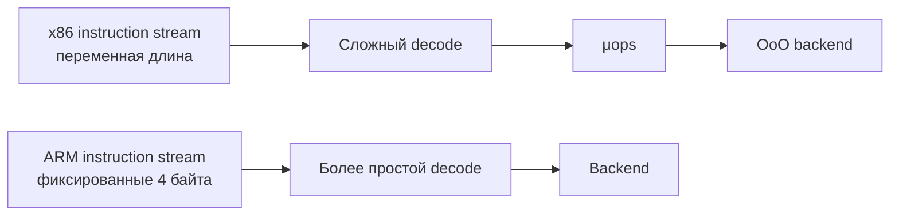

# CISC и RISC: набор команд

**Предпосылки:** [процессор](../00-cpu.md) (конвейер, decode, микроархитектура).

← [Процессор](../00-cpu.md) | [ABI и размещение данных](01-abi-and-data-layout.md) →

Конвейер, суперскалярность, спекулятивное исполнение — всё это *как* процессор выполняет инструкции внутри. Но *какие* инструкции доступны программисту и компилятору? Это определяет ISA (Instruction Set Architecture, архитектура набора команд): какие инструкции процессор понимает, какие регистры доступны, как адресуется память.

CISC (Complex Instruction Set Computer) — x86, доминирующий на серверах и десктопах. Одна инструкция может сделать много: загрузить из памяти, выполнить арифметику и записать результат обратно. Инструкции переменной длины — от 1 до 15 байт. RISC (Reduced Instruction Set Computer) — ARM, доминирующий в мобильных и встроенных. Каждая инструкция делает одну вещь, фиксированная длина 4 байта в AArch64 (32-битный ARM также поддерживает 16-битные Thumb-инструкции), декодирование проще.

Современные x86-процессоры внутри работают как RISC: сложные CISC-инструкции на стадии Decode разбиваются на микрооперации (micro-ops, μops) — простые внутренние команды фиксированной длины. Конвейер, суперскалярный движок и OoO-блок работают уже с микрооперациями. Снаружи — CISC ради совместимости с 45+ годами экосистемы. Внутри — RISC ради эффективности конвейера. Цена трансляции — сложный и энергоёмкий декодер, которого ARM-процессору не нужно. Более простой декодер — одна из причин, почему ARM-процессоры расходуют меньше энергии на инструкцию. На практике это проявляется в мобильных устройствах (где ARM доминирует) и постепенно — на серверах: AWS заявляет до 60% лучшую энергоэффективность у Graviton3 по сравнению с сопоставимыми x86-инстансами.



Смысл диаграммы не в том, что ARM «умеет» меньше, чем x86. Оба пути приходят к похожему backend с конвейером, OoO и исполнительными блоками. Главная асимметрия — во фронтенде decode: x86 тратит больше логики на перевод богатой внешней ISA во внутренний поток μops.

Выбор ISA не определяет производительность напрямую — обе архитектуры используют одни и те же техники: конвейер, суперскаляр, OoO, спекулятивное исполнение. Разница — в балансе энергия/производительность и в экосистеме программного обеспечения.

<details>
<summary>CISC vs RISC на ассемблере: a = a + b</summary>

```
x86 (CISC):
  mov  rax, [addr_b]          # загрузить b в регистр
  add  [addr_a], rax           # прибавить к a в памяти (чтение + сложение + запись)

ARM (RISC):
  ldr  r0, [addr_a]           # загрузить a в регистр
  ldr  r1, [addr_b]           # загрузить b в регистр
  add  r0, r0, r1             # сложить
  str  r0, [addr_a]           # записать обратно
```

CISC компактнее: две инструкции вместо четырёх, `add [addr_a], rax` сама выполняет чтение, сложение и запись. Но фиксированная длина RISC даёт преимущество на стадии Fetch: декодер нарезает 16 байт на 4 инструкции по фиксированным границам за один такт. Декодер x86 должен определить длину каждой инструкции (1? 5? 15?) последовательно. Intel решает это кешем декодированных микроопераций (μop cache).

</details>

<details>
<summary>Почему x86 не заменяется на ARM повсеместно?</summary>

ARM энергоэффективнее за счёт более простого декодера — меньше логики, меньше тепла. Но x86 имеет 45+ лет экосистемы: операционные системы, компиляторы, профилировщики, библиотеки — всё оптимизировано под x86. Apple смогла перевести Mac на ARM (M1), потому что контролирует и железо, и ОС, и инструменты разработки. Для экосистемы Linux/Windows такой переход сложнее, хотя AWS Graviton указывает, что для серверных нагрузок переход может быть экономически оправдан.

</details>

## Sources

- John L. Hennessy, David A. Patterson, 2017, *Computer Architecture: A Quantitative Approach* — 6th edition: https://www.elsevier.com/books/computer-architecture/hennessy/978-0-12-811905-1
- AWS, 2022, *Graviton3 delivers up to 60% better energy efficiency* — ARM server economics: https://aws.amazon.com/ec2/graviton/

---

← [Процессор](../00-cpu.md) | [ABI и размещение данных](01-abi-and-data-layout.md) →
