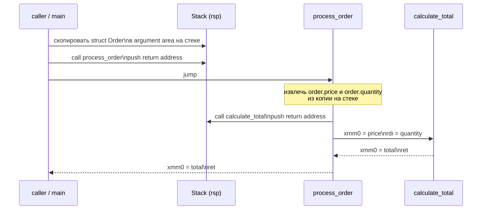

# ABI и размещение данных

**Предпосылки:** [порядок байтов](../../foundations/05-endianness.md), [процессор](../00-cpu.md) (регистры, конвейер), [CISC и RISC](00-isa.md) (ISA, micro-ops, CISC vs RISC).

← [CISC и RISC](00-isa.md) | [SIMD и векторные расширения](02-simd.md) →

ISA определяет, какие инструкции и регистры процессор предоставляет. Но как именно компилятор использует эти регистры — куда кладёт аргументы, как выравнивает данные — определяет ABI.

Процессор знает, как складывать регистры, загружать данные из памяти и переходить по адресу. Но программа — это не один поток инструкций: функция вызывает другую функцию, та — третью, каждая принимает аргументы и возвращает результат. Где лежат аргументы? Куда записать адрес возврата? Как расположить поля структуры, чтобы процессор не тратил лишние такты на чтение? Ответы на эти вопросы не зашиты в железо — они определяются соглашениями, которые компилятор, ОС и процессор соблюдают совместно. Совокупность таких соглашений — ABI (Application Binary Interface, двоичный интерфейс приложений, буквально: интерфейс на уровне двоичного кода).

Чтобы увидеть, зачем нужно каждое соглашение, проследим путь конкретного вызова. Функция `process_order` принимает структуру заказа, вызывает `calculate_total`, получает результат и возвращает его вызвавшему коду:

```c
struct Order {
    int     id;        // 4 байта
    double  price;     // 8 байт
    int     quantity;  // 4 байта
};

double calculate_total(double price, int quantity);

double process_order(struct Order order) {
    double total = calculate_total(order.price, order.quantity);
    return total;
}
```

Компилятор должен превратить этот код в машинные инструкции. Для этого ему нужно знать: как передать `order.price` и `order.quantity` в `calculate_total`, куда `calculate_total` положит результат и как `process_order` вернёт управление туда, откуда её вызвали.

## Стековый кадр и вызов функции

Процессор x86-64 имеет регистр `rsp` (stack pointer — указатель стека), который указывает на вершину стека — область памяти, растущую вниз, от старших адресов к младшим. Стек решает задачу, которую регистры решить не могут: хранить данные произвольной глубины вложенности. Функция `main` вызывает `process_order`, та вызывает `calculate_total` — три уровня. Если `calculate_total` рекурсивно вызывает себя, уровней может быть тысячи. Регистров 16, а глубина вложенности неизвестна заранее.

Почему адрес возврата нельзя хранить в регистре? На MIPS и некоторых других RISC-архитектурах так и делают: инструкция `jal` (jump and link) записывает адрес возврата в регистр `$ra`. Это быстрее — нет обращения к памяти. Но при вложенном вызове `process_order` -> `calculate_total` второй `jal` затрёт `$ra`, и адрес возврата из `process_order` будет потерян. Компилятор на MIPS обязан сохранить `$ra` в стек перед вложенным вызовом — то есть стек всё равно нужен. На x86-64 `call` и `ret` используют стек напрямую, и сохранение адреса происходит автоматически.

Инструкция `call calculate_total` делает две вещи: кладёт адрес следующей инструкции (адрес возврата) на стек и переходит по адресу `calculate_total`. Инструкция `ret` (return, «вернуться») забирает адрес со стека и прыгает туда. Стек работает как стопка тарелок: последний положенный адрес снимается первым — это LIFO (last in, first out), и именно такой порядок нужен для вложенных вызовов.

В неоптимизированном коде каждая функция при входе создаёт на стеке свой **кадр стека (stack frame, буквально «рамка стека»)** — область для локальных переменных, сохранённых регистров и временных данных. Регистр `rbp` (base pointer — указатель базы) опционально фиксирует начало кадра, чтобы отладчик мог пройти по цепочке кадров вверх и показать стек вызовов. В оптимизированном коде компилятор часто опускает `rbp` (флаг `-fomit-frame-pointer`) и адресует всё относительно `rsp`, экономя регистр.

Структура `Order` — 24 байта, слишком много для передачи через регистры (точный порог и причину разберём в [разделе о соглашении о вызовах](#соглашение-о-вызовах-system-v-amd64-abi)). Поэтому `main` копирует `order` на стек перед вызовом. Для вызова `process_order(order)` стек концептуально выглядит так (в неоптимизированном коде, с сохранением rbp):

```
Старшие адреса
  +-------------------------+
  | копия struct Order      |  <-- main скопировала order перед вызовом
  | (24 байта)              |
  +-------------------------+
  | адрес возврата из main  |  <-- call process_order положил сюда
  +-------------------------+
  | сохранённый rbp         |  <-- process_order сохранила rbp вызвавшего
  +-------------------------+
  | локальная total         |
  +-------------------------+  <-- rsp (вершина стека)
Младшие адреса
```



Стек хранит копию структуры-аргумента, адреса возврата и локальные данные. Скалярные аргументы (`price`, `quantity`) и результат `calculate_total` передаются через регистры — без обращения к памяти. Сочетание стека для крупных данных и регистров для «горячих» значений делает вызов функции одновременно вложенным и относительно дешёвым.

System V AMD64 ABI требует, чтобы перед инструкцией `call` значение `rsp` было выровнено по 16 байтам. Причина — инструкции SSE (Streaming SIMD Extensions — [расширения для одновременной обработки нескольких значений](02-simd.md)), например `movaps` и `movdqa`, ожидают 16-байтовое выравнивание данных в стеке. Если `rsp` не делится на 16, эти инструкции генерируют аппаратное исключение (процессор прерывает инструкцию и передаёт управление обработчику ошибок). Выровненные AVX-загрузки и записи (`vmovapd`) требуют уже 32-байтового выравнивания, но ABI гарантирует только 16. Сама `call` кладёт 8 байт адреса возврата, сдвигая `rsp` на 8, поэтому на входе в функцию `rsp` всегда смещён на 8 относительно 16. Функция восстанавливает выравнивание, вычитая из `rsp` нечётное количество 8-байтовых слов.

## Соглашение о вызовах: System V AMD64 ABI

Стек медленнее регистров: запись в стек — это запись в память (пусть и попадающая в L1-кеш, это ~1 нс против ~0.3 нс для регистра). Передавать все аргументы через стек расточительно, если большинство функций принимают 1–3 параметра. Calling convention (соглашение о вызовах) определяет, какие аргументы передаются в регистрах, какие — на стеке.

На Linux x86-64 действует **System V AMD64 ABI**. Первые шесть целочисленных аргументов (и указателей) передаются в регистрах `rdi`, `rsi`, `rdx`, `rcx`, `r8`, `r9` — именно в этом порядке. Первые восемь аргументов с плавающей точкой — в `xmm0`–`xmm7`. Если аргументов больше — остаток уходит на стек.

Для вызова `calculate_total(order.price, order.quantity)`:
- `order.price` (тип `double`) — первый аргумент с плавающей точкой, передаётся в `xmm0`;
- `order.quantity` (тип `int`) — первый целочисленный аргумент, передаётся в `rdi`.

Результат `double` возвращается в `xmm0`. Целочисленный результат вернулся бы в `rax`, крупный целочисленный результат (два 64-битных слова) — в паре `rax`/`rdx`.

Передача структур — отдельная тема. Небольшие структуры (как правило, до 16 байт) ABI может классифицировать для передачи в одном или двух регистрах. Структура `OrderCompact` (16 байт: `double` + два `int`) может быть передана в `xmm0` (для `double`) и `rdi` (для двух `int`, упакованных в 8 байт). Структуры больше 16 байт (точнее — аргументы, которые ABI относит к классу MEMORY — передача через память) передаются через стек: вызывающая сторона копирует структуру целиком в область аргументов. В нашем примере структура `Order` (24 байта) была бы скопирована на стек целиком. Это важно для производительности: передача структуры в 64 байта по значению означает копирование 64 байт при каждом вызове. На практике программисты передают крупные структуры через указатель (`const struct *`), заменяя копирование одной записью в регистр. Для **возврата** крупных структур ABI использует отдельный механизм: вызывающая сторона выделяет место и передаёт скрытый указатель в `rdi`, сдвигая остальные аргументы на один регистр.

Шесть регистров для аргументов — компромисс. Если бы регистров было больше, функция с двумя аргументами сэкономила бы ноль тактов (два регистра хватает), а сохранение неиспользованных регистров при вложенных вызовах стоило бы дороже. Шесть покрывает подавляющее большинство функций: на практике редкая функция принимает больше шести целочисленных аргументов.

### Caller-saved и callee-saved регистры

Когда `process_order` вызывает `calculate_total`, обе функции работают с одними и теми же 16 регистрами. Кто отвечает за сохранение значений?

ABI делит регистры на две группы. **Caller-saved** (сохраняемые вызывающей стороной): `rax`, `rcx`, `rdx`, `rsi`, `rdi`, `r8`–`r11`. Вызываемая функция может свободно их портить. Если `process_order` хранит что-то важное в `rcx`, она обязана сама сохранить его в стек перед `call`. **Callee-saved** (сохраняемые вызываемой стороной): `rbx`, `rbp`, `r12`–`r15`. Если `calculate_total` хочет использовать `rbx`, она обязана сохранить его на входе и восстановить перед `ret`.

Логика деления: регистры-аргументы (`rdi`, `rsi`, ...) и регистр результата (`rax`) — caller-saved, потому что их значения и так будут перезаписаны вызовом. Остальные — callee-saved, чтобы вызывающий код мог хранить в них долгоживущие значения через серию вызовов.

> [!info]- Задача: куда делось значение rdi после вызова?
> Функция сохранила указатель в `rdi` и затем вызвала другую функцию. После возврата `rdi` содержит мусор.
>
> **Частая ошибка:** ожидать, что `rdi` сохранит значение через `call`.
>
> `rdi` — caller-saved регистр. Вызываемая функция использует его для своего первого аргумента и не обязана восстанавливать. Для хранения значения через вызов нужен callee-saved регистр (`rbx`, `r12`–`r15`) или локальная переменная на стеке.

## Выравнивание

`calculate_total` получила аргументы, выполнила вычисление и вернула результат в `xmm0`. Теперь `process_order` кладёт `total` в локальную переменную типа `double`. Компилятор отводит для неё 8 байт на стеке (в оптимизированном коде значение может остаться в регистре и не попасть на стек, но для понимания выравнивания рассмотрим стековый случай). Но по какому адресу? Если `total` окажется по адресу `0x7FFD003`, а не `0x7FFD000`, обращение к ней может стоить дороже.

**Выравнивание (alignment)** — размещение данных по адресу, кратному размеру типа. `int` (4 байта) выравнивается по 4, `double` (8 байт) — по 8. Это правило называется **natural alignment** (естественное выравнивание): тип размером N байт лежит по адресу, делящемуся на N.

Причина — в аппаратуре. Процессор читает данные из памяти не побайтово, а [кеш-линиями](../data-path/00-memory-hierarchy.md) по 64 байта. Внутри кеш-линии контроллер памяти выдаёт данные выровненными порциями. Если 8-байтовый `double` лежит по адресу 0x04, он пересекает две 8-байтовые группы: байты 0x04–0x07 в одной, 0x08–0x0B — в другой. Процессор должен прочитать обе группы и склеить результат — это **split load (расщеплённое чтение)**. Выровненное чтение занимает 1 такт. Split load внутри одной кеш-линии стоит ~3 тактов, потому что процессор выполняет два чтения и склеивает результат. Если данные пересекают границу между двумя кеш-линиями (адрес 0x3C, данные заходят на кеш-линию с адреса 0x40), штраф составляет ~5–20 тактов в зависимости от микроархитектуры, потому что нужны два обращения к L1. Ещё хуже — пересечение границы страницы (4 КБ): процессору приходится транслировать два виртуальных адреса вместо одного, и штраф может достигать сотен тактов.

На x86-64 невыровненный доступ допустим — процессор справится, но медленнее. На AArch64 (ARMv8, 64-битный режим) ситуация аналогична: невыровненный доступ к обычной памяти обрабатывается аппаратно, со штрафом при пересечении кеш-линии. Обязательное выравнивание сохраняется только для атомарных операций и обращений к регистрам устройств. На ранних ARM (до ARMv6) невыровненный доступ действительно вызывал аппаратное исключение.

Компилятор расставляет выравнивание автоматически, и для отдельных переменных это незаметно. Последствия становятся видны при размещении данных в структурах.

## Размещение структуры в памяти

Правило выравнивания особенно заметно в структурах — именно там оно создаёт неожиданные эффекты. Вернёмся к структуре `Order`:

```c
struct Order {
    int     id;        // 4 байта, выравнивание 4
    double  price;     // 8 байт, выравнивание 8
    int     quantity;  // 4 байта, выравнивание 4
};
```

Наивное ожидание: `id` (4) + `price` (8) + `quantity` (4) = 16 байт. В реальности `sizeof(struct Order)` на x86-64 равен 24.

Компилятор размещает поля в порядке объявления. `id` начинается с адреса 0. После `id` следующий свободный адрес — 4. Но `price` требует выравнивания по 8, ближайший подходящий адрес — 8. Между `id` и `price` компилятор вставляет 4 байта **padding (заполнения)** — неиспользуемого пространства:

```
Адрес:  0    4    8              16   20   24
        +----+----+--------------+----+----+
        | id |pad |    price     |qty |pad |
        +----+----+--------------+----+----+
        4 Б   4 Б    8 Б          4 Б  4 Б  = 24 Б
```

Ещё 4 байта padding в конце после `quantity` — **trailing padding (хвостовой заполнитель)**. Он нужен для массивов: если `Order orders[10]`, то `orders[1]` должен начинаться по адресу, кратному выравниванию всей структуры. Выравнивание структуры равно выравниванию её самого требовательного поля — `double` с выравниванием 8. Без trailing padding второй элемент массива начался бы с адреса 20, что не делится на 8.

Простая перестановка полей убирает весь внутренний padding:

```c
struct OrderCompact {
    double  price;     // 8 байт, адрес 0
    int     id;        // 4 байта, адрес 8
    int     quantity;  // 4 байта, адрес 12
};  // sizeof = 16, без padding
```

`price` (выравнивание 8) стоит первой, начинается с 0. `id` (выравнивание 4) начинается с 8 — делится на 4. `quantity` — с 12 — делится на 4. Trailing padding не нужен: 16 делится на 8. Итого 16 вместо 24 — экономия 33%. При массиве из миллиона заказов это 8 МБ разницы: больше кеш-промахов, больше обращений к памяти, больше тактов ожидания.

Общее правило оптимизации: располагать поля от наибольшего выравнивания к наименьшему. Компилятор не переупорядочивает поля самостоятельно — стандарт C гарантирует, что поля лежат в порядке объявления, и код может зависеть от этого (приведение указателей, сериализация).

Атрибут `__attribute__((packed))` в GCC/Clang полностью убирает padding. `sizeof` уменьшается, но каждое обращение к невыровненному полю потенциально становится split load. Для структуры, к которой обращаются миллионы раз в секунду, потеря на невыровненных обращениях перевесит экономию памяти. `packed` оправдан в двух случаях: сетевые протоколы и форматы файлов, где размещение определено спецификацией, и структуры, которые сериализуются и хранятся на диске.

> [!info]- Задача: определить sizeof структуры с тремя полями
> ```c
> struct Packet {
>     char   type;      // 1 байт
>     int    length;    // 4 байта
>     char   flags;     // 1 байт
> };
> ```
>
> Сколько байт займёт `sizeof(struct Packet)`?
>
> **Частая ошибка:** 1 + 4 + 1 = 6 байт.
>
> `type` — адрес 0 (1 байт). `length` требует выравнивания 4, ближайший адрес — 4. Padding: 3 байта. `length` — адреса 4–7. `flags` — адрес 8 (1 байт). Trailing padding: 3 байта (структура выравнивается по 4, ближайшее кратное — 12). **`sizeof = 12`**, вдвое больше «наивных» 6.
>
> Перестановка: `int length; char type; char flags;` — sizeof = 8 (4 + 1 + 1 + 2 padding). Ещё лучше: `int length; char type; char flags; char reserved[2];` — явный padding делает намерение видимым.

## Порядок байтов (endianness)

Когда `price` нужно записать в бинарный файл или передать в сетевом пакете, при явной сериализации отдельных полей выравнивание и padding уже не играют роли. Но каким порядком расположены байты внутри 8-байтового `double`?

Подробно о порядке байтов, двух соглашениях (little-endian и big-endian), причинах выбора x86 и практических последствиях — в [порядок байтов](../../foundations/05-endianness.md). Здесь важно одно: внутри одной программы на одной машине endianness незаметен. Проблема возникает на границе: отправка по сети, запись в файл, межъязыковая сериализация. Современные x86-64 и AArch64 используют little-endian, сетевые протоколы (TCP/IP) — big-endian.

## ABI как контракт

Каждое соглашение, описанное выше, — фрагмент одного контракта. Calling convention определяет, как функция принимает аргументы и возвращает результат. Выравнивание определяет, по каким адресам лежат данные. Размещение структур определяет, как поля расположены относительно друг друга. Порядок байтов определяет, как многобайтовые значения записаны в памяти. Вместе они образуют **ABI** — набор правил, которым следуют все участники: компилятор, ОС, динамический линкер и любая библиотека.

На Linux x86-64 действует **System V AMD64 ABI**, описанный в документе ~130 страниц. Он охватывает не только вызовы функций, но и формат [ELF](../../linux/infrastructure/00-elf-and-linking.md)-файлов (Executable and Linkable Format), способ передачи структур (маленькие структуры в регистрах, крупные — через копирование на стек), размещение thread-local storage (локальное хранилище потока) и даже способ обработки исключений C++.

Windows x64 использует другой ABI: первые четыре целочисленных аргумента идут в `rcx`, `rdx`, `r8`, `r9` (не `rdi`, `rsi`, как в System V). Вызывающая функция обязана зарезервировать 32 байта на стеке для «shadow space» — области, куда вызываемая функция может записать регистровые аргументы при необходимости. Набор callee-saved регистров тоже отличается. Код, скомпилированный для Linux, нельзя вызвать из Windows-библиотеки — даже на том же процессоре с тем же набором инструкций.

Это объясняет, почему ABI-стабильность критична для разделяемых библиотек (`.so`, `.dll`). Библиотека libc.so скомпилирована отдельно от программы. Если компилятор решит изменить порядок аргументов в регистрах или выравнивание структуры в новой версии ABI, каждая программа, слинкованная с libc.so, перестанет работать. Поэтому ABI меняется крайне редко: System V AMD64 ABI используется без принципиальных изменений с 2003 года. Переход от x86 32-бит (cdecl, stdcall — несколько конкурирующих calling conventions) к x86-64 был одним из немногих моментов, когда индустрия согласовала единый ABI для платформы.

Для системных вызовов Linux использует тот же набор регистров, но с другим распределением: номер вызова в `rax`, аргументы в `rdi`, `rsi`, `rdx`, `r10`, `r8`, `r9` (обратите внимание: `r10` вместо `rcx`, потому что инструкция `syscall` затирает `rcx` адресом возврата). Подробности — в [механизме системных вызовов](../../linux/kernel/00-syscall-internals.md). Формат ELF, через который ядро загружает программу и разрешает зависимости, описан в [ELF и линковке](../../linux/infrastructure/00-elf-and-linking.md).

Путь от `process_order` через `calculate_total` и обратно опирается на все эти соглашения: структура `Order` скопирована на стек по правилам передачи MEMORY-класса, скалярные аргументы `calculate_total` переданы в регистрах по calling convention, стековый кадр выровнен по 16 байтам, поля структуры размещены с padding, результат вернулся в `xmm0`. Если любое из этих соглашений нарушено — вызывающий код прочитает мусор вместо результата, стек рассинхронизируется, и программа упадёт. ABI — невидимый контракт, который делает возможным раздельную компиляцию, динамическую линковку и взаимодействие кода на разных языках.

## Sources

- Michael Matz, Jan Hubicka, Andreas Jaeger, Mark Mitchell, 2023, *System V Application Binary Interface, AMD64 Architecture Processor Supplement* — вызовы, регистры, layout: https://gitlab.com/x86-psABIs/x86-64-ABI
- Intel, 2024, *Intel 64 and IA-32 Architectures Software Developer's Manual* — Volume 1: Basic Architecture, Chapter 6: Procedure Calls, Interrupts, and Exceptions: https://www.intel.com/content/www/us/en/developer/articles/technical/intel-sdm.html
- Ulrich Drepper, 2007, *What Every Programmer Should Know About Memory* — alignment, cache effects: https://people.freebsd.org/~lstewart/articles/cpumemory.pdf
- Agner Fog, 2024, *Calling Conventions for Different C++ Compilers and Operating Systems* — System V vs Windows x64: https://www.agner.org/optimize/calling_conventions.pdf
- ARM, 2023, *Procedure Call Standard for the Arm 64-bit Architecture (AAPCS64)* — ARM ABI для сравнения с x86-64: https://github.com/ARM-software/abi-aa/blob/main/aapcs64/aapcs64.rst

---

← [CISC и RISC](00-isa.md) | [SIMD и векторные расширения](02-simd.md) →
