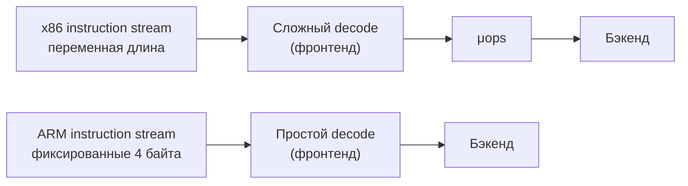

---
tags:
  - domain/computer
  - theme/data-representation
  - theme/internals
  - type/concept
aliases:
  - ISA
  - Instruction Set Architecture
  - CISC
  - RISC
  - x86
  - ARM
order: 9
---

# CISC и RISC: набор команд

**Предпосылки:** [процессор](../cpu.md) ([[computer/cpu#Конвейер|конвейер]], fetch, decode, [[computer/cpu#Суперскалярное исполнение|суперскалярность]], [[computer/cpu#Внеочерёдное исполнение|внеочерёдное исполнение]], [[computer/cpu#Спекулятивное исполнение|спекулятивное исполнение]]).

← [Процессор](../cpu.md) | [ABI и размещение данных](abi-and-data-layout.md) →

Когда компилятор вычисляет `a += b`, ему нужно понять, какими *командами* говорить процессору. Но разные производители разговаривают на разных языках инструкций: процессор Intel не поймёт программу, скомпилированную для ARM, и наоборот. Какой набор команд понимает процессор? Этот вопрос определяет, как компилятор превращает исходный код в выполняемые команды.

Компилятор генерирует код для одной и той же операции — `a += b`, когда обе переменные лежат в памяти. На x86 получаются две инструкции, на ARM — четыре. Разница не в том, *как* [процессор](../cpu.md) устроен внутри — [[computer/cpu#Конвейер|конвейер]], [[computer/cpu#Суперскалярное исполнение|суперскалярность]], [[computer/cpu#Внеочерёдное исполнение|внеочерёдное исполнение]] одинаковы по сути. Разница в том, *какие* инструкции процессор обещает понимать. Этот контракт между процессором и программным обеспечением — **ISA (Instruction Set Architecture — архитектура набора команд)**: какие инструкции доступны, какие регистры видны программисту, как адресуется память. Две архитектуры (x86 и ARM) решают эту задачу принципиально по-разному.

## Два подхода к набору команд

CISC (Complex Instruction Set Computer — «компьютер со сложным набором команд») — подход x86, доминирующего на серверах и десктопах. Одна инструкция может сделать много: загрузить значение из памяти, выполнить арифметику и записать результат обратно. Для `a += b` с обеими переменными в памяти достаточно двух инструкций: загрузить `b` в регистр и выполнить сложение с записью в память за одну операцию. Инструкции переменной длины — от 1 до 15 байт.

RISC (Reduced Instruction Set Computer — «компьютер с сокращённым набором команд») — подход ARM, доминирующего в мобильных и встроенных устройствах. Каждая инструкция делает ровно одну вещь. Фиксированная длина 4 байта в 64-битном ARM (AArch64). Для того же `a += b` из памяти нужно четыре инструкции: загрузить `a`, загрузить `b`, сложить, записать обратно.

> [!info]- CISC vs RISC на ассемблере: a = a + b
> ```
> x86 (CISC):
>   mov  rax, [addr_b]          # загрузить b в регистр
>   add  [addr_a], rax           # прибавить к a в памяти (чтение + сложение + запись)
>
> ARM (RISC):
>   ldr  r0, [addr_a]           # загрузить a в регистр
>   ldr  r1, [addr_b]           # загрузить b в регистр
>   add  r0, r0, r1             # сложить
>   str  r0, [addr_a]           # записать обратно
> ```
>
> CISC компактнее: две инструкции вместо четырёх, `add [addr_a], rax` сама выполняет чтение, сложение и запись. Но фиксированная длина RISC упрощает поиск границ инструкций: декодер сразу знает, где начинается следующая. Декодер x86 должен определить длину каждой инструкции (1 байт? 5? 15?) последовательно — это одна из причин его сложности и энергоёмкости.

Четыре инструкции вместо двух — значит ARM медленнее? Нет. Ключ — в том, что происходит внутри процессора на стадии decode.

## CISC снаружи, RISC внутри

Современные x86-процессоры внутри работают как RISC: сложные CISC-инструкции на стадии decode разбиваются на микрооперации (micro-ops, μops) — простые внутренние команды фиксированной длины. [[computer/cpu#Конвейер|Конвейер]], [[computer/cpu#Суперскалярное исполнение|суперскалярный движок]] и [[computer/cpu#Внеочерёдное исполнение|блок внеочерёдного исполнения]] работают уже с μops. Та самая операция `a += b`, записанная двумя x86-инструкциями, внутри процессора превращается в те же загрузку, сложение и запись — но с накладными расходами на трансляцию. Снаружи — CISC ради совместимости с 45+ годами экосистемы. Внутри — RISC ради эффективности [[computer/cpu#Конвейер|конвейера]].

Конвейер делится на фронтенд (front-end — «передняя часть»: стадии fetch и decode, которые готовят инструкции к исполнению) и бэкенд (back-end — «задняя часть»: исполнительные блоки, диспетчеризация и фиксация результатов). Оба пути — x86 и ARM — приходят к похожему бэкенду. Главная асимметрия — во фронтенде: x86-декодер дополнительно разбивает внешние CISC-инструкции на μops, что требует больше транзисторов и энергии.



Цена сложного фронтенда — энергия. Более простой декодер ARM — одна из причин, почему ARM-процессоры расходуют меньше энергии на инструкцию. На практике это проявляется в мобильных устройствах (где ARM доминирует) и постепенно — на серверах: AWS (Amazon Web Services) заявляет до 60% лучшую энергоэффективность у Graviton3 по сравнению с сопоставимыми x86-серверами.

Выбор ISA не определяет производительность напрямую — обе архитектуры используют одни и те же техники в бэкенде: [[computer/cpu#Конвейер|конвейер]], [[computer/cpu#Суперскалярное исполнение|суперскалярность]], [[computer/cpu#Внеочерёдное исполнение|внеочерёдное исполнение]], [[computer/cpu#Спекулятивное исполнение|спекулятивное исполнение]]. Разница — в балансе энергия/производительность и в экосистеме.

> [!info]- Почему x86 не заменяется на ARM повсеместно?
> ARM энергоэффективнее в том числе за счёт более простого декодера — меньше логики, меньше тепла. Но x86 имеет 45+ лет экосистемы: операционные системы, компиляторы, профилировщики, библиотеки — всё оптимизировано под x86. Apple смогла перевести Mac на ARM (M1), потому что контролирует и железо, и ОС, и инструменты разработки. Для экосистемы Linux/Windows такой переход сложнее, хотя AWS Graviton показывает, что для серверных нагрузок переход может быть экономически оправдан.

Выбор ISA определяет первичный компромисс: сложный декодер (CISC, энергозатратный, совместимый) vs простой (RISC, экономный, экосистемозависимый). Но это не единственное соглашение между процессором и программой. ISA говорит "вот эти команды я понимаю". Программе нужно знать и другое: куда кладутся аргументы функций, где лежит результат, как выравниваются данные в памяти. Эти правила определяют **ABI** — бинарный интерфейс приложений, который связывает компилятор, процессор и операционную систему в единый контракт.

## Sources

- John L. Hennessy, David A. Patterson, 2017, *Computer Architecture: A Quantitative Approach* — 6th edition: https://www.elsevier.com/books/computer-architecture/hennessy/978-0-12-811905-1
- AWS, 2022, *Graviton3 delivers up to 60% better energy efficiency* — ARM server economics: https://aws.amazon.com/ec2/graviton/

---

← [Процессор](../cpu.md) | [ABI и размещение данных](abi-and-data-layout.md) →
