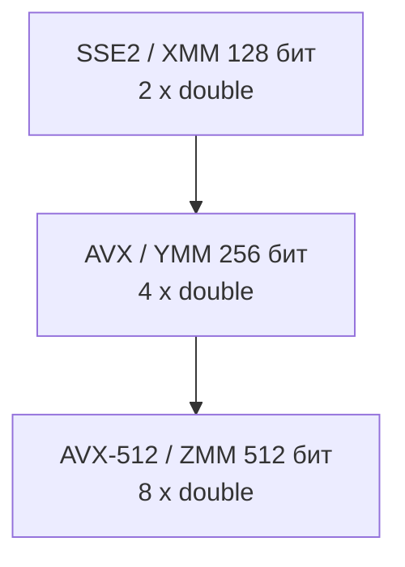
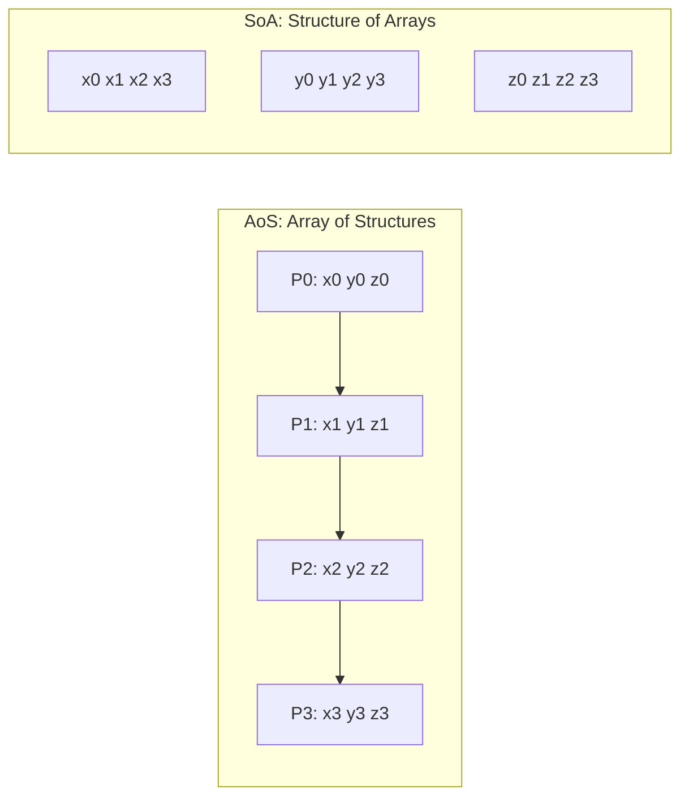

---
tags:
  - domain/computer
  - theme/performance
  - theme/data-representation
  - type/concept
aliases:
  - SIMD
  - Single Instruction Multiple Data
  - SSE
  - AVX
  - AVX-512
order: 9
---

# SIMD и векторные расширения

**Предпосылки:** [бит, байт](../../foundations/binary-and-bytes.md), [ABI и размещение данных](abi-and-data-layout.md) (xmm-регистры, выравнивание), [кеш-линия](../data-path/memory-hierarchy.md) (64 байта — единица передачи между кешем и памятью).

← [ABI и размещение данных](abi-and-data-layout.md)

В [ABI](abi-and-data-layout.md) аргументы с плавающей точкой передаются через xmm0–xmm7 — 128-битные регистры. Но зачем регистру 128 бит, если `double` занимает 64? Ответ: каждый xmm-регистр вмещает **два** `double`, и существуют инструкции, которые обрабатывают оба сразу. Это SIMD (Single Instruction, Multiple Data — одна инструкция, много данных): способ обрабатывать несколько одинаковых элементов одной инструкцией.

## Задача: поэлементное умножение

Возьмём простую задачу: поэлементно умножить два массива из 1024 `double` и записать результат в третий.

```c
for (int i = 0; i < 1024; i++)
    c[i] = a[i] * b[i];
```

Три массива по 8 КБ — 24 КБ суммарно, помещаются в L1d (32 КБ). Скалярный код (обрабатывающий по одному элементу за инструкцию) компилируется в цикл: загрузить `a[i]`, загрузить `b[i]`, `mulsd` (умножить один `double`), записать в `c[i]`. На каждой итерации — 3 инструкции с памятью (2 load + 1 store) и 1 арифметическая. За 1024 итерации — 1024 умножения, каждое обрабатывает ровно один элемент.

Суперскалярность помогает: [процессор](../cpu.md) выполняет load, mul и store параллельно на разных исполнительных блоках. Но фундаментально: каждая `mulsd` обрабатывает один `double`. Что если расширить и регистр, и ALU, чтобы одна инструкция умножала сразу несколько элементов?

## SIMD: расширяем путь данных

Суперскалярность запускает **несколько разных инструкций** параллельно (load + mul + store на разных блоках). SIMD — другой вид параллелизма: **одна инструкция** обрабатывает **несколько одинаковых данных**. Это не многопоточность (разные потоки с разным кодом) и не суперскалярность (разные инструкции). Это расширение самого пути данных: вместо 64-битного регистра и 64-битного умножителя — 256-битный регистр и 256-битный умножитель, обрабатывающий 4 `double` за одну инструкцию.

Для нашего цикла это означает: вместо 1024 итераций по одному `double` — 256 итераций по 4. Идеальный потолок по ширине вектора — ×4.

## x86: поколения векторных расширений



Ширина вектора почти напрямую превращается в число элементов на инструкцию: XMM обрабатывает 2 `double`, YMM — 4, ZMM — 8. Именно поэтому переходы SSE -> AVX -> AVX-512 воспринимаются как почти идеальные ×2 по «ширине полосы», хотя реальный выигрыш потом ограничивают [память](../data-path/memory-hierarchy.md), порты загрузки и частота.

### SSE и SSE2

SSE (Streaming SIMD Extensions, 1999) ввёл **новый регистровый файл**: 8 регистров XMM по 128 бит (в x86-64 — 16: xmm0–xmm15), независимый от FPU. SSE работал только с `float` (4 штуки по 32 бита в одном регистре). SSE2 (2001) расширил те же XMM-регистры для `double` (2 по 64 бита) и целочисленных типов (16 байт, 8 `short`, 4 `int`). С SSE2 каждая `mulpd xmm0, xmm1` умножает 2 `double` за раз — наш цикл ускоряется до ×2 по ширине вектора. SSE3, SSSE3 и SSE4 добавляли дополнительные инструкции (горизонтальные операции, строковые сравнения), но не меняли ширину.

### AVX и AVX2

AVX (Advanced Vector Extensions, 2011) удвоил ширину до 256 бит: 16 регистров YMM, каждый вмещает 4 `double` или 8 `float`. Одна `vmulpd ymm0, ymm1, ymm2` умножает сразу 4 `double` — наш цикл ускоряется до ×4. AVX использует трёхоперандный формат (два источника + результат), в отличие от SSE, где результат перезаписывал один из источников.

AVX2 (2013) расширил 256-битные операции на целочисленные типы и добавил gather-инструкции (загрузка элементов по массиву индексов). Без AVX2 целочисленная SIMD-арифметика оставалась 128-битной.

### AVX-512

AVX-512 (2017) удвоил ширину до 512 бит: 32 регистра ZMM, 8 `double` за инструкцию. Добавил mask-регистры (k0–k7): биты маски управляют, какие элементы вектора обрабатываются, а какие пропускаются. Это позволяет обрабатывать «хвосты» массивов и условные операции без ветвлений.

AVX-512 появился в серверных Xeon (Skylake-SP, 2017), затем в клиентских (Ice Lake, 2019), но E-cores гибридных процессоров (Alder Lake, 2021) не имеют 512-битных ALU. На Alder Lake AVX-512 официально не поддерживается — Intel отключил его через обновления микрокода даже при неактивных E-cores.

> [!info]- x86-специфичные подводные камни: throttling (снижение частоты) и transition penalty (штраф перехода)
> **AVX-512 frequency throttling:** при активации тяжёлых AVX-512 инструкций процессор снижает частоту. Широкие 512-битные ALU потребляют больше энергии, и тепловые ограничения не позволяют держать номинальную частоту. Если SIMD-секция кода короткая, потеря от снижения частоты может перевесить выигрыш от широкого вектора.
>
> **AVX↔SSE transition penalty:** на архитектурах до Skylake переключение между 256-битными AVX-инструкциями и 128-битными SSE-инструкциями без `vzeroupper` вызывало штраф ~70 тактов. Skylake убрал этот штраф, но `vzeroupper` по-прежнему рекомендуется для совместимости. Компиляторы вставляют его автоматически при `-mavx`.
>
> **gather/scatter:** инструкции загрузки/записи по массиву индексов (`vgatherdpd`, `vscatterdpd`) медленнее, чем последовательные загрузки. На Skylake gather из 4 элементов стоит ~12 тактов — не намного лучше 4 отдельных load. Реальный выигрыш gather даёт только на AVX-512 с 8+ элементами.

## ARM: NEON и SVE

x86 расширяла ширину поколениями: 128 → 256 → 512 бит, каждый раз добавляя новые инструкции и регистры. ARM пошёл другим путём.

**NEON** — обязательное расширение в ARMv8 (AArch64). 32 регистра по 128 бит (v0–v31), поддержка float, double и целочисленных типов. Концептуально похож на SSE2, но с бо́льшим регистровым файлом (32 vs 16). Apple M1/M2 содержат NEON, но не SVE.

**SVE/SVE2** (Scalable Vector Extension, 2016/2019) — принципиально другой подход. Ширина вектора не фиксирована в ISA: одна и та же программа работает на реализациях с 128, 256, 512 и до 2048 бит. Код не содержит конкретной ширины — процессор определяет её при исполнении. AWS Graviton3 реализует SVE с 256-битными векторами. Контраст с x86, где каждое поколение (SSE → AVX → AVX-512) требует отдельных инструкций и часто перекомпиляции.

## Требования к данным

SIMD-инструкции обрабатывают N элементов за раз, но только если эти элементы лежат подряд в памяти и выровнены. Для нашего `c[i] = a[i] * b[i]` массивы уже непрерывны — `vmulpd` загружает 4 соседних `double` одной инструкцией. Но не всякий код работает с массивами напрямую.

### Выравнивание

В [ABI](abi-and-data-layout.md) стек выровнен по 16 байтам, и `movaps` (aligned load) требует этого выравнивания. Для 256-битных AVX-загрузок данные выигрывают от 32-байтового выравнивания: `vmovapd` (aligned) требует его, а `vmovupd` (unaligned) на современных [процессорах](../cpu.md) (Haswell+) не штрафуется для обращений внутри одной [кеш-линии](../data-path/memory-hierarchy.md). Штраф возникает, когда 32-байтовая загрузка пересекает границу 64-байтовой [кеш-линии](../data-path/memory-hierarchy.md) — в этом случае нужны два обращения к кешу вместо одного.

Для динамически выделяемых массивов: `malloc` на большинстве платформ гарантирует 16-байтовое выравнивание. Для 32-байтового — `aligned_alloc(32, size)` в C11, `_mm_malloc(size, 32)` через специализированную функцию Intel.

### AoS vs SoA

Массив структур (AoS, Array of Structures) плохо подходит для SIMD. Если 3D-точки хранятся как `struct { double x, y, z; }`, координаты x разных точек разделены 24 байтами (z предыдущей, y и x следующей). Одна SIMD-загрузка захватывает x, y, z одной точки и x следующей — бесполезная смесь.

Структура массивов (SoA, Structure of Arrays) — три отдельных массива `double *x, *y, *z`. Координаты x лежат подряд: `x[0], x[1], x[2], x[3]` — одна `vmulpd` обрабатывает 4 координаты x. Переход от AoS к SoA — самая частая трансформация данных ради SIMD.



В AoS одна широкая загрузка почти неизбежно смешивает разные поля. В SoA каждая загрузка приносит ровно те значения, которые SIMD-инструкция хочет обработать одной группой: четыре `x`, четыре `y` или четыре `z`.

## Автовекторизация

Если данные лежат подряд и выровнены, компилятор часто может векторизовать цикл сам. Наш `c[i] = a[i] * b[i]` с `-O2 -march=native` компилируется в SIMD-инструкции целевого процессора без специальных функций в исходном коде. GCC включает автовекторизацию на `-O2` (`-ftree-vectorize`), Clang — тоже. Флаг `-march=native` разрешает использовать все расширения текущего процессора.

Автовекторизация работает, когда компилятор может доказать, что итерации независимы (нет зависимости `c[i]` от `c[i-1]`), указатели не пересекаются (`a`, `b`, `c` — разные массивы; квалификатор `restrict` явно обещает это компилятору) и цикл достаточно простой — без вызовов функций и сложных условий внутри.

Когда автовекторизация не справляется — зависимые итерации, наложение указателей (pointer aliasing), условная логика внутри цикла — нужен ручной контроль.

## Intrinsics: ручное управление

Intrinsics (встроенные функции компилятора, отображающиеся на конкретные инструкции) дают программисту прямой доступ к SIMD-инструкциям из C/C++. Наш цикл на AVX:

```c
#include <immintrin.h>

for (int i = 0; i < 1024; i += 4) {
    __m256d va = _mm256_load_pd(&a[i]);   // vmovapd: загрузить 4 double из a
    __m256d vb = _mm256_load_pd(&b[i]);   // vmovapd: загрузить 4 double из b
    __m256d vc = _mm256_mul_pd(va, vb);   // vmulpd:  умножить 4 пары
    _mm256_store_pd(&c[i], vc);           // vmovapd: записать 4 double в c
}
```

Каждый intrinsic соответствует одной инструкции: `_mm256_mul_pd` → `vmulpd`, `_mm256_load_pd` → `vmovapd`. Тип `__m256d` — 256-битный вектор из 4 `double`. Код явен и предсказуем, но привязан к конкретной ширине (AVX = 256 бит). Для SSE2 нужен отдельный вариант с `__m128d` и `_mm_mul_pd`, для AVX-512 — с `__m512d` и `_mm512_mul_pd`.

Библиотеки-обёртки (Google Highway, `std::experimental::simd`) абстрагируют ширину: один исходный код компилируется под разные расширения. Это решает проблему портируемости, но добавляет слой абстракции.

> [!info]- FMA: умножение и сложение за одну инструкцию
> FMA (Fused Multiply-Add) — отдельное расширение, не связанное с шириной вектора. Инструкция `vfmadd213pd` совмещает умножение и сложение (`a * b + c`) в одной операции вместо двух (mul + add). FMA доступен с Haswell (2013) на x86 и в NEON на ARM. Для задач вида `y[i] = a * x[i] + y[i]` (SAXPY) или матричного умножения FMA удваивает арифметическую пропускную способность. На 3 ГГц с двумя FMA-блоками и AVX2: 2 блока × 4 double × 2 операции (mul+add) × 3 ГГц = 48 GFLOPS на одном ядре.

## Идеальный потолок и реальный выигрыш

Ширина вектора обещает ×4 для AVX (256 бит / 64 бита на `double`). Но реальный выигрыш почти всегда ниже.

Даже на нашем массиве из 1024 `double`, полностью помещающемся в L1d, цикл делает 2 загрузки и 1 запись на каждое умножение. Суперскалярный [процессор](../cpu.md) имеет ограниченное число load/store портов (Intel Skylake: 2 load + 1 store за такт). При AVX-ширине каждый load — 32 байта, и пропускная способность портов (а не ширина умножителя) может стать узким местом.

На массивах, не помещающихся в кеш, к ограничению портов добавляется [пропускная способность памяти](../data-path/memory-hierarchy.md): DDR5-5600 в двух каналах даёт ~70 ГБ/с, и этот потолок не зависит от ширины SIMD-регистров. Для нашего цикла с 3 обращениями по 8 байт на элемент (24 байта на итерацию) и 1024 элементами вычислительный потолок (compute ceiling) с AVX при одной `vmulpd` за такт — 256 тактов; на архитектурах с двумя FMA-блоками потолок вдвое ниже. Но если массив в RAM, потолок пропускной способности (bandwidth ceiling) = 24 КБ / 70 ГБ/с ≈ 0.34 мкс — и ширина SIMD уже не определяет скорость.

## Когда SIMD не помогает

SIMD ускоряет чистые циклы с независимыми итерациями. Не всё подходит под это описание.

**Зависимые итерации.** Если `c[i]` зависит от `c[i-1]` (как `sum += a[i]` — loop-carried dependency), векторизация невозможна без алгоритмической перестройки (например, несколько аккумуляторов). Скалярная редукция 1024 элементов — цепочка из 1024 зависимых сложений: каждое ждёт результата предыдущего. Четыре независимых аккумулятора разбивают цепочку на четыре по 256 — процессор чередует их, и ускорение приближается к ×4.

**Ветвления внутри цикла.** `if (a[i] > 0) c[i] = a[i] * b[i]; else c[i] = 0;` — SIMD обрабатывает обе ветки и маскирует результат. Даже с масками производительность ветвистого кода — 30–50% от чистого цикла, потому что обе ветки выполняются всегда.

**Непрямой доступ.** `c[index[i]] = a[i] * b[index[i]]` — scatter/gather. Адреса зависят от данных, и SIMD не может загрузить элементы одной быстрой инструкцией: gather на Skylake стоит ~12 тактов на 4 элемента, не намного лучше 4 отдельных load по ~5 тактов каждый.

**Портируемость.** Код с AVX intrinsics не запустится на CPU без AVX. Выбор реализации при запуске (runtime dispatch) — проверка возможностей процессора через инструкцию `cpuid` и переключение на подходящую кодовую ветку — решает проблему, но увеличивает сложность. Библиотеки (Highway, Abseil) инкапсулируют dispatch.

## Sources

- Agner Fog, 2024, *Instruction Tables* — latency/throughput для SSE, AVX, AVX-512: https://www.agner.org/optimize/instruction_tables.pdf
- Agner Fog, 2024, *The microarchitecture of Intel, AMD, and VIA CPUs* — pipeline, SIMD execution units: https://www.agner.org/optimize/microarchitecture.pdf
- Intel, 2024, *Intel 64 and IA-32 Architectures Optimization Reference Manual* — AVX-512 throttling, alignment: https://www.intel.com/content/www/us/en/developer/articles/technical/intel-sdm.html
- Intel, 2024, *Intel Intrinsics Guide* — API intrinsics: https://www.intel.com/content/www/us/en/docs/intrinsics-guide/index.html
- ARM, 2023, *ARM Architecture Reference Manual for A-profile* — NEON, SVE: https://developer.arm.com/documentation/ddi0487/latest
- Intel, 2022, *12th Gen Intel Core Processor GameDev Guide* — AVX-512 на гибридной архитектуре: https://www.intel.com/content/www/us/en/developer/articles/guide/12th-gen-intel-core-processor-gamedev-guide.html
- GCC, 2026, *Optimize Options* — автовекторизация, `-ftree-vectorize` на `-O2`: https://gcc.gnu.org/onlinedocs/gcc/Optimize-Options.html
- LLVM, 2026, *Auto-Vectorization in LLVM* — Loop Vectorizer, SLP Vectorizer: https://llvm.org/docs/Vectorizers.html

---

← [ABI и размещение данных](abi-and-data-layout.md)
