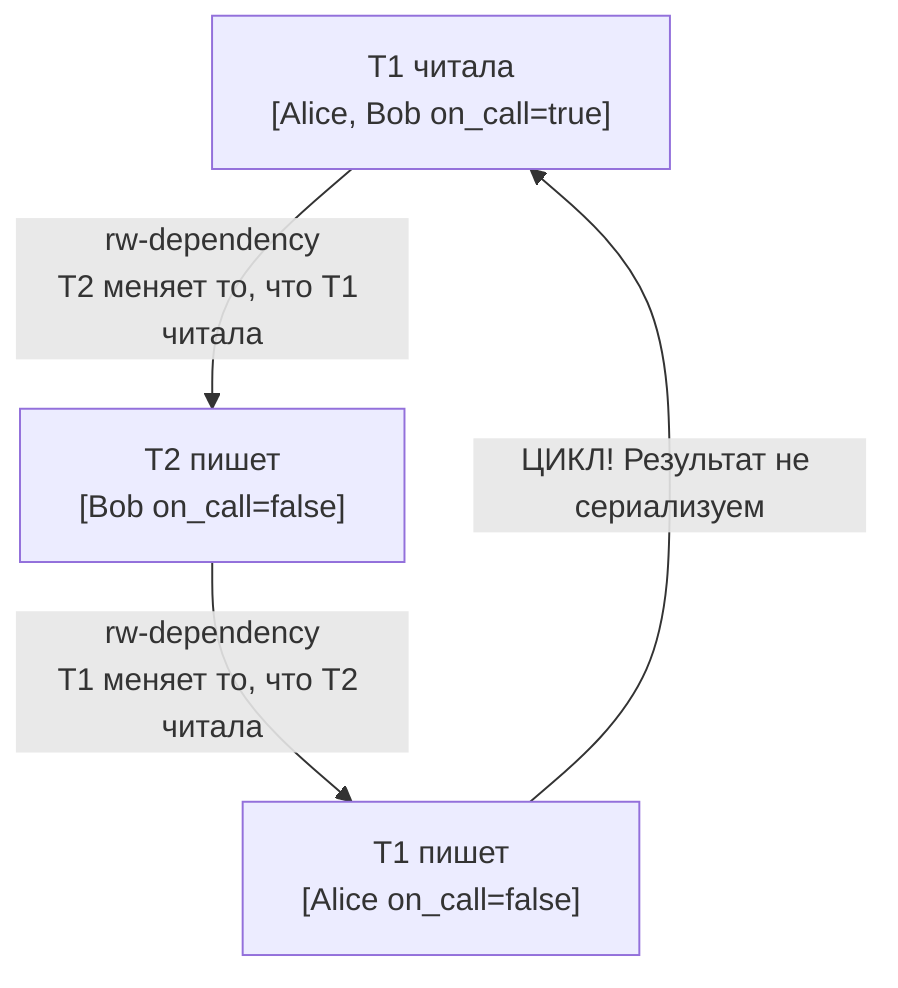

# Уровни изоляции в PostgreSQL

**Предпосылки:** [ACID](../storage/00-acid.md) (isolation), [MVCC](00-mvcc.md), [аномалии транзакций](01-anomalies.md). Примеры используют Ruby/ActiveRecord — синтаксис интуитивно понятен, но для полного понимания полезно знание [основ SQL](../../sql/index.md).

← [Аномалии транзакций](01-anomalies.md) | [Блокировки](03-locks.md) →

Стандарт описывает, какие аномалии допускает каждый уровень, но не объясняет, как база данных должна их предотвращать. Два вопроса остаются открытыми: почему один и тот же механизм snapshot даёт разную защиту на разных уровнях? И почему при конфликте записи READ COMMITTED продолжает работать, а REPEATABLE READ откатывается? Ответ — в деталях реализации: когда создаётся snapshot и что происходит, когда две транзакции пытаются изменить одну строку.

## PostgreSQL не реализует READ UNCOMMITTED

Из-за архитектуры MVCC dirty read в PostgreSQL невозможен. Незакоммиченные изменения записаны в tuple с xmin активной транзакции. По правилам видимости: если xmin указывает на незавершённую транзакцию, tuple невидим.

```ruby
# Даже если указать isolation: :read_uncommitted
ActiveRecord::Base.transaction(isolation: :read_uncommitted) do
  # PostgreSQL всё равно работает как READ COMMITTED
end
```

PostgreSQL просто игнорирует READ UNCOMMITTED и использует READ COMMITTED.

## READ COMMITTED: snapshot на каждый оператор

READ COMMITTED создаёт новый snapshot перед каждым SQL-оператором. Два SELECT внутри одной транзакции могут увидеть разные данные, если между ними кто-то закоммитил изменения.

### Пример: Non-repeatable read происходит

```ruby
# Начальное состояние: Account.find(1).balance = 1000

# === Терминал 1 ===
ActiveRecord::Base.transaction(isolation: :read_committed) do
  account = Account.find(1)
  puts account.balance  # 1000

  sleep(5)  # Пауза — в это время T2 меняет данные

  account.reload
  puts account.balance  # 500 — значение изменилось!
end

# === Терминал 2 (во время sleep) ===
ActiveRecord::Base.transaction do
  Account.find(1).update!(balance: 500)
end
```

**PostgreSQL SQL:**

```sql
-- T1 (XID = 100)
BEGIN ISOLATION LEVEL READ COMMITTED;

-- Первый SELECT: создаётся snapshot_1
-- snapshot_1: xmin=99, xmax=101, xip=[]
SELECT * FROM accounts WHERE id = 1;
-- Находит tuple [xmin=50, xmax=0, balance=1000]
-- Проверка: 50 < 99? Да. 50 в xip? Нет. CLOG(50)=COMMITTED. ВИДИМ.
-- Результат: balance = 1000

-- T2 (XID = 101) выполняется параллельно
BEGIN;
UPDATE accounts SET balance = 500 WHERE id = 1;
-- Создаёт новый tuple [xmin=101, xmax=0, balance=500]
-- Старый tuple: [xmin=50, xmax=101, balance=1000]
COMMIT;
-- CLOG(101) = COMMITTED

-- T1: второй SELECT — создаётся НОВЫЙ snapshot_2
-- snapshot_2: xmin=99, xmax=102, xip=[]
-- (T2 уже закоммитилась, её нет в xip)
SELECT * FROM accounts WHERE id = 1;
-- Старый tuple [xmin=50, xmax=101]: xmax=101, CLOG(101)=COMMITTED → tuple удалён → НЕВИДИМ
-- Новый tuple [xmin=101, xmax=0]: 101 < 102? Да. 101 в xip? Нет. CLOG(101)=COMMITTED. ВИДИМ.
-- Результат: balance = 500

COMMIT;
```

**Что произошло на уровне MVCC:**

```text
                    snapshot_1              snapshot_2
                    xmax=101                xmax=102
                        │                       │
Timeline:    ───────────┼───────────────────────┼─────────
                        │                       │
T2 (XID=101):     [активна]──────[COMMIT]       │
                        │           │           │
                        │           └───────────┤
                        │         T2 закоммитилась до snapshot_2
                        │
T1 видит:          balance=1000           balance=500
```

**Почему READ COMMITTED допускает non-repeatable read:** Каждый оператор получает свежий snapshot. Между операторами другие транзакции могут закоммитить изменения, и новый snapshot их увидит.

### Пример: Обработка конфликта записи (re-evaluation)

```ruby
# Начальное состояние: Account.find(1).balance = 1000

# === T1 ===
ActiveRecord::Base.transaction(isolation: :read_committed) do
  Account.where(id: 1).where("balance >= 500").update_all("balance = balance - 500")
end

# === T2 (стартует чуть раньше, коммитит во время T1) ===
ActiveRecord::Base.transaction do
  Account.find(1).update!(balance: 200)  # 1000 → 200
end
```

**PostgreSQL SQL и внутренняя логика:**

```sql
-- T2 (XID = 100) стартует первой
BEGIN;
UPDATE accounts SET balance = 200 WHERE id = 1;
-- Берёт row lock на строку id=1
-- Пока не коммитит, держит lock

-- T1 (XID = 101)
BEGIN ISOLATION LEVEL READ COMMITTED;
UPDATE accounts SET balance = balance - 500 WHERE id = 1 AND balance >= 500;
-- Шаг 1: Находит строку id=1
-- Шаг 2: Пытается взять row lock — ЗАБЛОКИРОВАНА T2!
-- Шаг 3: T1 ждёт...

-- T2 коммитит
COMMIT;  -- balance = 200, row lock освобождён

-- T1 просыпается
-- Шаг 4: READ COMMITTED видит, что строка изменилась
-- Шаг 5: ПЕРЕЧИТЫВАЕТ строку (получает balance = 200)
-- Шаг 6: ПЕРЕПРОВЕРЯЕТ WHERE: balance >= 500? 200 >= 500? НЕТ!
-- Шаг 7: Строка НЕ обновляется (0 rows affected)
COMMIT;
```

**Результат:** balance = 200. UPDATE в T1 не применился, потому что после перечитывания условие WHERE не выполнялось.

Это поведение называется **re-evaluation**: при конфликте записи READ COMMITTED ждёт завершения блокирующей транзакции, затем перечитывает строку и перепроверяет условие WHERE с новыми данными. Изменение применяется только если условие по-прежнему выполняется.

## REPEATABLE READ: один snapshot + обнаружение конфликтов

Свежий snapshot на каждый оператор означает, что между двумя SELECT картина мира может измениться — non-repeatable read возможен. Если транзакции нужна стабильная картина на всё время выполнения, READ COMMITTED недостаточен. REPEATABLE READ решает это: один snapshot на всю транзакцию. При конфликте записи — не re-evaluation, а ошибка.

### Пример: Non-repeatable read предотвращён

```ruby
# Начальное состояние: Account.find(1).balance = 1000

# === T1 ===
ActiveRecord::Base.transaction(isolation: :repeatable_read) do
  account = Account.find(1)
  puts account.balance  # 1000

  sleep(5)  # T2 меняет и коммитит

  account.reload
  puts account.balance  # Всё ещё 1000!
end

# === T2 ===
ActiveRecord::Base.transaction do
  Account.find(1).update!(balance: 500)
end
```

**PostgreSQL SQL:**

```sql
-- T1 (XID = 100)
BEGIN ISOLATION LEVEL REPEATABLE READ;

-- Первый оператор: создаётся snapshot (ОДИН РАЗ на всю транзакцию)
-- snapshot: xmin=99, xmax=101, xip=[]
SELECT * FROM accounts WHERE id = 1;
-- Результат: balance = 1000

-- T2 (XID = 101)
BEGIN;
UPDATE accounts SET balance = 500 WHERE id = 1;
COMMIT;
-- Новый tuple [xmin=101, xmax=0, balance=500]

-- T1: второй SELECT — использует ТОТ ЖЕ snapshot!
-- snapshot: xmin=99, xmax=101, xip=[]  (не изменился)
SELECT * FROM accounts WHERE id = 1;
-- Новый tuple [xmin=101]: 101 >= xmax(101)? ДА → tuple не существовал на момент snapshot → НЕВИДИМ
-- Старый tuple [xmin=50, xmax=101]: xmax=101 >= xmax(101)? ДА → удаление не видно → ВИДИМ
-- Результат: balance = 1000 (старое значение!)

COMMIT;
```

**Что произошло:**

```text
                    snapshot создан здесь
                    xmax=101
                        │
Timeline:    ───────────┼─────────────────────────────────
                        │
T2 (XID=101):           │ [активна]──────[COMMIT]
                        │                    │
                        │                    └─ 101 >= xmax(101)
                        │                       Коммит ПОСЛЕ snapshot
                        │                       T1 его НЕ видит
                        │
T1 видит:          balance=1000          balance=1000
                                         (тот же snapshot)
```

**Почему REPEATABLE READ предотвращает non-repeatable read:** Snapshot создаётся один раз. Все последующие операторы видят одну «замороженную» картину мира. Изменения, закоммиченные после создания snapshot, невидимы.

### Пример: Конфликт записи — ошибка (не re-evaluation!)

```ruby
# Начальное состояние: Account.find(1).balance = 1000

# === T1 ===
ActiveRecord::Base.transaction(isolation: :repeatable_read) do
  account = Account.find(1)
  new_balance = account.balance - 100  # 1000 - 100 = 900

  sleep(3)  # T2 успевает изменить и закоммитить

  account.update!(balance: new_balance)  # Попытка записать 900
  # ActiveRecord::SerializationFailure!
end

# === T2 ===
ActiveRecord::Base.transaction do
  Account.find(1).update!(balance: 800)  # 1000 → 800
end
```

**PostgreSQL SQL:**

```sql
-- T1 (XID = 100)
BEGIN ISOLATION LEVEL REPEATABLE READ;
-- snapshot: xmin=99, xmax=101, xip=[]

SELECT * FROM accounts WHERE id = 1;
-- Видит tuple [xmin=50, xmax=0, balance=1000]

-- T2 (XID = 101)
BEGIN;
UPDATE accounts SET balance = 800 WHERE id = 1;
-- Старый tuple: [xmin=50, xmax=101]
-- Новый tuple: [xmin=101, xmax=0, balance=800]
COMMIT;

-- T1 пытается UPDATE
UPDATE accounts SET balance = 900 WHERE id = 1;
-- Шаг 1: Ищет текущую версию строки id=1
-- Шаг 2: Находит tuple [xmin=101, xmax=0]
-- Шаг 3: Проверяет xmin=101 против snapshot
-- Шаг 4: 101 >= xmax(101) → tuple создан ПОСЛЕ нашего snapshot!
-- Шаг 5: Значит кто-то изменил строку после начала нашей транзакции
-- Шаг 6: ERROR: could not serialize access due to concurrent update

ROLLBACK;  -- Транзакция откатывается
```

**Почему ошибка, а не re-evaluation?**

REPEATABLE READ гарантирует: транзакция видит «замороженный» мир. Если T1 адаптируется к изменениям T2 (как в READ COMMITTED), она нарушит свой snapshot — увидит данные, которых не было в начале.

Единственный честный выход — сообщить об ошибке. Приложение должно повторить транзакцию.

```ruby
# Правильный паттерн для REPEATABLE READ
def transfer_with_retry(account_id, amount)
  attempts = 0
  begin
    ActiveRecord::Base.transaction(isolation: :repeatable_read) do
      account = Account.find(account_id)
      account.update!(balance: account.balance - amount)
    end
  rescue ActiveRecord::SerializationFailure
    attempts += 1
    retry if attempts < 3
    raise
  end
end
```

## SERIALIZABLE: SSI и поиск опасных циклов

**Проблема:** REPEATABLE READ ловит конфликты записи в одну строку. Но write skew — это запись в РАЗНЫЕ строки. Как его поймать?

### Write skew на REPEATABLE READ: проходит

Бизнес-правило: минимум 1 врач на дежурстве. Alice и Bob оба дежурят и оба хотят уйти:

```ruby
# Начальное состояние: Alice on_call=true, Bob on_call=true

# === T1 ===
ActiveRecord::Base.transaction(isolation: :repeatable_read) do
  if Doctor.where(on_call: true).count >= 2
    Doctor.find_by(name: 'Alice').update!(on_call: false)
  end
end

# === T2 (параллельно) ===
ActiveRecord::Base.transaction(isolation: :repeatable_read) do
  if Doctor.where(on_call: true).count >= 2
    Doctor.find_by(name: 'Bob').update!(on_call: false)
  end
end
```

На уровне SQL обе транзакции проходят без ошибок:

```sql
-- T1 (XID = 100), snapshot: xmax=102
BEGIN ISOLATION LEVEL REPEATABLE READ;
SELECT COUNT(*) FROM doctors WHERE on_call = true;  -- 2
UPDATE doctors SET on_call = false WHERE name = 'Alice';  -- OK, строка Alice
COMMIT;

-- T2 (XID = 101), snapshot: xmax=102
BEGIN ISOLATION LEVEL REPEATABLE READ;
SELECT COUNT(*) FROM doctors WHERE on_call = true;  -- 2 (T1 не видна)
UPDATE doctors SET on_call = false WHERE name = 'Bob';    -- OK, строка Bob (другая!)
COMMIT;
```

Обе транзакции успешны, 0 врачей на дежурстве — инвариант нарушен. REPEATABLE READ пропустил аномалию, потому что T1 и T2 изменяют разные строки: конфликта записи нет, а значит нет и повода для ошибки.

### SERIALIZABLE: Serializable Snapshot Isolation (SSI)

PostgreSQL использует **SSI (Serializable Snapshot Isolation)** — алгоритм, который отслеживает зависимости между транзакциями и находит опасные циклы.

**Три типа зависимостей:**

1. **WR (write-read):** T2 читает данные, записанные T1
2. **WW (write-write):** T2 перезаписывает данные, записанные T1
3. **RW (read-write, anti-dependency):** T2 записывает данные, которые T1 читала

**Опасный цикл:** Если образуется цикл из rw-зависимостей, результат не сериализуем.

### Write skew на SERIALIZABLE: обнаружен

Тот же сценарий, но с `isolation: :serializable`. Вторая транзакция получает ошибку:

```ruby
# === T1 ===
ActiveRecord::Base.transaction(isolation: :serializable) do
  if Doctor.where(on_call: true).count >= 2
    Doctor.find_by(name: 'Alice').update!(on_call: false)
  end
end

# === T2 (параллельно) ===
ActiveRecord::Base.transaction(isolation: :serializable) do
  if Doctor.where(on_call: true).count >= 2
    Doctor.find_by(name: 'Bob').update!(on_call: false)
  end
  # ActiveRecord::SerializationFailure!
end
```

Внутри PostgreSQL:

```sql
-- T1 (XID = 100)
BEGIN ISOLATION LEVEL SERIALIZABLE;
SELECT COUNT(*) FROM doctors WHERE on_call = true;
-- PostgreSQL запоминает: T1 ЧИТАЛА строки с on_call=true (SIREAD lock)

UPDATE doctors SET on_call = false WHERE name = 'Alice';
-- PostgreSQL запоминает: T1 ПИСАЛА в строку Alice
COMMIT;

-- T2 (XID = 101)
BEGIN ISOLATION LEVEL SERIALIZABLE;
SELECT COUNT(*) FROM doctors WHERE on_call = true;
-- PostgreSQL запоминает: T2 ЧИТАЛА строки с on_call=true (SIREAD lock)

UPDATE doctors SET on_call = false WHERE name = 'Bob';
-- PostgreSQL проверяет: кто читал строки, которые я меняю?
-- T1 читала on_call=true (включая Bob)
-- T1 писала в Alice
-- Зависимости:
--   T1 читала → T2 пишет (rw-dependency: T1 → T2)
--   T2 читала → T1 писала (rw-dependency: T2 → T1)
-- ЦИКЛ: T1 → T2 → T1

-- ERROR: could not serialize access due to read/write dependencies among transactions
ROLLBACK;
```

**Визуализация цикла:**



**Почему это цикл:** Чтобы результат был сериализуемым, должен существовать порядок: либо T1 перед T2, либо T2 перед T1.

- Если T1 перед T2: T2 должна была видеть изменения T1 (Alice off). Но T2 видела Alice on.
- Если T2 перед T1: T1 должна была видеть изменения T2 (Bob off). Но T1 видела Bob on.

Ни один порядок не даёт наблюдаемый результат. Следовательно — не сериализуемо.

### SIREAD Locks: как PostgreSQL запоминает чтения

**SIREAD lock** — предикатная блокировка, которая запоминает «транзакция T читала строки, удовлетворяющие условию X».

```sql
SELECT * FROM doctors WHERE on_call = true;
-- PostgreSQL создаёт SIREAD lock: "T1 читала (on_call = true)"
```

При записи PostgreSQL проверяет: «кто имеет SIREAD lock на данные, которые я меняю?»

**Эскалация SIREAD locks:**

SIREAD lock на каждую строку требует памяти. Если транзакция читает миллион строк — миллион записей.

Решение: **эскалация**. Много строк с одной страницы → lock на страницу. Много страниц таблицы → lock на таблицу.

```text
Строка → Страница → Таблица
(точнее)   (менее точно)   (грубо)
```

**Цена эскалации:** Ложные срабатывания. T1 читала страницу 3 (строки 1-100). T2 изменила строку 50. Lock на уровне страницы — конфликт. Но может T1 читала только строки 1-10, и реального конфликта нет. Откат, хотя он не был нужен.

## Сводка: как MVCC реализует каждый уровень

| Уровень | Snapshot | При конфликте записи | Дополнительно |
|---------|----------|---------------------|---------------|
| READ COMMITTED | Новый на каждый оператор | Re-evaluation: перечитать, перепроверить WHERE | — |
| REPEATABLE READ | Один на транзакцию | Ошибка: could not serialize access | — |
| SERIALIZABLE | Один на транзакцию | Ошибка | SSI: SIREAD locks, поиск rw-циклов |

Три уровня образуют спектр компромиссов. READ COMMITTED адаптируется к чужим изменениям — транзакция не откатывается, но может увидеть разные данные между операторами. REPEATABLE READ гарантирует стабильную картину мира ценой возможных откатов при конфликте записи в одну строку. SERIALIZABLE ловит даже write skew — запись в разные строки — через анализ rw-зависимостей, но платит за это ложными срабатываниями при эскалации SIREAD locks. Чем выше уровень, тем больше откатов и тем важнее retry-логика в приложении.

Уровни изоляции контролируют видимость данных через snapshot. Но параллельная запись требует координации — [блокировки](03-locks.md) решают эту задачу.

## Sources

- PostgreSQL Documentation (пример: v16): Transaction Isolation (включая SERIALIZABLE/SSI). <https://www.postgresql.org/docs/16/transaction-iso.html>
- Cahill et al. *Serializable Isolation for Snapshot Databases* (SIGMOD 2008). <https://doi.org/10.1145/1376616.1376690>

---

← [Аномалии транзакций](01-anomalies.md) | [Блокировки](03-locks.md) →
