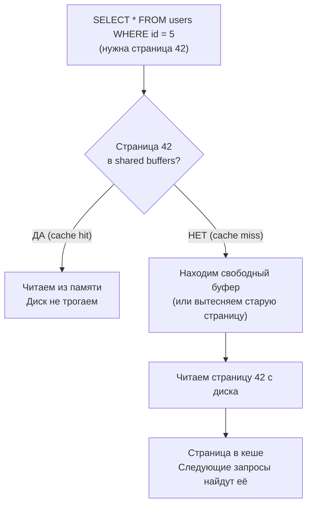

---
tags:
  - domain/postgresql
  - theme/durability
  - theme/performance
  - type/concept
aliases:
  - Buffer Cache
  - Shared Buffers
order: 5
---

# Буферный кеш

**Предпосылки:** [страницы и кортежи](../storage/pages-and-tuples.md), [WAL](wal.md), [LRU-кэш](../../../algorithms-and-data-structures/linear/lru-cache.md) (как «идеальная» модель вытеснения).

← [WAL](wal.md) | [MVCC](../concurrency/mvcc.md) →

Диск медленнее памяти, а PostgreSQL читает и пишет **страницы** (обычно по 8 КБ). Если запросы постоянно вытягивают страницы с диска, время ответа начинает определяться I/O. Буферный кеш снижает цену I/O: горячие страницы остаются в памяти, а запись на диск происходит управляемо, в фоне.

## Проблема: повторное чтение с диска

Каждый cache miss означает чтение страницы с диска. Если к одним и тем же страницам обращаются снова и снова, повторные чтения становятся лишней работой и прямым источником задержек.

**Решение:** Держать часто используемые страницы в оперативной памяти.

## Shared Buffers — общий кеш для всех процессов

**Shared Buffers** — область разделяемой памяти, где PostgreSQL хранит копии страниц с диска. Размер задаётся параметром `shared_buffers`. Это внутренний кэш PostgreSQL — он кэширует страницы данных внутри СУБД. Для снятия нагрузки с PostgreSQL целиком (CPU, соединения, парсинг запросов) используют [внешний кэш](../../../system-design/caching.md) — Redis перед PostgreSQL.

**Почему «shared» (разделяемые)?** PostgreSQL — мультипроцессная архитектура. Каждое соединение — отдельный процесс (backend). Если бы каждый backend имел свой кеш — одна и та же страница дублировалась бы в памяти десятки раз. Shared buffers — общая память, которую видят все backend'ы. Страница в памяти одна, все процессы её видят и могут изменять.

```text
┌─────────────────────────────────────────────────────┐
│                     PostgreSQL                      │
│                                                     │
│  ┌───────────────────────────────────────────────┐  │
│  │               Shared Buffers                  │  │
│  │                                               │  │
│  │  ┌────────┐ ┌────────┐ ┌─────────┐ ┌───────┐  │  │
│  │  │Page 42 │ │Page 7  │ │Page 103 │ │ empty │  │  │
│  │  │(users) │ │(users) │ │(orders) │ │       │  │  │
│  │  └────────┘ └────────┘ └─────────┘ └───────┘  │  │
│  └───────────────────────────────────────────────┘  │
│                                                     │
│  Все backend-процессы видят одни и те же буферы     │
└─────────────────────────────────────────────────────┘
                     ↕ read/write
┌─────────────────────────────────────────────────────┐
│                       Диск                          │
└─────────────────────────────────────────────────────┘
```

## Как работает чтение



На HDD одна случайная операция чтения страницы обычно занимает порядка ~10 мс (см. оценку в [страницах и кортежах](../storage/pages-and-tuples.md)). Поэтому даже небольшая доля cache miss начинает доминировать во времени запроса.

**Cache hit ratio** — доля обращений, которые нашли страницу в кеше (`shared_buffers`), а не читали её с диска. Чем ниже hit ratio, тем больше запросов ждут диск вместо памяти, и тем больше «гуляет» latency.

Например, при 1000 обращений к страницам в секунду и hit ratio 90% это около 100 чтений с диска в секунду.

```sql
-- Посмотреть статистику попаданий в кеш
-- pg_statio_user_tables — системный view со статистикой I/O по таблицам
SELECT
  sum(heap_blks_hit) as hits,
  sum(heap_blks_read) as misses,
  sum(heap_blks_hit)::float / nullif(sum(heap_blks_hit) + sum(heap_blks_read), 0) as hit_ratio
FROM pg_statio_user_tables;
```

## Dirty pages и clean pages

Страницы в буфере бывают двух видов.

**Clean page** — страница в буфере, идентичная копии на диске. Можно в любой момент выбросить из памяти без последствий.

**Dirty page** — страница изменена в памяти, но изменения ещё не записаны на диск. Название буквальное: страница «испачкана» изменениями. Если выбросить dirty page — потеряем данные.

```text
UPDATE users SET name = 'Bob' WHERE id = 5;

1. Находим страницу в shared buffers (или читаем с диска)
2. Меняем tuple на странице в памяти
3. Страница становится dirty
4. Изменения пока только в памяти
```

**Жизненный цикл dirty page:**
1. Страница читается с диска → clean
2. UPDATE/INSERT/DELETE меняет данные → dirty
3. Background writer или checkpointer записывает на диск → clean
4. Новое изменение → снова dirty
5. И так далее, пока страница в буфере

## Проблема вытеснения dirty pages

Shared buffers — фиксированный размер. Когда все слоты заняты и нужно прочитать новую страницу — кого-то вытесняем.

**Clean page:** Просто освобождаем слот. Данные есть на диске.

**Dirty page:** Нельзя просто выбросить — потеряем изменения. Нужно сначала записать на диск.

```text
Вытеснение clean page:  достаточно прочитать новую страницу
Вытеснение dirty page:  сначала нужно записать старую, потом прочитать новую
```

**Ещё хуже:** если backend вынужден сам записывать dirty page перед вытеснением — он блокируется на время записи. Запрос начинает ждать I/O, не имеющего прямого отношения к его логике. Один SELECT может быть быстрым, следующий — внезапно в разы медленнее.

## Background Writer и Checkpointer — проактивная запись

PostgreSQL не ждёт, пока backend столкнётся с необходимостью вытеснять dirty pages. Два фоновых процесса заранее записывают их на диск.

**Background Writer** — фоновый процесс, который периодически записывает часть dirty pages. Цель: поддерживать запас clean pages для вытеснения.

Background writer старается держать запас clean pages: периодически записывает часть dirty pages, выбирая «наименее нужные» страницы (например, с низким `usage_count`), которые с большей вероятностью будут вытеснены.

**Checkpointer** — записывает ВСЕ dirty pages на диск при checkpoint. После checkpoint все страницы в буфере становятся clean.

**Диагностика:**

```sql
-- pg_stat_bgwriter — системный view со статистикой записи страниц
SELECT * FROM pg_stat_bgwriter;
```

| Счётчик | Что означает | Что видит пользователь при проблемах |
|---------|--------------|--------------------------------------|
| `buffers_backend` | Страницы, записанные backend'ами | Непредсказуемые задержки запросов |
| `buffers_clean` | Страницы, записанные background writer | — |
| `buffers_checkpoint` | Страницы, записанные checkpointer | — |

Если `buffers_backend` растёт, значит backend'ы всё чаще вынуждены писать dirty pages сами — и это обычно проявляется как дополнительные задержки запросов.

## Алгоритм вытеснения

Когда нужен свободный буфер, PostgreSQL выбирает жертву для вытеснения. Используется **[clock-sweep](../../../algorithms-and-data-structures/linear/clock-sweep.md)** — более дешёвая в синхронизации аппроксимация **[LRU](../../../algorithms-and-data-structures/linear/lru-cache.md)**.

Суть: каждый буфер имеет `usage_count` (0-5). При обращении к странице — инкремент. При поиске жертвы — декремент. Страница с `usage_count = 0` — кандидат на вытеснение. «Горячие» страницы постоянно получают инкременты и не вытесняются. «Холодные» постепенно теряют счётчик и освобождаются.

## WAL before data — защита от torn pages

Dirty page рано или поздно записывается на диск. Но запись страницы (8 КБ) — не атомарная операция. Если crash случился посередине, часть данных окажется новой, часть — старой. Это **torn page** (разорванная страница): структура сломана, line pointers указывают в мусор.

**Решение:** Перед записью dirty page на диск убедиться, что соответствующие WAL-записи уже на диске. При recovery WAL позволит восстановить согласованное состояние.

**LSN (Log Sequence Number)** — позиция в потоке WAL, фактически смещение в байтах от начала. Каждая страница хранит `pd_lsn` в заголовке — LSN последней WAL-записи, которая изменила эту страницу.

**Правило «WAL before data»:** Нельзя записать страницу на диск, пока WAL до `pd_lsn` этой страницы не записан на диск.

```text
Background writer хочет записать dirty page:

if (page.pd_lsn > flushed_wal_lsn) {
    flush_wal_up_to(page.pd_lsn);  // сначала WAL
}
write_page_to_disk(page);  // теперь можно страницу
```

## Full Page Writes — полный образ страницы в WAL

WAL обычно хранит записи об изменениях (дельты). Но дельта бесполезна, если базовая страница на диске повреждена (torn page). Поэтому PostgreSQL использует **Full Page Write (FPW)**.

**FPW** — после checkpoint, при первом изменении страницы, PostgreSQL записывает в WAL полный образ страницы, а не только дельту.

**Когда FPW, когда дельта:**
- Первое изменение страницы после checkpoint → FPW (полный образ страницы в WAL)
- Последующие изменения той же страницы до следующего checkpoint → дельты
- Следующий checkpoint → счётчик «первое изменение» сбрасывается

**Почему это работает:** Если при recovery обнаружится torn page — в [WAL](wal.md) есть полный образ страницы от последнего checkpoint. Восстанавливаем образ, применяем дельты поверх — получаем согласованное состояние.

**Write amplification (усиление записи)** — одно логическое изменение порождает несколько физических записей. Частые checkpoint'ы увеличивают количество FPW, потому что счётчик «первое изменение» сбрасывается чаще. Редкие checkpoint'ы уменьшают количество FPW, но увеличивают время recovery: нужно проигрывать больший хвост [WAL](wal.md).

## Shared Buffers vs OS Page Cache

Операционная система тоже кеширует файлы в своём page cache ([подробнее](../../../linux/foundations/filesystems.md)). Когда PostgreSQL вызывает `read()`, ОС сначала проверяет свой кеш. Это два разных уровня кеширования.

**Почему PostgreSQL не полагается только на OS page cache:**

1. **Единая “истина” для буферов.** OS page cache общий для системы, но он кеширует *файлы* и живёт по правилам ОС. PostgreSQL же держит страницы в `shared_buffers` вместе с метаданными (pin/dirty/usage_count/LSN) и блокировками, чтобы backend'ы согласованно работали с одной и той же страницей и не создавали лишних конфликтов и I/O. Изменения, сделанные одним backend'ом в `shared_buffers`, не обязаны немедленно появиться в page cache — они становятся “файловыми” только после записи на диск.

2. **WAL before data.** PostgreSQL знает про связь страниц и [WAL](wal.md), проверяет LSN. ОС не знает — может записать страницу в любой момент.

3. **Pinning.** PostgreSQL может защитить страницу от вытеснения во время операции (pin). ОС может вытеснить страницу в любой момент под давлением памяти.

Баланс между `shared_buffers` и OS page cache всегда упирается в то, что память конечна: большие буферы уменьшают число чтений с диска, но увеличивают объём данных, которые нужно сбрасывать на диск при накоплении dirty pages.

OS page cache работает как «второй эшелон»: если страницы нет в `shared_buffers`, но она есть в кеше ОС, физического I/O не будет.

Буферный кеш оптимизирует доступ к страницам. Позже увидим, что UPDATE создаёт новые версии строк — буферный кеш хранит и старые, и новые, пока [VACUUM](../maintenance/vacuum.md) не освободит место.

## Sources

- PostgreSQL Documentation (пример: v16): Resource Consumption (`shared_buffers`), WAL Configuration (`full_page_writes`), `pg_stat_bgwriter`. <https://www.postgresql.org/docs/16/runtime-config-resource.html>, <https://www.postgresql.org/docs/16/runtime-config-wal.html>, <https://www.postgresql.org/docs/16/monitoring-stats.html>
- PostgreSQL source (пример: REL_16_0): clock-sweep / `BM_MAX_USAGE_COUNT`. <https://github.com/postgres/postgres/blob/REL_16_0/src/backend/storage/buffer/freelist.c>, <https://github.com/postgres/postgres/blob/REL_16_0/src/include/storage/buf_internals.h>

---

← [WAL](wal.md) | [MVCC](../concurrency/mvcc.md) →
