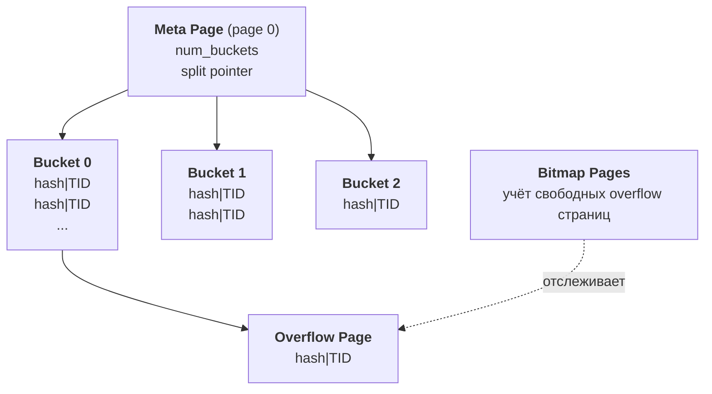

---
tags:
  - domain/postgresql
  - theme/indexing
  - type/concept
aliases:
  - Hash Index
order: 17
---

# Hash Index

**Предпосылки:** [хеш-таблица](../../../algorithms-and-data-structures/linear/hash-table.md), [B-tree](btree.md).

← [GiST](gist.md) | [BRIN](brin.md) →

Сервис сокращения URL хранит 200 млн записей: `original_url TEXT` (средняя длина ~300 байт) и `short_code TEXT` (8 байт). Основной запрос — `WHERE original_url = 'https://...'` (проверить, не создан ли уже short_code для этого URL). B-tree индекс по `original_url` хранит полные значения ключей: 200 млн × ~300 байт = ~56 ГБ индекса. Hash index по тому же столбцу хранит 4-байтовый хеш + 6-байтовый TID на запись: 200 млн × 10 байт = ~1.9 ГБ. Разница в 30 раз.

## Когда B-tree избыточен

B-tree поддерживает порядок ключей — это даёт range scan, сортировку, операторы `<`, `<=`, `>=`, `>`. Для `original_url` ни одна из этих возможностей не нужна:

```sql
-- B-tree ускоряет такие запросы за счёт упорядоченного обхода ключей:
SELECT * FROM urls ORDER BY original_url LIMIT 10;
SELECT * FROM urls WHERE original_url >= 'https://a' AND original_url < 'https://b';

-- Hash index не ускоряет ни один из них — ключи «размазаны» по bucket'ам
-- без какого-либо порядка.
```

Запросов «URL в диапазоне от A до B» или «отсортировать по URL» у сервиса нет. Вся работа B-tree по поддержанию отсортированного порядка длинных строк — накладные расходы без пользы.

Hash index не хранит ключей и не поддерживает порядок. Его единственная операция — точечный поиск по равенству (`=`). Теоретически O(1) против O(log N) у B-tree, но на практике разница в CPU-времени невелика — B-tree с данными в кеше тоже быстр. Реальный выигрыш hash — в размере индекса при длинных ключах.

## Структура: четыре типа страниц

Внутри hash index — [хеш-таблица](../../../algorithms-and-data-structures/linear/hash-table.md), разложенная по дисковым страницам. Ключ хешируется, хеш определяет номер bucket, bucket — одна или несколько страниц с записями.



**Meta page** (страница 0) хранит параметры индекса: текущее число bucket'ов, split pointer для linear hashing, маску для вычисления номера bucket.

**Bucket pages** — основные страницы. Номер bucket определяется из хеша ключа: `bucket_num = hash_code % num_buckets`. Каждая запись в bucket — хеш-код ключа (`hash code`, 4 байта) и указатель на строку в heap (`TID`, 6 байт). Сам ключ не хранится — отсюда компактность (10 байт на запись вместо ~300 для URL) и необходимость recheck при поиске.

**Overflow pages** — цепочки страниц при переполнении bucket. Это дисковый аналог chaining в обычной хеш-таблице: когда bucket page заполнена, новые записи «вытекают» в overflow.

**Bitmap pages** — служебные страницы для учёта свободных overflow страниц: какие можно переиспользовать при следующей вставке.

## Поиск с обязательным recheck

Запрос `WHERE original_url = 'https://example.com/very/long/path'`:

1. Вычисляется `hash('https://example.com/very/long/path')` — например, `0x7A3B2C1D`
2. Определяется bucket: `bucket_num = hash_code % num_buckets`
3. Читается bucket page — для каждой записи сравнивается сохранённый hash code с вычисленным
4. Если есть overflow pages — читаются и они
5. Для каждого совпавшего hash code — recheck в heap: индекс не хранит сам ключ, поэтому совпадение хеша ещё не гарантирует совпадение ключа (возможна коллизия). PostgreSQL идёт в heap и сравнивает реальное значение `original_url`

Recheck — дополнительный random I/O к heap. Для уникальных ключей (одно совпадение на запрос) это одно дополнительное чтение страницы. Вероятность ложных совпадений при 4-байтовом hash code (4 млрд возможных значений) невелика, но recheck обязателен всегда — PostgreSQL не может заранее знать, произошла ли коллизия.

## Вставка и linear hashing

Вставка новой записи в hash index следует тому же пути, что и поиск:

1. Вычисляется hash нового ключа
2. Определяется bucket: `bucket_num = hash_code % num_buckets`
3. Если в bucket page есть свободное место — запись (hash code + TID) добавляется туда
4. Если bucket page заполнена — запись уходит в overflow page (существующую или новую)

При росте данных bucket'ы переполняются и обрастают длинными цепочками overflow — поиск замедляется. В обычной хеш-таблице в памяти эту проблему решает [rehashing](../../../algorithms-and-data-structures/linear/hash-table.md): массив удваивается, все элементы перехешируются за O(n). На диске полная перестройка означала бы перезапись всех страниц индекса — для нашего 1.9 ГБ hash index это неприемлемо.

PostgreSQL использует **linear hashing**: вместо одномоментного удвоения bucket'ы сплитятся по одному. Meta page хранит split pointer — номер следующего bucket для разделения. Когда очередной bucket переполняется, PostgreSQL сплитит bucket, на который указывает split pointer (не обязательно тот, что переполнился), перераспределяя его записи между старым и новым bucket. Pointer сдвигается вперёд. Когда все bucket'ы пройдены, число bucket'ов удваивается и pointer сбрасывается. Индекс растёт постепенно, без пауз на полную перестройку.

## Ограничения

Hash index не может обеспечить UNIQUE constraint. Индекс хранит хеш ключа, а не сам ключ — совпадение хешей не означает совпадение ключей, а уникальность требует точного сравнения. Для нашего сервиса URL это значит: hash index ускоряет поиск дубликатов, но для гарантии уникальности `original_url` всё равно нужен B-tree UNIQUE constraint или проверка на стороне приложения.

Единственный поддерживаемый оператор — `=`. Ни диапазоны, ни LIKE, ни регулярные выражения, ни ORDER BY.

До PostgreSQL 10 существовало и третье ограничение: hash index не писался в [WAL](../durability/wal.md). При crash индекс повреждался и требовал `REINDEX`. Это делало hash непригодным для production. С PostgreSQL 10 [WAL](../durability/wal.md) полностью поддерживается — ограничение снято.

## Hash vs B-tree

| Характеристика | Hash | B-tree |
|----------------|------|--------|
| Поддерживаемые операторы | Только `=` | `=`, `<`, `<=`, `>`, `>=`, `BETWEEN` |
| Range scan | Нет | Да |
| ORDER BY | Нет | Да |
| Сложность поиска | O(1) амортиз. | O(log N) |
| Размер индекса | Обычно меньше (hash + TID) | Обычно больше (ключ + TID) |
| Recheck в heap | Всегда | Не нужен |
| UNIQUE constraint | Не поддерживает | Поддерживает |

Для нашего сервиса URL таблица показывает: hash выигрывает в размере индекса (1.9 ГБ вместо 56 ГБ) и проигрывает во всём остальном. Выбор оправдан, когда единственный паттерн запросов — equality на длинных ключах, уникальность не нужна на уровне индекса, и таблица достаточно велика, чтобы разница в размере влияла на попадание в [буферный кеш](../durability/buffer-cache.md). Меньше размер индекса → больше данных помещается в shared buffers → меньше дисковых I/O.

В остальных случаях B-tree — безопасный выбор по умолчанию.

```sql
CREATE INDEX idx_original_url_hash ON urls USING hash(original_url);
```

Hash — нишевый инструмент для точечных запросов по длинным ключам. Для огромных append-only таблиц с естественной корреляцией данных существует самый компактный тип индекса — [BRIN](brin.md).

## Sources

- PostgreSQL Documentation (пример: v16): Hash Indexes. <https://www.postgresql.org/docs/16/indexes-types.html>
- PostgreSQL Release Notes: v10 (WAL для hash indexes). <https://www.postgresql.org/docs/10/release-10.html>

---

← [GiST](gist.md) | [BRIN](brin.md) →
