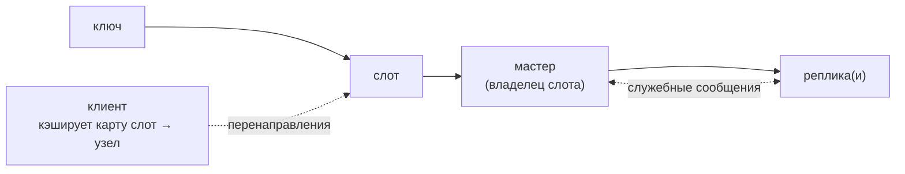

# Redis Cluster: распределение ключей по узлам и автоматическое переключение мастера

**Предпосылки:** [репликация](../../../system-design/replication.md), [шардинг](../../../system-design/sharding.md), [репликация Redis](./replication.md), [хеш-функция](../../../algorithms-and-data-structures/linear/hash-table.md), [транзакции MULTI/EXEC](../atomicity/multi-exec.md), [Lua-скрипты](../atomicity/lua-scripting.md), [Pub/Sub](../data-structures/pub-sub.md), [TCP](../../../networking/transport/tcp.md) (cluster bus).

← [Sentinel](sentinel.md) | [Кеширование](../patterns/caching.md) →

## Зачем нужен Redis Cluster

Одиночный Redis ограничен ресурсами одной машины. Репликация (мастер → реплики) помогает переживать отказы и иногда масштабировать чтение, но она не решает ёмкость: на каждой реплике лежит тот же набор данных.

Redis Cluster решает другую задачу: **разнести ключи по нескольким мастерам**, чтобы хранить больше данных и обрабатывать больше команд параллельно. Это встроенный шардинг: разные части пространства ключей живут на разных узлах. Поверх шардинга Cluster использует репликацию и автоматическое переключение мастера (failover), чтобы кластер оставался доступным при отказах.

## Карта системы

В Cluster есть несколько простых сущностей, которые дальше будут постоянно встречаться:

- **слот** — номер от 0 до 16 383; у каждого ключа есть ровно один слот;
- **мастер** — узел, который владеет набором слотов и хранит ключи этих слотов;
- **реплика** — копия данных конкретного мастера (для высокой доступности и failover);
- **клиент** — библиотека/программа, которая умеет работать с Cluster: держит карту «слот → узел» и понимает ответы `MOVED`/`ASK`.

Мини-карта:



Дальше важны два сюжета: как клиент попадает на «правильный» узел, и что происходит, когда топология меняется (failover, миграция слотов).

## Как запрос попадает на нужный узел

Redis Cluster делит пространство ключей на 16 384 слота. Принадлежность ключа к слоту определяется хешированием: Cluster вычисляет хеш ключа функцией CRC16 (быстрая контрольная сумма, дающая 16-битное значение) и берёт остаток от деления на 16 384.

`slot = CRC16(key) mod 16384`

Упрощённо путь одного запроса такой:

1. клиент вычисляет слот по ключу;
2. по карте слотов выбирает узел-владелец;
3. отправляет команду на этот узел;
4. если получил редирект, повторяет запрос на другой узел.

Редиректы бывают двух видов:

- `MOVED <slot> <host:port>` — «постоянно»: этот слот теперь у другого узла. Клиент обновляет карту и повторяет запрос на новый адрес.
- `ASK <slot> <host:port>` — «временно»: слот переезжает между узлами. Клиент делает один повтор на новый адрес (с `ASKING`), но карту слотов не меняет.

ASK-редирект требует, чтобы перед повтором клиент отправил команду `ASKING`: она разрешает целевому узлу принять запрос к слоту, который ещё в процессе миграции.

Практический вывод: клиент должен поддерживать Redis Cluster (карта слотов + `MOVED`/`ASK`). Например, `redis-cli` умеет следовать редиректам в режиме `-c`.

## Multi-key команды: почему появляется `CROSSSLOT`

Маршрутизация в Cluster естественно работает «по одному ключу». Команды вроде `MGET`, `DEL key1 key2`, `SUNION` могут затрагивать несколько ключей. Если ключи попали в разные слоты, они окажутся на разных узлах, и Redis не сможет выполнить одну атомарную операцию «через сеть». В этом случае Redis возвращает ошибку `CROSSSLOT` — это не временная ошибка, её нельзя исправить повторами.

Если нужно, чтобы группа ключей гарантированно попала в один слот, используют **hash tags**: если ключ содержит фигурные скобки, слот вычисляется только по содержимому между первыми `{` и `}`.

```bash
redis-cli SET '{user:123}:profile' '...'
redis-cli SET '{user:123}:settings' '...'
redis-cli MGET '{user:123}:profile' '{user:123}:settings'
```

Hash tags — это компромисс. Они помогают для атомарности/согласованности по группе ключей, но могут создавать «горячие» слоты: один узел получает непропорционально много нагрузки.

## Gossip-протокол и cluster bus

Название gossip — от англ. `gossip` («сплетни»): узлы кластера периодически обмениваются «новостями» со случайными соседями, и информация постепенно расползается по всему кластеру, но не становится известной всем мгновенно.

Данные распределены по узлам, но узлы должны знать о состоянии друг друга: кто владеет какими слотами, кто жив, кто упал. Для этого каждый узел периодически отправляет нескольким другим узлам сообщения со сводкой: «вот какие узлы я знаю и что я про них думаю».

В частности, узел сообщает, какими слотами он владеет. Для этого в сообщении есть битовая карта на 16 384 бита (2 КБ): по одному биту на слот. Отсюда и число слотов: чем больше слотов, тем больше служебные сообщения между узлами.

Информация о топологии распространяется не мгновенно. Поэтому в переходные моменты разные узлы могут «видеть» кластер по-разному, а клиенты могут получать `MOVED`/`ASK`, пока их карта слотов догоняет реальность.

Межузловые сообщения идут по отдельному TCP-соединению, которое в документации называют **cluster bus**. По умолчанию Redis использует порт данных + 10000 (например, при порте 6379 cluster bus будет на 16379). На практике это означает: в firewall должны быть открыты и клиентский порт, и порт cluster bus.

## Failover: что происходит при падении узла

Если мастер падает, его слоты становятся недоступны. Чтобы переживать отказ узла, у каждого мастера обычно есть хотя бы одна реплика.

```text
Master A (слоты 0–5460)      ← Replica A
Master B (слоты 5461–10922)  ← Replica B
Master C (слоты 10923–16383) ← Replica C
```

Механизм failover встроен в Cluster — отдельный Sentinel не нужен. Обнаружение сбоя начинается с подозрения: если один узел долго не получает ответ от другого, он помечает его как `PFAIL` (probable fail).

Чтобы отличать «мне показалось» от реального отказа, Cluster опирается на кворум: узел считается упавшим, когда **большинство мастеров** (majority, больше половины) пришли к одному выводу. Когда кворум согласен, узел помечается как `FAIL`.

После этого одна из реплик становится новым мастером и принимает слоты упавшего узла. Реплики участвуют в голосовании, а предпочтение обычно получает та, у которой больше **replication offset** (условно: она успела применить больше команд старого мастера, значит, потеря данных меньше).

Важно помнить: репликация в Redis по умолчанию асинхронная. Если мастер упал сразу после ответа клиенту, последняя команда могла не успеть попасть на реплику и после failover будет потеряна. Команда `WAIT` помогает сузить это окно — подробнее в [репликации](./replication.md).

На время переключения клиенты могут получать ошибки на затронутые слоты (например, `CLUSTERDOWN`) и редиректы, пока обновляется карта слотов.

Если старый мастер вернулся после failover, он автоматически становится репликой нового мастера тех же слотов — ручное вмешательство не требуется.

Cluster поддерживает миграцию реплик между мастерами (`cluster-allow-replica-migration yes` по умолчанию): если какой-то мастер остался без реплик, кластер может «перекинуть» к нему реплику от другого мастера, у которого реплик больше одной.

## Перебалансировка: добавить узел и перенести слоты

Со временем кластеру может понадобиться больше ресурсов. В Cluster масштабирование обычно означает перенос части слотов на новые (или менее загруженные) узлы.

С точки зрения клиента это выглядит так:

1. кластер решает, какие слоты переезжают;
2. для этих слотов часть запросов начинает приходить с `ASK`;
3. ключи переезжают на новый узел;
4. после завершения миграции клиенты начинают получать `MOVED` и обновляют карту слотов.

Технически миграция слота идёт в состояниях `MIGRATING` (на исходном узле) и `IMPORTING` (на целевом). Ключи переносит команда `MIGRATE`: она передаёт ключ на другой узел и удаляет локальную копию.

Типичный путь управления кластером — `redis-cli --cluster`:

```bash
redis-cli --cluster create \
  host1:6379 host2:6379 host3:6379 \
  host4:6379 host5:6379 host6:6379 \
  --cluster-replicas 1
```

Эта команда создаёт кластер и распределяет слоты. Для добавления узла к работающему кластеру новый узел подключают через `CLUSTER MEET ip port`, после чего переносится часть слотов. Удаление узла — это те же шаги в обратном порядке: сначала его слоты переносятся на другие узлы, затем узел удаляется из конфигурации.

## Ограничения Cluster

Cluster даёт шардинг ключей, встроенный failover и онлайн-перебалансировку, но за это приходится платить ограничениями, которых нет в одиночном Redis.

Lua-скрипты и транзакции MULTI/EXEC работают только с ключами одного слота — Cluster не может координировать атомарную операцию между узлами.

[Логические базы](../architecture/logical-databases.md) (`SELECT`, db 0..N) в Cluster не поддерживаются: всегда используется db 0, а команда `SELECT` запрещена. Данные разделяют префиксами в ключах или разными кластерами.

Pub/Sub в классическом виде рассылает каждое сообщение на все узлы. При большом числе узлов и высокой частоте публикаций это создаёт много сетевого трафика. [Sharded Pub/Sub](../data-structures/pub-sub.md) (Redis 7.0+) решает эту проблему, привязывая каналы к слотам.

По умолчанию параметр `cluster-require-full-coverage` установлен в `yes`. Это про поведение при «дырке» в слотах: когда какой-то слот временно остался без владельца (например, мастер упал и его не удалось заменить репликой).

При `cluster-require-full-coverage yes` узлы начинают отвечать ошибкой на **любые** команды, даже к «живым» слотам. Идея простая: лучше явный стоп, чем система, которая незаметно работает «наполовину».

При `cluster-require-full-coverage no` кластер продолжает обслуживать ключи из слотов, у которых есть живой владелец. Запросы к ключам из слотов без владельца вернут ошибку.

Этот параметр — прямой выбор между CP и AP при partition: `yes` останавливает весь кластер ради консистентности, `no` продолжает обслуживать доступные слоты ценой неполных данных — подробнее в [CAP-теореме](../../../system-design/cap-theorem.md).

## Когда нужен Cluster

Если данных достаточно для одного узла, но хочется автоматического failover, обычно проще начать с репликации + [Sentinel](sentinel.md): клиентам не нужна поддержка Cluster на уровне библиотек, а ограничения Cluster не мешают.

Cluster нужен, когда упираетесь в потолок одного узла и хотите распределить данные по нескольким машинам: тогда шардинг становится обязательным, и проще использовать встроенный механизм Redis, чем собирать «свой кластер» на уровне приложения.

Redis Cluster использует фиксированное число слотов (16 384) и простой хеш (`CRC16(key) mod 16384`). Альтернативный подход — [consistent hashing](../../../system-design/caching.md#consistent-hashing) — минимизирует перемещение ключей при добавлении узлов, но сложнее в реализации.

## Sources

- Redis Documentation: Cluster. <https://redis.io/docs/management/scaling/>
- Redis Documentation: Cluster specification. <https://redis.io/docs/reference/cluster-spec/>
- Redis source: `src/cluster.c`

---

← [Sentinel](sentinel.md) | [Кеширование](../patterns/caching.md) →
