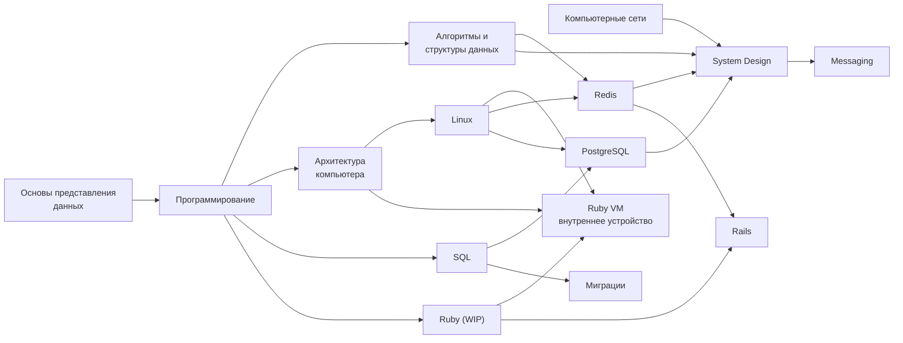

---
tags:
  - type/overview
aliases:
  - Home
  - Welcome
order: 0
---

# Компьютерные науки от бит до распределённых систем

**Предпосылки:** нет.

Компьютер работает с двумя состояниями электрического сигнала. Из этого ограничения вырастает всё остальное: числа и текст, процессор и оперативная память, операционная система, сети, базы данных, распределённые системы. На каждом новом уровне возвращаются одни и те же компромиссы — скорость против надёжности, последовательный доступ против случайного, простота против параллелизма, — но уже в другом масштабе и с другой ценой ошибки.

Эти материалы показывают связи между уровнями. Каждая заметка объясняет, какую задачу решает концепция, какой ценой и где она ломается. Порядок внутри домена выстроен так, чтобы следующая тема отвечала на вопрос, который создала предыдущая.

## Как читать

**`Предпосылки` — контракт знания.** В начале каждой заметки перечислено всё, что текст считает известным. Если термин встречается в заметке, но его нет ни в `Предпосылки`, ни в самом тексте — это ошибка, а не скрытое знание. Всё техническое, чего в `Предпосылки` нет, заметка обязана ввести сама.

**Ссылки стоят на каждом содержательном упоминании термина**, а не только на первом. Это делает каждую точку текста входом: можно открыть заметку с середины и сразу перейти к нужному контексту. Для длинных страниц ссылка ведёт на конкретный заголовок, а не на файл целиком.

> [!info]- Сворачиваемые блоки — отступления, не обязательные для основной линии
> Разбор частых ошибок, этимология терминов, исторические сравнения. Если пропустить блок, понимание следующего шага сохраняется. Раскройте этот блок, чтобы увидеть, как такие отступления выглядят в заметках.

**Навигация между заметками**. Граф в правом верхнем углу показывает связи текущей заметки с соседями. Backlinks в конце заметки показывают, откуда на неё ссылаются.

## Карта доменов

Стрелки — направление «что читать до чего». Некоторые ветки независимы и могут идти параллельно: [[networking/networking|сети]] не требуют [[computer/computer|архитектуры компьютера]] или [[linux/linux|Linux]]; Ruby-язык ([[ruby/ruby|Ruby (WIP)]]) и [[rails/rails|Rails]] стоят поверх [[programming/programming|базового программирования]], а [[ruby/internal/internals|Ruby VM внутреннее устройство]] дополнительно опирается на [[computer/computer|архитектуру компьютера]] и [[linux/linux|Linux]]; [[databases/acid|ACID]] — общий фундамент для [[databases/postgresql/postgresql|PostgreSQL]] и [[databases/redis/redis|Redis]], читается до обеих.

## Порядок изучения

### Представление данных

Почему компьютер хранит числа именно так, откуда берётся 0.1 + 0.2 ≠ 0.3, как один и тот же байт может значить разное.

- [[foundations/foundations|Основы представления данных]] — бит, байт, целые числа, IEEE 754, кодировки текста, порядок байтов

### Программирование

Базовая модель программы: данные в памяти, управление, функции, объекты. Весь материал строго однопоточный — без async и без параллельных потоков, чтобы сначала закрепилась простая модель.

- [[programming/programming|Программирование]] — от «что такое программа» через переменные, циклы, функции и коллекции до компиляции и обработки ошибок

### Алгоритмы и структуры данных

Почти всё сводится к двум вопросам: по чему ищем элемент (по позиции или по ключу) и чем платим за скорость (копированием, указателями, промахами кэша процессора).

- [[algorithms-and-data-structures/algorithms-and-data-structures|Алгоритмы и структуры данных]] — линейные структуры (массив, список, хеш-таблица, LRU), нелинейные (дерево, BST, куча, B-tree, skip list), динамическое программирование

### Как компьютер выполняет программу

Две оси: путь данных (регистры, кэш, оперативная память, диск, шины) и программная модель процессора (набор команд, соглашения о вызовах, атомарные инструкции).

- [[computer/computer|Архитектура компьютера]] — CPU и pipeline, иерархия памяти, когерентность кэшей, DMA, CISC/RISC, ABI, SIMD

### Операционная система

Как ядро изолирует процессы, распределяет процессорное время и память, абстрагирует сотни устройств через общий интерфейс файлов и системных вызовов.

- [[linux/linux|Linux]] — процессы и потоки, виртуальная память, файловые дескрипторы, планировщик, сокеты, мультиплексирование ввода-вывода, контейнеры

### Сети

Путь пакета снизу вверх: от битов в проводе до HTTP-запросов и инфраструктуры интернета.

- [[networking/networking|Компьютерные сети]] — Ethernet и коммутация, IP и маршрутизация, TCP/UDP, DNS, HTTP, TLS, WebSocket, BGP, CDN

### Базы данных

SQL как язык доступа к реляционной модели, общая теория транзакций и две конкретные СУБД с принципиально разной архитектурой.

- [[databases/acid|ACID]] — контракт транзакции: атомарность, согласованность, изоляция, надёжность
- [[databases/sql/sql|SQL]] — реляционная модель, запросы, DDL, модификация, PG-специфика
- [[databases/postgresql/postgresql|PostgreSQL]] — физическое хранение, WAL, MVCC, буферный кэш, индексы, планировщик
- [[databases/redis/redis|Redis]] — однопоточный event loop, структуры данных в памяти, атомарность, персистентность, распределение, паттерны
- [[databases/migrations/migrations|Миграции]] — безопасные изменения схемы под трафиком, expand-contract, backfilling

### Распределённые системы

Что ломается, когда данные перестают помещаться в один процесс, и какие компромиссы появляются взамен.

- [[system-design/system-design|System Design]] — CAP, модели консистентности, репликация, шардинг, load balancing, кэширование, гарантии доставки, API, микросервисы, event-driven architecture
- [[messaging/messaging|Messaging]] — Kafka как распределённый лог событий

### Ruby и Rails

Конкретный язык, на котором написаны примеры в разделе «Программирование», и фреймворк, сводящий вместе Redis, фоновые задачи и практические сценарии.

- [[ruby/ruby|Ruby (WIP)]] — системного описания языка ещё нет; два готовых раздела ниже — про реализацию VM
- [[ruby/internal/internals|Ruby VM внутреннее устройство]] — парсер, YARV, объектная модель, методы, коллекции, GC, JIT, конкурентность (GVL, Fiber, Ractor); опирается на [[computer/computer|computer/]] и [[linux/linux|linux/]]
- [[rails/rails|Rails]] — Redis в Rails-приложении, Sidekiq (архитектура, жизненный цикл задачи, гарантии, retry)

## Как всё связано

**Латентность против надёжности.** Один и тот же компромисс возвращается на каждом уровне. В файловой системе [[linux/programming/file-io|fsync]] гарантирует запись на диск, но стоит миллисекунды. В PostgreSQL [[databases/postgresql/durability/wal|WAL]] пишется до изменения страниц, и каждый COMMIT платит за fsync журнала. В распределённых очередях [[system-design/delivery-guarantees|подтверждение доставки]] превращает at-most-once в at-least-once, но каждое сообщение стоит дополнительного round-trip. Цена одинакова по смыслу, хотя отличается на порядки величин.

**Последовательный доступ против случайного.** В [[computer/data-path/ram|оперативной памяти]] последовательный доступ на порядок быстрее случайного из-за предсказания и открытых банков. В [[computer/data-path/storage|хранилище]] разрыв вырастает до двух-трёх порядков. Базы данных строятся вокруг этого факта: [[databases/postgresql/durability/wal|WAL]] — журнал, который пишется последовательно, чтобы не платить за seek при каждом COMMIT; [[messaging/kafka/kafka|Kafka]] — распределённый лог, где sequential I/O обеспечивает throughput, сопоставимый с in-memory решениями, при retention в терабайты.

**Изоляция против совместного использования.** Одна и та же задача — «пусть несколько единиц работы идут параллельно, не ломая данные друг друга» — решается на трёх масштабах. [[linux/foundations/processes|Процессы и потоки]] в операционной системе: процесс изолирован виртуальной памятью, поток дешевле, но разделяет адресное пространство и требует синхронизации. [[databases/acid|Транзакции]] в базе: уровни изоляции — это спектр компромиссов между строгостью и стоимостью. [[system-design/microservices|Микросервисы]] в распределённой системе: независимость команд ценой сетевых вызовов вместо методов и saga вместо транзакции.

**Стоимость чтения против стоимости записи.** [[databases/sql/schema/indexes|Индексы]] ускоряют чтение, но замедляют каждую запись. [[system-design/caching|Кэш]] делает то же самое на другом уровне. Read replicas масштабируют чтение, sharding — запись. B-tree оптимизирован под чтение, LSM-tree — под запись. Каждый выбор сдвигает баланс в одну сторону, и вопрос «что оптимизировать» определяется профилем нагрузки, а не эстетикой.
