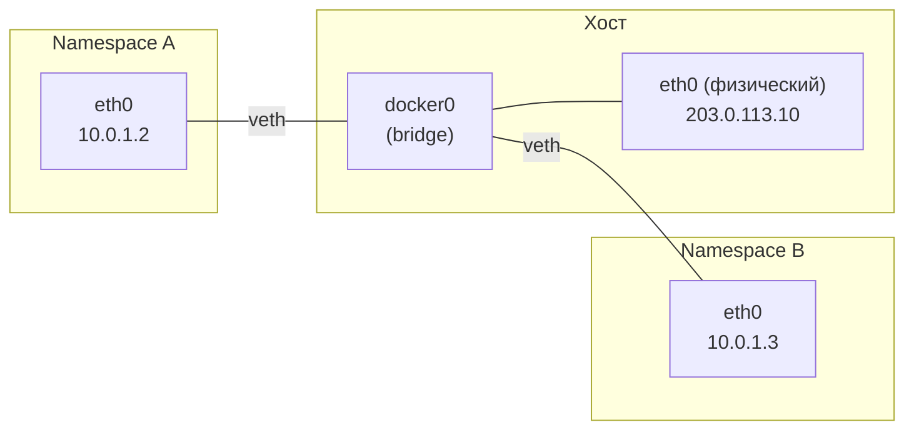

---
tags:
  - domain/linux
  - theme/security
  - theme/internals
  - type/concept
aliases:
  - Namespaces
  - Cgroups
  - Control Groups
order: 29
---

# Пространства имён и контрольные группы

> [!info]- Предпосылки
> [процессы](../foundations/processes.md) (fork, clone, PID), [планировщик](../foundations/scheduler.md) (CFS, vruntime), [файловые системы](../foundations/filesystems.md) (mount, VFS), [управление памятью](../programming/memory-management.md) (overcommit, OOM killer), [сигналы](../programming/signals.md) (kill, SIGCHLD, обработчики), [права и capabilities](../foundations/permissions-and-capabilities.md) (UID, GID, root, capabilities), [файловые дескрипторы](../foundations/file-descriptors.md) (fd, open/close).

← [Загрузка системы](../infrastructure/boot.md) | [Контейнеры](containers.md) →

Ядро работает, [systemd](../infrastructure/boot.md) запустил сервисы. Но все [процессы](../foundations/processes.md) на сервере делят одно пространство PID, одну сеть, одни ресурсы. Утечка памяти в одном сервисе может убить соседний через [OOM killer](../programming/memory-management.md) — потому что ядро не различает, кому принадлежит какой процесс. Для изоляции внутри одной ОС нужны механизмы, которые разделят общую картину мира на независимые области.

На сервере с 16 ГБ RAM работают два клиента. Клиент A запустил [процесс](../foundations/processes.md) конвертации видео, который начал потреблять всю доступную память. Когда свободная RAM закончилась, ядро активировало OOM (Out of Memory) killer — и он выбрал процесс клиента B (веб-приложение), потому что тот занимал больше всего [[linux/programming/memory-management#OOM killer: последняя линия защиты|RSS]] (Resident Set Size) в момент проверки. Клиент B потерял сервис из-за чужого процесса, хотя сам потреблял стабильные 2 ГБ.

Проблема глубже, чем кажется. Клиент A вызвал `kill -9` на PID 1823 — и убил процесс клиента B, потому что оба делят общее пространство PID (Process ID), а между ними нет изоляции по [[linux/foundations/permissions-and-capabilities#Идентичность процесса|UID/capabilities]]: зная PID и имея те же привилегии, A может послать [сигнал](../programming/signals.md) B. Клиент A запустил веб-сервер на порту 80 — и клиент B не может занять тот же порт, хотя оба платят за «выделенный сервер». Клиент A видит через `/proc` все процессы на машине: PID, аргументы командной строки, переменные окружения.

Для реальной изоляции нужны два механизма: **пространства имён** (namespaces) скрывают ресурсы одного клиента от другого, **контрольные группы** (cgroups) ограничивают потребление, чтобы один клиент не мог израсходовать ресурсы, принадлежащие другому.

## Пространства имён: что процесс видит

Пространство имён (namespace) ограничивает видимость. [Процесс](../foundations/processes.md) внутри пространства имён видит только ресурсы этого пространства — остальные для него не существуют. Ядро поддерживает восемь типов пространств имён, каждый отвечает за свой класс ресурсов.

### PID namespace: собственное дерево процессов

PID namespace создаёт отдельное дерево [процессов](../foundations/processes.md). Первый процесс внутри нового PID namespace получает PID 1 — он становится локальным init для этого пространства. Все процессы, порождённые внутри, получают PID из собственного счётчика: 1, 2, 3, и так далее. Процесс с PID 1 внутри пространства имён клиента A на уровне хоста имеет совершенно другой PID — допустим, 4527.

```text
Хост (PID namespace корневой):
  PID 1 (systemd)
  PID 4527 (init клиента A)        PID 5102 (init клиента B)
  PID 4528 (worker A)              PID 5103 (webapp B)
  PID 4529 (ffmpeg A)              PID 5104 (postgres B)

Клиент A видит:                    Клиент B видит:
  PID 1 (init)                       PID 1 (init)
  PID 2 (worker)                     PID 2 (webapp)
  PID 3 (ffmpeg)                     PID 3 (postgres)
```

Клиент A вызывает [`kill -9 2`](../programming/signals.md) — убивает собственный worker, а не [процесс](../foundations/processes.md) клиента B. У него нет ни возможности узнать PID 5103, ни послать ему сигнал. Процессы клиента B для него не существуют.

PID 1 внутри namespace выполняет роль init: забирает осиротевших потомков (orphaned children — [процессы](../foundations/processes.md), чей родитель завершился раньше них) и снимает с них статус зомби через `wait()`, получает [SIGCHLD](../programming/signals.md) при завершении прямых потомков. Если PID 1 внутри namespace завершается, ядро уничтожает все процессы в этом пространстве — аналог выключения машины.

### Network namespace: собственный сетевой стек

Клиент A и клиент B оба хотят слушать порт 80. В общем network namespace это невозможно: `bind()` на `0.0.0.0:80` вернёт `EADDRINUSE`.

Network namespace создаёт изолированный сетевой стек: собственный набор интерфейсов, собственные таблицы маршрутизации, собственные правила iptables, собственный пул портов. Новый network namespace при создании содержит единственный интерфейс — `lo` (loopback), и тот в состоянии DOWN.

Для связи с внешним миром ядро создаёт **veth pair** (virtual Ethernet pair — пара виртуальных Ethernet-интерфейсов). Один конец пары помещается в network namespace контейнера, другой — в хостовой namespace, обычно подключённый к bridge-интерфейсу (программный коммутатор, соединяющий несколько виртуальных интерфейсов в одну L2-сеть). Пакет, отправленный в один конец veth, мгновенно появляется на другом — как виртуальный кабель между двумя пространствами.



Оба клиента слушают порт 80 внутри своего namespace. На хосте iptables/[[networking/foundations/nat#SNAT и DNAT|DNAT]] (Destination NAT) перенаправляет входящие соединения: `203.0.113.10:8080` → `10.0.1.2:80` (клиент A), `203.0.113.10:8081` → `10.0.1.3:80` (клиент B). Обратный путь симметричен: ответные пакеты из namespace проходят через SNAT/MASQUERADE — хост подменяет адрес источника, чтобы ответ вернулся отправителю от `203.0.113.10`, а не от внутреннего `10.0.1.x`.

### Mount namespace: собственная файловая система

[Процессы](../foundations/processes.md) клиентов A и B в общем mount namespace видят одну и ту же [файловую систему](../foundations/filesystems.md). Клиент A может прочитать `/home/clientB/config.yml` и увидеть чужие ключи.

Mount namespace даёт [процессу](../foundations/processes.md) собственное дерево [монтирования](../foundations/filesystems.md). При создании нового mount namespace ядро копирует дерево монтирования родителя — это стартовая точка, а не чистый лист. Операции `mount` и `umount` внутри нового namespace не влияют на остальные. Именно поэтому в примере с `unshare --mount` приходится перемонтировать `/proc`: новый namespace унаследовал ссылку на `/proc` хоста, и её нужно явно перекрыть. Клиент A видит свой корень файловой системы, клиент B — свой. Каждый может установить свою версию библиотек, свой `/etc/resolv.conf`, свой набор сертификатов в `/etc/ssl/`.

### UTS namespace: собственное имя хоста

UTS namespace (Unix Time-Sharing) изолирует имя хоста и доменное имя. Клиент A вызывает `hostname client-a-web` — и это не влияет на `hostname` клиента B. Без UTS namespace [системный вызов](../foundations/cpu-modes-and-syscalls.md) `sethostname()` изменил бы имя для всей машины.

### User namespace: root внутри, nobody снаружи

Клиент A хочет устанавливать пакеты через `apt install` — для этого нужен [root](../foundations/permissions-and-capabilities.md). Но реальный root на хосте — прямая угроза: побег из [контейнера](containers.md) с привилегиями root даёт полный контроль над сервером.

User namespace создаёт отображение [UID (User ID) / GID (Group ID)](../foundations/permissions-and-capabilities.md): пользователь с UID 0 (root) внутри namespace отображается на непривилегированного пользователя на хосте — например, UID 100000. [Процесс](../foundations/processes.md) внутри namespace может выполнять привилегированные операции (mount, создание сетевых интерфейсов, изменение hostname) в пределах своего namespace, но на хосте он остаётся обычным пользователем. Файл `/proc/<pid>/uid_map` хранит таблицу маппинга:

```text
# внутри namespace:  на хосте:      диапазон:
         0           100000           65536
```

Это означает: [UID](../foundations/permissions-and-capabilities.md) 0-65535 внутри namespace соответствуют UID 100000-165535 на хосте. Практическое следствие: файл, созданный root (UID 0) внутри namespace, на уровне хостовой [файловой системы](../foundations/filesystems.md) принадлежит UID 100000 — непривилегированному пользователю. Если [процесс](../foundations/processes.md) вырвется из namespace, он окажется обычным пользователем без прав на системные ресурсы хоста.

### Остальные типы пространств имён

**IPC (Inter-Process Communication) namespace** изолирует очереди сообщений System V, семафоры и разделяемую память. Без него `shmget()` одного клиента может столкнуться с ключами другого.

**Cgroup namespace** скрывает структуру контрольных групп хоста. [Процесс](../foundations/processes.md) внутри cgroup namespace видит свою cgroup как корневую — он не знает о существовании других cgroup на машине. `/proc/self/cgroup` показывает `/` вместо `/system.slice/docker-abc123.scope`.

**Time namespace** (появился в Linux 5.6, 2020) позволяет [процессу](../foundations/processes.md) видеть другое значение `CLOCK_MONOTONIC` и `CLOCK_BOOTTIME`. Это нужно при миграции [контейнеров](containers.md) между серверами: контейнер, запущенный на машине с uptime 30 дней, переезжает на свежий сервер — без time namespace `clock_gettime(CLOCK_MONOTONIC)` резко изменится, что может сломать таймеры внутри приложения.

## Создание пространств имён: системные вызовы

Пространства имён создаются и соединяются тремя [системными вызовами](../foundations/cpu-modes-and-syscalls.md): `clone()`, `unshare()` и `setns()`.

**[[linux/foundations/threads#Linux: потоков не существует|clone()]]** создаёт новый [процесс](../foundations/processes.md) (как `fork()`) и одновременно помещает его в новые пространства имён. Флаги `CLONE_NEWPID`, `CLONE_NEWNET`, `CLONE_NEWNS` (mount), `CLONE_NEWUTS`, `CLONE_NEWUSER`, `CLONE_NEWIPC`, `CLONE_NEWCGROUP`, `CLONE_NEWTIME` указывают, какие пространства создать. Можно комбинировать:

```c
/* Создать процесс в новых PID, mount и network namespace */
clone(child_fn, stack_top,
      CLONE_NEWPID | CLONE_NEWNS | CLONE_NEWNET | SIGCHLD,
      arg);
```

**unshare()** создаёт новые пространства имён для уже существующего [процесса](../foundations/processes.md), не создавая дочерний. Текущий процесс «отсоединяется» от пространства имён родителя и получает собственную копию:

```c
/* Текущий процесс получает собственный mount namespace */
unshare(CLONE_NEWNS);

/* Теперь mount/umount не влияют на родителя */
mount("tmpfs", "/tmp", "tmpfs", 0, "size=100M");
```

**setns()** присоединяет текущий [процесс](../foundations/processes.md) к уже существующему пространству имён другого процесса. Пространства имён представлены как файлы в `/proc/<pid>/ns/`, открываемые через обычный [[linux/foundations/file-descriptors#Откуда берётся дескриптор|файловый дескриптор]]:

```bash
ls -l /proc/4527/ns/
# lrwxrwxrwx pid -> pid:[4026532198]
# lrwxrwxrwx net -> net:[4026532201]
# lrwxrwxrwx mnt -> mnt:[4026532199]
# ...
```

Каждый файл — символическая ссылка с inode-номером пространства имён. Два [процесса](../foundations/processes.md) с одинаковым номером находятся в одном пространстве.

```c
/* Присоединиться к network namespace процесса 4527 */
int fd = open("/proc/4527/ns/net", O_RDONLY);
setns(fd, CLONE_NEWNET);
close(fd);
/* текущий процесс теперь видит сетевые интерфейсы контейнера */
```

Важная деталь: для PID namespace `setns()` работает иначе, чем для остальных. Вызывающий [процесс](../foundations/processes.md) не меняет свой PID namespace — изменение вступает в силу только для его *дочерних* процессов. Причина в том, что процесс уже имеет PID, зарегистрированный в родительском namespace; смена namespace означала бы смену PID, что сломало бы все внешние ссылки на этот процесс. Поэтому `docker exec` делает `setns()` для всех namespace (PID, mount, network, UTS, IPC, cgroup), а затем `fork()` + `exec()` — именно дочерний процесс рождается внутри PID namespace [контейнера](containers.md) и получает там новый PID.

## Утилиты командной строки: unshare и nsenter

Для исследования и диагностики [системные вызовы](../foundations/cpu-modes-and-syscalls.md) `unshare()` и `setns()` доступны как одноимённые утилиты. `unshare` создаёт новые пространства имён и запускает в них команду:

```bash
# Создать PID + mount namespace, запустить bash
sudo unshare --pid --mount --fork bash

# Внутри нового namespace:
echo $$
# 1                    <-- PID 1 внутри namespace

ps aux
# Показывает процессы хоста — procfs ещё от старого mount namespace.
# Перемонтируем /proc:
mount -t proc proc /proc

ps aux
# PID  COMMAND
#   1  bash
# Только собственные процессы
```

`nsenter` — аналог `setns()` для командной строки. Входит в пространства имён указанного процесса:

```bash
# Войти во все namespace процесса с PID 4527
sudo nsenter --target 4527 --all bash

# Войти только в network namespace
sudo nsenter --target 4527 --net ip addr show
# Покажет интерфейсы контейнера, а не хоста
```

Диагностический приём: если [контейнер](containers.md) запущен на базе distroless-образа (образ без оболочки, пакетного менеджера и стандартных утилит — только приложение и его зависимости), `nsenter --target <PID> --net ss -tlnp` покажет сетевые соединения контейнера с хоста.

## Контрольные группы: сколько процесс может потратить

Пространства имён решили проблему видимости: клиент A не видит [процессы](../foundations/processes.md) клиента B. Но клиент A по-прежнему может потребить все 16 ГБ RAM — и [OOM killer](../programming/memory-management.md) убьёт процессы клиента B, потому что лимита на потребление нет. Пространства имён ограничивают видимость, но не потребление. Для этого нужен другой механизм — **контрольные группы** (cgroups, control groups).

Cgroup — именованная группа [процессов](../foundations/processes.md) с количественными лимитами на ресурсы. Процессы внутри cgroup могут использовать CPU, память, дисковый I/O — но не больше установленного предела.

### Контроллер памяти: memory.max и OOM внутри группы

Возвращаемся к сценарию: клиент A запускает конвертацию видео, которая пожирает память. Создадим cgroup с жёстким лимитом 2 ГБ:

```bash
# Cgroups v2: создать группу client-a
mkdir /sys/fs/cgroup/client-a

# Установить лимит памяти 2 ГБ
echo 2G > /sys/fs/cgroup/client-a/memory.max

# Поместить процесс в группу
echo 4527 > /sys/fs/cgroup/client-a/cgroup.procs

# Проверить текущее потребление
cat /sys/fs/cgroup/client-a/memory.current
# 847249408    (~808 МБ)
```

Ядро отслеживает потребление через счётчик: при каждом выделении страницы [памяти](../foundations/virtual-memory.md) [процессом](../foundations/processes.md) в cgroup счётчик инкрементируется (charge), при освобождении — декрементируется (uncharge). Когда суммарный счётчик достигает `memory.max` = 2 ГБ, ядро активирует [OOM killer](../programming/memory-management.md) — но только внутри этой cgroup. Убит будет процесс клиента A, не клиента B. Хост и другие cgroup не затронуты. Это принципиальное отличие от системного OOM killer, который выбирает жертву среди всех процессов на машине.

`memory.current` показывает фактическое потребление. `memory.high` (мягкий лимит) замедляет выделение [памяти](../foundations/virtual-memory.md) через throttling (искусственное торможение — ядро вставляет задержки в путь выделения), давая приложению шанс освободить память до того, как будет достигнут жёсткий `memory.max`. `memory.events` содержит счётчики: сколько раз был достигнут high, сколько раз сработал [OOM](../programming/memory-management.md).

### Контроллер CPU: cpu.max и квоты

Клиент A запустил ffmpeg, который нагружает все 8 ядер на 100%. Клиент B получает крохи CPU.

`cpu.max` задаёт квоту в формате `$QUOTA $PERIOD` — сколько микросекунд из каждого периода cgroup может использовать [CPU](../foundations/scheduler.md):

```bash
# Клиент A: максимум 200 мс из каждых 100 мс
# (эквивалент 2 полных ядер из 8)
echo "200000 100000" > /sys/fs/cgroup/client-a/cpu.max
```

Значение `200000 100000` означает: за каждые 100 мс (100 000 мкс) [процессы](../foundations/processes.md) в этой cgroup суммарно получат не более 200 мс (200 000 мкс) процессорного времени. Поскольку за 100 мс реального времени 8 ядер дают 800 мс CPU-времени, квота 200 мс — это 25% всех CPU-ресурсов, или эквивалент двух полных ядер.

`cpu.weight` (диапазон 1-10000, по умолчанию 100) работает иначе — это относительный вес при конкуренции. Если у клиента A вес 100 и у клиента B вес 300, при полной загрузке B получит втрое больше [CPU](../foundations/scheduler.md). Но если B не использует свою долю — A может забрать свободное. `cpu.max` — жёсткий потолок, `cpu.weight` — пропорциональное деление.

### Контроллер I/O: io.max и полоса пропускания

Клиент A записывает на диск результаты конвертации — непрерывный поток записей через `O_DIRECT` (минуя [страничный кеш](../programming/memory-management.md)). Дисковая подсистема перегружена, запросы клиента B на чтение базы данных ждут в очереди. `io.max` ограничивает I/O по числу IOPS (I/O Operations Per Second) и полосе пропускания, привязывая лимит к конкретному устройству:

```bash
# Узнать major:minor номер устройства
lsblk -o NAME,MAJ:MIN
# sda  8:0

# Ограничить запись клиента A: максимум 50 МБ/с, 1000 IOPS на запись
echo "8:0 rbps=max wbps=52428800 riops=max wiops=1000" \
    > /sys/fs/cgroup/client-a/io.max
```

## Cgroups v1 и v2: два поколения

Три контроллера выше — память, CPU, I/O — живут в `/sys/fs/cgroup/client-a/` одного дерева. Так устроены cgroups v2. Но это далеко не единственный возможный дизайн: чтобы ограничить все ресурсы одного клиента, можно было бы выделить каждому контроллеру собственную иерархию — и именно так работали cgroups v1 (Linux 2.6.24, 2008). Память [монтировалась](../foundations/filesystems.md) в `/sys/fs/cgroup/memory/`, CPU — в `/sys/fs/cgroup/cpu/`, I/O — в `/sys/fs/cgroup/blkio/`. [Процесс](../foundations/processes.md) мог находиться в cgroup `A` для памяти и в cgroup `B` для CPU, и приходилось создавать и синхронизировать группы в нескольких иерархиях; рассинхронизация была частой причиной ошибок.

Cgroups v2 (Linux 4.5, 2016; по умолчанию в [systemd](../infrastructure/boot.md) с v243, 2019) используют **единую иерархию**. Все контроллеры — memory, cpu, io, pids — работают в одном дереве `/sys/fs/cgroup/`. [Процесс](../foundations/processes.md) принадлежит одной cgroup, и все лимиты задаются в ней:

```text
/sys/fs/cgroup/                  (корневая cgroup)
  +-- client-a/                  (cgroup клиента A)
  |     memory.max = 2G
  |     cpu.max = 200000 100000
  |     io.max = 8:0 wbps=52428800
  |     cgroup.procs = 4527, 4528, 4529
  |
  +-- client-b/                  (cgroup клиента B)
        memory.max = 4G
        cpu.max = 400000 100000
        cgroup.procs = 5102, 5103, 5104
```

В cgroups v2 появился механизм PSI — pressure stall information (информация о простоях из-за нехватки ресурсов): файлы `cpu.pressure`, `memory.pressure`, `io.pressure` показывают, какую долю времени [процессы](../foundations/processes.md) в cgroup ожидают ресурс. Значение `some avg10=25.00` в `memory.pressure` означает: за последние 10 секунд 25% времени хотя бы один процесс в cgroup ожидал память. Проверить, какая версия используется:

```bash
mount | grep cgroup
# cgroup2 on /sys/fs/cgroup type cgroup2 (rw,nosuid,nodev,noexec)
```

Если вывод содержит `cgroup2` — система работает на v2. Если несколько строк с `cgroup` (memory, cpu, blkio отдельно) — это v1.

## systemd и контрольные группы

На современных серверах с [systemd](../infrastructure/boot.md) каждый сервис автоматически получает собственную cgroup. При `systemctl start nginx` systemd создаёт cgroup `/system.slice/nginx.service`, запускает main-[процесс](../foundations/processes.md) внутри неё, и все дочерние процессы наследуют эту cgroup.

```bash
systemd-cgls
# Control group /:
# -.slice
# +-- system.slice
# |   +-- nginx.service
# |   |   +-- 1234 nginx: master process
# |   |   +-- 1235 nginx: worker process
# |   |   +-- 1236 nginx: worker process
# |   +-- postgresql.service
# |       +-- 1300 /usr/lib/postgresql/16/bin/postgres
# +-- user.slice
#     +-- user-1000.slice
#         +-- session-1.scope
#             +-- 2000 bash
#             +-- 2001 vim
```

`systemd-cgtop` работает как `top`, но показывает потребление по cgroup: CPU, память, I/O для каждого сервиса.

Лимиты задаются в unit-файле:

```ini
[Service]
MemoryMax=2G
CPUQuota=200%
IOWriteBandwidthMax=/dev/sda 50M
```

`CPUQuota=200%` означает эквивалент двух полных ядер — тот же лимит, что и `echo "200000 100000" > cpu.max`, но в удобной нотации. `MemoryMax=2G` транслируется в `memory.max`.

Важное следствие: `systemctl stop nginx` отправляет [SIGTERM](../programming/signals.md) main-[процессу](../foundations/processes.md), ждёт `TimeoutStopSec` (по умолчанию 90 секунд), а затем [systemd](../infrastructure/boot.md) перебирает `cgroup.procs` и отправляет SIGKILL каждому оставшемуся процессу в cgroup сервиса. Даже если nginx форкнул дочерний процесс, который отсоединился от сессии (демонизировался), он всё равно остаётся в cgroup и будет завершён. До cgroups демонизированные процессы «убегали» от init-скрипта — `kill $(cat /var/run/nginx.pid)` не затрагивал потомков, которые могли продолжать висеть в памяти.

## Мониторинг потребления памяти

Лимиты выставлены — но откуда узнать, что [процесс](../foundations/processes.md) приближается к порогу или что [OOM](../programming/memory-management.md) уже сработал?

`dmesg` покажет событие с подробностями:

```bash
dmesg | tail
# Memory cgroup out of memory: Killed process 4529 (ffmpeg)
#   total-vm:4521984kB, anon-rss:2097152kB
```

Файл `memory.events` накапливает счётчики за время жизни cgroup:

```bash
cat /sys/fs/cgroup/client-a/memory.events
# low 0
# high 12
# max 3
# oom 1
# oom_kill 1
# oom_group_kill 0
# sock_throttled 0
```

`high 12` — [процесс](../foundations/processes.md) 12 раз касался мягкого лимита (`memory.high`) и попадал под throttling. `oom_kill 1` — однажды ядро дошло до жёсткого `memory.max` и убило процесс. `oom_group_kill` считает случаи, когда ядро убило всю cgroup целиком (поведение настраивается через `memory.oom.group`). Если `high` растёт при стабильном `oom_kill = 0` — приложение систематически давит на лимит, и стоит либо поднять квоту, либо искать утечку.

## Пространства имён + контрольные группы = строительные блоки контейнера

Итог сценария. Клиент A и клиент B на одном физическом сервере:

PID namespace — A не видит [процессы](../foundations/processes.md) B, не может послать им [сигнал](../programming/signals.md). Mount namespace — A видит собственную [файловую систему](../foundations/filesystems.md) с собственными библиотеками. Network namespace — оба слушают порт 80, каждый в своём сетевом стеке, связаны с хостом через veth pair. User namespace — [root](../foundations/permissions-and-capabilities.md) внутри пространства A не имеет привилегий на хосте. Cgroup memory.max = 2 ГБ — [OOM killer](../programming/memory-management.md) при превышении убивает процессы A, а не B. Cgroup cpu.max — A не может занять все ядра.

Всё это — механизмы ядра Linux, доступные через [системные вызовы](../foundations/cpu-modes-and-syscalls.md) и псевдофайловую систему `/sys/fs/cgroup/`. Их можно комбинировать вручную: `unshare` + `mount` + `echo PID > cgroup.procs`. На практике эту сборку автоматизируют [контейнерные среды](containers.md), которые собирают пространства имён, cgroups, корневую [файловую систему](../foundations/filesystems.md) и дополнительные ограничения безопасности в единый воспроизводимый запуск.

## Sources

- Michael Kerrisk, 2013-2016, *Namespaces in operation* — LWN.net article series: https://lwn.net/Articles/531114/
- `man 7 namespaces`: https://man7.org/linux/man-pages/man7/namespaces.7.html
- `man 7 cgroups`: https://man7.org/linux/man-pages/man7/cgroups.7.html

---

← [Загрузка системы](../infrastructure/boot.md) | [Контейнеры](containers.md) →
