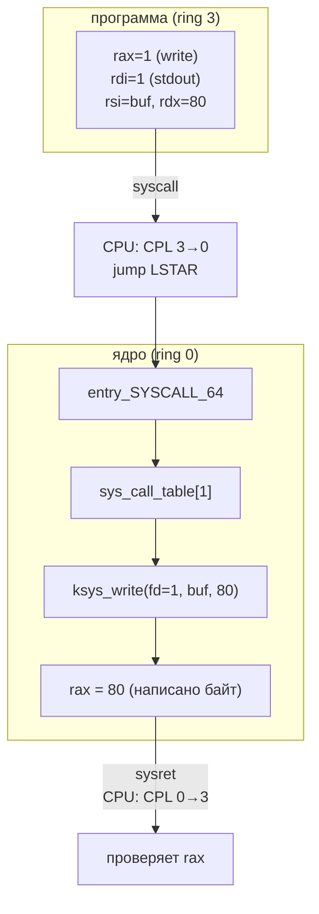

---
tags:
  - domain/linux
  - theme/internals
  - theme/security
  - type/concept
aliases:
  - CPU Modes
  - System Calls
  - Syscalls
order: 2
---

# Режимы CPU и системные вызовы

**Предпосылки:** [что такое операционная система](what-is-os.md) (абстракция, изоляция, разделение ресурсов, процесс как экземпляр программы).

← [Что такое операционная система](what-is-os.md) | [Процессы](processes.md) →

Операционная система изолирует программы друг от друга и от оборудования. Но изоляция бесполезна, если программа может обойти её программно — например, напрямую записать данные на диск, минуя файловую систему. Для настоящей изоляции нужна поддержка на уровне железа: процессор сам должен запрещать опасные действия.

## Кольца привилегий

Процессоры архитектуры x86 реализуют четыре кольца привилегий (privilege rings) — уровни доступа от 0 до 3. На практике используются два: кольцо 0 (kernel mode, режим ядра) и кольцо 3 (user mode, пользовательский режим).

Текущий уровень привилегий хранится в двух младших битах регистра `CS` (Code Segment) — это CPL (Current Privilege Level). Когда CPL = 0, процессору доступны все инструкции. Когда CPL = 3, целый класс операций запрещён аппаратно.

```
кольцо 3 (user mode)      кольцо 0 (kernel mode)
  CPL = 3                    CPL = 0
  +-----------+              +-----------+
  | программа |  -- нет -->  | ядро      |
  |           |  прямого     | драйверы  |
  |           |  доступа     | железо    |
  +-----------+              +-----------+
```

Что именно запрещено в кольце 3? Любая инструкция, которая может нарушить изоляцию. Инструкция `out` отправляет данные в порт ввода-вывода — через неё можно напрямую обратиться к диску. Инструкция `hlt` останавливает процессор. Инструкция `mov cr3, ...` переключает таблицу страниц, что позволило бы читать память другого процесса. Если программа с CPL = 3 попытается выполнить любую из них, процессор немедленно генерирует исключение General Protection Fault (#GP) — ядро перехватывает его и, как правило, завершает процесс сигналом SIGSEGV.

Проверка происходит на каждой привилегированной инструкции, при каждом такте декодирования. Это не программная проверка, которую можно обойти хитрым кодом — это логика внутри самого процессора, реализованная в кремнии.

Кольца 1 и 2 были задуманы для драйверов и системных сервисов, но на практике ни Linux, ни Windows их не используют — только 0 и 3. Виртуализация добавила ещё один уровень: гипервизор работает в специальном режиме VMX root (Virtual Machine Extensions) (иногда неформально называемом «ring -1»), а гостевые ОС получают аппаратное кольцо 0, но под контролем гипервизора.

## Проблема: как программа обращается к ядру

Изоляция работает: программа не может напрямую писать на диск, отправлять пакеты по сети или выделять страницы памяти. Но программе всё это нужно. Обычная инструкция `call` здесь не поможет — она передаёт управление по адресу, но не меняет CPL. Программа остаётся в кольце 3, а код ядра ожидает кольцо 0.

Нужен управляемый переход между кольцами — механизм, который одновременно повышает привилегии и передаёт управление строго в доверенную точку входа ядра, а не по произвольному адресу. Если бы программа могла прыгнуть в произвольное место кода ядра с привилегиями кольца 0, это было бы равносильно отсутствию защиты: достаточно найти адрес нужной инструкции и перейти к ней.

## Механизм системного вызова

Системный вызов (system call, syscall) — единственный штатный способ для программы попросить ядро выполнить привилегированную операцию. До появления инструкции `syscall` (AMD64) для этого использовалось программное прерывание `int 0x80` — инструкция, которая генерирует исключение и передаёт управление обработчику в ядре. Механизм работал, но медленнее: `int 0x80` проходит через таблицу прерываний IDT (Interrupt Descriptor Table), сохраняет больше состояния и стоит ~400-500 наносекунд. Инструкция `syscall` была разработана специально для системных вызовов и обходится без IDT, что сокращает время до ~100-300 наносекунд на системах без защит от Spectre/Meltdown; с включённой KPTI (Kernel Page Table Isolation — изоляция таблиц страниц ядра) и другими митигациями стоимость возрастает до 200-700 нс в зависимости от поколения CPU.

Весь процесс проходит в три фазы.

### Фаза 1: подготовка запроса

Программа помещает номер системного вызова и аргументы в регистры процессора. Для Linux на x86-64 соглашение следующее: номер syscall — в `rax`, аргументы — в `rdi`, `rsi`, `rdx`, `r10`, `r8`, `r9` (до шести аргументов). Это чистая конвенция между ядром и пользовательским кодом — процессор не знает, что означают значения в этих регистрах.

На практике программист редко работает с регистрами напрямую. Стандартная библиотека C (glibc — GNU C Library, musl) предоставляет функции-обёртки: `read()`, `write()`, `open()`. Обёртка заполняет регистры, выполняет инструкцию `syscall`, проверяет результат и в случае ошибки устанавливает `errno`. Но суть остаётся той же — под каждой обёрткой лежит ровно один переход в кольцо 0.

### Фаза 2: переключение в ядро

Программа выполняет инструкцию `syscall`. В этот момент процессор делает несколько вещей за один такт: сохраняет адрес возврата в регистр `rcx`, сохраняет флаги в `r11`, устанавливает CPL = 0, загружает из специального регистра `LSTAR` (Long System Target Address Register) адрес точки входа в ядро и передаёт туда управление. Адрес в `LSTAR` ядро записало при загрузке системы — программа не может его изменить.

Это ключевой момент: программа не выбирает, куда прыгнуть в ядре. Процессор всегда передаёт управление в одну и ту же фиксированную точку — `entry_SYSCALL_64` в ядре Linux. Программа влияет только на номер вызова в `rax`.

### Фаза 3: выполнение в ядре

Обработчик `entry_SYSCALL_64` сохраняет регистры пользовательского [процесса](processes.md), переключает стек на стек ядра и по номеру из `rax` находит нужную функцию в таблице системных вызовов (sys_call_table). В Linux ~450 системных вызовов: `read` (номер 0), `write` (1), `open` (2), `close` (3), `mmap` (9) и так далее.

Ядро выполняет запрошенную операцию: копирует данные с диска в буфер, отправляет пакет через сетевую карту, выделяет страницы памяти. Результат помещается в `rax` (успех — значение >= 0, ошибка — отрицательный код). Инструкция `sysret` восстанавливает CPL = 3 и возвращает управление по адресу из `rcx`.



## Цена системного вызова

Обычный вызов функции внутри программы — инструкция `call` — стоит 1-5 наносекунд. Системный вызов обходится в 100-300 наносекунд без защитных митигаций: примерно 50-100 раз дороже. Разница объясняется не самим переключением колец (оно занимает десятки наносекунд), а сопутствующими операциями: сохранение и восстановление регистров, переключение стека, сброс участков конвейера процессора (pipeline flush — очистка конвейера), проверки безопасности, возможная обработка сигналов при возврате. На процессорах с защитой от Spectre и Meltdown добавляется переключение таблиц страниц (KPTI) и ограничение спекулятивного выполнения (IBRS — Indirect Branch Restricted Speculation), что увеличивает стоимость до 200-700 наносекунд в зависимости от поколения CPU и набора включённых защит.

Для единичного вызова 200 наносекунд — ничто. Но системные вызовы совершаются тысячами и миллионами раз в секунду, и накладные расходы складываются. Утилита `strace -c` позволяет посчитать, сколько системных вызовов сделала программа и сколько времени на них ушло. Нередко оказывается, что короткоживущая программа тратит на системные вызовы больше времени, чем на собственные вычисления.

## Анатомия read()

Рассмотрим конкретный системный вызов — `read(fd, buf, count)`. Три аргумента: `fd` (file descriptor) — целое число, идентифицирующее открытый ресурс (файл, сокет, пайп); `buf` — адрес в памяти программы, куда ядро запишет прочитанные данные; `count` — сколько байт запрашивается.

[Файловый дескриптор](file-descriptors.md) (file descriptor) — это просто индекс в таблице открытых файлов [процесса](processes.md). Каждый [процесс](processes.md) при запуске получает три стандартных дескриптора: 0 — stdin (ввод), 1 — stdout (вывод), 2 — stderr (ошибки). Открытие файла через `open()` возвращает следующий свободный номер — обычно 3.

Вызов `read(3, buf, 4096)` означает: «из ресурса номер 3 прочитай до 4096 байт и положи их по адресу `buf`». Ядро проверяет, что дескриптор 3 действительно принадлежит этому процессу, определяет тип ресурса (файл на диске, сокет, устройство), вызывает соответствующий драйвер, копирует данные из пространства ядра в буфер программы и возвращает количество фактически прочитанных байт.

Возвращаемое значение `read()` может быть меньше запрошенного `count` — это нормальное поведение, а не ошибка. Если в файле осталось 500 байт, а запрашивалось 4096, `read()` вернёт 500. Если дескриптор указывает на сокет, данные приходят порциями — `read()` вернёт столько, сколько доступно прямо сейчас. Возврат 0 означает конец файла — EOF (End Of File). Возврат -1 — ошибка, код которой записывается в глобальную переменную `errno`.

## vDSO: системный вызов без системного вызова

Некоторые операции запрашиваются так часто, что 200 наносекунд на каждую становятся узким местом. Функция `gettimeofday()` — типичный пример: веб-сервер вызывает её при логировании каждого запроса, профилировщик — тысячи раз в секунду, база данных — при каждой фиксации транзакции.

При этом `gettimeofday()` только читает данные — текущее время. Ядро и так обновляет эти данные периодически (при каждом тике таймера, обычно каждые 1-4 миллисекунды). Полноценное переключение в кольцо 0 для чтения одного числа — расточительство.

Решение — vDSO (virtual Dynamic Shared Object, виртуальный динамический разделяемый объект). При запуске каждого процесса ядро отображает (map) в его адресное пространство небольшую область памяти — обычно одну страницу, 4 КБ. В этой области лежит код и данные, подготовленные ядром. Ядро периодически обновляет данные в этой странице (записывая текущее время), а программа читает их обычной инструкцией `mov` — без переключения колец.

```
адресное пространство процесса
+---------------------------+
|  код программы            |
+---------------------------+
|  куча (heap)              |
+---------------------------+
|  ...                      |
+---------------------------+
|  vDSO (4 КБ)             |  <-- отображена ядром
|  - код gettimeofday()     |      при запуске процесса
|  - данные: текущее время  |      ядро обновляет данные
+---------------------------+      каждые 1-4 мс
|  стек                     |
+---------------------------+
```

Куча (heap) — область памяти, из которой программа выделяет память во время работы, растущая от младших адресов вверх.

Вызов `gettimeofday()` через vDSO — это обычное чтение из памяти: 1-2 наносекунды вместо ~200. Разница в 100 раз. При 10 000 вызовов в секунду экономия составляет 10000 * 198 нс = ~2 мс — заметно для приложений, чувствительных к латентности.

В Linux через vDSO ускорены несколько функций: `gettimeofday()`, `clock_gettime()`, `getcpu()`, `time()`. Общий принцип: если данные обновляются ядром редко, а читаются пользователем часто, и при этом только на чтение — vDSO позволяет избежать переключения колец.

Предшественник vDSO — vsyscall — работал похоже, но использовал фиксированный адрес в памяти, одинаковый для всех процессов. Это создавало уязвимость: зная адрес, атакующий мог использовать его для ROP-атак (Return-Oriented Programming). vDSO отображается по случайному адресу благодаря ASLR (Address Space Layout Randomization), что значительно усложняет эксплуатацию.

## Буферизация: сокращение числа системных вызовов

vDSO решает проблему для нескольких конкретных функций. Но большинство операций — чтение файлов, запись логов, работа с сокетами — требуют настоящих системных вызовов. Здесь стратегия другая: вместо удешевления каждого вызова — сократить их количество.

Представим программу, которая пишет лог: каждая строка — 80 байт. Без буферизации каждая строка — отдельный `write()`:

```
write(fd, "2026-03-23 ...\n", 80)    -- 200 нс
write(fd, "2026-03-23 ...\n", 80)    -- 200 нс
write(fd, "2026-03-23 ...\n", 80)    -- 200 нс
...
1000 строк/сек * 200 нс = 200 мкс/сек только на переключение колец
```

1000 системных вызовов в секунду, каждый по ~200 наносекунд — 200 микросекунд чистых накладных расходов. Само копирование 80 байт внутри ядра занимает считанные наносекунды — почти всё время уходит на входы-выходы из кольца 0.

Альтернатива — накопить данные в буфере на стороне программы и отправить одним вызовом. Стандартная библиотека C (libc) делает именно это. Функции `fprintf()`, `fwrite()`, `fputs()` не вызывают `write()` напрямую. Вместо этого они копируют данные во внутренний буфер — на glibc (Linux) его размер по умолчанию 8192 байт (константа BUFSIZ), на musl и BSD — обычно 4096 или 1024. Когда буфер заполняется — одним вызовом `write()` сбрасываются накопленные данные.

```
fprintf() -> буфер (8192 байт)     <- без syscall, копирование в памяти
fprintf() -> буфер                  <- без syscall
fprintf() -> буфер                  <- без syscall
...
после ~102 строк (102 * 80 = 8160):
  write(fd, buf, 8160)              <- один syscall на 102 строки
```

Для 1000 строк по 80 байт: 80 000 байт / 8192 ≈ 10 системных вызовов вместо 1000. Накладные расходы: 10 * 200 нс = 2 микросекунды вместо 200. Разница в 100 раз.

### Три режима буферизации stdio

Стандартная библиотека применяет разные стратегии в зависимости от типа потока вывода.

Полная буферизация (fully buffered) — данные сбрасываются, когда буфер заполнен. Это поведение по умолчанию для файлов. Размер буфера обычно 4096 или 8192 байт.

Построчная буферизация (line buffered) — данные сбрасываются при появлении символа новой строки `\n` или при заполнении буфера. Это поведение по умолчанию для stdout, когда он подключён к терминалу. Каждая строка `printf("...\n")` немедленно появляется на экране.

Без буферизации (unbuffered) — каждый вызов функции записи немедленно выполняет `write()`. Это поведение по умолчанию для stderr: сообщения об ошибках должны появляться немедленно, даже если программа аварийно завершится до сброса буферов. Именно поэтому при `fprintf(stderr, "error: ...\n")` сообщение гарантированно дойдёт до терминала, а `fprintf(stdout, "status: ...\n")` может потеряться, если процесс упадёт до вызова `fflush()` или до заполнения буфера.

Неожиданное следствие: одна и та же программа ведёт себя по-разному в зависимости от того, куда направлен её вывод. Если stdout подключён к терминалу — построчная буферизация, `printf()` с `\n` в конце выводит строку сразу. Если stdout перенаправлен в файл или пайп (`./program | grep error`) — полная буферизация, данные могут задерживаться на тысячи строк. Это частый источник путаницы при отладке: «в терминале вижу вывод, а в пайпе — нет».

### Буферизация при чтении

Буферизация работает и в обратную сторону. Функция `fread()` при первом вызове читает не запрошенное количество байт, а целый блок — 8192 байт на glibc — одним вызовом `read()`. Последующие вызовы `fread()` берут данные из этого буфера, пока он не опустеет.

Наглядный пример: программа читает файл размером 1 мегабайт (1 048 576 байт) по одному байту за раз.

Вариант с прямыми системными вызовами — `read(fd, &c, 1)` в цикле: 1 048 576 вызовов `read()`, каждый по ~200 наносекунд. Только на переключения колец: 1 048 576 * 200 нс = ~210 миллисекунд. При этом ядро каждый раз проверяет дескриптор, определяет позицию в файле, копирует один байт — избыточная работа для чтения следующего символа, который уже лежит на той же странице файлового кеша.

Вариант с `fread(&c, 1, 1, fp)`: первый вызов делает `read(fd, internal_buf, 8192)` — один системный вызов, 8192 байт. Следующие 8191 вызовов `fread()` — копирование из буфера в памяти программы, без системных вызовов. На весь файл: 1 048 576 / 8192 = 128 системных вызовов. Время на переключения: 128 * 200 нс ≈ 26 микросекунд. Плюс ~1 048 576 операций копирования одного байта из буфера — порядка 1 миллисекунды. Итого ~1 мс против ~210 мс. Разница — примерно 200 раз.

```
побайтовый read():                 fread() с буфером 8192:

read(fd, &c, 1) -- syscall         fread() -- read(fd, buf, 8192) syscall
read(fd, &c, 1) -- syscall         fread() -- копия из буфера
read(fd, &c, 1) -- syscall         fread() -- копия из буфера
...                                 ...
read(fd, &c, 1) -- syscall         fread() -- копия из буфера (x8191)
                                    fread() -- read(fd, buf, 8192) syscall
                                    ...

1 048 576 syscalls                  128 syscalls
~210 мс на переключения            ~0.03 мс на переключения + ~1 мс копирование
```

Буферизация — не магия, а замена дорогой операции (системный вызов, переключение колец) на дешёвую (копирование в памяти пользовательского процесса). Принцип тот же, что у [буферного кеша PostgreSQL](../../databases/postgresql/durability/buffer-cache.md): удерживать данные на более быстром уровне иерархии, чтобы реже обращаться к медленному.

Важная оговорка: буферизация stdio — это буферизация в пространстве программы, в библиотеке C. Она не имеет отношения к буферному кешу ядра (page cache), который кеширует страницы файлов в оперативной памяти. Данные проходят два уровня буферизации: сначала stdio-буфер в процессе, затем `write()` передаёт данные ядру, где они попадают в page cache, и только потом — на диск. Вызов `fflush()` сбрасывает stdio-буфер, но не гарантирует запись на диск. Для этого нужен `fsync()` — ещё один системный вызов, который заставляет ядро записать страницы из page cache на физический носитель.

> [!info]- Задача: почему tail -f показывает логи, а ./program | grep error — нет?
> **Частая ошибка:** предположение, что данные «застряли» в пайпе или в `grep`.
>
> На самом деле проблема — в буферизации stdio. Когда stdout программы подключён к терминалу, используется построчная буферизация: каждый `printf("...\n")` вызывает `write()` немедленно. Когда stdout перенаправлен в пайп, библиотека переключается на полную буферизацию с буфером 4096 байт. Данные копятся в буфере и не отправляются, пока буфер не заполнится.
>
> **Решение:** `stdbuf -oL ./program | grep error` — утилита `stdbuf` через переменную `LD_PRELOAD` заставляет stdout использовать построчную буферизацию даже при записи в пайп.

## Итого: иерархия стоимости

```
операция                           время              кратность
-----------------------------------------------------------------
чтение из регистра CPU             ~0.3 нс            1x
вызов функции (call/ret)           ~1-5 нс            3-15x
чтение из vDSO                     ~1-2 нс            3-6x
копирование из stdio-буфера        ~1 нс              3x
системный вызов (user->kernel)*    ~100-700 нс        300-2000x
чтение страницы с SSD              ~50-100 мкс        150 000-300 000x
чтение страницы с HDD              ~5-10 мс           15 000 000-30 000 000x

* нижняя граница — без защит от Spectre/Meltdown;
  верхняя — с KPTI + IBRS на старших поколениях CPU
```

Каждый переход на следующий уровень стоит на порядки дороже. Буферизация, vDSO, кеширование — разные техники с одной целью: удержать данные на более дешёвом уровне и реже пересекать границы. Программист не всегда управляет всеми уровнями напрямую — но понимание иерархии стоимости объясняет, почему `fread()` в 200 раз быстрее побайтового `read()`, почему `gettimeofday()` через vDSO работает как обычный доступ к памяти, и почему даже на быстром SSD сокращение числа системных вызовов остаётся значимой оптимизацией.

Системный вызов даёт доступ к ядру. Но ядро должно управлять множеством одновременно работающих программ — выделять каждой память, процессорное время, [файловые дескрипторы](file-descriptors.md). Единица такого управления — [процесс](processes.md): экземпляр запущенной программы со своим адресным пространством и состоянием.

## См. также

- [Ruby I/O и GVL](../../ruby/internal/concurrency.md) — блокирующий syscall (`File.read`, `Socket.read`) освобождает GVL: пока поток в kernel mode, другие Ruby-потоки выполняют bytecode

## Sources

- Michael Kerrisk, 2010, *The Linux Programming Interface* — Chapter 3: System Call Interface: https://man7.org/tlpi/
- `man 2 syscall` — описание механизма системных вызовов: https://man7.org/linux/man-pages/man2/syscall.2.html
- `man 7 vdso` — описание механизма vDSO: https://man7.org/linux/man-pages/man7/vdso.7.html
- Intel, 2024, *Intel 64 and IA-32 Architectures Software Developer's Manual, Volume 3* — Chapter 5: Protection (privilege levels, CPL, rings): https://www.intel.com/content/www/us/en/developer/articles/technical/intel-sdm.html

---

← [Что такое операционная система](what-is-os.md) | [Процессы](processes.md) →
