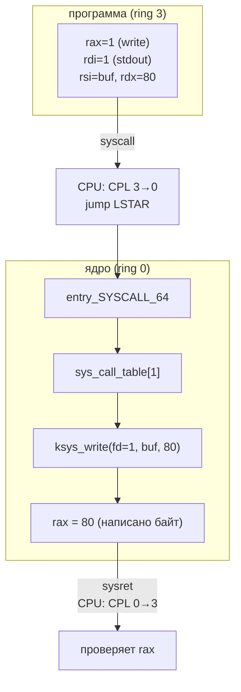

---
tags:
  - domain/linux
  - theme/internals
  - theme/security
  - type/concept
aliases:
  - CPU Modes
  - System Calls
  - Syscalls
order: 2
---

# Режимы CPU и системные вызовы

**Предпосылки:** [что такое операционная система](what-is-os.md) (абстракция, изоляция, разделение ресурсов, процесс как экземпляр программы); регистры CPU — именованные ячейки хранения внутри процессора, к которым он обращается за наносекунды (см. [ISA](../../computer/programmer-model/isa.md)).

← [Что такое операционная система](what-is-os.md) | [Процессы](processes.md) →

В предыдущей заметке аппаратный механизм привилегий остался за скобками: ядро работает на максимальном уровне, программы — на минимальном, попытка выполнить привилегированную инструкцию аппаратно прерывается процессором. Этот механизм реализован через кольца защиты, а легальное пересечение границы между ними — через системный вызов.

## Кольца привилегий

Процессоры архитектуры x86 реализуют четыре кольца привилегий (privilege rings) — уровни доступа от 0 до 3. На практике используются два: кольцо 0 (kernel mode, режим ядра) и кольцо 3 (user mode, пользовательский режим).

Текущий уровень привилегий хранится в двух младших битах регистра `CS` (Code Segment) — это CPL (Current Privilege Level). Когда CPL = 0, процессору доступны все инструкции. Когда CPL = 3, целый класс операций запрещён аппаратно.

```
кольцо 3 (user mode)      кольцо 0 (kernel mode)
  CPL = 3                    CPL = 0
  +-----------+              +-----------+
  | программа |  -- нет -->  | ядро      |
  |           |  прямого     | драйверы  |
  |           |  доступа     | железо    |
  +-----------+              +-----------+
```

Что именно запрещено в кольце 3? Любая инструкция, которая может нарушить изоляцию. Инструкция `out` отправляет данные в порт ввода-вывода — через неё можно напрямую обратиться к диску. Инструкция `hlt` останавливает процессор. Инструкция `mov cr3, ...` переключает таблицу страниц, что позволило бы читать память другого процесса. Если программа с CPL = 3 попытается выполнить любую из них, процессор немедленно генерирует исключение General Protection Fault (#GP) — ядро перехватывает его и, как правило, завершает процесс сигналом SIGSEGV (сигнал нарушения сегментации, который ОС посылает процессу).

Проверка происходит на каждой привилегированной инструкции, при каждом такте декодирования. Это не программная проверка, которую можно обойти хитрым кодом — это логика внутри самого процессора, реализованная в кремнии.

Кольца 1 и 2 были задуманы для драйверов и системных сервисов, но на практике ни Linux, ни Windows их не используют — только 0 и 3. Виртуализация добавила ещё один уровень: гипервизор работает в специальном режиме VMX root (Virtual Machine Extensions) (иногда неформально называемом «ring -1»), а гостевые ОС получают аппаратное кольцо 0, но под контролем гипервизора.

## Проблема: как программа обращается к ядру

Изоляция работает: программа не может напрямую писать на диск, отправлять пакеты по сети или выделять страницы памяти. Но программе всё это нужно. Обычная инструкция `call` здесь не поможет — она передаёт управление по адресу, но не меняет CPL. Программа остаётся в кольце 3, а код ядра ожидает кольцо 0.

Нужен управляемый переход между кольцами — механизм, который одновременно повышает привилегии и передаёт управление строго в доверенную точку входа ядра, а не по произвольному адресу. Если бы программа могла прыгнуть в произвольное место кода ядра с привилегиями кольца 0, это было бы равносильно отсутствию защиты: достаточно найти адрес нужной инструкции и перейти к ней.

## Механизм системного вызова

Системный вызов (system call, syscall) — единственный штатный способ для программы попросить ядро выполнить привилегированную операцию. Инструкция `syscall` была разработана специально для этого: она обходится без таблицы прерываний и стоит ~100-300 наносекунд на системах без защит от Spectre/Meltdown; с включённой [[linux/kernel/syscall-internals#KPTI: двойные таблицы страниц|KPTI]] и другими митигациями — до 200-700 нс в зависимости от поколения CPU.

Весь процесс проходит в три фазы.

### Фаза 1: подготовка запроса

Программа помещает номер системного вызова и аргументы в регистры процессора. Для Linux на x86-64 соглашение следующее: номер syscall — в `rax`, аргументы — в `rdi`, `rsi`, `rdx`, `r10`, `r8`, `r9` (до шести аргументов). Порядок регистров почти полностью совпадает с [System V AMD64 calling convention](../../computer/programmer-model/abi-and-data-layout.md) (стандартный ABI для вызова функций на x86-64 Linux): обычный вызов функции использует `rcx` как четвёртый аргумент, syscall — `r10`, чтобы не конфликтовать с сохранением адреса возврата в `rcx`. В остальном — та же конвенция, которую использует любой вызов функции.

#### Стандартная библиотека C

На практике программист редко работает с регистрами напрямую. Стандартная библиотека C (glibc — GNU C Library, musl) предоставляет функции-обёртки: `read()`, `write()`, `open()`. Обёртка заполняет регистры, выполняет инструкцию `syscall`, проверяет результат и в случае ошибки устанавливает `errno`. Но суть остаётся той же — под каждой обёрткой лежит ровно один переход в кольцо 0.

### Фаза 2: переключение в ядро

Программа выполняет инструкцию `syscall`. В этот момент процессор делает несколько вещей как единая операция: сохраняет адрес возврата в регистр `rcx`, сохраняет флаги в `r11`, устанавливает CPL = 0, загружает из специального регистра `LSTAR` (Long System Target Address Register) адрес точки входа в ядро и передаёт туда управление. Адрес в `LSTAR` ядро записало при загрузке системы — программа не может его изменить.

Это ключевой момент: программа не выбирает, куда прыгнуть в ядре. Процессор всегда передаёт управление в одну и ту же фиксированную точку — `entry_SYSCALL_64` в ядре Linux. Программа влияет только на номер вызова в `rax`.

### Фаза 3: выполнение в ядре

Обработчик `entry_SYSCALL_64` сохраняет регистры пользовательского [процесса](processes.md), переключает стек на стек ядра и по номеру из `rax` находит нужную функцию в таблице системных вызовов (sys_call_table). В Linux более 450 системных вызовов (mainline 6.x): `read` (номер 0), `write` (1), `open` (2), `close` (3), `mmap` (9) и так далее.

Ядро выполняет запрошенную операцию: копирует данные с диска в буфер, отправляет пакет через сетевую карту, выделяет страницы памяти. Результат помещается в `rax` (успех — значение >= 0, ошибка — отрицательный код). Инструкция `sysret` восстанавливает CPL = 3 и возвращает управление по адресу из `rcx`.



> [!info]- Раньше было иначе: int 0x80
> До инструкции `syscall` (появилась в AMD64) Linux использовал программное прерывание `int 0x80`. Оно генерирует исключение и передаёт управление обработчику через IDT (Interrupt Descriptor Table — таблица адресов обработчиков, к которой процессор обращается при любом прерывании или исключении). `int` и парная `iret` сохраняют и восстанавливают состояние через стек — это обращения к памяти. `syscall`/`sysret`, напротив, используют регистры `rcx` и `r11`, без обращений к памяти. Отсюда разница в скорости: `int 0x80` стоит несколько сотен наносекунд, `syscall` — ~100-300 нс. На 32-битных системах и в 32-битной совместимости ядро Linux до сих пор принимает `int 0x80`.

## Цена системного вызова

Обычный вызов функции внутри программы — инструкция `call` — стоит 1-5 наносекунд. Системный вызов обходится в 100-300 наносекунд без защитных митигаций: примерно 50-100 раз дороже. Сам аппаратный переход — `swapgs`, сохранение/восстановление регистров, переключение стека, диспатч по таблице, проверка флагов, `sysret` — занимает 50-100 наносекунд (подробнее — в [[linux/kernel/syscall-internals#Стоимость входа и выхода|механизме системных вызовов]]). Остальное добавляют косвенные эффекты: [сброс конвейера процессора](../../computer/cpu/out-of-order-execution.md) (pipeline flush — процессор заранее декодирует следующие инструкции; при смене привилегии эта предвыборка сбрасывается), промахи кешей после переключения контекста, проверки безопасности и возможная обработка сигналов при возврате. На процессорах с защитой от Spectre и Meltdown добавляется переключение таблиц страниц ([[linux/kernel/syscall-internals#KPTI: двойные таблицы страниц|KPTI]]) и ограничение спекулятивного выполнения (IBRS — Indirect Branch Restricted Speculation), что увеличивает стоимость до 200-700 наносекунд в зависимости от поколения CPU и набора включённых защит.

Для единичного вызова 200 наносекунд — ничто. Но системные вызовы совершаются тысячами и миллионами раз в секунду, и накладные расходы складываются. Утилита `strace -c` позволяет посчитать, сколько системных вызовов сделала программа и сколько времени на них ушло. Нередко оказывается, что короткоживущая программа тратит на системные вызовы больше времени, чем на собственные вычисления.

## Анатомия read()

Цена становится конкретной на одном вызове целиком. `read(fd, buf, count)` принимает три аргумента: `fd` (file descriptor) — целое число, идентифицирующее открытый ресурс (файл, сокет, пайп); `buf` — адрес в памяти программы, куда ядро запишет прочитанные данные; `count` — сколько байт запрашивается.

`fd` — [файловый дескриптор](file-descriptors.md): индекс в таблице открытых файлов [процесса](processes.md). Открытие файла через `open()` возвращает следующий свободный номер — обычно 3.

Вызов `read(3, buf, 4096)` означает: «из ресурса номер 3 прочитай до 4096 байт и положи их по адресу `buf`». Ядро проверяет, что дескриптор 3 действительно принадлежит этому процессу, определяет тип ресурса (файл на диске, сокет, устройство), вызывает соответствующий драйвер, копирует данные из пространства ядра в буфер программы и возвращает количество фактически прочитанных байт.

Возвращаемое значение `read()` может быть меньше запрошенного `count` — это нормальное поведение, а не ошибка. Если в файле осталось 500 байт, а запрашивалось 4096, `read()` вернёт 500. Если дескриптор указывает на сокет, данные приходят порциями — `read()` вернёт столько, сколько доступно прямо сейчас. Возврат 0 означает конец файла — EOF (End Of File). Возврат -1 — ошибка, код которой записывается в глобальную переменную `errno`.

## vDSO: системный вызов без системного вызова

Некоторые операции запрашиваются так часто, что 200 наносекунд на каждую становятся узким местом. Функция `gettimeofday()` — типичный пример: веб-сервер вызывает её при логировании каждого запроса, профилировщик — тысячи раз в секунду, база данных — при каждой фиксации транзакции.

При этом `gettimeofday()` только читает данные — текущее время. Ядро и так обновляет эти данные периодически (при каждом тике таймера, каждые 1-10 миллисекунд в зависимости от `CONFIG_HZ`). Полноценное переключение в кольцо 0 для чтения одного числа — расточительство.

Решение — vDSO (virtual Dynamic Shared Object, виртуальный динамический разделяемый объект). При запуске каждого процесса ядро отображает (map) в его адресное пространство небольшую область памяти — обычно две страницы, 8 КБ. В этой области лежит код и данные, подготовленные ядром. Ядро периодически обновляет данные в этой странице (записывая текущее время), а программа читает их обычной инструкцией `mov` — без переключения колец.

```
адресное пространство процесса
+---------------------------+
|  код программы            |
+---------------------------+
|  куча (heap)              |
+---------------------------+
|  ...                      |
+---------------------------+
|  vDSO (8 КБ)             |  <-- отображена ядром
|  - код gettimeofday()     |      при запуске процесса
|  - данные: текущее время  |      ядро обновляет данные
+---------------------------+      каждые 1-10 мс
|  стек                     |
+---------------------------+
```

Вызов `gettimeofday()` через vDSO занимает ~20-50 наносекунд: чтение базовых данных из отображённой страницы, чтение аппаратного счётчика TSC и вычисление текущего времени — всё в пользовательском режиме, без переключения колец. Для сравнения: тот же вызов через полный syscall стоит ~200 наносекунд. При 10 000 вызовов в секунду экономия составляет 10000 * 170 нс = ~1.7 мс — заметно для приложений, чувствительных к латентности.

В Linux через vDSO ускорены несколько функций: `gettimeofday()`, `clock_gettime()`, `getcpu()`, `time()`. Общий принцип: если данные обновляются ядром редко, а читаются пользователем часто, и при этом только на чтение — vDSO позволяет избежать переключения колец.

> [!info]- vsyscall: предшественник vDSO
> Предшественник vDSO — vsyscall — работал похоже, но использовал фиксированный адрес в памяти, одинаковый для всех процессов. Это создавало уязвимость: зная адрес заранее, атакующий мог использовать его для ROP-атак (Return-Oriented Programming — атаки, использующие фрагменты уже загруженного кода по заранее известным адресам). vDSO отображается по случайному адресу благодаря ASLR (Address Space Layout Randomization — рандомизация расположения адресного пространства), что значительно усложняет эксплуатацию.

## Второй путь: сократить число syscall

vDSO удешевляет отдельные вызовы. Вторая стратегия — уменьшить их количество: накопить N операций в user space и сделать один `write()` на группу. Именно так работает буферизация stdio в libc: `fprintf()`/`fwrite()` пишут в буфер ~8 КБ и вызывают `write()` только при заполнении. На 1000 коротких записей это означает ~10 syscall вместо 1000, и накладные расходы падают на два порядка. Подробнее — в заметке о [файловом вводе-выводе](../programming/file-io.md).

## Итого: иерархия стоимости

```
операция                           время              кратность
-----------------------------------------------------------------
чтение из регистра CPU             ~0.3 нс            1x
копирование из stdio-буфера        ~1 нс              3x
вызов функции (call/ret)           ~1-5 нс            3-15x
вызов через vDSO (clock_gettime)   ~20-50 нс          60-150x
системный вызов (user->kernel)*    ~100-700 нс        300-2000x
чтение страницы с SSD              ~50-100 мкс        150 000-300 000x
чтение страницы с HDD              ~5-10 мс           15 000 000-30 000 000x

* нижняя граница — без защит от Spectre/Meltdown;
  верхняя — с KPTI + IBRS на старших поколениях CPU
```

Каждый переход на следующий уровень стоит на порядки дороже — та же [иерархия стоимости доступа](../../computer/data-path/memory-hierarchy.md), которая определяет разрыв между регистрами, кешами, RAM и диском, продолжается и в программные границы: stdio-буфер, vDSO, page cache. Программист не всегда управляет всеми уровнями напрямую — но понимание иерархии объясняет, почему `fread()` в 200 раз быстрее побайтового `read()`, почему `gettimeofday()` через vDSO на порядок дешевле полного системного вызова, и почему даже на быстром SSD сокращение числа системных вызовов остаётся значимой оптимизацией.

Системный вызов даёт доступ к ядру. Но ядро должно управлять множеством одновременно работающих программ — выделять каждой память, процессорное время, [файловые дескрипторы](file-descriptors.md). Единица такого управления — [процесс](processes.md): экземпляр запущенной программы со своим адресным пространством и состоянием.

## См. также

- [Ruby I/O и GVL](../../ruby/internal/concurrency.md) — блокирующий syscall (`File.read`, `Socket.read`) освобождает GVL: пока поток в kernel mode, другие Ruby-потоки выполняют bytecode

## Sources

- Michael Kerrisk, 2010, *The Linux Programming Interface* — Chapter 3: System Call Interface: https://man7.org/tlpi/
- `man 2 syscall` — описание механизма системных вызовов: https://man7.org/linux/man-pages/man2/syscall.2.html
- `man 7 vdso` — описание механизма vDSO: https://man7.org/linux/man-pages/man7/vdso.7.html
- Intel, 2024, *Intel 64 and IA-32 Architectures Software Developer's Manual, Volume 3* — Chapter 5: Protection (privilege levels, CPL, rings): https://www.intel.com/content/www/us/en/developer/articles/technical/intel-sdm.html

---

← [Что такое операционная система](what-is-os.md) | [Процессы](processes.md) →
