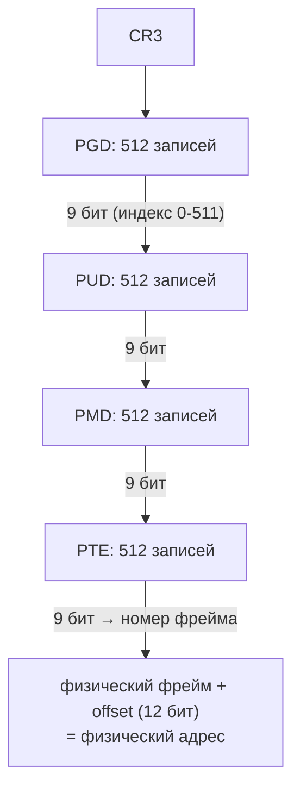

---
tags:
  - domain/linux
  - theme/memory
  - type/concept
aliases:
  - Virtual Memory
  - VM
order: 6
---

# Виртуальная память

> [!info]- Предпосылки
> [файловые дескрипторы](file-descriptors.md) (fd), [процессы](processes.md) (fork, exec(), copy-on-write на уровне эффекта), [иерархия памяти](../../computer/data-path/memory-hierarchy.md) (cache line), [когерентность кешей](../../computer/data-path/cache-coherency.md) (MESI).

← [Файловые дескрипторы](file-descriptors.md) | [Файловые системы](filesystems.md) →

fd абстрагирует ввод-вывод: [процесс](processes.md) работает с дескриптором, а ядро направляет данные к нужному устройству. Но у процессов есть вторая фундаментальная потребность — память. Веб-сервер и фоновый агент метрик работают на одной машине, и оба видят адреса, начинающиеся с `0x400000`. Два процесса, одинаковые адреса, одна физическая RAM — как они не затирают память друг друга?

## Три проблемы физической адресации

Если бы каждый процесс работал с физическими адресами RAM напрямую, возникли бы три проблемы.

**Изоляция.** Веб-сервер хранит буфер входящего HTTP-запроса по адресу `0x00A00000`. Агент метрик выделяет массив для накопления данных и получает тот же адрес — ничто не мешает, менеджера адресов нет. Запись агента уничтожает данные веб-сервера. Без границ между процессами одна ошибка в вычислении индекса ломает чужой процесс — та же беззащитность, что [без ОС](what-is-os.md). Причём ошибка может быть тихой — процесс не упадёт, а прочитает повреждённые данные и обработает их как валидные.

**Фрагментация.** Процесс A занял 100 МБ с адреса 0 до 100 МБ, процесс B — 50 МБ с 100 до 150 МБ. Процесс A завершился, освободив 100 МБ. Теперь процесс C просит 120 МБ непрерывной памяти — непрерывного куска нет, хотя свободной памяти 150 МБ (0–100 МБ + 150–200 МБ). Переместить процесс B «подвинуться» нельзя: все его указатели содержат абсолютные физические адреса в диапазоне 100–150 МБ, и изменение базового адреса сломает каждый из них. Внешняя фрагментация (external fragmentation) — свободная память есть, но разбита на куски, и ни один не достаточно велик.

**Фиксированные адреса.** Компилятор при генерации исполняемого файла размещает код и данные по определённым адресам. Два экземпляра одного и того же nginx не могут загрузиться одновременно в физическую память — оба скомпилированы для одного базового адреса, и их инструкции ссылаются на одни и те же абсолютные адреса. Чтобы запустить пять экземпляров, пришлось бы перекомпилировать каждый под свой диапазон.

## Виртуальные адреса: у каждого процесса своё пространство

Все три проблемы имеют одну корневую причину: процессы работают с физическими адресами напрямую. Решение — добавить уровень косвенности между адресами, которые видит процесс, и адресами реальной RAM.

Процесс оперирует **виртуальными адресами** (virtual addresses). Каждый процесс видит собственное непрерывное адресное пространство — 128 ТБ user-space на x86-64 (нижняя половина 48-битного диапазона; верхние 128 ТБ зарезервированы под ядро). Веб-сервер и агент метрик оба обращаются к адресу `0x400000`, но аппаратура транслирует эти одинаковые виртуальные адреса в разные физические адреса RAM. Один виртуальный адрес — два разных физических фрейма.

Процессу не нужно знать, где его данные лежат физически. Он работает в «иллюзии» непрерывной, приватной памяти. Фрагментация физической RAM не мешает — ядро может собрать непрерывное виртуальное пространство из разрозненных физических кусков.

Виртуальные страницы с последовательными номерами могут отображаться на физические фреймы, разбросанные по всей RAM: страница 0 → фрейм 4712, страница 1 → фрейм 89, страница 2 → фрейм 230001. Процесс видит непрерывный блок, а физическая память фрагментирована — и это не имеет значения.

Два экземпляра nginx загружаются по одному виртуальному адресу `0x400000`, но занимают разные физические страницы. Компилятору не нужно знать, сколько копий программы будет запущено — все работают с одинаковыми виртуальными адресами.

## Механизм целиком

Каждый адрес, к которому обращается процесс, — виртуальный. Аппаратный блок в процессоре — MMU (Memory Management Unit, блок управления памятью) — транслирует его в физический адрес через специальную структуру данных, page table (таблицу страниц).

Память делится на блоки фиксированного размера — страницы (pages) по 4 КБ. Трансляция работает постранично: MMU берёт номер виртуальной страницы, ищет соответствующий физический фрейм в page table, добавляет смещение внутри страницы — и получает физический адрес.

TLB (Translation Lookaside Buffer, буфер трансляции) кеширует недавние трансляции, чтобы не обращаться к page table на каждой инструкции. Если страницы нет в RAM — процессор генерирует page fault, и ядро загружает её. Если страница помечена как CoW (Copy-on-Write — копирование при записи) — ядро скопирует её при первой записи.

```text
Процесс                  MMU                    RAM
  |                       |                      |
  |-- load 0x401234 ----->|                      |
  |                       |-- TLB hit? --------->|
  |                       |   да: фрейм 0x7A1    |
  |                       |   нет: page table -->|
  |                       |        PTE lookup    |
  |                       |                      |
  |                       |-- физ. 0x7A1234 ---->|
  |<-- данные ------------|<-- данные ------------|
```

Пять компонентов — страницы, page table, MMU, TLB, page fault — работают вместе, и каждый держится на предыдущем: трансляция идёт постранично, page table хранит отображение страниц, MMU читает её, TLB кеширует результат, page fault включается, когда отображения ещё нет.

## Страницы: единица трансляции

Трансляция каждого байта по отдельности потребовала бы таблицу на 2^48 записей — это 2 ПБ только для одного процесса. Память делится на блоки одинакового размера: **страница** (page) — 4 КБ (2^12 байт) на x86-64. Виртуальная страница (virtual page) отображается на **фрейм** (page frame) — физический блок того же размера в RAM.

Раз страница — это 4096 = 2^12 байт, младшие 12 бит любого адреса задают позицию байта внутри страницы, а старшие биты — номер самой страницы. Поэтому виртуальный адрес распадается на две части без вычислений, простым разрезом:

```text
48-битный виртуальный адрес:
|<--- номер страницы (36 бит) --->|<- смещение (12 бит) ->|
|       0x000000401                |       0x234           |
```

Номер страницы определяет, какой фрейм искать в page table. Смещение (offset) — позиция внутри страницы — переносится в физический адрес без изменений: внутри фрейма того же размера байт стоит на том же месте. 12 бит смещения — это 2^12 = 4096 возможных позиций, ровно размер страницы.

Почему именно 4 КБ? Это компромисс между двумя противоположными давлениями. Мелкие страницы (512 Б) уменьшают внутреннюю фрагментацию — процесс, которому нужно 5 КБ, тратит 10 страниц по 512 Б = 5 КБ без потерь. Но мелкие страницы порождают огромные page table (больше записей) и больше TLB-промахов (каждая запись TLB покрывает меньший диапазон). Крупные страницы (2 МБ, 1 ГБ — huge pages) резко уменьшают количество записей в page table и увеличивают TLB hit rate, но тратят память впустую на мелких аллокациях: процесс, запросивший 8 КБ, получит целую страницу в 2 МБ — 99.6% фрейма пропадёт. 4 КБ — баланс, принятый в x86 с 1985 года (Intel 80386) и сохранившийся по сей день. Внутренняя фрагментация при 4 КБ страницах — в среднем 2 КБ на последнюю страницу аллокации, что на фоне общего потребления незначительно.

## Page table: карта трансляций

**Page table** (таблица страниц) — структура данных в RAM, по одной на процесс. Каждая запись — PTE (Page Table Entry, запись таблицы страниц) — содержит номер физического фрейма и набор атрибутов.

Каждая запись — 64 бита, из которых ~40 бит отведены под номер физического фрейма, а остальные — под флаги. Два флага работают уже в ближайших разделах:

- **Present (P)** — страница находится в RAM. Если бит сброшен, обращение вызовет page fault.
- **Read/Write (R/W)** — разрешена ли запись. Бит, который делает возможным copy-on-write: ядро очищает его, чтобы перехватить первую запись через page fault.

Остальные флаги вступают в игру позже, когда сценарий создаёт для них работу:

- **User/Supervisor (U/S)** — доступна ли страница из user mode ([[linux/foundations/cpu-modes-and-syscalls#Кольца привилегий|ring 3]]). Страницы ядра имеют U/S=0, и процесс из ring 3 не может их прочитать.
- **Accessed (A)** и **Dirty (D)** — процессор ставит Accessed при любом обращении, Dirty — при записи. Оба нужны при вытеснении страниц из RAM: Accessed помогает ядру отличить «горячие» страницы от тех, что можно вытеснить, а Dirty решает судьбу вытесняемой — изменённую придётся сначала записать на диск, чистую можно просто отбросить.
- **NX (No Execute; у Intel — XD, Execute Disable)** — запрет исполнять данные страницы как код. Стек и куча помечены NX=1: процессор откажется исполнить инструкции, оказавшиеся в области данных, — например shell-код, записанный в буфер на стеке (классический stack-based buffer overflow). Это защита от целого класса атак, где чужой код подсовывают в буфер данных.

Физический адрес PTE вычисляется по номеру виртуальной страницы: MMU использует его как индекс в таблице. Но плоская (одноуровневая) таблица для 48-битного адресного пространства заняла бы 2^36 записей x 8 байт = 512 ГБ на процесс. На сервере с 400 процессами это 200 ТБ — больше, чем вся физическая RAM на планете. При этом типичный процесс использует лишь крохотную долю из 128 ТБ user-space. Нужна структура, которая не тратит память на неиспользуемые диапазоны адресов.

## Многоуровневая page table

Решение — дерево. Вместо одной гигантской таблицы — несколько ярусов маленьких: запись верхнего яруса хранит не фрейм данных, а адрес таблицы следующего яруса, и так до последнего, где запись наконец указывает на физический фрейм. Тогда ветви, ведущие в неиспользуемые диапазоны, можно не создавать вовсе. Чтобы спускаться по ярусам, 36 бит номера виртуальной страницы разбиваются на четыре группы по 9 бит — по группе на ярус, каждая выбирает запись в своей таблице. x86-64 использует четырёхуровневое дерево (с 2019 года Intel добавил пятый уровень для 57-битных адресов, но четыре уровня остаются стандартом):

```text
48-битный виртуальный адрес:
|  PGD  |  PUD  |  PMD  |  PTE  | offset |
| 9 бит | 9 бит | 9 бит | 9 бит | 12 бит |
```

Каждая таблица на каждом уровне содержит 2^9 = 512 записей по 8 байт = 4096 байт — ровно одна страница (4 КБ). Это не совпадение: таблицы специально выровнены по размеру страницы, чтобы ядро могло выделять и освобождать их стандартным механизмом управления физическими фреймами.

Уровни:

- **PGD** (Page Global Directory) — корень дерева. Одна таблица на процесс.
- **PUD** (Page Upper Directory) — второй уровень.
- **PMD** (Page Middle Directory) — третий уровень.
- **PTE** (Page Table Entry) — четвёртый уровень, содержит физический фрейм и атрибуты.



Ключевое свойство: таблицы нижних уровней выделяются только при необходимости. Если процесс использует 100 МБ виртуального пространства из 128 ТБ доступных user-space, подавляющее большинство записей PGD указывают «не существует» — и соответствующие PUD, PMD, PTE вообще не создаются. Типичный процесс с 100 МБ рабочей памяти расходует на page table порядка 200–300 КБ вместо 512 ГБ при плоской организации. Экономия — в шесть порядков.

На конкретном адресе трансляция выглядит так. Процесс обращается к `0x00007F4A3B601234`. MMU извлекает 36 бит номера виртуальной страницы и разбивает их на четыре 9-битных индекса. Первые 9 бит — индекс в PGD: таблица лежит в памяти как массив записей по 8 байт, поэтому адрес нужной записи — это начало таблицы (из CR3) плюс индекс x 8 байт. MMU читает эту запись. Запись содержит физический адрес таблицы PUD. Вторые 9 бит — индекс в PUD: MMU обращается к PUD и получает адрес PMD. Третьи 9 бит — индекс в PMD → адрес таблицы PTE. Четвёртые 9 бит — индекс в PTE → номер физического фрейма. MMU конкатенирует номер фрейма с 12-битным смещением (0x234) и получает итоговый физический адрес. Четыре чтения из RAM — четыре потенциальных промаха кеша.

Цена многоуровневой организации — четыре последовательных обращения к RAM на каждую трансляцию, каждое по ~60–100 нс. Четыре уровня — 240–400 нс только на адресный перевод, прежде чем процессор доберётся до самих данных.

Без кеширования это катастрофа: типичная программа выполняет сотни миллионов обращений к памяти в секунду, и тратить 400 нс на каждое из них — значит снизить реальную производительность процессора в десятки раз. Поэтому трансляции кешируются в специальном аппаратном буфере.

## MMU и регистр CR3

**MMU** (Memory Management Unit) — аппаратный блок внутри процессора, который выполняет трансляцию при каждом обращении к памяти. Каждая инструкция `mov`, `load`, `store`, каждая выборка следующей инструкции (instruction fetch) — всё проходит через MMU. Программа обращается к виртуальному адресу — MMU прозрачно подставляет физический. Для программы MMU невидим: она работает с виртуальными адресами и не знает, что за кулисами происходит трансляция. Единственный момент, когда MMU становится «видимым», — page fault: процессор останавливает выполнение и передаёт управление ядру.

MMU узнаёт, где лежит page table текущего процесса, из регистра **CR3** (Control Register 3). CR3 хранит физический адрес корневой таблицы PGD. Адрес физический, а не виртуальный — иначе возник бы порочный круг: чтобы транслировать адрес, нужна page table, а чтобы найти page table, нужно транслировать адрес.

При переключении контекста (context switch) — когда планировщик передаёт процессор другому процессу — ядро записывает в CR3 адрес PGD нового процесса. Одна запись в CR3 — и MMU начинает транслировать адреса по другой page table. Веб-сервер и агент метрик имеют разные PGD, поэтому одинаковый виртуальный адрес `0x400000` ведёт к разным физическим фреймам.

Запись в CR3 — привилегированная операция ([[linux/foundations/cpu-modes-and-syscalls#Кольца привилегий|ring 0]] — режим ядра; пользовательский процесс работает в ring 3 и лишён этого права). Пользовательский процесс не может подменить свою page table и получить доступ к чужой памяти. Это замыкает кольцо безопасности: виртуальная память изолирует процессы, page table определяет видимость, CR3 привязывает page table к процессу, а привилегированность CR3 не позволяет процессу выйти за рамки своей page table.

Переключение контекста — дорогая операция не столько из-за записи в CR3 (несколько тактов), сколько из-за побочных эффектов. Новый CR3 означает новую page table, а значит все закешированные трансляции в TLB становятся невалидными.

## TLB: кеш трансляций

Четыре обращения к RAM на каждую трансляцию — неприемлемо. **TLB** (Translation Lookaside Buffer, буфер ассоциативной трансляции) — аппаратный кеш внутри MMU, хранящий результаты недавних трансляций: пары «номер виртуальной страницы -> номер физического фрейма + атрибуты».

TLB — полностью ассоциативный кеш (fully associative). В обычных кешах (L1, L2) адрес определяет позицию в кеше — конкурируют только линии с одинаковым индексом. В TLB каждая запись может хранить любую трансляцию, и при поиске все записи сравниваются параллельно. Это возможно, потому что TLB маленький: L1 DTLB — десятки записей, L2 TLB — порядка тысячи (для сравнения: L1 кеш данных — тысячи кеш-линий). Малый размер позволяет параллельное сравнение за один такт.

Числа для типичного процессора (Intel Core, Skylake-архитектура):

- L1 DTLB (data TLB): 64 записи для 4 КБ страниц, 32 записи для 2 МБ huge pages
- L2 TLB (unified): 1536 записей
- TLB hit: ~1 такт (~0.3 нс при 3 ГГц)
- TLB miss → page walk (полный обход 4 уровней): 10–400 нс в зависимости от того, попадут ли промежуточные таблицы в кеш данных

Hit rate TLB при типичной нагрузке — 99%+. 64 записи L1 DTLB покрывают 64 x 4 КБ = 256 КБ. С L2 TLB на 1536 записей — 6 МБ. Для программы с рабочим набором до 6 МБ практически каждое обращение попадает в TLB.

Когда рабочий набор вырастает — hit rate падает, и программа начинает тратить десятки наносекунд на каждый page walk. Базы данных с рабочим набором в сотни гигабайт иногда теряют 10–20% производительности на TLB-промахах. Одна из причин использовать huge pages (2 МБ): одна запись TLB покрывает не 4 КБ, а 2 МБ — в 512 раз больше. 64 записи L1 DTLB для huge pages покрывают 64 x 2 МБ = 128 МБ вместо 256 КБ. PostgreSQL поддерживает huge pages через параметр `huge_pages = on`, и для shared_buffers в 8 ГБ это снижает TLB-промахи на порядок.

Промежуточные таблицы (PGD, PUD, PMD) — обычные страницы в RAM, и они попадают в L1/L2 кеш данных процессора. Если процесс обращается к соседним виртуальным адресам (пространственная локальность), все четыре уровня таблиц уже лежат в кеше, и page walk обходится в 10–20 нс вместо 400 нс. Именно поэтому последовательный обход массива почти не страдает от TLB-промахов: промахи есть, но page walk быстрый. Случайный доступ к памяти — другое дело: каждое обращение может затронуть другую ветвь дерева, кеш не помогает, и page walk стоит полные 100+ нс.

**Переключение контекста и TLB.** Запись нового значения в CR3 инвалидирует TLB — все записи становятся невалидными. Это логично: трансляции старого процесса не имеют смысла для нового. Но цена высока: после переключения первые десятки обращений к памяти идут через полный page walk. На машине, переключающей контекст каждые 4 мс (типичный квант планировщика Linux), TLB-промахи после переключения могут составлять 5–10% от всех обращений.

Процессоры смягчают это через **PCID** (Process Context ID) — тег процесса на каждой записи TLB. Записи помечаются тегом текущего процесса, и при переключении TLB больше не сбрасывается целиком: трансляции старого процесса остаются с его тегом, а MMU при поиске учитывает только записи с тегом активного процесса. При возврате к процессу его трансляции всё ещё в TLB, и «холодный старт» после переключения исчезает. С PCID переключение контекста перестаёт сбрасывать TLB целиком — на серверах с частыми переключениями это экономит порядка 1–2% стоимости.

**TLB shootdown: инвалидация на других ядрах.** PCID решает проблему переключения контекста, но есть другой источник устаревших трансляций. На многоядерном CPU у каждого ядра свой TLB. Когда ядро операционной системы изменяет page table — `munmap()` освобождает регион, `mprotect()` меняет права, copy-on-write ломает разделение фрейма — TLB на других ядрах, исполняющих потоки того же процесса, продолжает хранить старые трансляции. Поток на ядре 3 может читать память, которую ядро 0 уже пометило как недоступную.

Ядро ОС решает это через **TLB shootdown**: отправляет IPI (Inter-Processor Interrupt — межпроцессорное прерывание) каждому ядру, использующему это адресное пространство. Получившее IPI ядро выполняет инструкцию `INVLPG` (invalidate page — сбросить одну запись TLB) или полный flush, в зависимости от объёма изменений.

Стоимость TLB shootdown — 1–10 мкс на каждое ядро-получатель: IPI пересекает interconnect, прерывает исполнение, процессор выполняет инвалидацию и возвращается к работе. На 128-ядерном сервере shootdown может затронуть десятки ядер одновременно. Для программ с частым `mmap()`/`munmap()` — JIT-компиляторы (Just-In-Time; примеры — JVM (Java Virtual Machine), V8), которые постоянно выделяют и освобождают регионы под скомпилированный код — shootdown становится заметной нагрузкой. Аналогия с [[computer/data-path/cache-coherency#Протокол MESI: четыре состояния кеш-линии|когерентностью кешей]]: протокол MESI (Modified, Exclusive, Shared, Invalid) инвалидирует кеш-линии при изменении данных, shootdown инвалидирует TLB-записи при изменении трансляций. PCID смягчает проблему при переключении контекста (старые записи помечены чужим тегом), но не при изменении page table текущего процесса — shootdown неизбежен.

## Page fault: когда трансляция не удалась

Когда MMU не может завершить трансляцию — present-бит в PTE равен нулю, или запись нарушает атрибуты (запись в read-only страницу) — процессор генерирует исключение: **page fault**. Управление передаётся обработчику в ядре, который разбирается в причине.

**Minor page fault** (малый): страница может быть обслужена без дискового ввода-вывода. Чаще всего это означает, что физический фрейм нужно выделить и заполнить нулями (для анонимных страниц) или что фрейм уже в RAM, но PTE ещё не настроен (например, при CoW). Ядро заполняет PTE и возвращает управление. Стоимость: ~1–10 мкс — переход в kernel mode, поиск или выделение фрейма, обновление page table, возврат в user mode. При старте программы minor fault идут потоком: каждая новая страница кода, каждая новая страница стека порождает fault. Для типичного процесса при запуске — тысячи minor fault за первые миллисекунды.

**Major page fault** (большой): данных в RAM нет, их нужно прочитать с диска. Это происходит в двух ситуациях: страница была вытеснена из RAM в swap (механизм подкачки — ядро сбрасывает редко используемые страницы на диск, чтобы освободить фреймы для активных процессов), или страница принадлежит файлу, отображённому через `mmap()`, и ещё не была загружена. Ядро находит данные, инициирует чтение с устройства хранения, переключает процесс в состояние ожидания (процессор исполняет другие процессы, пока данные читаются). Стоимость: 1–10 мс на HDD, 50–200 мкс на NVMe SSD. На три-четыре порядка дороже minor fault. Один major page fault на критическом пути HTTP-запроса может увеличить latency с 1 мс до 10 мс — поэтому серверы баз данных стремятся держать рабочий набор в RAM и минимизировать swap.

**Illegal access** (нелегальный доступ): виртуальный адрес не принадлежит ни одному отображению процесса, или обращение нарушает права (например, попытка исполнения кода на странице с NX-битом). Ядро отправляет процессу сигнал SIGSEGV (segmentation fault). Результат — завершение процесса, если сигнал не перехвачен. Это та самая защита: агент метрик обращается по адресу, принадлежащему веб-серверу, — но в его виртуальном пространстве этого адреса нет, page table не содержит записи, и процессор генерирует fault вместо того, чтобы молча записать в чужую память.

Обработчик page fault в ядре различает эти три случая по состоянию VMA (Virtual Memory Area — описание виртуального региона: начальный адрес, размер, права, ссылка на источник) и PTE. Алгоритм:

Сначала ядро проверяет, есть ли VMA, покрывающий адрес fault (через red-black дерево — [бинарное дерево поиска](../../algorithms-and-data-structures/non-linear/binary-search-tree.md), самобалансирующийся вариант — по VMA процесса; поиск за O(log n)). Если VMA нет — illegal access, SIGSEGV.

Если VMA есть, но PTE содержит present=0 — ядро смотрит, куда указывает VMA: на файл (demand paging, читать с диска — major fault) или на анонимную память (выделить фрейм — minor fault).

Если PTE содержит present=1, но права не совпадают (запись в read-only) — ядро проверяет, помечена ли страница как CoW. Если да — minor fault с копированием фрейма. Если нет — illegal access, SIGSEGV.

## Demand paging: ленивая загрузка

Когда ядро загружает программу через `exec()`, оно не читает весь исполняемый файл в RAM. Ядро разбирает [ELF-заголовок](../infrastructure/elf-and-linking.md) файла (Executable and Linkable Format — стандартный формат исполняемых файлов в Linux), определяет секции (Text, Data, BSS) и их виртуальные адреса. Для каждой секции ядро создаёт **VMA** (Virtual Memory Area) — описание виртуального региона: начальный адрес, размер, права доступа, ссылка на файл-источник. Но физических фреймов не выделяет. PTE всех страниц содержат present=0.

Первая инструкция программы обращается к виртуальному адресу точки входа (entry point — адрес функции `_start`, записанный в ELF-заголовке). MMU видит present=0 — page fault. Ядро определяет, что VMA указывает на исполняемый файл, читает соответствующие 4 КБ с диска, выделяет физический фрейм, копирует данные, заполняет PTE (present=1, R/W=0, executable=1) и возвращает управление. Процессор повторяет инструкцию — на этот раз TLB получает валидную трансляцию. Следующие инструкции попадают в ту же страницу — TLB hit, никаких fault. Когда выполнение дойдёт до кода за пределами первых 4 КБ — снова page fault, снова загрузка одной страницы.

На практике программа размером 100 МБ может использовать только 2–3 МБ кода за всё время работы. Demand paging гарантирует, что в RAM окажутся только эти 2–3 МБ, а остальные 97 МБ останутся на диске. Время запуска тоже выигрывает: вместо чтения 100 МБ с диска (~15–20 мс на NVMe) — чтение одной страницы (~50–200 мкс).

Demand paging работает не только для кода. Анонимные страницы (heap, stack) тоже выделяются лениво: `malloc()` создаёт VMA, но физический фрейм появляется только при первом обращении. Именно поэтому `malloc(1 GB)` мгновенный — ядро создаёт виртуальное описание региона, а не 262 144 физических фреймов. Разницу между виртуальным и физическим потреблением можно увидеть в `/proc/<pid>/status`: поле `VmSize` показывает суммарный размер всех VMA (виртуальная память), а `VmRSS` — количество физически занятых фреймов (resident set size). Для только что запущенного процесса с `malloc(1 GB)` VmSize вырастет на гигабайт, а VmRSS — на ноль.

## Copy-on-write: fork() без копирования

[`fork()`](processes.md) создаёт дочерний процесс — копию родительского. Эффект: дочерний процесс видит те же данные, но изменения в одном не затрагивают другой.

Наивная реализация — скопировать всю физическую память родителя — потребовала бы для процесса с 1 ГБ RSS (Resident Set Size — размер резидентного набора) около 250 мс и 1 ГБ свободной RAM. Это неприемлемо: типичный веб-сервер вызывает fork() при обработке запросов, и задержка в четверть секунды на каждый fork убила бы производительность.

**Copy-on-write** (CoW, копирование при записи) решает проблему через page table. Идея: не копировать физическую память — копировать только метаданные (page table), а физические фреймы разделять между процессами до тех пор, пока один из них не попытается записать. Запись перехватывается через page fault, и только тогда создаётся физическая копия — одной страницы, а не всей памяти.

Вот что происходит при `fork()`:

1. Ядро создаёт новую page table для дочернего процесса — копию page table родителя. Копируются только PTE (записи таблиц), не физические фреймы. Page table для процесса с 1 ГБ памяти — порядка 2 МБ, копирование занимает ~50–100 мкс.

2. Ядро очищает бит R/W (writable) во всех PTE обоих процессов — и родителя, и ребёнка. Обе page table теперь указывают на одни и те же физические фреймы, но помечены как read-only.

3. Ядро увеличивает счётчик ссылок (refcount) на каждом физическом фрейме. Refcount хранится в структуре `struct page` — дескрипторе физического фрейма в ядре.

Сразу после fork() прирост физической памяти — около нуля: все фреймы разделяются между родителем и ребёнком, новых не выделено. При этом VmRSS (Resident Set Size, размер резидентного набора) ребёнка в `/proc/<pid>/status` покажет значение, близкое к родительскому — RSS учитывает все resident-страницы, включая разделяемые CoW-страницы. Реальное потребление «собственной» памяти ребёнка отражает метрика PSS (Proportional Set Size) из `/proc/<pid>/smaps`, которая делит разделяемые страницы поровну между процессами.

fork() для процесса с 1 ГБ RSS завершается за ~50–100 мкс — ядро копирует только page table (~2 МБ), не физические данные. Без CoW тот же fork() занял бы 30–500 мс (копирование 1 ГБ при пропускной способности RAM ~2–30 ГБ/с в зависимости от поколения и конфигурации) и потребовал бы 1 ГБ свободной физической памяти.

Когда один из процессов выполняет запись:

1. Процессор видит: PTE помечен read-only. Запись в read-only страницу — page fault.
2. Ядро получает управление и проверяет: это CoW-страница (refcount > 1)? Да.
3. Ядро выделяет новый физический фрейм (4 КБ).
4. Копирует содержимое старого фрейма в новый — 4 КБ данных, ~100 нс.
5. Обновляет PTE пишущего процесса: новый фрейм, бит R/W установлен.
6. Уменьшает refcount старого фрейма. Если refcount стал 1 — бит R/W оставшегося процесса будет восстановлен при следующей попытке записи: копировать больше не нужно.

Если дочерний процесс сразу после fork() вызывает `exec()` (загружает другую программу), он заменяет всё адресное пространство — ни одной страницы родителя не копируется. Это типичный паттерн: `fork()` + `exec()` — стандартный способ запуска нового процесса в Unix, и CoW делает его практически бесплатным.

CoW проявляется и в неожиданных контекстах. Redis выполняет фоновое сохранение (BGSAVE) через `fork()`: дочерний процесс сериализует данные на диск, а родитель продолжает обрабатывать запросы. Redis-сервер с 10 ГБ данных вызывает `fork()` — ребёнок получает page table за ~100 мкс, физическая память не удваивается. Пока BGSAVE идёт, клиенты пишут в Redis. Каждая запись порождает CoW-fault: ядро копирует 4 КБ страницу, прежде чем разрешить запись родителю. Если за время BGSAVE клиенты модифицируют 30% данных — 3 ГБ скопируется через CoW. Пиковое потребление: 10 ГБ (оригинал) + 3 ГБ (CoW-копии) = 13 ГБ. На машине с 12 ГБ RAM это вызовет OOM kill (Out Of Memory — нехватка памяти). Именно поэтому для Redis рекомендуют держать `maxmemory` не выше 50–60% от физической RAM — запас под CoW при BGSAVE.

```text
fork():
  Родитель PTE          Ребёнок PTE
  ┌───────────┐         ┌───────────┐
  | vpage 0   |--+      | vpage 0   |--+
  | R/W = 0   |  |      | R/W = 0   |  |
  └───────────┘  |      └───────────┘  |
                 |                     |
                 +---> [ фрейм X ] <---+
                       refcount = 2

Запись ребёнком:
  Родитель PTE          Ребёнок PTE
  ┌───────────┐         ┌───────────┐
  | vpage 0   |----->   | vpage 0   |----->
  | R/W = 1   |  [ фрейм X ]  | R/W = 1   |  [ фрейм Y ]
  └───────────┘  refcount = 1  └───────────┘  (копия 4 КБ)
```

## Overcommit: виртуальная память без физической

`malloc(1 * 1024 * 1024 * 1024)` — запрос на 1 ГБ. Ядро создаёт виртуальное отображение (VMA) на 262 144 страницы, но не выделяет ни одного физического фрейма. PTE всех этих страниц содержат present=0. RSS процесса остаётся прежним — ноль новых физических страниц.

Процесс записывает один байт по адресу внутри выделенного блока: `buffer[0] = 'x'`. MMU транслирует адрес, находит PTE с present=0 — page fault. Ядро выделяет один физический фрейм (4 КБ), заполняет нулями, обновляет PTE. RSS вырастает на 4 КБ. Остальные 262 143 страницы всё ещё не имеют физического фрейма.

Это и есть **overcommit** (избыточное резервирование): ядро разрешает виртуальных отображений больше, чем есть физической RAM. Десять процессов могут запросить по 1 ГБ каждый на машине с 4 ГБ RAM — и это работает, пока не все страницы реально используются.

Типичный Java-процесс резервирует виртуальной памяти в 3–5 раз больше, чем его рабочий набор. JVM запрашивает большой непрерывный блок для кучи (heap) через `mmap()` при старте, но фактически использует только часть. Без overcommit пришлось бы иметь физическую RAM под максимальный размер кучи каждого Java-процесса — даже если реально занята лишь пятая часть.

Проблема наступает, когда суммарное потребление физической памяти превышает RAM + swap. Ядро получает page fault, пытается выделить фрейм — свободных нет. Сначала ядро пытается освободить память: сбрасывает чистые страницы page cache (кэш содержимого файлов в RAM), вытесняет редко используемые страницы в swap. Если и это не помогает — вступает **[[linux/programming/memory-management#OOM killer: последняя линия защиты|OOM killer]]** (Out Of Memory killer): ядро выбирает процесс-«жертву» на основе oom_score (эвристика, учитывающая RSS процесса, его возраст и пользовательскую корректировку oom_score_adj) и завершает его сигналом SIGKILL, освобождая фреймы для остальных. OOM kill — событие, которое пишется в dmesg и syslog, и на продуктовых серверах оно означает инцидент.

Overcommit контролируется через `/proc/sys/vm/overcommit_memory`: значение 0 (эвристический — ядро отклоняет явно безумные запросы, например 100 ТБ на машине с 16 ГБ), 1 (всегда разрешать — malloc никогда не вернёт NULL), 2 (строгий — виртуальная память ограничена swap + настраиваемый процент RAM из `overcommit_ratio`). По умолчанию стоит 0. На продуктовых серверах баз данных часто выставляют 2, чтобы `malloc` возвращал ошибку вместо молчаливого overcommit с последующим OOM kill. PostgreSQL, например, рекомендует `overcommit_memory=2` в своей документации — потому что OOM kill процесса postmaster приводит к перезапуску всего кластера.

## Адресное пространство процесса

Overcommit показал, что виртуальная память отвязана от физической: процесс может зарезервировать гигабайты виртуального пространства, не расходуя ни одного физического фрейма. Само это пространство устроено не как сплошное поле: 128 ТБ user-space не используются целиком — ядро размечает адресное пространство на несколько регионов с разными правами доступа:

```text
Высокие адреса (0x7FFF...)
┌─────────────────────┐
|       Stack         |  растёт вниз, по умолчанию 8 МБ
|         |           |  R/W, NX
|         v           |
|                     |
|  (неиспользуемое    |
|   пространство)     |
|                     |
|         ^           |
|         |           |
|    mmap область     |  динамические библиотеки, mmap-файлы
|                     |  права зависят от отображения
├─────────────────────┤
|         ^           |
|         |           |
|       Heap          |  растёт вверх (brk/mmap)
|                     |  R/W, NX
├─────────────────────┤
|       BSS           |  неинициализированные глобальные переменные
|                     |  R/W, NX, заполнен нулями
├─────────────────────┤
|       Data          |  инициализированные глобальные переменные
|                     |  R/W, NX
├─────────────────────┤
|       Text          |  машинный код программы
|                     |  R, X (read + execute, no write)
└─────────────────────┘
Низкие адреса (~0x400000)
```

**Text** (код) — машинные инструкции программы. Read-only и executable. Попытка записи в Text — page fault → SIGSEGV. Это защита от случайного повреждения кода и от целого класса атак: атакующий не может перезаписать инструкции программы, даже если нашёл уязвимость. Text-сегмент разделяется между всеми экземплярами программы через те же физические фреймы — пять процессов nginx используют одну копию кода в RAM.

**Data** — инициализированные глобальные переменные. `int counter = 42;` в C попадает сюда. Значения читаются из исполняемого файла при загрузке (demand paging загружает по одной странице). Read/write, но NX (no execute) — исполнять данные как код нельзя.

**BSS** (Block Started by Symbol) — неинициализированные глобальные переменные. `int buffer[1000000];` без начального значения в C занимает 4 МБ виртуального пространства. Но в исполняемом файле на диске BSS не занимает места — ELF-файл хранит только размер секции, а не миллион нулей. При загрузке ядро создаёт VMA нужного размера. Demand paging отображает страницы BSS на специальную **zero page** — одну физическую страницу, заполненную нулями и доступную только для чтения, общую для всех процессов. При первой записи в любую страницу BSS — CoW fault → ядро выделяет новый фрейм, заполняет нулями, обновляет PTE. Программа видит нулевую инициализацию, но физическая память выделяется только под реально записанные страницы.

**Heap** (куча) — динамическая память, выделяемая через `malloc()` в C, `new` в C++, аллокаторы в других языках. Растёт вверх (к высоким адресам). Границу кучи можно двигать через системный вызов `brk()`, но большие аллокации (обычно > 128 КБ, порог зависит от аллокатора — glibc malloc использует 128 КБ по умолчанию) используют `mmap()` напрямую, создавая отдельный VMA в mmap-области. Это позволяет освободить память обратно ядру через `munmap()`, а не только двигать верхнюю границу кучи.

**mmap-область** — сюда отображаются динамические библиотеки (`.so`), файлы через `mmap()`, анонимные отображения для больших аллокаций. Расположена между кучей и стеком. Когда процесс загружает `libc.so`, [[linux/infrastructure/elf-and-linking#Динамический линкер: ld-linux|динамический линкер]] (`ld-linux.so`) вызывает `mmap()` с флагами MAP_PRIVATE и PROT_READ|PROT_EXEC. Ядро создаёт VMA в mmap-области, указывающий на файл библиотеки на диске. Физические фреймы не выделяются — demand paging загрузит нужные страницы при первом обращении.

Несколько процессов, использующих одну библиотеку, разделяют одни и те же физические фреймы кода — это один из главных способов экономии RAM. На типичном Linux-сервере libc загружена в сотни процессов, но в физической RAM её код занимает одну копию (~2 МБ). Без разделения каждый из 400 процессов хранил бы свой экземпляр — 800 МБ вместо 2 МБ.

**Stack** (стек) — локальные переменные, адреса возврата, аргументы функций. Растёт вниз (к низким адресам). Размер по умолчанию — 8 МБ (`ulimit -s` показывает текущий лимит). Стек тоже использует demand paging: ядро при создании процесса выделяет VMA на 8 МБ, но физические фреймы появляются по мере роста — первый вызов функции порождает fault на первую страницу стека, глубокая рекурсия — fault на следующие.

На нижней границе стека стоит **guard page** — специальная страница без прав доступа. Обращение к ней — SIGSEGV вместо молчаливого выхода за пределы стека в чужие VMA. Переполнение стека (stack overflow) — обращение за пределы выделенного региона — классическая причина SIGSEGV. Глубокая рекурсия без базового случая создаёт фреймы вызовов до тех пор, пока стек не дорастёт до guard page.

Промежуток между стеком и кучей — неиспользуемое виртуальное пространство. Обращение к адресу в этом промежутке — illegal access → SIGSEGV. Это пустота виртуального пространства, не подкреплённая ни одним VMA. 128 ТБ user-space настолько огромны, что столкновение стека и кучи на практике невозможно — между ними терабайты пустоты.

## Сценарий целиком: malloc, touch, fork, write

Один сценарий задействует все компоненты сразу — страницы, page table, MMU, TLB, page fault, demand paging, CoW, overcommit.

Процесс вызывает `malloc(1 GB)`. Ядро создаёт VMA на 262 144 страниц. Физических фреймов — ноль. RSS = 0 дополнительных байт. Overcommit в действии.

Процесс записывает один байт: `buffer[0] = 'A'`. MMU транслирует виртуальный адрес → PTE → present=0 → page fault (minor). Ядро выделяет один фрейм (4 КБ), заполняет нулями, записывает адрес в PTE, ставит present=1, R/W=1. MMU повторяет трансляцию — успешно. RSS вырос на 4 КБ. Demand paging в действии.

Процесс вызывает `fork()`. Ядро копирует page table (в данном сценарии — несколько КБ, так как реально выделена одна страница; для полностью заполненного 1 ГБ — ~2 МБ). Все PTE обоих процессов получают R/W=0. Refcount на единственном выделенном фрейме становится 2. RSS ребёнка — 0 дополнительной физической памяти (не считая page table). CoW в действии.

Дочерний процесс записывает байт: `buffer[0] = 'B'`. MMU → PTE → R/W=0 → page fault. Ядро проверяет: refcount > 1? Да (CoW). Ядро выделяет новый фрейм, копирует 4 КБ из старого, записывает `'B'`, обновляет PTE ребёнка (новый фрейм, R/W=1). Refcount старого фрейма = 1 → при следующей попытке записи родителем его PTE получит R/W=1 обратно. Одна запись одного байта стоила один page fault + одну копию 4 КБ.

Итого: после `malloc(1 GB)` + touch + `fork()` + write в системе выделено ровно два физических фрейма — 8 КБ из гигабайтного виртуального пространства. Все остальные 262 142 страницы не подкреплены физической памятью. Overcommit, demand paging и CoW работают вместе, чтобы физическая память выделялась только в момент реальной необходимости.

Проверить это можно через `/proc/<pid>/status`: у родителя VmRSS покажет ~4 КБ (одна страница), у ребёнка — тоже ~4 КБ (одна CoW-копия), при том что VmSize у обоих процессов — порядка 1 ГБ.

## От виртуальной памяти к файловым системам

Виртуальная память управляет RAM как набором 4 КБ страниц: выделяет, отображает, разделяет между процессами, вытесняет на диск при нехватке. Когда процесс обращается к данным — виртуальная память гарантирует, что нужная страница окажется в RAM и будет доступна по виртуальному адресу. Это абстракция для чтения и вычислений.

Но данные, записанные в RAM, не переживут перезагрузку. Системный вызов `write(fd, buf, size)` помещает данные в page cache — область RAM, кэширующую содержимое файлов. Данные появились в RAM, но ещё не на диске. Внезапное отключение питания — и записанные данные потеряны. Чтобы данные дожили до следующей загрузки, нужен механизм, организующий их на устройстве хранения, контролирующий когда и как страницы из page cache сбрасываются на диск — файловая система.

## См. также

- [Ruby GC](../../ruby/internal/gc.md) — bitmap marking (флаги в отдельных страницах) как адаптация к CoW после `fork()`: избегает грязных страниц при trace-разметке в preload-серверах (Unicorn, Puma)

## Sources

- Michael Kerrisk, 2010, *The Linux Programming Interface* — Chapter 49: Memory Mappings — https://man7.org/tlpi/
- Mel Gorman, 2004, *Understanding the Linux Virtual Memory Manager* — https://www.kernel.org/doc/gorman/
- Intel Corporation, 2024, *Intel 64 and IA-32 Architectures Software Developer's Manual* — Volume 3A: System Programming Guide, Chapter 4: Paging — https://www.intel.com/content/www/us/en/developer/articles/technical/intel-sdm.html

---

← [Файловые дескрипторы](file-descriptors.md) | [Файловые системы](filesystems.md) →
