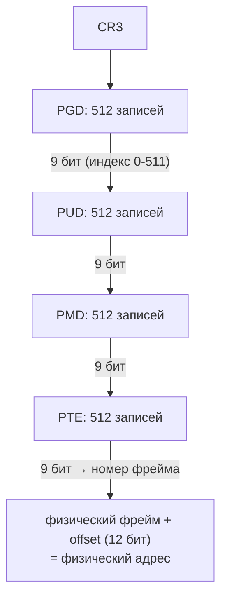

---
tags:
  - domain/linux
  - theme/memory
  - type/concept
aliases:
  - Address Translation
  - Page Table
order: 6.1
---

# Трансляция и изоляция

**Предпосылки:** [виртуальная память](virtual-memory.md) (три проблемы физической адресации, механизм целиком), [процессы](../processes.md) (task_struct, context switch), [иерархия памяти](../../../computer/data-path/memory-hierarchy.md) (cache line), [кольца привилегий](../cpu-modes-and-syscalls.md) (ring 0 / ring 3).

← [Виртуальная память](virtual-memory.md) | [TLB и стоимость трансляции](tlb.md) →

Два процесса используют виртуальный адрес `0x400000` и получают разные физические фреймы. Пока это магия: что-то транслирует, но не видно, как аппаратура решает, куда именно направить адрес одного процесса и такой же адрес другого. Можно предположить, что виртуальный адрес — это просто переименование физического через сдвиг относительно базы. Но тогда изоляция ломается: если каждому процессу выдают свою «базу», остаётся один непрерывный физический диапазон, и фрагментация возвращается. Значит, трансляция устроена иначе — и вопрос в том, как именно, чтобы два процесса могли использовать один и тот же виртуальный адрес без пересечения.

## Страницы: единица трансляции

Трансляция каждого байта по отдельности потребовала бы таблицу на 2^48 записей — это 2 ПБ только для одного процесса. Память делится на блоки одинакового размера: **страница** (page) — 4 КБ (2^12 байт) на x86-64. Виртуальная страница (virtual page) отображается на **фрейм** (page frame) — физический блок того же размера в RAM.

Виртуальный адрес разбивается на две части:

```text
48-битный виртуальный адрес:
|<--- номер страницы (36 бит) --->|<- смещение (12 бит) ->|
|       0x000000401                |       0x234           |
```

Номер страницы определяет, какой фрейм искать в page table. Смещение (offset) — позиция внутри страницы — переносится в физический адрес без изменений. 12 бит смещения — это 2^12 = 4096 возможных позиций, ровно размер страницы.

Почему именно 4 КБ? Это компромисс между двумя противоположными давлениями. Мелкие страницы (512 Б) уменьшают внутреннюю фрагментацию: процесс, которому нужно 5 КБ, тратит 10 страниц по 512 Б = 5 КБ без потерь. Но мелкие страницы порождают огромные page table (больше записей) и больше TLB-промахов (каждая запись TLB покрывает меньший диапазон). Крупные страницы (2 МБ, 1 ГБ — **huge pages**) резко уменьшают количество записей в page table и увеличивают TLB hit rate, но тратят память впустую на мелких аллокациях: процесс, запросивший 8 КБ, получит целую страницу в 2 МБ — 99.6% фрейма пропадёт. 4 КБ — баланс, принятый в x86 с 1985 года (Intel 80386) и сохранившийся по сей день. Внутренняя фрагментация при 4 КБ страницах — в среднем 2 КБ на последнюю страницу аллокации, что на фоне общего потребления незначительно.

Huge pages Linux поддерживает опционально: приложение само просит 2 МБ или 1 ГБ выравнивание через `madvise(MADV_HUGEPAGE)` или через transparent huge pages (THP — автоматическая склейка соседних 4 КБ страниц в одну 2 МБ ядром). Для баз данных с большим shared buffer'ом (PostgreSQL, MySQL) это снижает [[tlb#TLB: кеш трансляций|TLB]]-промахи на порядок — но об этом ниже, в заметке про стоимость трансляции.

## Page table: карта трансляций

**Page table** (таблица страниц) — структура данных в RAM, по одной на процесс. Каждая запись — PTE (Page Table Entry, запись таблицы страниц) — содержит номер физического фрейма и набор атрибутов.

Атрибуты PTE на x86-64 (каждая запись — 64 бита, из которых ~40 бит отведены под номер физического фрейма, а остальные — под флаги):

- **Present (P)** — страница находится в RAM. Если бит сброшен, обращение вызовет [[page-faults#Page fault: когда трансляция не удалась|page fault]].
- **Read/Write (R/W)** — разрешена ли запись. Бит, который делает возможным copy-on-write: ядро очищает его, чтобы перехватить первую запись через [[page-faults#Page fault: когда трансляция не удалась|page fault]].
- **User/Supervisor (U/S)** — доступна ли страница из user mode ([[../cpu-modes-and-syscalls#Кольца привилегий|ring 3]]). Страницы ядра имеют U/S=0, и процесс из ring 3 не может их прочитать.
- **Accessed (A)** — процессор устанавливает при любом обращении. Ядро периодически проверяет и сбрасывает этот бит, чтобы определить, какие страницы «горячие» (используются часто), а какие можно вытеснить.
- **Dirty (D)** — процессор устанавливает при записи. Если страницу нужно вытеснить из RAM, dirty-страницу придётся сначала записать на диск, а чистую можно просто отбросить.
- **NX (No Execute)** — запрет исполнения кода со страницы. Стек и куча помечены NX=1 — даже если атакующий записал shell-код в буфер на стеке, процессор откажется его исполнить. NX-бит появился в x86-64 (AMD назвал его NX — No Execute, Intel — XD — Execute Disable) и стал стандартной защитой от целого класса атак (stack-based buffer overflow).

Физический адрес PTE вычисляется по номеру виртуальной страницы: MMU использует его как индекс в таблице. Но плоская (одноуровневая) таблица для 48-битного адресного пространства заняла бы 2^36 записей × 8 байт = 512 ГБ на процесс. На сервере с 400 процессами это 200 ТБ — больше, чем вся физическая RAM на планете. При этом типичный процесс использует лишь крохотную долю из 128 ТБ user-space. Нужна структура, которая не тратит память на неиспользуемые диапазоны адресов.

## Многоуровневая page table

Решение — дерево с ленивыми ветками: корень фиксированного размера, а поддеревья создаются только под реально используемые диапазоны виртуального пространства. x86-64 использует четырёхуровневое дерево (с 2019 года Intel добавил пятый уровень для 57-битных адресов, но четыре уровня остаются стандартом). 36 бит номера виртуальной страницы разбиваются на четыре группы по 9 бит:

```text
48-битный виртуальный адрес:
|  PGD  |  PUD  |  PMD  |  PTE  | offset |
| 9 бит | 9 бит | 9 бит | 9 бит | 12 бит |
```

Каждая таблица на каждом уровне содержит 2^9 = 512 записей по 8 байт = 4096 байт — ровно одна страница (4 КБ). Это не совпадение: таблицы специально выровнены по размеру страницы, чтобы ядро могло выделять и освобождать их стандартным механизмом управления физическими фреймами.

Уровни дерева:

- **PGD** (Page Global Directory) — корень дерева. Одна таблица на процесс.
- **PUD** (Page Upper Directory) — второй уровень.
- **PMD** (Page Middle Directory) — третий уровень.
- **PTE** (Page Table Entry) — четвёртый уровень, содержит физический фрейм и атрибуты.



Ключевое свойство — ленивость. Таблицы нижних уровней выделяются только при необходимости. Если процесс использует 100 МБ виртуального пространства из 128 ТБ доступных user-space, подавляющее большинство записей PGD указывают «не существует» — и соответствующие PUD, PMD, PTE вообще не создаются. Типичный процесс с 100 МБ рабочей памяти расходует на page table порядка 200–300 КБ вместо 512 ГБ при плоской организации. Экономия — в шесть порядков.

Проследим трансляцию конкретного адреса. Процесс обращается к `0x00007F4A3B601234`. MMU извлекает 36 бит номера виртуальной страницы и разбивает их на четыре 9-битных индекса. Первые 9 бит — индекс в PGD: MMU берёт адрес корневой таблицы из регистра [[#MMU и регистр CR3|CR3]], прибавляет индекс × 8 байт и читает запись. Запись содержит физический адрес таблицы PUD. Вторые 9 бит — индекс в PUD: MMU обращается к PUD и получает адрес PMD. Третьи 9 бит — индекс в PMD → адрес таблицы PTE. Четвёртые 9 бит — индекс в PTE → номер физического фрейма. MMU конкатенирует номер фрейма с 12-битным смещением (0x234) и получает итоговый физический адрес. Четыре чтения из RAM — четыре потенциальных промаха кеша.

Цена многоуровневой организации — четыре последовательных обращения к RAM на каждую трансляцию, каждое по ~60–100 нс. Четыре уровня — 240–400 нс только на адресный перевод, прежде чем процессор доберётся до самих данных. Без кеширования это катастрофа: типичная программа выполняет сотни миллионов обращений к памяти в секунду, и тратить 400 нс на каждое из них — значит снизить реальную производительность процессора в десятки раз. Поэтому трансляции кешируются в специальном аппаратном буфере — [[tlb#TLB: кеш трансляций|TLB]], о котором разговор в отдельной заметке.

## MMU и регистр CR3

**MMU** (Memory Management Unit) — аппаратный блок внутри процессора, который выполняет трансляцию при каждом обращении к памяти. Каждая инструкция `mov`, `load`, `store`, каждая выборка следующей инструкции (instruction fetch) — всё проходит через MMU. Программа обращается к виртуальному адресу — MMU прозрачно подставляет физический. Для программы MMU невидим: она работает с виртуальными адресами и не знает, что за кулисами происходит трансляция. Единственный момент, когда MMU становится «видимым», — [[page-faults#Page fault: когда трансляция не удалась|page fault]]: процессор останавливает выполнение и передаёт управление ядру.

MMU узнаёт, где лежит page table текущего процесса, из регистра **CR3** (Control Register 3 — один из [управляющих регистров x86](../../../computer/programmer-model/isa.md), доступных только в ring 0). CR3 хранит физический адрес корневой таблицы PGD. Адрес физический, а не виртуальный — иначе возник бы порочный круг: чтобы транслировать адрес, нужна page table, а чтобы найти page table, нужно транслировать адрес.

При переключении контекста (context switch) — когда планировщик передаёт процессор другому процессу — ядро записывает в CR3 адрес PGD нового процесса. Одна запись в CR3 — и MMU начинает транслировать адреса по другой page table. Веб-сервер и агент метрик имеют разные PGD, поэтому одинаковый виртуальный адрес `0x400000` ведёт к разным физическим фреймам.

Запись в CR3 — привилегированная операция ([[../cpu-modes-and-syscalls#Кольца привилегий|ring 0]] — режим ядра; пользовательский процесс работает в ring 3 и лишён этого права). Пользовательский процесс не может подменить свою page table и получить доступ к чужой памяти. Это замыкает кольцо безопасности: виртуальная память изолирует процессы, page table определяет видимость, CR3 привязывает page table к процессу, а привилегированность CR3 не позволяет процессу выйти за рамки своей page table.

Запись в CR3 стоит несколько тактов — сама по себе дешёвая. Но у неё есть побочный эффект, который делает переключение контекста дорогим: все закешированные трансляции предыдущего процесса становятся невалидными. Почему именно это дорого и как процессоры с этим борются — в [[tlb#TLB: кеш трансляций|заметке про TLB]].

## Сценарий: два процесса, одинаковые адреса

Соединим всё вместе. Веб-сервер и агент метрик обращаются к `0x00400000` — стандартному базовому адресу Text-сегмента на Linux x86-64.

Когда выполняется веб-сервер, CR3 содержит физический адрес его PGD — назовём её `PGD_ws`. MMU делает page walk: `PGD_ws[индекс 0]` → физический адрес PUD веб-сервера → PMD → PTE → физический фрейм 0x7A1 (условно). К нему MMU прибавляет offset и читает данные из физической RAM.

Планировщик переключает CPU на агент метрик. Ядро в ring 0 записывает в CR3 физический адрес `PGD_agent`. Агент обращается к тому же виртуальному адресу `0x00400000`. MMU снова делает page walk, но теперь от другого корня: `PGD_agent[индекс 0]` → другой PUD → другой PMD → другой PTE → физический фрейм 0x9E2. Тот же самый виртуальный адрес `0x00400000`, совершенно разные физические фреймы.

Записи PGD, PUD, PMD у двух процессов указывают на разные поддеревья — они физически изолированы. Никакой ошибки в коде веб-сервера недостаточно, чтобы попасть в физический фрейм агента: у веб-сервера просто нет записей page table, которые бы туда вели. А чтобы подменить CR3 и переключиться на чужую page table, нужен ring 0 — а пользовательский процесс работает в ring 3.

Именно поэтому ядро и написано в ring 0: любой код, который выделяет фреймы, меняет PTE или пишет в CR3, должен быть защищён от произвольного изменения процессами. Если user-space мог бы писать в CR3, изоляция рухнула бы за одну инструкцию.

## Адресное пространство процесса

Page table и CR3 дают механизм: один виртуальный адрес у двух процессов → два разных фрейма. Но виртуальное пространство процесса не плоское и не равномерное. 128 ТБ user-space размечены на регионы с разными правами доступа и разным источником данных. Каждый регион описывается **VMA** (Virtual Memory Area) — структурой в ядре, хранящей диапазон виртуальных адресов, права (R/W/X), флаги (shared/private) и источник (файл, анонимная память, zero page). О VMA подробно — в [[page-faults#Page fault: когда трансляция не удалась|заметке про page fault]], где они становятся ключом к решению ядра «загружать с диска или из swap».

```text
Высокие адреса (0x7FFF...)
+---------------------+
|       Stack         |  растёт вниз, по умолчанию 8 МБ
|         |           |  R/W, NX
|         v           |
|                     |
|  (неиспользуемое    |
|   пространство)     |
|                     |
|         ^           |
|         |           |
|    mmap область     |  динамические библиотеки, mmap-файлы
|                     |  права зависят от отображения
+---------------------+
|         ^           |
|         |           |
|       Heap          |  растёт вверх (brk/mmap)
|                     |  R/W, NX
+---------------------+
|       BSS           |  неинициализированные глобальные переменные
|                     |  R/W, NX, заполнен нулями
+---------------------+
|       Data          |  инициализированные глобальные переменные
|                     |  R/W, NX
+---------------------+
|       Text          |  машинный код программы
|                     |  R, X (read + execute, no write)
+---------------------+
Низкие адреса (~0x400000)
```

**Text** (код) — машинные инструкции программы. Read-only и executable. Попытка записи в Text — page fault → SIGSEGV. Это защита от случайного повреждения кода и от целого класса атак: атакующий не может перезаписать инструкции программы, даже если нашёл уязвимость. Text-сегмент разделяется между всеми экземплярами программы через те же физические фреймы — пять процессов nginx используют одну копию кода в RAM.

**Data** — инициализированные глобальные переменные. `int counter = 42;` в C попадает сюда. Значения читаются из исполняемого файла при загрузке (одна страница при первом обращении, остальные — по требованию; механизм — в [[page-faults#Demand paging: ленивая загрузка|demand paging]]). Read/write, но NX (no execute) — исполнять данные как код нельзя.

**BSS** (Block Started by Symbol) — неинициализированные глобальные переменные. `int buffer[1000000];` без начального значения в C занимает 4 МБ виртуального пространства. Но в исполняемом файле на диске BSS не занимает места — ELF-файл хранит только размер секции, а не миллион нулей. При загрузке ядро создаёт VMA нужного размера. Все страницы BSS отображаются на одну физическую **zero page** — страницу, заполненную нулями и доступную только для чтения, общую для всех процессов. При первой записи в любую страницу BSS — CoW-fault → ядро выделяет новый фрейм, заполняет нулями, обновляет PTE. Программа видит нулевую инициализацию, но физическая память выделяется только под реально записанные страницы.

**Heap** (куча) — динамическая память, выделяемая через `malloc()` в C, `new` в C++, аллокаторы в других языках. Растёт вверх (к высоким адресам). Границу кучи двигают через системный вызов `brk()`, но большие аллокации (обычно > 128 КБ, порог зависит от аллокатора — glibc malloc использует 128 КБ по умолчанию) используют `mmap()` напрямую, создавая отдельный VMA в mmap-области. Это позволяет освободить память обратно ядру через `munmap()`, а не только двигать верхнюю границу кучи.

**mmap-область** — сюда отображаются динамические библиотеки (`.so`), файлы через `mmap()`, анонимные отображения для больших аллокаций. Расположена между кучей и стеком. Когда процесс загружает `libc.so`, [[../../infrastructure/elf-and-linking#Динамический линкер: ld-linux|динамический линкер]] (`ld-linux.so`) вызывает `mmap()` с флагами MAP_PRIVATE и PROT_READ|PROT_EXEC. Ядро создаёт VMA в mmap-области, указывающий на файл библиотеки на диске. Физические фреймы не выделяются — [[page-faults#Demand paging: ленивая загрузка|demand paging]] загрузит нужные страницы при первом обращении.

Несколько процессов, использующих одну библиотеку, разделяют одни и те же физические фреймы кода — один из главных способов экономии RAM. На типичном Linux-сервере libc загружена в сотни процессов, но в физической RAM её код занимает одну копию (~2 МБ). Без разделения каждый из 400 процессов хранил бы свой экземпляр — 800 МБ вместо 2 МБ.

**Stack** (стек) — локальные переменные, адреса возврата, аргументы функций. Растёт вниз (к низким адресам). Размер по умолчанию — 8 МБ (`ulimit -s` показывает текущий лимит). Стек тоже использует [[page-faults#Demand paging: ленивая загрузка|demand paging]]: ядро при создании процесса выделяет VMA на 8 МБ, но физические фреймы появляются по мере роста — первый вызов функции порождает fault на первую страницу стека, глубокая рекурсия — fault на следующие.

На нижней границе стека стоит **guard page** — специальная страница без прав доступа. Обращение к ней — SIGSEGV вместо молчаливого выхода за пределы стека в чужие VMA. Переполнение стека (stack overflow) — обращение за пределы выделенного региона — классическая причина SIGSEGV. Глубокая рекурсия без базового случая создаёт фреймы вызовов до тех пор, пока стек не дорастёт до guard page.

Промежуток между стеком и кучей — неиспользуемое виртуальное пространство. Обращение к адресу в этом промежутке — illegal access → SIGSEGV. Это пустота виртуального пространства, не подкреплённая ни одним VMA. 128 ТБ user-space настолько огромны, что столкновение стека и кучи на практике невозможно — между ними терабайты пустоты.

## Что дальше

MMU обходит четыре уровня page table, CR3 переключает корень дерева при context switch, регионы адресного пространства получают разные права через атрибуты PTE. Но вся схема работает только потому, что четыре чтения из RAM на каждое обращение не выполняются каждый раз. Где прячется разница между 400 наносекундами и одним тактом, что ломается при переключении контекста, и почему `munmap()` в одном потоке на многоядерной машине замедляет другие — разбирает [TLB](tlb.md).

## Sources

- Michael Kerrisk, 2010, *The Linux Programming Interface* — Chapter 49: Memory Mappings — https://man7.org/tlpi/
- Mel Gorman, 2004, *Understanding the Linux Virtual Memory Manager* — https://www.kernel.org/doc/gorman/
- Intel Corporation, 2024, *Intel 64 and IA-32 Architectures Software Developer's Manual* — Volume 3A: System Programming Guide, Chapter 4: Paging — https://www.intel.com/content/www/us/en/developer/articles/technical/intel-sdm.html

---

← [Виртуальная память](virtual-memory.md) | [TLB и стоимость трансляции](tlb.md) →
