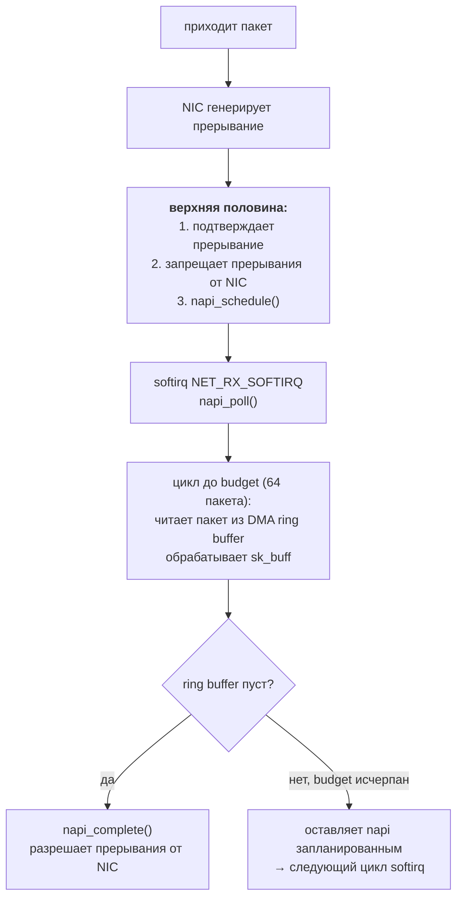
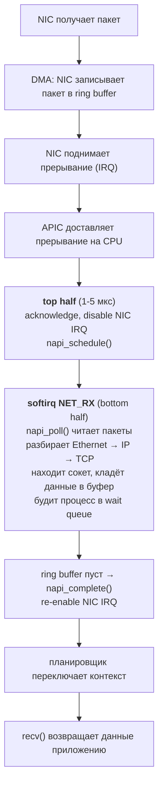

---
tags:
  - domain/linux
  - theme/internals
  - type/concept
aliases:
  - Interrupts
  - IRQ
  - ISR
order: 21
---

# Прерывания

**Предпосылки:** [механизм системных вызовов](syscall-internals.md) (вход в ядро, pt_regs), [шины и DMA](../../computer/data-path/buses-and-dma.md) (прерывания, DMA-передачи).

← [Механизм системных вызовов](syscall-internals.md) | [Устройства и драйверы](devices-and-drivers.md) →

Системный вызов — это программа просит ядро. Прерывание (interrupt) — это устройство просит процессор. Сетевая карта получила пакет, таймер отсчитал интервал, диск завершил DMA-передачу (DMA, Direct Memory Access) — каждое такое событие генерирует аппаратное прерывание. Процессор приостанавливает текущий код, сохраняет состояние и передаёт управление обработчику (interrupt handler, ISR — Interrupt Service Routine) в ядре.

Обработчик живёт в жёстких ограничениях: пока он выполняется, текущее прерывание на этом процессоре заблокировано. Обработчик не может спать, не может ждать мьютекс, не может вызывать `schedule()`. Если обработчик задержится на миллисекунду — это миллисекунда, в течение которой процессор не реагирует на новые события от этого устройства. Для сетевой карты, принимающей 10 000 пакетов в секунду, каждая лишняя микросекунда в обработчике означает потерянные пакеты.

## Путь прерывания через процессор

Когда устройство поднимает линию прерывания, контроллер прерываний (APIC — Advanced Programmable Interrupt Controller) доставляет сигнал конкретному ядру CPU. Процессор завершает текущую инструкцию, сохраняет регистры в стек и через таблицу прерываний (IDT — Interrupt Descriptor Table) находит адрес обработчика. Каждому прерыванию соответствует вектор — число от 0 до 255. Первые 32 вектора зарезервированы за исключениями процессора (page fault, division by zero), остальные доступны устройствам.

Ядро Linux оборачивает аппаратный вектор в структуру `irq_desc`, которая связывает номер прерывания с функцией-обработчиком, зарегистрированной драйвером через `request_irq()`. Драйвер сетевой карты при загрузке вызывает `request_irq(irq_num, my_handler, flags, "eth0", dev)` и с этого момента каждое прерывание от карты попадает в `my_handler`.

Посмотреть, сколько прерываний обработал каждый процессор, можно через `/proc/interrupts`:

```
           CPU0       CPU1       CPU2       CPU3
  1:          9          0          0          0   IR-IO-APIC   1-edge      i8042
 18:          0          0          0          0   IR-IO-APIC  18-fastedge  i801_smbus
 38:     128934     241087     193456     217632   PCI-MSI  524288-edge  eth0-TxRx-0
 39:     215678     134290     287143     198501   PCI-MSI  524289-edge  eth0-TxRx-1
```

Четыре строки для `eth0` — это четыре очереди сетевой карты (multi-queue NIC, Network Interface Card). Каждая очередь привязана к своему прерыванию и может обрабатываться отдельным ядром CPU, распределяя нагрузку.

## Проблема: долгий обработчик блокирует устройство

Сервер обрабатывает HTTP-трафик: 10 000 пакетов в секунду приходят на сетевую карту. Каждый пакет генерирует прерывание. Обработчик прерывания должен: прочитать статус устройства, скопировать метаданные пакета, выделить `sk_buff` (структура ядра для сетевого пакета), разобрать заголовки Ethernet/IP/TCP, найти соответствующий сокет, положить данные в буфер сокета, разбудить [процесс](../foundations/processes.md), ожидающий `read()`.

Если выполнить всё это в обработчике, каждый пакет занимает 10-50 мкс. При 10 000 пакетах в секунду — 100-500 мс чистого процессорного времени в секунду, и всё это время с запрещёнными прерываниями. Пока обработчик разбирает заголовки одного пакета, следующие пакеты копятся в аппаратном буфере карты. Буфер конечен — типичный размер 256-4096 дескрипторов. При задержке обработки буфер переполняется и карта начинает отбрасывать пакеты.

## Решение: верхняя и нижняя половины

Ядро Linux делит обработку прерывания на две части. Верхняя половина (top half) — код, который выполняется немедленно при срабатывании прерывания с запрещёнными прерываниями. Нижняя половина (bottom half) — отложенная работа, которая выполняется позже с разрешёнными прерываниями.

### Верхняя половина: минимум работы

Верхняя половина обработчика сетевой карты делает только три вещи: читает статусный регистр устройства, чтобы понять причину прерывания; подтверждает прерывание (acknowledge), записывая в регистр устройства — иначе контроллер будет генерировать его повторно; планирует нижнюю половину для основной работы. Всё это занимает 1-5 мкс.

Критерий разделения прост: если код может подождать — он уходит в нижнюю половину. В верхней остаётся только то, что нельзя отложить без потери данных или повторных прерываний.

### Нижняя половина: основная работа

После завершения верхней половины прерывания снова разрешены. Процессор может реагировать на новые события. Нижняя половина выполняется «при первой возможности» — обычно сразу после верхней, но уже в контексте, где прерывания не заблокированы и другие устройства могут прервать обработку.

Именно нижняя половина разбирает заголовки пакета, выделяет буферы, находит сокет и пробуждает [процесс](../foundations/processes.md). Эта работа занимает основное время (10-50 мкс на пакет), но теперь она не блокирует прерывания от других устройств.

## Три механизма нижней половины

Ядро предоставляет три механизма для отложенной обработки, каждый со своим набором ограничений. Выбор зависит от того, может ли код спать и насколько горячий путь он обслуживает.

### softirq: фиксированные обработчики для горячих путей

Программные прерывания (softirq) — самый быстрый механизм. В ядре определено фиксированное количество типов softirq, каждый для своей подсистемы:

```
Тип             Назначение
----------------------------------------------
HI_SOFTIRQ      высокоприоритетные tasklet'ы
TIMER_SOFTIRQ   таймеры ядра
NET_TX_SOFTIRQ  отправка сетевых пакетов
NET_RX_SOFTIRQ  приём сетевых пакетов
BLOCK_SOFTIRQ   блочный ввод-вывод
IRQ_POLL_SOFTIRQ IRQ polling
TASKLET_SOFTIRQ  tasklet'ы
SCHED_SOFTIRQ   балансировка планировщика
HRTIMER_SOFTIRQ  таймеры высокого разрешения
RCU_SOFTIRQ     Read-Copy-Update
```

Всего 10 типов, и новый тип можно добавить только изменением кода ядра. Это не API для драйверов — это инфраструктура для подсистем самого ядра.

Верхняя половина обработчика помечает нужный softirq как «ожидающий» вызовом `raise_softirq(NET_RX_SOFTIRQ)`. Ядро проверяет наличие ожидающих softirq в нескольких точках: при выходе из обработчика аппаратного прерывания, при возврате из системного вызова, в специальном потоке ядра `ksoftirqd`. В типичном случае softirq запускается сразу после верхней половины, практически без задержки.

Ключевое свойство: один и тот же тип softirq может выполняться одновременно на разных CPU. `NET_RX_SOFTIRQ` обрабатывает входящие пакеты на CPU 0 и CPU 1 параллельно. Это даёт максимальную производительность на многоядерных системах, но требует полной потокобезопасности обработчика: все структуры данных должны защищаться per-CPU переменными или lock-free алгоритмами.

Статистику обработки softirq по каждому CPU показывает `/proc/softirqs`. Значения `NET_RX` порядка миллионов на загруженном сервере — нормальная картина.

Softirq не может спать: он выполняется в прерывательном контексте (interrupt context), где нет привязки к конкретному процессу. Попытка вызвать `schedule()`, `mutex_lock()` или `kmalloc(GFP_KERNEL)` — ошибка ядра (BUG).

### tasklet: softirq для драйверов

Tasklet — механизм, построенный поверх softirq (`TASKLET_SOFTIRQ`), но с ослабленным требованием к потокобезопасности. Конкретный экземпляр tasklet'а гарантированно не выполняется на двух CPU одновременно. Разные tasklet'ы могут работать параллельно, но один и тот же — никогда.

Драйвер создаёт tasklet и связывает его с функцией обработки:

```c
void my_tasklet_handler(unsigned long data) {
    /* обработка данных от устройства */
    /* нельзя спать! */
}

DECLARE_TASKLET(my_tasklet, my_tasklet_handler, 0);

/* в верхней половине обработчика прерывания: */
tasklet_schedule(&my_tasklet);
```

Верхняя половина вызывает `tasklet_schedule()`, и при следующей проверке softirq ядро запустит `my_tasklet_handler`. Если tasklet уже запланирован, но ещё не выполнился, повторный `tasklet_schedule()` не создаст второго запуска — tasklet выполнится один раз.

Tasklet проще в написании: автору драйвера не нужно думать о параллельном выполнении одного обработчика на разных CPU. Цена — потенциально меньшая производительность, потому что обработка сериализуется. Для большинства драйверов это приемлемо: USB-контроллер или звуковая карта не генерируют миллион прерываний в секунду. Как и softirq, tasklet работает в прерывательном контексте и не может спать.

### workqueue: когда коду нужно спать

Рабочие очереди (workqueue) принципиально отличаются от softirq и tasklet'ов: работа выполняется в контексте обычного потока ядра (kernel thread). Это означает полноценный контекст процесса со стеком, возможностью спать, захватывать мьютексы, выделять память с `GFP_KERNEL` и выполнять блокирующий ввод-вывод.

```c
void my_work_handler(struct work_struct *work) {
    /* полноценный контекст процесса */
    void *buf = kmalloc(4096, GFP_KERNEL);  /* можно */
    mutex_lock(&my_mutex);                   /* можно */
    /* ... */
    mutex_unlock(&my_mutex);
    kfree(buf);
}

DECLARE_WORK(my_work, my_work_handler);

/* в верхней половине обработчика прерывания: */
schedule_work(&my_work);
```

Ядро поддерживает пул потоков `kworker` (видны в `ps aux`). Вызов `schedule_work()` помещает работу в очередь, и один из потоков `kworker` подхватывает её, когда получит CPU от планировщика. Задержка между `schedule_work()` и выполнением — типично 10-100 мкс, порядка одного-двух контекстных переключений.

Workqueue используется, когда обработка устройства требует операций, невозможных в прерывательном контексте. Например: обновление файловой системы на блочном устройстве (нужно захватить мьютекс inode), отправка данных через сокет (может блокироваться на TCP-буфере), взаимодействие с «медленным» оборудованием через I2C (шина с тактовой частотой 100-400 кГц, передача байта занимает 20-80 мкс).

### Выбор механизма

```
                 Может спать?   Параллельно на разных CPU?   Задержка запуска
softirq          нет            да (нужна thread-safety)     < 1 мкс
tasklet          нет            нет (сериализован)           < 1 мкс
workqueue        да             да                           10-100 мкс
```

Softirq — для подсистем ядра с экстремальной нагрузкой (сеть, блочный ввод-вывод). Tasklet — для драйверов, которым не нужна параллельность одного обработчика. Workqueue — для всего, что может заблокироваться.

## NAPI: прерывания не масштабируются

Вернёмся к серверу с 10 000 пакетами в секунду. Верхняя половина занимает 1-5 мкс, softirq-обработчик — 10-50 мкс на пакет. Суммарная нагрузка: 110-550 мс CPU в секунду. Работает.

Теперь нагрузка растёт. При 100 000 пакетов в секунду — 1.1-5.5 секунд CPU в секунду. Одно ядро уже перегружено. При 1 000 000 пакетов в секунду (10 Gbit Ethernet с мелкими пакетами по 64 байта выдаёт до 14.8 млн пакетов/сек) — каждый пакет генерирует прерывание, каждое прерывание сохраняет и восстанавливает регистры, ищет обработчик, вызывает верхнюю половину, планирует softirq. Одни только прерывания (без полезной обработки) съедают всё процессорное время.

Это состояние называется **livelock** — система жива (не зависла), но всё время уходит на обработку прерываний и ни один пакет не доходит до приложения. Процессор на 100% занят, сетевые счётчики показывают приём пакетов, но `recv()` в приложении не возвращает ни байта. Чем больше пакетов приходит — тем меньше из них обрабатывается до конца.

Корневая проблема — стоимость прерывания фиксирована (1-5 мкс на переключение контекста, сохранение регистров, вызов обработчика), а пакеты приходят непрерывным потоком. Overhead на прерывание не зависит от полезной работы, и при достаточном потоке overhead вытесняет полезную работу полностью.

### NAPI: переключение между прерываниями и поллингом

**NAPI (New API)** решает проблему адаптивным переключением между двумя режимами. При низкой нагрузке работают обычные прерывания — каждый пакет вызывает обработчик. Когда поток пакетов возрастает, NAPI переключается на поллинг (polling) — ядро само опрашивает устройство.

Механизм работает так:



После первого прерывания NIC замолкает — дальнейшие прерывания от неё запрещены. Ядро в цикле softirq читает пакеты напрямую из DMA ring buffer, куда карта складывает их через DMA без участия CPU. За один вызов `napi_poll()` обрабатывается до `budget` пакетов (budget — лимит на один вызов, по умолчанию 64, настраивается). Если в буфере остались пакеты — softirq запланирует ещё один вызов. Когда буфер опустеет — `napi_complete()` снова разрешает прерывания, и цикл начинается заново.

При 1 000 000 пакетов в секунду вместо миллиона прерываний происходит несколько тысяч — ровно столько, сколько нужно, чтобы «разбудить» поллинг. Остальные пакеты читаются пачками без прерываний. Стоимость обработки одного пакета падает с 1-5 мкс (прерывание + контекстное переключение) до ~100-200 нс (чтение из ring buffer в цикле).

### DMA ring buffer

Сетевая карта и ядро разделяют кольцевой буфер (ring buffer) в оперативной памяти. Карта через DMA записывает данные пакетов в буферы, а метаданные (длина, статус, адрес буфера) — в дескрипторы кольца. Ядро читает дескрипторы, обрабатывает пакеты и возвращает дескрипторы карте для повторного использования.

```
     NIC (DMA write)                   CPU (read)
          |                              |
          v                              v
   +----+----+----+----+----+----+----+----+
   | d0 | d1 | d2 | d3 | d4 | d5 | d6 | d7 |   <-- дескрипторы
   +----+----+----+----+----+----+----+----+
          ^                         ^
          |                         |
        tail                      head
     (NIC пишет сюда)         (CPU читает отсюда)
```

Типичный размер кольца — 256-4096 дескрипторов. При NAPI-поллинге CPU вычитывает дескрипторы от `head` к `tail`, не дожидаясь прерывания на каждый. Пока CPU обрабатывает одну пачку, NIC продолжает заполнять кольцо через DMA.

### Адаптивность к нагрузке

NAPI автоматически подстраивается под текущую нагрузку без какой-либо настройки. При низкой нагрузке (100 пакетов в секунду) каждый пакет вызывает прерывание, `napi_poll()` находит один пакет, вызывает `napi_complete()` и возвращает прерывания. Задержка (latency) минимальна — пакет обрабатывается сразу. При высокой нагрузке (1 000 000 пакетов в секунду) один вызов `napi_poll()` вычитывает 64 пакета за раз, следующий softirq — ещё 64. Прерывания приходят редко, overhead стремится к нулю. Между этими крайностями система плавно переходит из одного режима в другой.

### Параллель с io_uring SQPOLL

Та же идея — переключение от per-event notification к поллингу — реализована в `io_uring` через режим `SQPOLL`. Ядро выделяет поток, который непрерывно опрашивает submission queue вместо того, чтобы ждать системного вызова `io_uring_enter()` для каждой операции. При высокой нагрузке поток `SQPOLL` находит новые запросы в каждом цикле, overhead системного вызова равен нулю. При низкой нагрузке поток засыпает после таймаута простоя и пробуждается по следующему `io_uring_enter()`.

Общий принцип: при высокой частоте событий стоимость per-event notification (прерывание, системный вызов) доминирует, и поллинг оказывается эффективнее. При низкой частоте per-event notification экономит CPU, который иначе тратился бы на холостые опросы. Адаптивные схемы переключаются между режимами, получая лучшее от обоих.

## ksoftirqd: когда softirq занимает слишком много времени

Softirq может перепланировать сам себя: обработчик `NET_RX_SOFTIRQ`, не успев вычитать все пакеты за один `napi_poll()`, поднимает свой softirq снова. Если пакеты приходят быстрее, чем ядро их обрабатывает, softirq будет перезапускаться бесконечно, и пользовательские [процессы](../foundations/processes.md) не получат CPU.

Ядро ограничивает это: после обработки softirq проверяется, не превышено ли количество итераций (MAX_SOFTIRQ_RESTART = 10) или время обработки (2 мс). Если лимит исчерпан, а softirq всё ещё ожидает — ядро будит поток `ksoftirqd/N` (по одному на каждый CPU). Этот поток ядра выполняется с дефолтным приоритетом (SCHED_OTHER, nice 0) и обрабатывает оставшиеся softirq наравне с обычными [процессами](../foundations/processes.md) через [планировщик](../foundations/scheduler.md). Его задача — разгрузить interrupt context, чтобы другие прерывания могли обрабатываться, при этом не голодая самому.

Если `top` показывает `ksoftirqd` с заметной загрузкой — это признак того, что поток softirq не успевает завершиться за отведённые 10 итераций и работа перетекает в фоновый поток.

## Итог: от прерывания до приложения

Полный путь сетевого пакета через все механизмы, разобранные выше:



Прерывания обеспечивают реакцию ядра на внешние события. Разделение на верхнюю и нижнюю половины позволяет держать время с запрещёнными прерываниями в пределах единиц микросекунд. NAPI устраняет overhead прерываний при высокой нагрузке переключением на поллинг. Но все эти механизмы работают с конкретным устройством через его драйвер. Как ядро организует доступ к сотням разных устройств — от NVMe-дисков до USB-клавиатур — через единую модель драйверов, разберём далее.

## Sources

- Robert Love, 2010, *Linux Kernel Development* — Chapters 7-8: Interrupts and Bottom Halves: https://www.oreilly.com/library/view/linux-kernel-development/9780768696974/
- `cat /proc/interrupts`: https://man7.org/linux/man-pages/man5/proc.5.html
- `cat /proc/softirqs`: https://man7.org/linux/man-pages/man5/proc.5.html

---

← [Механизм системных вызовов](syscall-internals.md) | [Устройства и драйверы](devices-and-drivers.md) →
