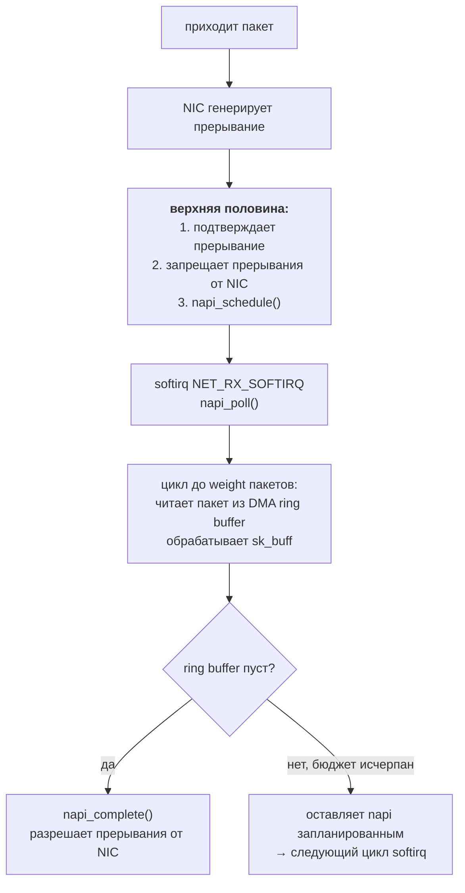
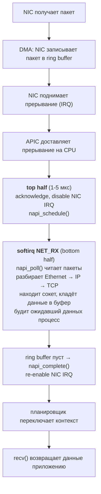

---
tags:
  - domain/linux
  - theme/internals
  - type/concept
aliases:
  - Interrupts
  - IRQ
  - ISR
order: 21
---

# Прерывания

**Предпосылки:** [[linux/kernel/syscall-internals|механизм системных вызовов]] (вход в ядро, pt_regs); [[computer/data-path/buses-and-dma|шины и DMA]] ([[computer/data-path/buses-and-dma#Прерывания: устройство зовёт процессор|прерывания]], [[computer/data-path/buses-and-dma#DMA: устройство пишет в память напрямую|DMA-передачи]]); [[linux/foundations/threads#Потоки ядра и потоки пользовательского пространства|потоки ядра]] (kworker, ksoftirqd); [[linux/concurrency/synchronization|синхронизация]] (мьютекс как блокирующий примитив).

← [[linux/kernel/syscall-internals|Механизм системных вызовов]] | [[linux/kernel/devices-and-drivers|Устройства и драйверы]] →

Ядро умеет отвечать на системный вызов: процесс сам инициирует переход и приносит с собой номер операции. Но кто сообщает ядру, что на сетевую карту пришёл пакет, что истёк таймер, что диск закончил [[computer/data-path/buses-and-dma#DMA: устройство пишет в память напрямую|DMA-передачу]]? Процесс, ожидающий `read()`, ничего об этих событиях не знает, а ядро не может опрашивать каждое устройство в цикле — оно занято другой работой.

Нужен обратный канал: устройство должно уметь [[computer/data-path/buses-and-dma#Прерывания: устройство зовёт процессор|прервать]] текущую работу процессора и позвать ядро. Процессор приостанавливает текущий код, сохраняет состояние и передаёт управление [[computer/data-path/buses-and-dma#Прерывания: устройство зовёт процессор|обработчику прерывания]] (ISR, Interrupt Service Routine).

Обработчик живёт в жёстких ограничениях: пока он выполняется, текущее прерывание на этом процессоре заблокировано. Обработчик не может спать, не может ждать мьютекс, не может вызывать `schedule()` — передачу управления планировщику, после которой текущая задача уступает CPU. Если обработчик задержится на миллисекунду — это миллисекунда, в течение которой процессор не реагирует на новые события от этого устройства. Для сетевой карты, принимающей 10 000 пакетов в секунду, каждая лишняя микросекунда в обработчике означает потерянные пакеты.

## Путь прерывания через процессор

Когда устройство поднимает линию [[computer/data-path/buses-and-dma#Прерывания: устройство зовёт процессор|прерывания]], контроллер прерываний (APIC — Advanced Programmable Interrupt Controller) доставляет сигнал конкретному ядру CPU. Строго говоря, APIC — это пара: IO-APIC собирает прерывания от шин и устройств, Local APIC на каждом ядре доставляет их процессору. В `/proc/interrupts` это видно по префиксу `IR-IO-APIC` для одних источников и `PCI-MSI` для других (MSI — Message Signaled Interrupts, когда устройство само пишет запрос в регистр APIC через шину).

Процессор завершает текущую инструкцию и через таблицу прерываний (IDT — Interrupt Descriptor Table) находит адрес [[computer/data-path/buses-and-dma#Прерывания: устройство зовёт процессор|обработчика]]. Каждому прерыванию соответствует вектор — число от 0 до 255. Первые 32 вектора заняты **исключениями процессора** (page fault, деление на ноль). Исключения — синхронные события от самого CPU, они не «приходят от устройства», но ядро обслуживает их через тот же механизм IDT, поэтому они и занимают первые векторы. Остальные векторы распределяются между устройствами.

### NMI: немаскируемые прерывания

Обработчик верхней половины запрещает прерывания на время своей работы — это защищает от повторного входа. Но некоторые ситуации настолько критичны, что ждать разрешения нельзя: аппаратная ошибка памяти, зависший CPU, переполнение счётчика производительности. Для них существует [[#NMI: немаскируемые прерывания|NMI]] (Non-Maskable Interrupt, немаскируемое прерывание) — вектор 2 в IDT. В отличие от обычных [[computer/data-path/buses-and-dma#Прерывания: устройство зовёт процессор|IRQ]], NMI игнорирует флаг IF в [[computer/cpu#Такт и регистры|регистре FLAGS]]: инструкция `cli` (запрет прерываний) на него не действует, и NMI доставляется всегда.

Типичные источники [[#NMI: немаскируемые прерывания|NMI]]:

- **PMU overflow** — счётчик производительности (Performance Monitoring Unit) переполнился; именно через этот механизм работают [[linux/infrastructure/tracing#perf record/report: сэмплирующий профилировщик|perf record]] и другие семплирующие профилировщики: ядро записывает текущий [[computer/cpu#Такт и регистры|RIP]] и стек вызовов при достижении порога.
- **[[#NMI: немаскируемые прерывания|NMI]]-watchdog** — ядерный watchdog (`/proc/sys/kernel/nmi_watchdog`) использует PMU-переполнение для обнаружения hung CPU: если ядро не обновляет счётчик за ожидаемое время, [[#NMI: немаскируемые прерывания|NMI]] фиксирует зависание.
- **Inter-processor NMI (IPI)** — одно ядро отправляет [[#NMI: немаскируемые прерывания|NMI]] другому через Local APIC, например чтобы сбросить зависший CPU при kernel panic.

Обработчик [[#NMI: немаскируемые прерывания|NMI]] в Linux (`do_nmi()`) должен быть повторно входимым: пока один [[#NMI: немаскируемые прерывания|NMI]] обрабатывается, может прийти следующий. Ядро обеспечивает это через IST (Interrupt Stack Table) — отдельный стек, выделенный специально для [[#NMI: немаскируемые прерывания|NMI]], чтобы вложенный [[#NMI: немаскируемые прерывания|NMI]] не повредил стековый фрейм предыдущего.

Аппаратура сохраняет часть контекста (IP, FLAGS, сегменты) на стек автоматически; остальные регистры общего назначения сохраняет ядерная входная заглушка, формируя [[linux/kernel/syscall-internals#pt_regs: снимок состояния процессора|pt_regs]] — тот же снимок состояния процессора, что и при syscall. Разница с системным вызовом в том, кто инициирует переход: прерывание приходит асинхронно и принудительно прерывает чей угодно код — процесс в user space, другой процесс в ядре или даже idle task.

Ядро Linux оборачивает аппаратный вектор в структуру `irq_desc`, которая связывает номер прерывания с функцией-обработчиком, зарегистрированной драйвером через `request_irq()`. Драйвер сетевой карты при загрузке вызывает `request_irq(irq_num, my_handler, flags, "eth0", dev)` и с этого момента каждое прерывание от карты попадает в `my_handler`.

Посмотреть, сколько прерываний обработал каждый процессор, можно через `/proc/interrupts`:

```
           CPU0       CPU1       CPU2       CPU3
  1:          9          0          0          0   IR-IO-APIC   1-edge      i8042
 18:          0          0          0          0   IR-IO-APIC  18-fastedge  i801_smbus
 38:     128934     241087     193456     217632   PCI-MSI  524288-edge  eth0-TxRx-0
 39:     215678     134290     287143     198501   PCI-MSI  524289-edge  eth0-TxRx-1
```

Четыре строки для `eth0` — это четыре очереди сетевой карты (multi-queue NIC, Network Interface Card). Каждая очередь привязана к своему прерыванию и может обрабатываться отдельным ядром CPU, распределяя нагрузку.

Маршрут работает, пока обработчик укладывается в единицы микросекунд. Посмотрим, что произойдёт, если нет.

## Проблема: долгий обработчик блокирует устройство

Сервер обрабатывает HTTP-трафик: 10 000 пакетов в секунду приходят на сетевую карту. Каждый пакет генерирует [[computer/data-path/buses-and-dma#Прерывания: устройство зовёт процессор|прерывание]]. [[computer/data-path/buses-and-dma#Прерывания: устройство зовёт процессор|Обработчик прерывания]] должен: прочитать статус устройства, скопировать метаданные пакета, выделить [[linux/kernel/network-stack#sk_buff: главная структура пакета|sk_buff]] (структура ядра для сетевого пакета), разобрать заголовки Ethernet/IP/TCP, найти соответствующий сокет, положить данные в [[linux/kernel/network-stack#Передача эстафеты: от softirq к процессу|буфер сокета]], разбудить [[linux/foundations/processes|процесс]], ожидающий `read()`.

Если выполнить всё это в обработчике, каждый пакет занимает 10-50 мкс. При 10 000 пакетах в секунду — 100-500 мс чистого процессорного времени в секунду, и всё это время с запрещёнными прерываниями. Пока обработчик разбирает заголовки одного пакета, следующие пакеты копятся в аппаратном буфере карты. Буфер конечен — типичный размер 256-4096 дескрипторов. При задержке обработки буфер переполняется и карта начинает отбрасывать пакеты.

## Решение: верхняя и нижняя половины

Ядро Linux делит обработку [[computer/data-path/buses-and-dma#Прерывания: устройство зовёт процессор|прерывания]] на две части. **Верхняя половина** (top half) выполняется немедленно при срабатывании прерывания, с запрещёнными прерываниями, в interrupt context — контексте без привязки к какому-либо процессу, где нет планировщика и нельзя заснуть. **Нижняя половина** (bottom half) — отложенная работа, которая выполняется позже, когда прерывания уже разрешены.

Противопоставление interrupt context / process context становится ключевым дальше: всё, что живёт в interrupt context, не может блокироваться, потому что блокировка подразумевает «усыпить текущую задачу», а усыпить можно только процесс или поток ядра. В interrupt context никакой задачи нет — прервали кого попало, и возврат должен идти по тому же стеку.

### Верхняя половина: минимум работы

Верхняя половина обработчика сетевой карты делает только три вещи: читает статусный регистр устройства, чтобы понять причину прерывания; подтверждает прерывание (acknowledge), записывая в регистр устройства — иначе контроллер будет генерировать его повторно; планирует нижнюю половину для основной работы. Всё это занимает 1-5 мкс.

Критерий разделения прост: если код может подождать — он уходит в нижнюю половину. В верхней остаётся только то, что нельзя отложить без потери данных или повторных прерываний.

### Нижняя половина: основная работа

После завершения верхней половины прерывания снова разрешены. Процессор может реагировать на новые события. Нижняя половина выполняется «при первой возможности» — обычно сразу после верхней, но уже в контексте, где прерывания не заблокированы и другие устройства могут прервать обработку.

Именно нижняя половина разбирает заголовки пакета, выделяет буферы, находит сокет и пробуждает [[linux/foundations/processes|процесс]]. Эта работа занимает основное время (10-50 мкс на пакет), но теперь она не блокирует прерывания от других устройств.

## Три механизма нижней половины

«Нижнюю половину» можно было бы реализовать одним механизмом, но у разных подсистем конфликтующие требования. Сетевой стек требует максимальной параллельности на многоядерных системах. Большинство драйверов в такой параллельности не нуждаются, зато хотят писать код, не думая о синхронизации. Некоторому коду (TCP-буферы, inode-мьютексы, медленные шины) вообще нужна возможность спать — а это уже не interrupt context.

Три ограничения — три механизма:

- **softirq** — нижняя половина остаётся в interrupt context и работает параллельно на всех CPU. Требование к коду: полная потокобезопасность через per-CPU или lock-free структуры.
- **tasklet** — построен поверх softirq и сериализует экземпляр: один и тот же tasklet не выполнится одновременно на двух CPU. Цена за упрощение — меньшая параллельность.
- **workqueue** — работает в kernel thread, а не в interrupt context, и может спать. Цена — задержка на контекстное переключение.

### softirq: параллельно, lock-free, без права спать

Сетевой стек принимает пакеты на всех ядрах одновременно. Если нижнюю половину сериализовать, одно ядро станет бутылочным горлышком задолго до насыщения канала. Значит, механизм обязан масштабироваться на все CPU — и именно это предоставляет softirq.

Программные прерывания (softirq) — название историческое: аппаратного прерывания здесь нет, просто ядро в определённых точках проверяет очередь отложенной работы. В ядре определено фиксированное количество типов softirq, каждый для своей подсистемы:

```
Тип             Назначение
----------------------------------------------
HI_SOFTIRQ      высокоприоритетные tasklet'ы
TIMER_SOFTIRQ   таймеры ядра
NET_TX_SOFTIRQ  отправка сетевых пакетов
NET_RX_SOFTIRQ  приём сетевых пакетов
BLOCK_SOFTIRQ   блочный ввод-вывод
IRQ_POLL_SOFTIRQ IRQ polling
TASKLET_SOFTIRQ  tasklet'ы
SCHED_SOFTIRQ   балансировка планировщика
HRTIMER_SOFTIRQ  таймеры высокого разрешения
RCU_SOFTIRQ     Read-Copy-Update
```

Всего 10 типов, и новый тип можно добавить только изменением кода ядра. Это не API для драйверов — это инфраструктура для подсистем самого ядра.

Верхняя половина обработчика помечает нужный softirq как «ожидающий» вызовом `raise_softirq(NET_RX_SOFTIRQ)`. Ядро проверяет наличие ожидающих softirq в нескольких точках: при выходе из [[computer/data-path/buses-and-dma#Прерывания: устройство зовёт процессор|обработчика аппаратного прерывания]], при возврате из системного вызова, в специальном потоке ядра `ksoftirqd`. В типичном случае softirq запускается сразу после верхней половины, практически без задержки.

Ключевое свойство: один и тот же тип softirq может выполняться одновременно на разных CPU. `NET_RX_SOFTIRQ` обрабатывает входящие пакеты на CPU 0 и CPU 1 параллельно. Это даёт максимальную производительность, но требует полной потокобезопасности обработчика: все структуры данных должны защищаться per-CPU переменными или lock-free алгоритмами.

Статистику обработки softirq по каждому CPU показывает `/proc/softirqs`. Значения `NET_RX` порядка миллионов на загруженном сервере — нормальная картина. Резкий перекос между CPU обычно означает неверно настроенный RSS: все очереди карты упираются в одно ядро.

Softirq не может спать: он выполняется в interrupt context, где нет привязки к конкретному процессу. Попытка вызвать `schedule()`, `mutex_lock()` или `kmalloc(GFP_KERNEL)` (флаг, разрешающий ядру заснуть в ожидании свободной памяти) — ошибка ядра (BUG).

### tasklet: lock-free больно, параллельность необязательна

USB-контроллер или звуковая карта не генерируют миллион прерываний в секунду — им не нужна параллельная обработка одного и того же обработчика на разных CPU. Зато им очень нужно, чтобы автор драйвера не думал о per-CPU структурах и lock-free алгоритмах. Из этого компромисса вырос tasklet.

Tasklet — механизм, построенный поверх softirq (`TASKLET_SOFTIRQ`). Конкретный экземпляр tasklet'а гарантированно не выполняется на двух CPU одновременно: если его пытаются запустить на втором CPU, пока он уже работает на первом, второй запуск откладывается. Разные tasklet'ы могут работать параллельно, но один и тот же — никогда.

> [!warning] tasklet устарел
> Начиная с ядра ~5.9 (2020) tasklet официально помечен как устаревший API: новый код рекомендуется писать на threaded IRQ (через `request_threaded_irq()`) или workqueue. Существующий код постепенно переводят. Знать tasklet полезно для чтения драйверов, но для нового кода выбирайте один из двух актуальных механизмов. Тогда же API инициализации изменился: `DECLARE_TASKLET` стал двухаргументным (старый трёхаргументный переименован в `DECLARE_TASKLET_OLD`), а callback теперь принимает `struct tasklet_struct *t` вместо `unsigned long data`. Инициализация во время выполнения — через `tasklet_setup()`.

```c
/* современная сигнатура (kernel >= 5.9) */
void my_tasklet_handler(struct tasklet_struct *t)
{
    /* обработка данных от устройства */
    /* нельзя спать! */
}

DECLARE_TASKLET(my_tasklet, my_tasklet_handler);

/* в верхней половине обработчика прерывания: */
tasklet_schedule(&my_tasklet);
```

Верхняя половина вызывает `tasklet_schedule()`, и при следующей проверке softirq ядро запустит `my_tasklet_handler`. Если tasklet уже запланирован, но ещё не выполнился, повторный `tasklet_schedule()` не создаст второго запуска — tasklet выполнится один раз.

Как и softirq, tasklet работает в interrupt context и не может спать.

### workqueue: когда коду нужно спать

И softirq, и tasklet живут в interrupt context. Для обработчика, которому нужно захватить [[linux/concurrency/synchronization#Мьютекс|мьютекс]] inode файловой системы, подождать TCP-буфер или пообщаться с медленной шиной — это приговор. Такому коду нужен полноценный контекст процесса, и его даёт workqueue.

Рабочие очереди (workqueue) принципиально отличаются от softirq и tasklet'ов: работа выполняется в контексте обычного потока ядра (kernel thread). Это означает полный стек, возможность спать, захватывать мьютексы, выделять память с [[linux/kernel/memory-management#Зоны, ватерлайны и GFP-флаги|GFP_KERNEL]] и выполнять блокирующий ввод-вывод.

```c
void my_work_handler(struct work_struct *work) {
    /* полноценный контекст процесса */
    void *buf = kmalloc(4096, GFP_KERNEL);   /* можно — спим, если памяти нет */
    mutex_lock(&my_mutex);                    /* можно — спим в ожидании */
    /* ... */
    mutex_unlock(&my_mutex);
    kfree(buf);
}

DECLARE_WORK(my_work, my_work_handler);

/* в верхней половине обработчика прерывания: */
schedule_work(&my_work);
```

Ядро поддерживает пул потоков `kworker` (видны в `ps aux`). Вызов `schedule_work()` помещает работу в очередь, и один из потоков `kworker` подхватывает её, когда получит CPU от планировщика. Задержка между `schedule_work()` и выполнением — типично 10-100 мкс, порядка одного-двух контекстных переключений.

Workqueue используется, когда обработка устройства требует операций, невозможных в interrupt context. Например: обновление файловой системы на блочном устройстве (нужно захватить мьютекс inode), отправка данных через сокет (может блокироваться на TCP-буфере), взаимодействие с «медленным» оборудованием через I2C (шина с тактовой частотой 100-400 кГц, передача байта занимает 20-100 мкс).

### Выбор механизма

```
                 Может спать?   Параллельно на разных CPU?   Задержка запуска
softirq          нет            да (нужна thread-safety)     < 1 мкс
tasklet          нет            нет (сериализован)           < 1 мкс
workqueue        да             да                           10-100 мкс
```

Softirq — для подсистем ядра с экстремальной нагрузкой (сеть, блочный ввод-вывод). Tasklet — для драйверов, которым не нужна параллельность одного обработчика (но новый код — через threaded IRQ или workqueue). Workqueue — для всего, что может заблокироваться.

## NAPI: прерывания не масштабируются

Вернёмся к серверу с 10 000 пакетами в секунду. Верхняя половина занимает 1-5 мкс, softirq-обработчик — 10-50 мкс на пакет. Суммарная нагрузка: 110-550 мс CPU в секунду. Работает.

Теперь нагрузка растёт. При 100 000 пакетов в секунду — 1.1-5.5 секунд CPU в секунду. Одно ядро уже перегружено. При 1 000 000 пакетов в секунду (10 Gbit Ethernet с мелкими пакетами по 64 байта выдаёт до 14.8 млн пакетов/сек) — каждый пакет генерирует [[computer/data-path/buses-and-dma#Прерывания: устройство зовёт процессор|прерывание]], каждое прерывание сохраняет и восстанавливает регистры, ищет [[computer/data-path/buses-and-dma#Прерывания: устройство зовёт процессор|обработчик]], вызывает верхнюю половину, планирует softirq. Одни только прерывания (без полезной обработки) съедают всё процессорное время.

Это состояние называется **livelock** — система жива (не зависла), но всё время уходит на обработку прерываний и ни один пакет не доходит до приложения. Процессор на 100% занят, сетевые счётчики показывают приём пакетов, но `recv()` в приложении не возвращает ни байта. Чем больше пакетов приходит — тем меньше из них обрабатывается до конца.

Корневая проблема — стоимость прерывания фиксирована (1-5 мкс на переключение контекста, сохранение регистров, вызов обработчика), а пакеты приходят непрерывным потоком. Overhead на прерывание не зависит от полезной работы, и при достаточном потоке overhead вытесняет полезную работу полностью.

### NAPI: переключение между прерываниями и поллингом

**NAPI (New API)** решает проблему адаптивным переключением между двумя режимами. При низкой нагрузке работают обычные прерывания — каждый пакет вызывает обработчик. Когда поток пакетов возрастает, NAPI переключается на поллинг (polling) — ядро само опрашивает устройство.

Механизм работает так:



После первого прерывания NIC замолкает — дальнейшие прерывания от неё запрещены. Выключение прерываний на NIC делает сам драйвер, записью в регистр маски устройства; вызов `napi_schedule()` лишь планирует softirq. Ядро в цикле softirq читает пакеты напрямую из [[linux/kernel/network-stack#NIC, DMA и кольцевой буфер|DMA ring buffer]] — общей с картой области в RAM, куда NIC складывает входящие пакеты и метаданные через DMA без участия CPU. Ring buffer — кольцевая очередь: NIC публикует новые дескрипторы, CPU забирает готовые, оба указателя движутся по кругу. Карта и CPU работают с одним и тем же кольцом параллельно, и пока CPU обрабатывает одну пачку, NIC продолжает заполнять следующие слоты.

За один вызов `napi_poll()` обрабатывается до **NAPI weight** пакетов (лимит на одно устройство, по умолчанию `NAPI_POLL_WEIGHT` = 64; если драйверу нужен другой лимит, он регистрируется через `netif_napi_add_weight()`). Отдельно существует **`net.core.netdev_budget`** (по умолчанию 300) — суммарный лимит на один прогон `NET_RX_SOFTIRQ` по всем NAPI-источникам на данном CPU. Если в буфере остались пакеты, а лимит исчерпан — softirq запланирует ещё один вызов. Когда буфер опустеет, `napi_complete()` снова разрешает прерывания, и цикл начинается заново.

При 1 000 000 пакетов в секунду вместо миллиона прерываний происходит несколько тысяч — ровно столько, сколько нужно, чтобы «разбудить» поллинг. Остальные пакеты читаются пачками без прерываний. Стоимость обработки одного пакета падает с 1-5 мкс (прерывание + контекстное переключение) до ~100-200 нс (чтение из ring buffer в цикле).

### Адаптивность к нагрузке

NAPI автоматически подстраивается под текущую нагрузку без какой-либо настройки. При низкой нагрузке (100 пакетов в секунду) каждый пакет вызывает прерывание, `napi_poll()` находит один пакет, вызывает `napi_complete()` и возвращает прерывания. Задержка (latency) минимальна — пакет обрабатывается сразу. При высокой нагрузке (1 000 000 пакетов в секунду) один вызов `napi_poll()` вычитывает целую пачку, следующий softirq — ещё одну. Прерывания приходят редко, overhead стремится к нулю. Между этими крайностями система плавно переходит из одного режима в другой.

> [!info]- Та же идея в io_uring SQPOLL
> Переключение от per-event notification к поллингу реализовано в `io_uring` через режим [[linux/programming/io-multiplexing#SQPOLL: нулевые системные вызовы|SQPOLL]]. Ядро выделяет поток, который непрерывно опрашивает submission queue вместо того, чтобы ждать системного вызова `io_uring_enter()` для каждой операции. При высокой нагрузке поток SQPOLL находит новые запросы в каждом цикле, overhead системного вызова равен нулю. При низкой нагрузке поток засыпает после таймаута простоя и пробуждается по следующему `io_uring_enter()`.
>
> Общий принцип: при высокой частоте событий стоимость per-event notification (прерывание, системный вызов) доминирует, и поллинг оказывается эффективнее. При низкой частоте per-event notification экономит CPU, который иначе тратился бы на холостые опросы. Адаптивные схемы переключаются между режимами, получая лучшее от обоих.

## ksoftirqd: предохранитель от голодания

NAPI снял overhead отдельных [[computer/data-path/buses-and-dma#Прерывания: устройство зовёт процессор|прерываний]], но softirq по-прежнему живёт в interrupt context. Если поток пакетов устойчиво высок, `NET_RX_SOFTIRQ` раз за разом перепланирует сам себя: не успел вычитать всё за один `napi_poll()` — поднял свой softirq снова. Никакой планировщик в этом контексте не работает, и пользовательские процессы CPU не получат вовсе.

Чтобы этого не случилось, после обработки softirq ядро проверяет условия выхода: превышено ли количество итераций (`MAX_SOFTIRQ_RESTART = 10`), суммарное время 2 мс или планировщик просит уступить CPU (`need_resched()`). Если любое сработало, а softirq всё ещё ожидает — ядро будит поток ядра `ksoftirqd/N` (по одному на каждый CPU). Этот поток выполняется с дефолтным приоритетом и обрабатывает оставшиеся softirq наравне с обычными [[linux/foundations/processes|процессами]] через [[linux/foundations/scheduler|планировщик]]. Interrupt context разгружается — прерывания от других устройств снова могут обрабатываться, — а softirq доживает в нормальном потоке, не вытесняя всех подряд.

Если `top` показывает `ksoftirqd` с заметной загрузкой — это признак того, что softirq не успевает завершиться за отведённые 10 итераций и работа перетекает в фоновый поток.

## Итог: от прерывания до приложения

Полный путь сетевого пакета через все механизмы, разобранные выше:



[[computer/data-path/buses-and-dma#Прерывания: устройство зовёт процессор|Прерывания]] обеспечивают реакцию ядра на внешние события. Разделение на верхнюю и нижнюю половины держит время с запрещёнными прерываниями в единицах микросекунд; softirq используется горячими подсистемами вроде сети, tasklet и workqueue — остальными драйверами, когда параллельность или возможность спать важнее нулевой задержки. NAPI устраняет overhead прерываний при высокой нагрузке переключением на поллинг, а `ksoftirqd` работает предохранителем, чтобы затянувшаяся обработка softirq не голодала пользовательским процессам. Но все эти механизмы работают с конкретным устройством через его драйвер. Как ядро организует доступ к сотням разных устройств — от NVMe-дисков до USB-клавиатур — через единую модель драйверов, разберём далее.

## Наблюдаемость

- `/proc/interrupts` — сколько прерываний обработал каждый CPU, по каждому вектору; перекос обычно означает, что прерывания не распределены по ядрам через `smp_affinity`.
- `/proc/softirqs` — та же разбивка для softirq; перекос `NET_RX` по CPU — признак misaligned RSS (очереди карты уходят в одно ядро).
- `ethtool -S eth0` — статистика драйвера, включая `rx_dropped` и счётчики переполнения кольца.
- `ethtool -g eth0` — текущий и максимальный размер ring buffer; `ethtool -G eth0 rx 4096` — увеличить кольцо.
- `ethtool -c eth0` — параметры interrupt coalescing (сколько пакетов или микросекунд NIC ждёт перед прерыванием).

## Sources

- Robert Love, 2010, *Linux Kernel Development* — Chapters 7-8: Interrupts and Bottom Halves: https://www.oreilly.com/library/view/linux-kernel-development/9780768696974/
- NAPI: https://docs.kernel.org/networking/napi.html
- Jamie Mogul and K. K. Ramakrishnan, 1996, *Eliminating Receive Livelock in an Interrupt-Driven Kernel*: https://www.usenix.org/conference/usenix-1996-annual-technical-conference/eliminating-receive-livelock-interrupt-driven
- `cat /proc/interrupts`: https://man7.org/linux/man-pages/man5/proc.5.html
- `cat /proc/softirqs`: https://man7.org/linux/man-pages/man5/proc.5.html

---

← [[linux/kernel/syscall-internals|Механизм системных вызовов]] | [[linux/kernel/devices-and-drivers|Устройства и драйверы]] →
