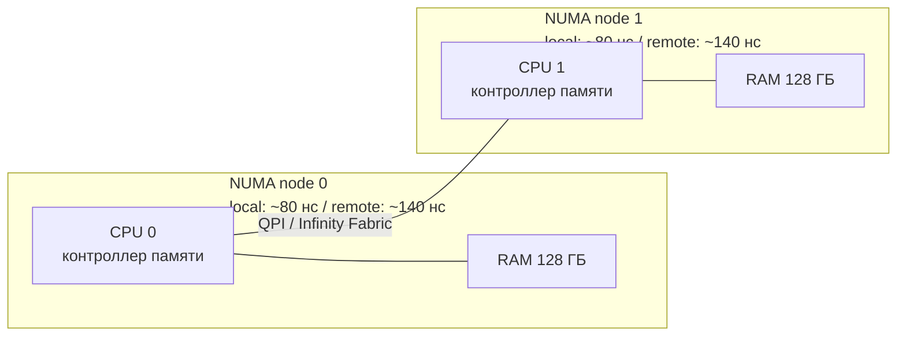

---
tags:
  - domain/linux
  - theme/memory
  - type/concept
aliases:
  - Memory Management
order: 18
---

# Управление памятью

> [!info]- Предпосылки
> [виртуальная память](../foundations/virtual-memory.md) (страницы, TLB, page fault, overcommit, OOM killer), [отображение памяти](memory-mapping.md) (mmap, MAP_ANONYMOUS, madvise), [оперативная память](../../computer/data-path/ram.md) (NUMA).

← [Мультиплексирование ввода-вывода](io-multiplexing.md) | [Межпроцессное взаимодействие](ipc.md) →

epoll и io_uring позволяют одному потоку обслуживать тысячи соединений. Но каждое соединение требует буферов, каждый буфер — физической памяти. Сервер с 10 000 соединений и буферным пулом базы данных на 128 ГБ упирается в следующий вопрос: как ядро распределяет физическую память, что происходит, когда она заканчивается, и почему размер страницы определяет производительность.

`malloc()` возвращает указатель — но за ним нет физической памяти, пока программа не запишет по этому адресу данные. Между обещанием виртуального адреса и реальным физическим фреймом лежит несколько механизмов ядра, каждый из которых решает конкретную проблему. Адресное пространство процесса значительно больше физической RAM — ядро выделяет фреймы по требованию и вынужденно отбирает их, когда память заканчивается. Для процессов с огромным рабочим набором критичен ещё один параметр — размер страницы: чем она больше, тем меньше записей в таблице трансляции и тем реже процессор обращается к медленным таблицам страниц в RAM.

Конкретные механизмы: `malloc(1 ГБ)` создаёт VMA (Virtual Memory Area — область виртуальной памяти, описанную структурой `vm_area_struct`), но ни одна PTE (Page Table Entry — запись таблицы страниц) не заполняется — фреймы материализуются при первом обращении через page fault (demand paging). Overcommit разрешает процессам запросить больше памяти, чем есть физически, — и это работает, пока не все пишут одновременно. Когда физических фреймов не остаётся — OOM (Out Of Memory) killer убивает процесс, чтобы освободить память. А для крупных буферных пулов размер страницы определяет количество промахов TLB (Translation Lookaside Buffer — кеш трансляции адресов): huge pages (2 МБ вместо 4 КБ) сокращают их в сотни раз.

Сервер базы данных с буферным пулом 128 ГБ соприкасается со всеми этими механизмами одновременно: TLB-промахи при доступе к буферному пулу, overcommit при запуске нескольких экземпляров, OOM kill при исчерпании RAM, NUMA-штрафы (NUMA — Non-Uniform Memory Access, неоднородный доступ к памяти) при доступе к памяти удалённого узла.

## TLB как узкое место: 128 ГБ буферного пула

PostgreSQL при запуске выделяет shared_buffers — область разделяемой памяти для кеширования страниц данных. Допустим, shared_buffers = 128 ГБ на сервере с 256 ГБ RAM. При стандартных 4 КБ страницах это 128 ГБ / 4 КБ = 33 554 432 страницы — 32 миллиона записей в page table.

[TLB](../foundations/virtual-memory.md) типичного серверного процессора (Intel Xeon, AMD EPYC) хранит порядка 1000–1500 записей для 4 КБ страниц (64 в L1 DTLB (Data TLB) + 1536 в L2 TLB). Каждая запись покрывает 4 КБ — суммарное покрытие TLB составляет ~6 МБ. Из 128 ГБ буферного пула TLB одновременно покрывает 6 МБ / 128 ГБ = 0.000046, то есть 0.0046%. Оставшиеся 99.995% обращений к буферному пулу приводят к TLB miss.

Каждый TLB miss запускает page walk — обход четырёх уровней page table (PGD (Page Global Directory) -> PUD (Page Upper Directory) -> PMD (Page Middle Directory) -> PTE). В лучшем случае промежуточные таблицы лежат в L2 кеше, и page walk обходится в 10–20 нс. В худшем — таблицы вытеснены из кеша, и каждый уровень требует обращения к RAM: 4 x 60–100 нс = 240–400 нс. Для базы данных с рандомным паттерном доступа (индексный поиск, hash join) промежуточные таблицы редко попадают в кеш — типичный page walk стоит 30–50 нс.

При 100 миллионах обращений к памяти в секунду (нормальная нагрузка для активного запроса к буферному пулу) и 50 нс на page walk потеря составляет 100M x 50 нс = 5 секунд из каждых 10 секунд. Процессор проводит больше половины времени в page walk вместо полезной работы. `perf stat` покажет это как высокое значение `dTLB-load-misses` и `dtlb_load_misses.walk_completed`.

## Huge pages: 2 МБ вместо 4 КБ

x86-64 поддерживает страницы трёх размеров: 4 КБ (стандартная), 2 МБ (huge page) и 1 ГБ (gigantic page). Huge page на 2 МБ использует тот же четырёхуровневый механизм трансляции, но останавливается на уровне PMD: запись PMD содержит не указатель на таблицу PTE, а непосредственно номер физического фрейма размером 2 МБ. Бит PS (Page Size) в PMD-записи сообщает MMU (Memory Management Unit — блок управления памятью в процессоре): «дальше не ходи, фрейм найден».

```text
4 КБ страница:                   2 МБ huge page:
PGD -> PUD -> PMD -> PTE -> фрейм    PGD -> PUD -> PMD -> фрейм (2 МБ)
       4 уровня обхода                      3 уровня обхода
```

Для буферного пула 128 ГБ с huge pages на 2 МБ: 128 ГБ / 2 МБ = 65 536 страниц вместо 32 миллионов. L1 DTLB обычно содержит отдельные записи для huge pages — типично 32 на Skylake. L2 STLB (Second-Level TLB) — общий для 4 КБ и 2 МБ страниц: 1536 записей на Skylake, 1024 на Haswell (конкретное число зависит от модели процессора). Если все записи L2 STLB отданы под 2 МБ страницы: 1536 x 2 МБ = 3 ГБ покрытия; на практике часть записей занята 4 КБ страницами, и реальное покрытие — порядка 1–2 ГБ. Даже 1 ГБ покрытия — это 1 ГБ / 128 ГБ = 0.8% буферного пула, что в 170 раз больше, чем 0.0046% при 4 КБ страницах.

На практике эффект ещё сильнее: горячие страницы базы данных (корневые узлы B-tree индексов, часто читаемые таблицы) составляют 5–20% буферного пула, и 1–2 ГБ TLB покрытия хватает для значительной доли горячих данных. TLB miss rate падает с 99.99% до 10–30%, и `perf` подтверждает это снижением `dTLB-load-misses` на один-два порядка.

### Резервирование huge pages

Huge pages нельзя выделить из произвольной физической памяти — нужен непрерывный блок в 2 МБ (512 подряд идущих 4 КБ фреймов). После длительной работы системы физическая память фрагментирована: свободные фреймы разбросаны между занятыми. Найти 512 подряд идущих свободных фреймов становится невозможно.

Поэтому huge pages резервируют заранее, при загрузке системы, пока RAM ещё не фрагментирована.

```bash
# Зарезервировать 65536 huge pages по 2 МБ = 128 ГБ
echo 65536 > /proc/sys/vm/nr_hugepages

# Проверить результат
grep HugePages /proc/meminfo
# HugePages_Total:   65536
# HugePages_Free:    65536
# HugePages_Rsvd:        0
# HugePages_Surp:        0
# Hugepagesize:       2048 kB
```

`HugePages_Total` — зарезервированные страницы. `HugePages_Free` — ещё не занятые процессами. `HugePages_Rsvd` — зарезервированные, но не использованные (процесс вызвал mmap, но ещё не обратился). Зарезервированная память изымается из общего пула — она недоступна для обычных 4 КБ аллокаций. Если зарезервировать 128 ГБ huge pages на сервере с 256 ГБ RAM, для всего остального останется 128 ГБ.

Для сохранения настройки между перезагрузками — параметр ядра: `hugepages=65536` в GRUB (GRand Unified Bootloader) или `vm.nr_hugepages=65536` в `/etc/sysctl.conf`.

### Использование huge pages из приложений

Приложение запрашивает huge pages через `mmap` с флагом `MAP_HUGETLB`:

```c
void *buf = mmap(NULL, 128UL * 1024 * 1024 * 1024,
                 PROT_READ | PROT_WRITE,
                 MAP_PRIVATE | MAP_ANONYMOUS | MAP_HUGETLB,
                 -1, 0);
```

Либо через файловую систему hugetlbfs:

```bash
mount -t hugetlbfs none /dev/hugepages
```

Процесс открывает файл на этой файловой системе и вызывает `mmap` — каждая страница автоматически будет 2 МБ.

PostgreSQL поддерживает huge pages через параметр `huge_pages`:

```
# postgresql.conf
huge_pages = on          # требовать huge pages, не стартовать без них
shared_buffers = 128GB
```

При `huge_pages = on` PostgreSQL вызывает `mmap` с `MAP_HUGETLB` для shared_buffers. Если зарезервированных huge pages не хватает — PostgreSQL откажется запускаться с ошибкой `could not map anonymous shared memory: Cannot allocate memory`. При `huge_pages = try` (по умолчанию) — откатится на обычные 4 КБ страницы.

Статические huge pages решают проблему TLB, но требуют ручного расчёта и резервирования при загрузке. Если администратор не подготовил их заранее или изменил размер буферного пула, приложение работает на обычных 4 КБ страницах. Ядро предлагает автоматическую альтернативу.

## Transparent Huge Pages: автоматическое укрупнение

Резервирование huge pages требует ручной настройки: администратор должен рассчитать количество страниц, зарезервировать их до фрагментации RAM, перезапустить приложение. Transparent Huge Pages (THP, прозрачные огромные страницы) пытается автоматизировать этот процесс — ядро само укрупняет 4 КБ страницы в 2 МБ без участия приложения.

Механизм работает в два этапа. При page fault, если ядро находит 512 подряд идущих свободных фреймов, оно сразу выделяет 2 МБ huge page вместо одной 4 КБ. Если непрерывного блока нет — выделяет обычную 4 КБ страницу. Фоновый демон `khugepaged` периодически сканирует адресные пространства процессов и ищет группы из 512 смежных 4 КБ страниц, которые можно объединить в одну 2 МБ. Найдя такую группу, `khugepaged` выделяет непрерывный 2 МБ блок, копирует данные из 512 страниц, обновляет PMD-запись и освобождает старые фреймы.

```bash
# Текущее состояние THP
cat /sys/kernel/mm/transparent_hugepage/enabled
# [always] madvise never

# Отключить обычную автоматическую политику THP
echo never > /sys/kernel/mm/transparent_hugepage/enabled
```

Три режима: `always` (THP для всех процессов), `madvise` (только для регионов, помеченных `madvise(MADV_HUGEPAGE)`), `never` (отключена обычная автоматическая политика). `never` убирает fault-time и фоновый коллапс в рамках стандартной THP-политики, но не является абсолютным запретом на huge-page collapse для всех механизмов ядра — в современных ядрах остаётся, например, явный `MADV_COLLAPSE`.

### Проблемы THP для баз данных

THP выглядит удобно, но для баз данных создаёт три конкретных проблемы.

**Всплески задержки при компактификации.** Когда при page fault нет непрерывного 2 МБ блока, ядро запускает memory compaction — перемещает занятые страницы, чтобы собрать непрерывный блок. Компактификация может заблокировать аллоцирующий поток на 10–100 мс. Для базы данных, где p99 latency запроса должно быть ниже 10 мс, один всплеск компактификации разрушает SLA (Service Level Agreement, соглашение об уровне обслуживания). `perf trace` покажет процесс в `compact_zone` — это и есть компактификация.

**Раздувание памяти.** Процесс выделяет 8 КБ — получает 2 МБ huge page. Внутренняя фрагментация: 2 МБ - 8 КБ = 2 040 КБ потрачены впустую. Для базы данных, которая управляет памятью собственным аллокатором (Redis хранит тысячи мелких ключей), THP может увеличить потребление памяти в 2–3 раза.

**Непредсказуемая задержка `khugepaged`.** Демон сканирует адресное пространство и копирует данные при объединении страниц. Копирование 2 МБ данных занимает ~1 мс. Если `khugepaged` копирует страницу, которую процесс активно использует, процесс испытывает паузу — ему нужно дождаться завершения копирования и обновления page table. Предсказать, когда `khugepaged` решит объединить конкретную группу страниц, невозможно.

Поэтому Redis, MongoDB, Oracle рекомендуют отключать автоматическую политику THP. PostgreSQL рекомендует использовать статические huge pages (`huge_pages = on`) вместо THP. В production-окружении типичная настройка — `echo never > /sys/kernel/mm/transparent_hugepage/enabled` в скрипте инициализации и ручное резервирование через `nr_hugepages`.

Huge pages зарезервированы под буферный пул — 128 ГБ изъяты из общего пула. Оставшиеся 128 ГБ RAM делят между собой ОС, мониторинг, бэкап-агент и другие сервисы. Суммарные запросы `malloc()` могут превысить доступную физическую RAM.

## Overcommit: виртуальная память без физической

Overcommit описан в [виртуальной памяти](../foundations/virtual-memory.md) — ядро разрешает виртуальных отображений больше, чем есть физической RAM. Здесь разберём механизм управления overcommit в деталях.

Пять процессов на сервере с 16 ГБ RAM вызывают `malloc(4 ГБ)` каждый — суммарный запрос 20 ГБ. При overcommit_memory=0 (эвристический режим по умолчанию) ядро разрешает все пять запросов: каждый malloc создаёт VMA без выделения фреймов, RSS (Resident Set Size — размер резидентной памяти) каждого процесса — около нуля. Demand paging выделяет фреймы по мере записи.

Пока процессы работают с 2–3 ГБ каждый, суммарное физическое потребление — 10–15 ГБ, всё помещается в RAM. Проблема наступает, когда все пять процессов одновременно начинают активно писать в свои 4 ГБ. Суммарное потребление стремится к 20 ГБ, а физической RAM — 16 ГБ.

Параметр `/proc/sys/vm/overcommit_memory` определяет политику:

**0 — heuristic (эвристический, по умолчанию).** Ядро оценивает запрос и отклоняет «явно безумные» — например, `malloc(100 ТБ)` на машине с 16 ГБ. Но `malloc(4 ГБ)` на 16 ГБ считается разумным, даже если пять таких запросов суммарно превышают RAM. Эвристика учитывает текущее потребление, но не гарантирует, что вся запрошенная память будет доступна. Это компромисс: большинство программ запрашивают больше, чем используют (Java, Python, Go), и строгий учёт заставил бы держать RAM под максимальный запрос каждого процесса.

**1 — always (всегда разрешать).** `malloc` никогда не вернёт NULL (кроме ошибок адресного пространства). Ядро не проверяет объём запроса. Полезно для программ, которые выделяют виртуальную память про запас, но используют малую долю — например, sparse-массивы или memory-mapped файлы. Опасно для production-серверов: гарантия OOM kill при переподписке.

**2 — strict (строгий лимит).** Суммарный объём виртуальной памяти всех процессов (committed memory) не может превысить `swap + RAM * overcommit_ratio / 100`. По умолчанию `overcommit_ratio = 50`, то есть лимит = swap + 50% RAM. Для сервера с 16 ГБ RAM и 4 ГБ swap: 4 + 8 = 12 ГБ. Шестой malloc, превышающий лимит, получит ENOMEM — `malloc` вернёт NULL.

```bash
# Текущая политика overcommit
cat /proc/sys/vm/overcommit_memory
# 0

# Текущий лимит (в strict-режиме) и использование
grep -i commit /proc/meminfo
# CommitLimit:    12345678 kB    # swap + RAM * ratio
# Committed_AS:   8765432 kB    # суммарный запрос всех процессов
```

PostgreSQL рекомендует `overcommit_memory=2` — строгий режим. Причина конкретная: при OOM kill ядро может убить процесс postmaster (главный процесс PostgreSQL), что приводит к перезапуску всего кластера и разрыву всех клиентских подключений. При strict-режиме `malloc` вернёт NULL, и PostgreSQL обработает ошибку штатно — выдаст клиенту `out of memory` без падения кластера. `overcommit_ratio` при этом выставляют в 80–90, чтобы оставить запас для ОС и утилит.

## OOM killer: последняя линия защиты

Когда физическая память и swap исчерпаны, ядро получает page fault, пытается выделить фрейм — свободных нет. Ядро проходит через цепочку освобождения: сбрасывает чистые страницы page cache (кешированные файлы, которые можно перечитать с диска), вытесняет редко используемые анонимные страницы в swap (если есть), пытается компактифицировать память. Если после всех попыток свободных фреймов по-прежнему нет — вступает OOM killer. Подробности этой цепочки — buddy allocator, kswapd, direct reclaim, watermarks — в [управлении памятью на уровне ядра](../kernel/memory-management.md).

OOM killer выбирает процесс-жертву на основе oom_score и отправляет ему SIGKILL. Выбор основан на двух факторах.

**oom_score** — эвристическая оценка от 0 до ~1000 (на практике может превышать 1000), вычисляемая ядром. Основной вклад — доля физической памяти, занятая процессом (RSS + swap usage). Процесс, потребляющий 50% RAM, получает oom_score около 500. Процесс с 1% RAM — около 10. Логика проста: убить процесс с наибольшим RSS — освободить больше всего памяти одним действием.

**oom_score_adj** — пользовательская корректировка от -1000 до +1000, записываемая в `/proc/<pid>/oom_score_adj`. Итоговый oom_score складывается из эвристики ядра и oom_score_adj. Значение -1000 означает «не убивать этот процесс при OOM» — ядро полностью исключает его из кандидатов. Значение +1000 — «убить первым».

```bash
# Посмотреть oom_score процесса PostgreSQL
cat /proc/$(pidof postgres)/oom_score
# 45

# Защитить процесс от OOM kill
echo -1000 > /proc/$(pidof postgres)/oom_score_adj
```

На production-сервере базы данных администратор выставляет `oom_score_adj = -1000` для postmaster, чтобы при нехватке памяти ядро убило менее важный процесс (агент мониторинга, фоновый скрипт) вместо базы. Systemd поддерживает это через директиву `OOMScoreAdjust=-1000` в unit-файле.

Когда OOM killer срабатывает, ядро пишет в dmesg подробный отчёт: какой процесс убит, его RSS, oom_score, состояние памяти на момент события. Команда `dmesg | grep -i oom` показывает историю OOM kill. На production это инцидент, требующий разбора: либо процесс потребляет больше ожидаемого (утечка памяти), либо сервер недопровижен.

На сервере с PostgreSQL и десятком вспомогательных сервисов системный OOM killer может убить postmaster вместо второстепенного агента мониторинга — эвристика `oom_score` не различает бизнес-критичные и второстепенные процессы.

## Cgroups: OOM без системного ущерба

OOM killer уровня системы — грубый инструмент: он выбирает жертву среди всех процессов, и критический сервис может пострадать, даже если проблему создал другой процесс. Memory cgroups (control groups) позволяют ограничить потребление памяти группой процессов и изолировать OOM.

```bash
# Создать cgroup с лимитом 4 ГБ (cgroups v2)
mkdir /sys/fs/cgroup/app
echo 4G > /sys/fs/cgroup/app/memory.max
echo $$ > /sys/fs/cgroup/app/cgroup.procs
```

`memory.max` — жёсткий лимит. Когда суммарный RSS процессов в cgroup достигает лимита, ядро пытается освободить память внутри группы (вытесняет page cache процессов группы, swaps). Если невозможно — OOM kill срабатывает внутри cgroup: убивается процесс из этой группы, а не произвольный системный процесс. Процессы вне cgroup не затронуты.

Kubernetes использует именно этот механизм. Каждый pod получает memory limit, который транслируется в `memory.max` соответствующей cgroup:

```yaml
resources:
  limits:
    memory: "4Gi"    # -> memory.max = 4294967296
  requests:
    memory: "2Gi"    # для планировщика, не для cgroup
```

Когда контейнер превышает лимит, ядро убивает процесс внутри cgroup, и Kubernetes видит это как OOMKilled. Pod перезапускается, остальные поды не затронуты. Без cgroups утечка памяти в одном контейнере могла бы вызвать OOM kill критического сервиса на том же узле.

`memory.high` — мягкий лимит, при превышении которого ядро агрессивно вытесняет страницы процессов группы в swap и замедляет их аллокации. Процессы не убиваются, но испытывают throttling (искусственное замедление). Это позволяет «предупредить» приложение о приближении к лимиту: приложение замедляется, мониторинг фиксирует рост latency, и администратор может вмешаться до OOM.

Памяти достаточно, процессы изолированы по cgroups — OOM killer не угрожает базе данных. Но на двухсокетном сервере с 128+128 ГБ RAM появляется ещё один фактор: задержка доступа к памяти зависит от того, на каком физическом сокете лежат данные.

## NUMA: неоднородная память

На серверах с несколькими процессорами (сокетами) каждый процессор имеет собственный контроллер памяти и собственные модули RAM. Эта архитектура называется [NUMA](../../computer/data-path/ram.md) (Non-Uniform Memory Access, неоднородный доступ к памяти). Доступ к «своей» памяти (local access) занимает ~80 нс, а к памяти другого процессора (remote access) — ~140 нс, потому что запрос проходит через межпроцессорную шину (QPI (QuickPath Interconnect) у Intel, Infinity Fabric у AMD).



По умолчанию Linux применяет **first-touch policy** (политика первого касания): физический фрейм выделяется на том NUMA-узле, где работает поток, впервые обратившийся к странице. Если главный поток PostgreSQL инициализирует shared_buffers, все 128 ГБ окажутся на NUMA-узле, где работает главный поток — на одном из двух сокетов. Рабочие потоки на втором сокете будут обращаться к remote-памяти с полуторакратным штрафом по задержке.

```bash
# Топология NUMA
lscpu | grep -i numa
# NUMA node(s):          2
# NUMA node0 CPU(s):     0-31
# NUMA node1 CPU(s):     32-63

# Статистика обращений к памяти по NUMA-узлам
numastat postgres
#                           node0           node1
# numa_hit               12345678         2345678
# numa_miss                 12345          890123
# numa_foreign              890123           12345
```

`numa_miss` — обращения к remote-памяти. Высокое значение означает, что процесс работает с данными на «чужом» узле.

Управление привязкой осуществляется утилитой `numactl`:

```bash
# Запустить процесс на CPU сокета 0 с памятью на обоих узлах (interleave)
numactl --cpunodebind=0 --interleave=all postgres -D /data

# Привязать к конкретному узлу
numactl --cpunodebind=0 --membind=0 postgres -D /data
```

`--interleave=all` (чередование) распределяет страницы равномерно по всем NUMA-узлам (round-robin). Средняя задержка доступа становится (80 + 140) / 2 = 110 нс вместо 80 нс для local, но исчезает проблема концентрации всей памяти на одном узле. Для shared_buffers, к которым обращаются потоки со всех сокетов, interleave часто даёт лучший результат, чем first-touch.

Отдельная проблема — `fork()`. PostgreSQL при создании дочернего процесса через fork получает копию page table с теми же физическими фреймами. Дочерний процесс может быть запланирован на другом NUMA-узле, и все его обращения к shared_buffers пойдут через remote access. Планировщик Linux учитывает NUMA при миграции потоков, но не может переместить физическую память — фреймы остаются на узле, где были выделены.

## Диагностика: /proc и инструменты

### /proc/meminfo

Общесистемная картина потребления памяти:

```
MemTotal:       263174212 kB    # 256 ГБ физической RAM
MemFree:         12345678 kB    # свободно (не используется ничем)
MemAvailable:    98765432 kB    # доступно для приложений
Buffers:          1234567 kB    # метаданные ФС в page cache
Cached:          87654321 kB    # содержимое файлов в page cache
SwapTotal:        4194304 kB    # 4 ГБ swap
SwapFree:         3145728 kB    # свободный swap
HugePages_Total:    65536       # зарезервированные huge pages
HugePages_Free:     12345       # свободные huge pages
Hugepagesize:        2048 kB    # размер huge page
```

`MemFree` и `MemAvailable` — разные числа. `MemFree` — фреймы, вообще не используемые. `MemAvailable` — оценка памяти, которую ядро может освободить без swap: MemFree + reclaimable page cache + reclaimable slab. На загруженном сервере `MemFree` может быть 500 МБ, а `MemAvailable` — 80 ГБ, потому что 79.5 ГБ page cache можно сбросить.

### /proc/\<pid\>/status

Потребление памяти конкретного процесса:

```
VmSize:    135000000 kB    # суммарный объём виртуальной памяти (VMA)
VmRSS:      8500000 kB    # физическая память (resident set size)
RssAnon:    7200000 kB    # анонимные страницы (heap, stack, mmap anonymous)
RssFile:    1300000 kB    # файловые страницы (код, shared libraries)
VmSwap:      120000 kB    # страницы в swap
```

`VmSize` >> `VmRSS` — нормально: overcommit и demand paging означают, что виртуальная память почти всегда больше физической. `VmSwap` > 0 — процесс частично вытеснен в swap, его страницы будут загружаться по page fault с задержкой SSD/HDD I/O вместо ~100 нс RAM.

### /proc/\<pid\>/smaps

Детализация по каждому VMA (региону виртуальной памяти):

```
7f4a3b600000-7f4a3b800000 rw-p 00000000 00:00 0
Size:               2048 kB
Rss:                1024 kB     # физическая память этого региона
Pss:                 512 kB     # proportional set size (разделённая память)
Referenced:         1024 kB     # к каким страницам обращались
Anonymous:          1024 kB     # анонимные (не файловые)
```

PSS (Proportional Set Size) — доля физической памяти с учётом разделения. Если shared library занимает 10 МБ и подключена к 10 процессам, PSS каждого = 1 МБ. PSS полезнее RSS для оценки реального потребления, когда процессы разделяют память.

Суммарное PSS всех процессов — хорошая оценка полного потребления RAM приложением:

```bash
awk '/^Pss:/ {total += $2} END {print total, "kB"}' /proc/$(pidof postgres)/smaps
```

## Sources

- Mel Gorman, 2004, *Understanding the Linux Virtual Memory Manager*: https://www.kernel.org/doc/gorman/
- `man 5 proc` — /proc filesystem: https://man7.org/linux/man-pages/man5/proc.5.html
- Linux kernel documentation: Documentation/admin-guide/mm/: https://www.kernel.org/doc/html/latest/admin-guide/mm/index.html
- Linux kernel documentation: Transparent Hugepage Support: https://docs.kernel.org/admin-guide/mm/transhuge.html
- Jonathan Corbet, 2011, *Transparent huge pages* — LWN.net: https://lwn.net/Articles/423584/
- PostgreSQL documentation: huge_pages, overcommit: https://www.postgresql.org/docs/current/kernel-resources.html

---

← [Мультиплексирование ввода-вывода](io-multiplexing.md) | [Межпроцессное взаимодействие](ipc.md) →
