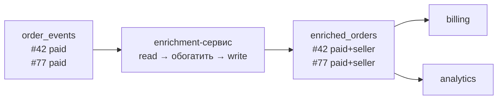

# Kafka Transactions: exactly-once для consume-transform-produce

**Предпосылки:** [Consumer internals](consumer-internals.md) (poll loop, offset commit, at-least-once), [Producer reliability](producer-reliability.md) (idempotent producer, PID, sequence number, границы), [Гарантии доставки](../../../system-design/delivery-guarantees.md) (exactly-once = at-least-once + idempotency), [Reliability patterns](../../../system-design/reliability-patterns.md) (idempotency).

[Idempotent producer](producer-reliability.md) гарантирует exactly-once на стороне записи: PID и sequence number исключают дубликаты и переупорядочивание в каждой партиции. На стороне чтения [at-least-once + идемпотентный обработчик](consumer-internals.md) даёт [exactly-once обработку](../../../system-design/delivery-guarantees.md) для простого consumer'а вроде `seller_read_db`: прочитал событие, выполнил `UPDATE orders SET status = 'paid' WHERE id = 42`, закоммитил offset. Повтор при crash'е безвреден — UPDATE идемпотентен.

Но рядом с `seller_read_db` появился enrichment-сервис. Его задача — прочитать событие из `order_events`, обогатить данными продавца (имя, рейтинг, комиссия) и записать результат в topic `enriched_orders`. Downstream consumer'ы — billing (начисление комиссии) и analytics (ClickHouse) — читают уже из `enriched_orders`. Enrichment-сервис — **consume-transform-produce**: внутри одного процесса живут и consumer (для `order_events`), и producer (для `enriched_orders`).



## Consume-transform-produce: разрыв атомарности

Цикл обработки enrichment-сервиса — три операции за итерацию:

```
while true
  records = consumer.poll(timeout: 500ms)

  for record in records
    enriched = enrich_with_seller_data(record)
    producer.send("enriched_orders", key: record.key, value: enriched)
  end

  consumer.commit_sync   # зафиксировать offset в order_events
end
```

Enrichment-сервис обработал 10 событий, записал 10 обогащённых записей в `enriched_orders` и упал до `commit_sync`. Billing видит все 10 событий — они записаны, committed, выше [high watermark](replication.md). При рестарте enrichment-сервис перечитает те же 10 событий из `order_events` (offset не сдвинулся) и запишет их повторно. Billing получит 20 событий вместо 10.

Для `seller_read_db` идемпотентность была дешёвой — один идемпотентный UPDATE. Billing начисляет комиссию продавцу: `INSERT INTO commissions (order_id, seller_id, amount) VALUES (42, 7, 15.00)`. Чтобы сделать это идемпотентным, нужен unique constraint на `order_id` или проверка перед вставкой — дополнительная логика в каждом downstream consumer'е. Analytics пишет в ClickHouse через batch insert — дедупликация в аналитической БД дорогая. А если downstream — внешний API? Billing вызывает платёжную систему для начисления — внешний API может не поддерживать [идемпотентность](../../../system-design/reliability-patterns.md).

Enrichment-сервис не может гарантировать отсутствие дубликатов в output topic'е, и ответственность перекладывается вниз по цепочке. С одним downstream это терпимо. С пятью — каждый из пяти защищается от дубликатов по-своему. Если бы enrichment-сервис гарантировал, что каждое событие появляется в `enriched_orders` ровно один раз — downstream consumer'ам не нужна идемпотентность для защиты от дубликатов enrichment'а.

Для этого запись в `enriched_orders` и commit offset'а в `order_events` должны быть атомарными: либо оба произойти, либо оба не произойти. Offset commit — это запись в `__consumer_offsets`, а это другой topic, другая партиция. Два разных topic'а, две разных партиции, одна атомарная операция.

Атомарность в append-only логе требует решения трёх задач: скрыть незакоммиченные записи от consumer'ов (механизм видимости), идентифицировать producer через рестарты и отсекать зомби-процессы (механизм идентификации), координировать commit в несколько партиций одновременно (механизм координации).

## Видимость в append-only логе

Атомарность в PostgreSQL реализована через rollback: crash до COMMIT — recovery откатывает незавершённые изменения, строки становятся невидимы через xmin/xmax и snapshot. В Kafka лог append-only — записанное нельзя удалить, перезаписать или пометить флагом. Запись иммутабельна: broker отдаёт данные через zero-copy transfer (`sendfile()`) прямо с диска, без чтения в пользовательское пространство. Если broker будет модифицировать записи на лету, zero-copy сломается.

Kafka решает видимость иначе: записи идут в лог как есть, без модификации. Вместо флага на каждой записи — один маркер в конце. Когда транзакция завершается, Kafka записывает в партицию специальное **control message** — `COMMIT` или `ABORT`. Это обычная запись в тот же лог, просто с особым типом (кто именно координирует запись маркеров — разберём в секции о transaction coordinator'е).

```
enriched_orders, partition 0:

offset:  0      1      2      3      4      5
       [msg]  [msg]  [msg]  [msg]  [msg]  [COMMIT]
       │      │      │      │      │      │
       └──────┴──────┴──────┴──────┘      │
           записи транзакции T1           маркер
```

Consumer с дефолтными настройками (`isolation.level=read_uncommitted`) видит все записи, включая незакоммиченные. Consumer с `isolation.level=read_committed` видит данные только до определённой границы.

Broker отслеживает все незавершённые транзакции и вычисляет **Last Stable Offset (LSO)** — offset самой ранней незавершённой транзакции. Всё ниже LSO гарантированно либо нетранзакционное, либо уже завершено (COMMIT или ABORT).

```
enriched_orders, partition 0:

offset:  0    1    2    3    4    5        6    7
       [T1] [T1] [T1] [T1] [T1] [COMMIT] [T2] [T2]
                                    ^             │
                                    │       не завершена
                                    T1 завершена

LSO = 6  (T2 начинается с offset 6, маркера нет)

read_uncommitted consumer: видит 0..7
read_committed consumer:   видит 0..5 (до LSO)
```

Consumer с `read_committed` при `poll()` получает записи только до LSO. Broker ограничивает выдачу одним сравнением offset'а — consumer'у не нужно парсить маркеры или знать, какие записи транзакционные. Клиентская библиотека фильтрует control messages (COMMIT/ABORT) — приложение видит только data-записи.

При ABORT записи транзакции остаются в логе физически, но клиентская библиотека знает их PID (каждая запись несёт PID в метаданных) и, увидев маркер ABORT, отбрасывает записи этой транзакции. Записи от других producer'ов проходят нормально:

```
offset:  0    1    2    3    4    5       6
       [T1] [P2] [T1] [P2] [T1] [ABORT] [P2]

LSO сдвигается на 7 (нет открытых транзакций)

read_committed consumer получает:
  offset 1: P2 ✓
  offset 3: P2 ✓
  offset 6: P2 ✓
  offset 0, 2, 4: отфильтрованы (T1, ABORT)
```

## Задержка видимости: trade-off открытых транзакций

В партицию пишут несколько producer'ов — транзакционных и обычных. Записи чередуются, а LSO — одно число на партицию, не фильтр по producer'у. Если транзакция T1 открыта с offset 0 и обычный producer P2 записал данные на offset 1, `read_committed` consumer не увидит ни offset 0 (T1, не завершена), ни offset 1 (P2, за LSO) — хотя P2 к транзакции не имеет отношения.

Альтернатива — broker фильтрует записи по PID на каждом fetch: читает данные в память, проходит каждую запись, проверяет принадлежность к открытой транзакции, собирает отфильтрованный батч. Zero-copy невозможен, CPU на каждом fetch при высоком throughput. LSO — грубый, но дешёвый механизм: одно сравнение offset'а вместо per-record фильтрации.

Trade-off реален, но он в **задержке**, не в потере данных. Как только транзакция завершается (COMMIT или ABORT), LSO сдвигается и все задержанные записи — включая чужие — становятся доступны. При коротких транзакциях (один poll-цикл, миллисекунды) задержка незаметна.

Если producer завис (GC-пауза, сетевой сбой) и не отправил ни COMMIT, ни ABORT — LSO стоит на месте. `transaction.timeout.ms` (дефолт 60 секунд) — предохранитель: если транзакция не завершена за это время, Kafka записывает ABORT, LSO сдвигается. Но 60 секунд при 150 events/sec — до 9 000 записей, невидимых для `read_committed` consumer'ов в этой партиции. Отсюда практическое правило: транзакции должны быть короткими — один poll-цикл: прочитал, обработал, записал, commit.

LSO и маркеры решают видимость на стороне чтения — `read_committed` consumer не видит незакоммиченные данные. Но чтобы producer мог открывать транзакции и при рестарте abort'нуть незавершённую или отсечь зомби-процесс, нужен механизм идентификации, который переживает рестарты.

## transactional.id и epoch: идентификация через рестарты

[Idempotent producer](producer-reliability.md) получает PID от broker'а при подключении. При рестарте — новый PID, broker не связывает старый и новый. Для транзакционного producer'а этого недостаточно: если enrichment-сервис упал посреди транзакции, при рестарте нужно знать, что предыдущая транзакция от того же логического сервиса не завершена — и abort'нуть её.

`transactional.id` — строка, заданная приложением (не кластером), например `"enrichment-service-1"`. Она переживает рестарты. При подключении producer регистрируется с `transactional.id`, и broker назначает ему PID и **epoch** — монотонно растущий счётчик поколений:

```
Первый запуск:
  transactional.id = "enrichment-service-1"
  broker назначает PID = 7, epoch = 0

Crash, рестарт:
  transactional.id = "enrichment-service-1"  (тот же)
  broker назначает PID = 7, epoch = 1        (epoch +1)
```

Epoch решает проблему зомби-процессов ([split-brain](../../../system-design/replication.md)). Enrichment-сервис завис (GC-пауза), Kubernetes поднял новый pod. Старый процесс жив, но парализован. Два процесса с одним `transactional.id`:

```
Старый процесс: PID=7, epoch=0  (завис, но жив)
Новый процесс:  PID=7, epoch=1  (зарегистрировался)
```

Старый процесс очнулся и пытается записать в `enriched_orders` или закоммитить транзакцию. Broker видит epoch=0, текущий epoch=1 — **ProducerFencedException**: неретраиабельная ошибка, старый процесс должен остановиться. Его транзакция абортирована. В любой момент времени ровно один процесс владеет данным `transactional.id`.

## Transaction coordinator: атомарный commit нескольких партиций

При `commit_transaction` записи могли уйти в несколько партиций `enriched_orders` (разные partition key) плюс `__consumer_offsets`. COMMIT-маркер нужен в каждой из них, и все должны появиться атомарно. Partition leader каждой партиции видит только свою часть — ни один не видит полной картины.

**Transaction coordinator** — broker, назначенный для конкретного `transactional.id`. Определяется хешем `transactional.id` по партициям внутреннего topic'а `__transaction_state` — аналогично тому, как [group coordinator](consumer-internals.md) определяется хешем имени группы по партициям `__consumer_offsets`.

```
hash("enrichment-service-1") % 50 = 12
→ leader партиции 12 в __transaction_state = Broker 1
→ Broker 1 — transaction coordinator для этого transactional.id
```

Transaction coordinator хранит состояние транзакции в `__transaction_state`: `transactional.id`, PID/epoch, затронутые партиции, статус. Данные персистентны и реплицированы — `__transaction_state` работает с `acks=all`, как любой внутренний topic Kafka.

Transaction coordinator — это не partition leader data-партиций. Это разные роли на потенциально разных broker'ах:

```
Broker 0                    Broker 1 (Tx Coordinator)     Broker 2
─────────                   ─────────────────────────     ─────────
leader partition 0          leader __transaction_state    leader partition 2
leader __consumer_offsets
```

Coordinator не записывает COMMIT-маркеры сам — он отправляет запросы partition leader'ам: «запиши COMMIT-маркер в partition 0» (Broker 0), «запиши COMMIT-маркер в partition 2» (Broker 2).

Цикл commit'а — упрощённый two-phase commit (координатор один, «участники» — partition leaders — не голосуют, а записывают маркер по команде):

```
Enrichment-сервис         Tx Coordinator (Broker 1)       Partition leaders
      │                          │                              │
      │  begin_transaction       │                              │
      │─────────────────────────>│  статус: ONGOING             │
      │                          │                              │
      │  send("enriched_orders") │                              │
      │──────────────────────────┼─────────────────────────────>│ partition 0
      │  (coordinator узнаёт:    │                              │ partition 2
      │   T1 затрагивает p0, p2) │                              │
      │                          │                              │
      │  send_offsets_to_txn     │                              │
      │──────────────────────────┼─────────────────────────────>│ __consumer_offsets
      │                          │                              │
      │  commit_transaction      │                              │
      │─────────────────────────>│                              │
      │                          │  1. PREPARE_COMMIT           │
      │                          │     в __transaction_state    │
      │                          │     (acks=all, реплицировано)│
      │                          │                              │
      │                          │  2. COMMIT-маркер            │
      │                          │─────────────────────────────>│ partition 0
      │                          │─────────────────────────────>│ partition 2
      │                          │─────────────────────────────>│ __consumer_offsets
      │                          │                              │
      │                          │  3. COMMITTED                │
      │                          │     в __transaction_state    │
```

Шаг 1 — point of no return. PREPARE_COMMIT записан в `__transaction_state` с `acks=all` — подтверждён всеми ISR-репликами. Coordinator не переходит к рассылке маркеров, пока PREPARE_COMMIT не реплицирован. С этого момента решение принято: транзакция будет закоммичена, даже если coordinator упадёт. Аналогия: запись COMMIT в WAL с fsync в PostgreSQL — point of no return для транзакции. Даже если процесс упадёт до обновления data-файлов, recovery доиграет WAL.

Если coordinator упал после шага 1 (PREPARE_COMMIT записан), но до завершения шага 2 — часть партиций получила COMMIT-маркер, часть нет. Новый leader `__transaction_state` (выбранный через [ISR](replication.md), как при обычном failover) прочитает PREPARE_COMMIT и доразошлёт COMMIT-маркеры в оставшиеся партиции.

Если coordinator упал до шага 1 (PREPARE_COMMIT не записан) — новый coordinator увидит транзакцию в статусе ONGOING и abort'нет её по `transaction.timeout.ms`.

## Полный цикл: consume-transform-produce с транзакциями

Ключевое отличие от цикла без транзакций: offset commit происходит через producer, а не через consumer. `send_offsets_to_transaction` записывает offset'ы в `__consumer_offsets` как часть той же транзакции. При commit — и записи в `enriched_orders`, и offset'ы становятся видимы атомарно. При abort — ни то, ни другое.

```
producer = create_producer(
  transactional_id: "enrichment-service-1"
  # idempotent producer включается автоматически
)

producer.init_transactions   # один раз при старте: регистрация transactional.id,
                             # получение PID/epoch, abort незавершённых транзакций

consumer = create_consumer(
  group_id: "enrichment-group",
  isolation_level: "read_committed",  # не видеть чужие незакоммиченные записи
  enable_auto_commit: false           # offset'ы коммитятся через producer
)

while true
  records = consumer.poll(timeout: 500ms)

  producer.begin_transaction

  for record in records
    enriched = enrich_with_seller_data(record)
    producer.send("enriched_orders", key: record.key, value: enriched)
  end

  # offset commit ВНУТРИ транзакции, через producer
  producer.send_offsets_to_transaction(
    consumer.current_offsets,        # {partition_0: offset_23, ...}
    group_id: "enrichment-group"
  )

  producer.commit_transaction        # атомарно: и записи, и offset'ы
end
```

`init_transactions` при старте делает три вещи: регистрирует `transactional.id` у transaction coordinator'а, получает PID и новый epoch (fencing предыдущего экземпляра), abort'ит любую незавершённую транзакцию предыдущего epoch'а. После этого producer готов к транзакционной работе.

Транзакция охватывает батч из одного `poll()`, а не каждое событие по отдельности. `begin_transaction` + `commit_transaction` — запись маркеров в лог, координация с transaction coordinator, запись в `__consumer_offsets`. При 150 events/sec транзакция на каждое событие — 150 транзакций в секунду, ощутимый overhead. Транзакция на батч (десятки-сотни событий из `poll()`) — единицы транзакций в секунду. Штраф за abort выше (переобработать весь батч), но abort — редкое событие, а overhead на commit — постоянный.

Enrichment-сервис — consumer в группе `enrichment-group`. Если посреди открытой транзакции произошёл [rebalancing](consumer-internals.md) (например, добавился новый экземпляр сервиса), consumer теряет часть партиций. Offset'ы для отозванных партиций уже включены в `send_offsets_to_transaction` — commit таких offset'ов некорректен, потому что consumer больше не владеет этими партициями. Транзакция должна быть abort'нута до передачи партиций. На практике это реализуется через `ConsumerRebalanceListener`: в callback'е `onPartitionsRevoked` вызывается `producer.abort_transaction()`, а после получения новых партиций — начинается новая транзакция с чистого состояния.

## Граница exactly-once

Kafka Transactions гарантируют exactly-once для операций **внутри Kafka**: прочитать из topic'а, записать в topic, закоммитить offset — атомарно и ровно один раз. Enrichment-сервис (Kafka → Kafka) — идеальный кандидат.

Как только обработка выходит за пределы Kafka, транзакции не контролируют side effect. Billing прочитал обогащённое событие из `enriched_orders` (с `read_committed` — без дубликатов от enrichment'а) и вызвал платёжный API: «начисли 15$ продавцу #7». API ответил «ok». Billing упал до commit'а offset'а. При рестарте — повтор вызова. Exactly-once гарантия Kafka не защитила billing от дубликата во внешней системе.

Для таких случаев остаётся at-least-once + [идемпотентность](../../../system-design/reliability-patterns.md) на стороне приложения: unique constraint в БД, idempotency key во внешнем API, upsert вместо insert. `seller_read_db` с идемпотентным `UPDATE` — пример, где транзакции Kafka не нужны: одна операция «прочитал → обработал → закоммитил offset», без записи в другой topic, и [at-least-once + идемпотентный обработчик](../../../system-design/delivery-guarantees.md) достаточен.

Exactly-once в Kafka — это exactly-once processing между topic'ами, не exactly-once delivery во внешний мир.

## Sources

- Narkhede, Shapira, Palino, 2017, *Kafka: The Definitive Guide*. O'Reilly
- Apache Kafka Documentation. <https://kafka.apache.org/documentation/>
- Kafka KIP-98, 2017, *Exactly Once Delivery and Transactional Messaging*. <https://cwiki.apache.org/confluence/display/KAFKA/KIP-98+-+Exactly+Once+Delivery+and+Transactional+Messaging>
