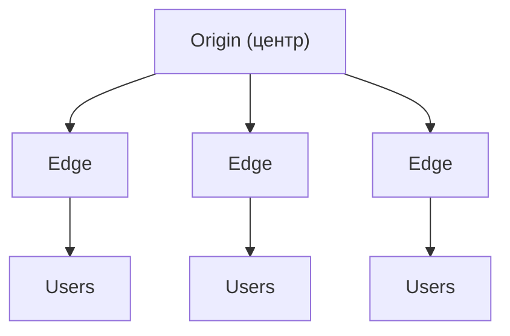

---
tags:
  - domain/networking
  - theme/networking
  - theme/performance
  - type/concept
aliases:
  - CDN
  - Content Delivery Network
order: 18
---

# CDN

**Предпосылки:** [DNS](../application/dns.md) (резолвинг, CNAME, TTL), [HTTP](../application/http.md) (заголовки, Cache-Control, коды статуса), [TLS](../application/tls.md) (рукопожатие, латентность, TLS-терминация), [TCP](../transport/tcp.md) (RTT).

<- [VPN](vpn.md)

Пользователь в Токио запрашивает картинку с сервера в Нью-Йорке. Даже по прямой путь через океан даёт десятки миллисекунд в одну сторону, а реальный RTT с маршрутизацией и оборудованием легко уходит за 100 ms. Для нового соединения и промаха по кэшу это превращается в дополнительные RTT на [TCP](../transport/tcp.md), [TLS](../application/tls.md) и первый байт ответа. Вторая проблема — нагрузка: популярный сайт получает миллионы запросов, и один сервер-источник не должен отдавать одну и ту же статику всему миру.

## CDN: контент ближе к пользователю

**CDN** (Content Delivery Network) — географически распределённая сеть серверов, которая кэширует контент ближе к пользователям.

Архитектура включает два типа серверов. **Origin-сервер** — источник контента, основной сервер. **Edge-серверы** — узлы CDN, расположенные в точках присутствия (PoP — Point of Presence) по всему миру. "Edge" — "край" сети, термин из сетевой топологии: есть центр (origin, дата-центр) и периферия — точки максимально близкие к конечным пользователям.

Когда пользователь запрашивает ресурс, запрос идёт на ближайший edge-сервер. Если контент есть в кэше — edge отдаёт его сразу. Если нет — edge запрашивает у origin, сохраняет в свой кэш и отдаёт пользователю. Следующий запрос того же ресурса из того же региона получит данные мгновенно.

## DNS и маршрутизация к edge

CDN напрямую участвует в [DNS](../application/dns.md)-резолвинге. Два основных подхода.

**CNAME-подход.** Создаётся CNAME-запись, указывающая на домен CDN: `static.mysite.com` → `d1234.cloudfront.net`. Когда пользователь резолвит `static.mysite.com`, [DNS](../application/dns.md) возвращает CNAME, затем [DNS](../application/dns.md) CDN-провайдера возвращает [IP](../foundations/ip-and-routing.md) ближайшего edge-сервера. Выбор основан на геолокации по [IP](../foundations/ip-and-routing.md) источника [DNS](../application/dns.md)-запроса. Статика идёт через [CDN](cdn.md) (`static.mysite.com`), динамический контент — напрямую на origin (`mysite.com`).

**Полный DNS-прокси (Cloudflare-стиль).** NS-записи домена переключаются на серверы CDN. CDN контролирует весь [DNS](../application/dns.md) и сразу отдаёт [IP](../foundations/ip-and-routing.md) своего edge-сервера для любого запроса. Edge работает как reverse proxy — принимает [HTTP](../application/http.md)-запрос, решает по правилам: отдать из кэша или проксировать на origin. Преимущество: один домен для всего, разное поведение кэширования настраивается правилами. Бонус — защита от DDoS (Distributed Denial of Service — распределённая атака на отказ в обслуживании) и WAF на весь трафик.

**Выбор ближайшего сервера.** CDN использует комбинацию методов: геолокацию по [IP](../foundations/ip-and-routing.md) резолвера, anycast-маршрутизацию (один [IP](../foundations/ip-and-routing.md) анонсируется с разных точек, BGP выбирает ближайшую), иногда маршрутизацию по измеренной задержке.

## Инвалидация кэша

**TTL.** Origin отдаёт заголовок `Cache-Control: max-age=3600`. Edge хранит контент 3600 секунд, потом считает его stale (устаревшим).

**Условные запросы (revalidation).** Когда TTL истёк, edge не обязательно заново скачивает файл. Он делает условный запрос к origin с заголовками `If-None-Match: "abc123"` и `If-Modified-Since: Mon, 20 Jan 2025 10:00:00 GMT`. Origin отвечает `304 Not Modified` (контент не изменился, можно продлить кэш) или `200` с новым контентом.

**Принудительная инвалидация.** Через API или консоль провайдера можно сказать CDN: "забудь этот URL". Обычно есть лимиты на количество инвалидаций.

**Cache busting.** Вместо инвалидации меняется URL: `app.js?v=2` или `app.a1b2c3.js`. Старый файл остаётся в кэше, но его никто не запрашивает.

**stale-while-revalidate.** Директива в `Cache-Control`. Edge отдаёт устаревший контент сразу, а в фоне запрашивает свежий у origin. Пользователь не ждёт, но получает слегка устаревшие данные.

## Стратегии кэширования

Для статики (JS, CSS, изображения, шрифты) — длинный TTL (дни, недели) + cache busting через хэш в имени файла. Файл `app.a1b2c3.js` кэшируется навсегда; при изменении кода генерируется новое имя `app.d4e5f6.js`.

Для API с кэшированием — короткий TTL (секунды, минуты) + `stale-while-revalidate`. Баланс между свежестью и скоростью.

Для динамического контента, который нельзя кэшировать, CDN всё равно полезен: [TLS](../application/tls.md)-терминация на edge снижает нагрузку на origin, а постоянные соединения между edge и origin уменьшают накладные расходы.

## Эффекты

**Снижение latency.** Edge-сервер физически ближе — RTT падает с сотен миллисекунд до десятков. **Разгрузка origin.** Статика отдаётся с edge-узлов; origin обрабатывает только уникальные запросы и динамический контент. **Отказоустойчивость.** Если один edge-узел упал, трафик маршрутизируется на другой. **Защита от DDoS.** CDN поглощает атаку на своей распределённой инфраструктуре.

CDN — ключевой компонент в многоуровневой архитектуре кэширования.

## Sources

- RFC 9111, *HTTP Caching*, 2022. https://www.rfc-editor.org/rfc/rfc9111
- RFC 5861, *HTTP Cache-Control Extensions for Stale Content*, 2010. https://www.rfc-editor.org/rfc/rfc5861

---

<- [VPN](vpn.md)
