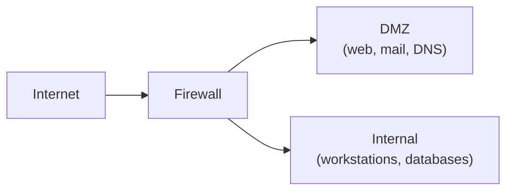

---
tags:
  - domain/networking
  - theme/networking
  - theme/security
  - type/concept
aliases:
  - Firewall
  - Firewalls
  - Packet Filter
  - Stateful Firewall
  - DMZ
order: 16
---

# Firewalls

**Предпосылки:** [IP и маршрутизация](../foundations/ip-and-routing.md) (IP-адрес, пакет), [TCP](../transport/tcp.md) (соединение, SYN, ACK, порт), [UDP](../transport/udp.md) (порт, датаграмма).

<- [Протоколы маршрутизации](routing-protocols.md) | [VPN](vpn.md) ->

Сервер подключён к интернету. На нём работает веб-приложение (порт 443), SSH для администрирования (порт 22) и PostgreSQL (порт 5432). Без ограничений любой [IP](../foundations/ip-and-routing.md) в интернете может попытаться подключиться к любому порту: перебирать пароли SSH, сканировать PostgreSQL, эксплуатировать уязвимости. Нужен механизм, который пропускает только разрешённый трафик.

## Packet filter: простейший файрвол

**Packet filter** — набор правил, которые проверяют каждый пакет и решают: пропустить (allow) или отбросить (drop/reject). Правила основаны на полях заголовков: [IP](../foundations/ip-and-routing.md)-адрес отправителя/получателя, протокол ([TCP](../transport/tcp.md)/[UDP](../transport/udp.md)/ICMP), порт отправителя/получателя.

Пример набора правил для описанного сервера:

```
allow  TCP  any       -> self:443    # HTTP от кого угодно
allow  TCP  10.0.0.0/8 -> self:22   # SSH только из внутренней сети
drop   TCP  any       -> self:5432   # PostgreSQL закрыт снаружи
drop   any  any       -> self:*      # всё остальное — отбросить
```

Правила проверяются сверху вниз, срабатывает первое подходящее. Последнее правило — **default deny**: всё, что явно не разрешено, запрещено. Это безопаснее обратного подхода (default allow), потому что забытое правило приводит к блокировке, а не к утечке.

Packet filter работает быстро — решение принимается по каждому пакету независимо. Но он не понимает контекст: не знает, является ли пакет частью установленного соединения или это попытка атаки.

## Stateful firewall: понимание соединений

**Stateful firewall** (файрвол с отслеживанием состояния) ведёт таблицу активных соединений — **connection tracking** (conntrack). Когда клиент устанавливает [TCP](../transport/tcp.md)-соединение (SYN → SYN-ACK → ACK), файрвол записывает его в таблицу. Последующие пакеты этого соединения автоматически пропускаются без проверки по всем правилам.

Преимущества. Правила становятся проще: достаточно разрешить новые (NEW) соединения на нужные порты, а ответные пакеты (ESTABLISHED) пропускаются автоматически. Файрвол может отличить легитимный ответный ACK от поддельного — если SYN на этот сокет не проходил, ACK отбрасывается.

Stateful firewall работает и для [UDP](../transport/udp.md): хотя [UDP](../transport/udp.md) — connectionless, файрвол создаёт "виртуальное соединение" по паре [IP](../foundations/ip-and-routing.md):порт и помнит его в течение таймаута.

Цена: таблица conntrack потребляет память. При большом количестве активных соединений (сотни тысяч) таблица может переполниться, и новые соединения начнут отбрасываться. Размер таблицы настраивается (`nf_conntrack_max` на Linux).

## Зоны и DMZ

В реальной инфраструктуре не два мира (внутренний и внешний), а минимум три:

**Internal** (внутренняя сеть) — рабочие станции, внутренние сервисы. Полный доступ между собой, ограниченный доступ наружу.

**External** (интернет) — недоверенная зона. Входящий трафик фильтруется жёстко.

**DMZ** (Demilitarized Zone — демилитаризованная зона) — промежуточная зона для серверов, доступных из интернета: веб-серверы, почтовые серверы, DNS. Доступ из интернета в DMZ разрешён на конкретные порты. Доступ из DMZ во внутреннюю сеть — запрещён или ограничен конкретными соединениями (например, DMZ-сервер → база данных во внутренней сети на порту 5432).



Если злоумышленник компрометирует сервер в DMZ, он не получает прямого доступа к внутренней сети — файрвол между DMZ и Internal продолжает действовать.

## Application-layer firewall и WAF

Packet filter и stateful firewall работают на уровнях L3–L4: IP-адреса и порты. Они не анализируют содержимое HTTP-запросов. **Application-layer firewall** (L7) понимает протоколы прикладного уровня и может блокировать запросы на основе URL, [HTTP](../application/http.md)-методов, содержимого тела запроса.

**WAF** (Web Application Firewall) — специализированный application-layer firewall для веб-приложений. Блокирует SQL-инъекции, XSS, подозрительные паттерны в запросах. Популярные реализации: ModSecurity (open source), Cloudflare WAF ([CDN](cdn.md)-integrated), AWS WAF.

WAF может работать на edge-серверах [CDN](cdn.md) — тогда вредоносный трафик блокируется до того, как достигнет origin-сервера.

## Linux: iptables и nftables

На Linux файрвол реализован в ядре. **iptables** — классический интерфейс, использует цепочки (chains) и таблицы. **nftables** — более новая замена с унифицированным синтаксисом. Оба используют фреймворк обработки пакетов в ядре Linux. Connection tracking реализован модулем `nf_conntrack`.

---

<- [Протоколы маршрутизации](routing-protocols.md) | [VPN](vpn.md) ->
