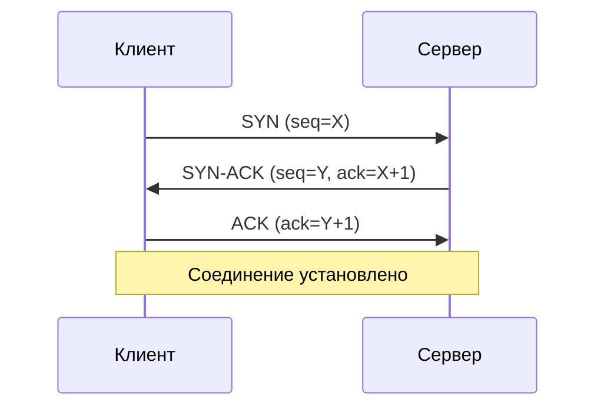
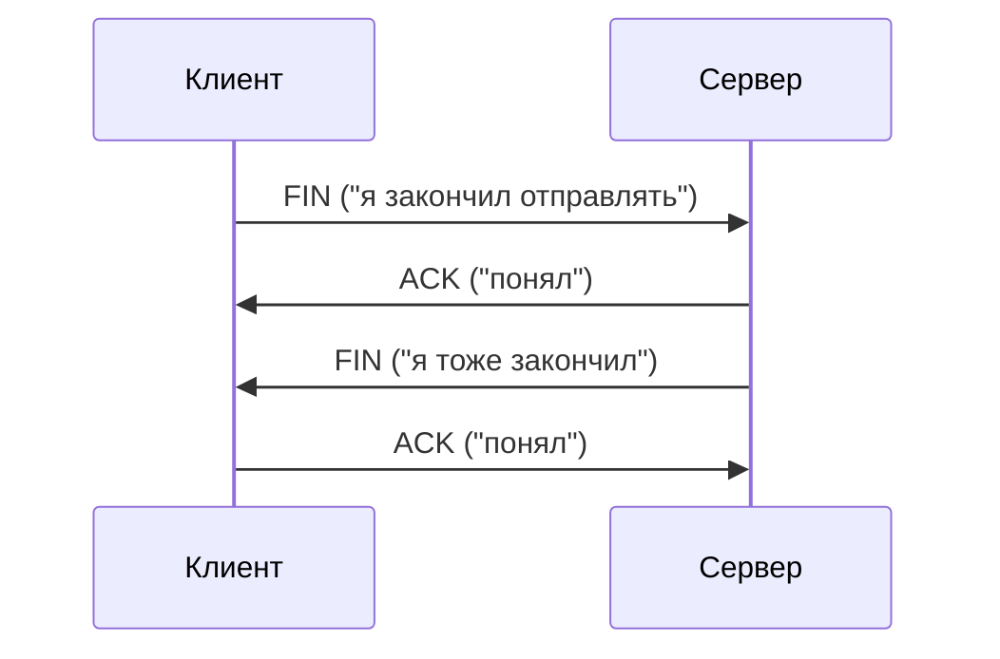

# TCP

**Предпосылки:** [UDP](00-udp.md) (порт, сокет, датаграмма), [IP и маршрутизация](../foundations/01-ip-and-routing.md) (пакет, TTL).

<- [UDP](00-udp.md) | [TCP Tuning](02-tcp-tuning.md) ->

UDP передаёт данные без гарантий — быстро, но ненадёжно. Для загрузки файла, HTTP-запроса или подключения к базе данных потеря или перестановка байтов недопустима. Нужен протокол, который гарантирует: данные дойдут, дойдут в правильном порядке, не продублируются, и отправитель не перегрузит получателя.

## Соединение

**TCP** (Transmission Control Protocol — протокол управления передачей) решает все четыре задачи. Фундаментальное отличие от UDP: TCP создаёт **соединение** (connection). UDP — как отправка открыток: каждая независима. TCP — как телефонный звонок: установка соединения, обмен данными, завершение. Соединение — это **состояние**, хранимое на обоих концах: номера последовательности, размеры буферов, таймеры.

## Трёхстороннее рукопожатие

**Handshake** (рукопожатие) — процедура установки соединения:



**SYN** (synchronize) — "хочу соединиться, мой начальный номер X". **SYN-ACK** — "принял, мой начальный номер Y". **ACK** (acknowledge) — "принял". Три шага нужны, чтобы обе стороны убедились, что связь работает в обе стороны: после двух шагов сервер не знает, дошёл ли его ответ до клиента.

В Linux эта абстракция доступна через системные вызовы `socket()`, `connect()`, `listen()` и `accept()` — подробнее в [сокетах](../../linux/programming/03-sockets.md).

## Сегмент

**Сегмент** (segment) — единица данных TCP. TCP "нарезает" поток данных на части. Ключевые поля заголовка (минимум 20 байт):

```
+----------------+----------------+-----------------+-----------------+
| Порт           | Порт           | Sequence Number | Acknowledgment  |
| отправителя    | получателя     | (номер послед.) | Number (подтв.) |
| (2 байта)      | (2 байта)      | (4 байта)       | (4 байта)       |
+----------------+----------------+-----------------+-----------------+
| Флаги (SYN, ACK, FIN, RST...), размер окна, контр. сумма...        |
+---------------------------------------------------------------------+
| Данные (payload)                                                    |
+---------------------------------------------------------------------+
```

## Sequence Number и ACK: надёжность и порядок

IP-пакеты могут приходить не в том порядке (маршруты различаются) и могут теряться. TCP решает обе проблемы через нумерацию байтов.

**Sequence Number** — номер первого байта данных в сегменте. Сегмент 1: seq=1000, 500 байт — байты 1000–1499. Сегмент 2: seq=1500, 500 байт — байты 1500–1999. Если сегмент 2 придёт раньше, получатель положит его в буфер и подождёт сегмент 1.

**Acknowledgment** — подтверждение получения. Получатель отправляет ACK с номером: "получил всё до N, жду N и дальше". Отправитель посылает байты 1000–1499, получатель отвечает ACK=1500. Отправитель посылает 1500–1999, получатель отвечает ACK=2000. Если ACK не приходит в течение таймаута — **повторная передача** (retransmission).

Таймаут вычисляется динамически на основе **RTT** (Round-Trip Time — время туда-обратно). Быстрая сеть — короче таймаут. Медленная — длиннее.

## Управление потоком: окно

Отправитель может "завалить" получателя данными быстрее, чем тот обрабатывает. **Управление потоком** (flow control) решает это через **окно** (window): получатель в каждом ACK сообщает размер окна — "у меня W байт свободного места". Отправитель не шлёт неподтверждённых данных больше, чем размер окна. Получатель перегружен — окно уменьшается вплоть до нуля.

## Контроль перегрузки: адаптация к сети

Управление потоком защищает получателя. Но сеть между ними тоже может быть перегружена — роутер не справляется, пакеты теряются.

**Congestion control** — адаптация к состоянию сети. Принцип: потеря пакетов = сигнал перегрузки, нужно замедлиться. **Slow start**: начать с маленького окна перегрузки (cwnd), увеличивать экспоненциально при успешной доставке. **Congestion avoidance**: после достижения порога — увеличивать линейно. При потере — резкое уменьшение окна.

## Завершение соединения

Соединение полнодуплексное — каждая сторона завершает передачу независимо:



**FIN** (finish) — "больше не буду отправлять данные". **RST** (reset) — грубое немедленное закрытие без церемоний.

## Полная инкапсуляция

На этом этапе видна полная картина вложенности: данные приложения (например, HTTP) помещаются в TCP-сегмент, тот — в IP-пакет, а он — в Ethernet-кадр:

```
+---------------------------------------------------------------------+
| Ethernet-кадр                                                       |
| +------------------------------------------------------------------+|
| | MAC-заголовок | IP-пакет                                         ||
| |               | +----------------------------------------------+ ||
| |               | | IP-заголовок | TCP-сегмент                    | ||
| |               | |              | +----------------------------+ | ||
| |               | |              | | TCP-заголовок | Данные      | | ||
| |               | |              | |               | (HTTP)      | | ||
| |               | |              | +----------------------------+ | ||
| |               | +----------------------------------------------+ ||
| +------------------------------------------------------------------+|
+---------------------------------------------------------------------+
```

## TCP vs UDP

| Характеристика    | TCP                    | UDP                  |
|--------------------|------------------------|----------------------|
| Соединение         | Да (stateful)          | Нет (stateless)      |
| Надёжность         | Гарантирована          | Не гарантирована     |
| Порядок            | Сохраняется            | Не сохраняется       |
| Накладные расходы  | 20+ байт заголовка     | 8 байт заголовка     |
| Применение         | HTTP, файлы, БД        | Видео, игры, DNS     |

TCP обеспечивает надёжный канал между приложениями. Но приложениям нужно ещё понимать друг друга — преобразовать имя сервера в IP-адрес ([DNS](../application/00-dns.md)), договориться о формате обмена ([HTTP](../application/01-http.md)), защитить данные от перехвата ([TLS](../application/02-tls.md)).

---

<- [UDP](00-udp.md) | [TCP Tuning](02-tcp-tuning.md) ->
