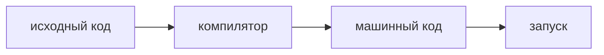

# Компиляция и интерпретация

**Предпосылки:** [Ассемблер](01-assembler.md) (машинный код, мнемоники), [Переменные и типы](02-variables-and-types.md) (статическая и динамическая типизация), [Функции](05-functions.md) (вызов функций).

<- [Ошибки и исключения](11-errors-and-exceptions.md)

На протяжении всего курса мы писали код вроде `salary = 1500`. Процессор таких слов не понимает. Ему нужны инструкции низкого уровня. Значит, между исходным кодом и выполнением всегда есть этап перевода.

Главный вопрос этой заметки не в том, “какой язык лучше”. Главный вопрос в другом: каким путём один и тот же исходный код добирается до выполнения. Для этого удобно разделить три вещи:

- когда происходит перевод;
- что получается после перевода;
- кто исполняет результат во время работы.

Компиляция, виртуальная машина и интерпретация отвечают именно на эти вопросы. Статическая и динамическая типизация — отдельная ось, и смешивать её с формой запуска нельзя.

## Компиляция заранее: получи исполнимый файл до запуска

Самый прямой путь — перевести весь текст программы в машинный код до запуска. Такой подход называется ahead-of-time (AOT — «заблаговременно», до запуска) компиляцией.



Примеры:

```bash
$ gcc file.c -o program
$ ./program
```

```bash
$ rustc file.rs
$ ./file
```

После компиляции получается файл с машинными инструкциями для конкретной платформы. Операционная система загружает его, и процессор выполняет эти инструкции напрямую.

Этот путь снимает одну важную проблему: значительная часть подготовки уже сделана заранее. Поэтому запуск обычно быстрый, а часть ошибок можно поймать ещё до первого выполнения.

Но у такого подхода есть цена:

- после каждого изменения код нужно перекомпилировать;
- получившийся файл привязан к платформе;
- если нужна другая операционная система или другой процессор, обычно требуется новая сборка.

## Виртуальная машина: переведи не в машинный код процессора, а в общий промежуточный код

Привязка к платформе — серьёзное ограничение. Если хочется запускать одну и ту же программу на разных системах без новой сборки под каждую, можно вставить дополнительный слой.

Идея такая: перевести исходный код не сразу в машинный код процессора, а в байткод (bytecode — инструкции, закодированные побайтно) для виртуальной машины. Виртуальная машина (virtual machine) — это программа, которая ведёт себя как отдельный компьютер: у неё свой набор инструкций и своя модель памяти, но работает она поверх настоящего процессора.


В Java это видно прямо в командах:

```bash
$ javac Main.java
$ java Main
```

`javac` создаёт `.class`-файлы с байткодом JVM. Команда `java` запускает этот байткод на виртуальной машине Java.

В Ruby этот промежуточный шаг обычно скрыт от пользователя. Снаружи вы пишете `ruby file.rb`, но внутри рантайм всё равно сначала разбирает исходный код и превращает его во внутреннюю форму, с которой потом работает виртуальная машина.

Этот путь решает другую задачу, чем AOT-компиляция. Здесь важен не только запуск, но и переносимость: одна и та же промежуточная форма может работать на разных платформах, если на каждой есть своя реализация VM.

Цена тоже своя:

- между программой и процессором появляется дополнительный слой;
- модель запуска становится сложнее;
- часть работы откладывается на рантайм виртуальной машины.

## Прямая интерпретация: разбирай и выполняй на ходу

Есть и другой приоритет: не подготовить всё заранее, а как можно быстрее увидеть результат после изменения кода.

Интерпретатор читает исходный текст и исполняет его без отдельного пользовательского шага сборки и без отдельного сохраняемого артефакта:


Так работали ранние версии BASIC: строка вводилась, сразу разбиралась и сразу выполнялась. Для обучения и экспериментов это было удобно: цикл «написал -> увидел результат» становился максимально коротким.

Важно не спутать две вещи:

- “нет отдельной команды компиляции”;
- “нет вообще никакой промежуточной внутренней формы”.

Во многих современных системах граница размыта: снаружи язык выглядит интерпретируемым, но внутри рантайм всё равно строит внутреннее представление программы. Для базовой модели достаточно помнить главное: у программиста нет отдельного пользовательского шага сборки, код запускается сразу.

## Это не то же самое, что статическая и динамическая типизация

В [заметке о типах](02-variables-and-types.md) уже был другой вопрос: когда язык проверяет допустимость операций и насколько явно программист описывает типы.

Это отдельная ось.

Например:

- C: AOT-компиляция + статическая типизация;
- Rust: AOT-компиляция + статическая типизация + дополнительные проверки владения;
- Java: виртуальная машина + статическая типизация;
- Ruby: запуск через рантайм виртуальной машины + динамическая типизация;
- ранний BASIC: интерпретация + слабые проверки до реального выполнения.

Поэтому нельзя просто сказать:

- “компилируемый язык значит статический”;
- “интерпретируемый язык значит динамический”;
- “виртуальная машина значит все ошибки только во время работы”.

Это разные свойства языка и среды выполнения.

## Время компиляции и время выполнения

Из-за этого различия полезно отдельно держать ещё одну пару понятий.

**Время компиляции** — момент, когда код переводится и проверяется до запуска.

**Время выполнения** — момент, когда программа уже работает.

Часть ограничений относится именно ко времени компиляции:

- статическая проверка типов;
- проверка владения в Rust;
- отказ собрать программу при явном нарушении контракта.

А часть проблем относится ко времени выполнения:

- исключения;
- отсутствие файла;
- неверный ввод пользователя;
- ошибки, которые проявляются только на реально дошедшем до них пути выполнения.

Это важно, потому что одна и та же программа почти всегда живёт в обеих фазах: что-то можно проверить заранее, а что-то становится видно только на реальных данных и реальном ходе выполнения.

## Почему границы размываются

На практике современные рантаймы часто смешивают несколько подходов.

Виртуальная машина может использовать JIT (just-in-time — «в момент выполнения»): часто выполняемый байткод дополнительно переводится в машинный код уже во время работы программы.

Интерпретатор может сначала построить внутреннее представление программы, а потом выполнять уже его, а не исходный текст посимвольно.

Поэтому названия вроде «компилируемый» и «интерпретируемый» лучше понимать как описание доминирующего пути запуска, а не как обещание, что внутри существует только один механизм.

## Что это даёт программисту

| Подход | Что получается после перевода | Что это даёт | Цена |
|--------|-------------------------------|--------------|------|
| AOT-компиляция | машинный код | быстрый запуск, много работы сделано заранее | нужна пересборка, результат привязан к платформе |
| Виртуальная машина | байткод или другая промежуточная форма | переносимость и дополнительный слой оптимизаций | выполнение идёт через VM |
| Прямая интерпретация | нет отдельного пользовательского артефакта | короткий цикл “изменил -> запустил” | меньше подготовки вынесено до запуска |

Это снова не три разных класса языков “по природе”. Это три разных ответа на один и тот же вопрос: где именно проходит граница между написанным текстом и реальным выполнением на машине.

## Исторический контекст

В начале 1950-х сама идея компилятора казалась спорной: многие программисты привыкли писать машинный код вручную. В 1952 году команда Грейс Хоппер создала A-0 — один из первых компиляторов. FORTRAN сделал компиляцию массовой. BASIC сделал массовым немедленный запуск для обучения. Java популяризовала виртуальную машину как переносимый слой исполнения.

Эти подходы не отменяют друг друга. Они отвечают на разные практические требования: скорость выполнения, скорость обратной связи, переносимость и объём проверок до запуска.

## Sources

- Hopper, G., 1952, *The Education of a Computer*. Proceedings of the ACM.
- Aho, A. et al., 2006, *Compilers: Principles, Techniques, and Tools*. Pearson.
- Thomas, D. et al., 2023, *Programming Ruby 3.3*. Pragmatic Bookshelf.

---

<- [Ошибки и исключения](11-errors-and-exceptions.md)
