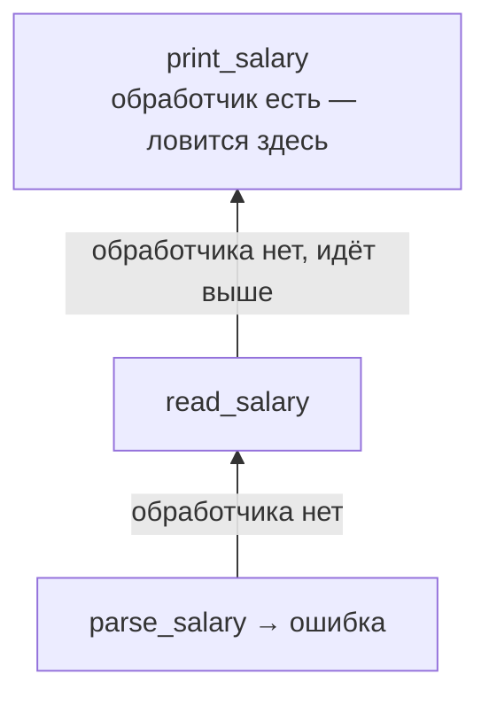

---
tags:
  - domain/programming
  - theme/data-representation
  - type/concept
aliases:
  - errors
  - exceptions
  - Result type
order: 11
---

# Ошибки и исключения

**Предпосылки:** [Функции](functions.md) (вызовы функций), [Память](memory.md) (стек вызовов, кадры).

<- [Функциональное программирование](fp.md) | [Компиляция и интерпретация](compilation-and-interpretation.md) ->

Пусть программа должна открыть `salaries.txt`, прочитать первую строку и превратить её в число. Здесь могут сломаться три разные вещи: файла нет, строка не прочиталась, текст оказался не числом.

Главный вопрос этой заметки не в том, бывают ли ошибки. Они бывают всегда. Главный вопрос в другом: как сигнал о сбое проходит через программу и кто обязан на него отреагировать.

## Коды ошибок: проверяй после каждого шага

Самый прямой подход — вернуть специальное значение, которое означает неуспех. Здесь и ниже примеры на C. Для понимания важна идея, а не синтаксис C — нужные детали поясняются рядом.

```c
FILE *f = fopen("salaries.txt", "r");
if (f == NULL) {
    printf("Файл не найден\n");
    return 1;
}

int salary;
if (fscanf(f, "%d", &salary) != 1) {
    printf("Не удалось прочитать число\n");
    fclose(f);
    return 1;
}

fclose(f);
printf("%d\n", salary);
```

`fopen` сообщает об ошибке через `NULL`. `fscanf` тоже возвращает признак успеха или неуспеха. Сигнал об ошибке идёт как обычное значение рядом с полезным результатом.

Цена такого подхода проста: вызывающий код обязан проверить каждый шаг, прежде чем идти дальше. Если поверх этого кода будет ещё одна функция, ей тоже придётся либо обработать ошибку, либо вернуть свой код ошибки выше.

## Исключения: сигнал идёт вверх сам

Другой подход — не возвращать код ошибки после каждой операции, а прервать обычный ход выполнения и передать управление обработчику. В Ruby для этого есть конструкция `begin`/`rescue`/`ensure`/`end`:

```ruby
file = nil

begin
  file = File.open("salaries.txt")
  line = file.gets
  salary = Integer(line)
  puts salary
rescue => error
  puts "Не удалось прочитать зарплату: " + error.message
ensure
  file.close if file
end
```

Если `File.open`, `file.gets` или `Integer(line)` не удаётся, управление сразу переходит в `rescue`. Строки ниже места ошибки не выполняются. Блок `ensure` выполняется в любом случае: и после успеха, и после ошибки.

Внешне основной путь выглядит чище: не нужно писать проверку после каждого вызова. Но теперь путь ошибки скрыт в механике исключения, а не лежит рядом с каждой строкой.

## Раскрутка стека: обработчик может быть выше места ошибки

Сильная сторона исключений в том, что обработчик не обязан стоять прямо рядом с местом сбоя. Ошибка может подняться по цепочке вызовов — тем самым кадрам стека из [заметки о памяти](memory.md):



```ruby
def parse_salary(line)
  Integer(line)
end

def read_salary(filename)
  file = nil

  begin
    file = File.open(filename)
    line = file.gets
    parse_salary(line)
  ensure
    file.close if file
  end
end

def print_salary(filename)
  begin
    salary = read_salary(filename)
    puts "Зарплата: " + salary.to_s
  rescue => error
    puts "Не удалось прочитать зарплату: " + error.message
  end
end
```

Такой подъём исключения вверх по вызовам называется раскруткой стека (stack unwinding): промежуточные кадры снимаются в обратном порядке, пока не найдётся обработчик. Важно, что во время этой раскрутки всё равно выполняются блоки `ensure`.

## `Result`: ошибка становится частью типа

Коды ошибок можно забыть проверить. Исключения нельзя забыть, но по сигнатуре функции не видно, какие ошибки она может поднять. Rust часто выбирает третий путь: делает ошибочный исход явной частью результата.

```rust
fn read_salary(path: &str) -> Result<i32, String> {
    // либо Ok(зарплата), либо Err(описание ошибки)
}

fn print_salary(path: &str) -> Result<(), String> {
    let salary = read_salary(path)?;   // если Err, сразу вернуть его выше
    println!("Зарплата: {}", salary);
    Ok(())
}

fn main() {
    match print_salary("salaries.txt") {
        Ok(()) => {}
        Err(error) => println!("Ошибка: {}", error),
    }
}
```

`Result<i32, String>` означает: функция вернёт либо число, либо описание ошибки. `match` явно разбирает оба варианта. Символ `?` означает: если здесь `Err`, не продолжай обычный путь, а сразу верни ту же ошибку вызывающему коду.

Это делает путь ошибки видимым прямо в сигнатуре функции. Вызывающий код обязан выбрать один из вариантов: явно разобрать `Ok` и `Err`, передать ошибку дальше через `?`, или намеренно завершить программу в точке вызова.

## Три ответа на один вопрос

| Подход | Как идёт сигнал об ошибке | Что хорошо | Цена |
|--------|---------------------------|------------|------|
| Код ошибки | как обычное возвращаемое значение | всё явно рядом с местом вызова | нужно проверять после каждого шага |
| Исключение | прыгает вверх до ближайшего обработчика | основной путь кода короче | путь ошибки не виден по сигнатуре |
| `Result` | является частью типа результата | вызывающий код сразу видит возможность сбоя | больше церемонии в точке вызова |

Это не три разных вида ошибок. Это три разных способа провести один и тот же факт через программу: обычный путь продолжать нельзя, нужен отдельный путь обработки.

Следующий вопрос уже не про сбой во время работы, а про запуск программы вообще: почему `ruby file.rb` и `gcc file.c` выглядят так по-разному?

## Sources

- Klabnik, S. & Nichols, C., 2023, *The Rust Programming Language*. No Starch Press.
- Thomas, D. et al., 2023, *Programming Ruby 3.3*. Pragmatic Bookshelf.
- Kernighan, B. & Ritchie, D., 1988, *The C Programming Language*. Prentice Hall.

---

<- [Функциональное программирование](fp.md) | [Компиляция и интерпретация](compilation-and-interpretation.md) ->
