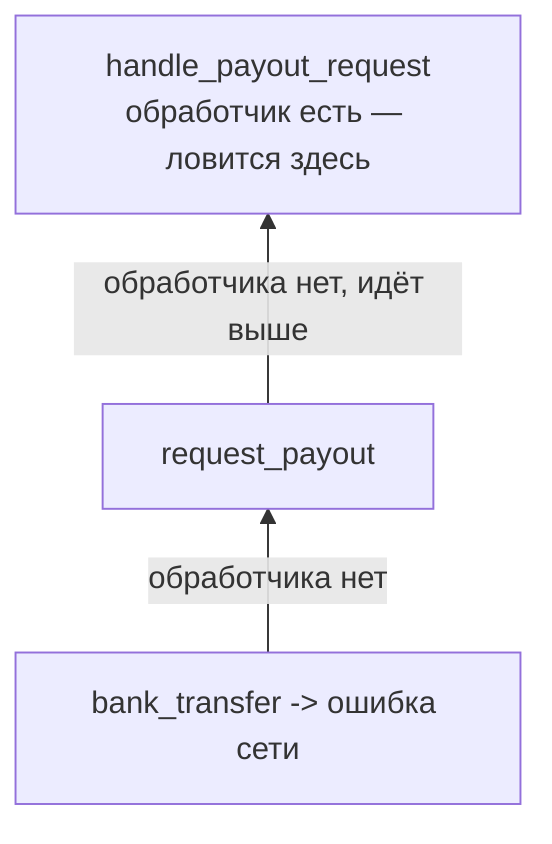

---
tags:
  - domain/programming
  - theme/data-representation
  - type/concept
aliases:
  - errors
  - exceptions
  - Result type
order: 11
---

# Ошибки и исключения

**Предпосылки:** [Функции](functions.md) (вызовы функций), [Память](memory.md) (стек вызовов, кадры).

<- [Замыкания](closures.md) | [Компиляция и интерпретация](compilation-and-interpretation.md) ->

В [заметке про функциональное программирование](fp.md) маркетплейс считал баланс счёта: зарплата, бонус, списание подписки, комиссия. Пока всё шло по плану, история значений отвечала на вопрос «где баланс ушёл в минус». Теперь сценарий сложнее: продавец Alice запросила выплату на внешний счёт, и на этом пути что-то сломалось. Банк вернул отказ, или сети не было, или в базе у продавца оказался битый номер счёта.

Ошибки бывают всегда. Вопрос в другом: как сигнал о сбое проходит через программу и кто обязан на него отреагировать.

## Коды ошибок: проверяй после каждого шага

Самый прямой подход — вернуть специальное значение, означающее неуспех. В языке без встроенного механизма исключений (например, в C) это единственный вариант. Снаружи форма выглядит так:

```c
int result = request_payout(account_id, amount);
if (result != OK) {
    log_error(result);
    return result;
}
```

Каждый шаг возвращает код. Рядом с ним стоит ручная проверка: если не `OK`, вызывающий либо сам справляется, либо возвращает тот же код выше. Сигнал об ошибке идёт как обычное значение, бок о бок с полезным результатом.

В Ruby тот же подход можно сымитировать, возвращая пару `[успех, значение]` из каждого шага:

```ruby
def request_payout(account, amount)
  ok, details = bank_transfer(account, amount)
  return [false, details] unless ok

  ok, receipt = record_payout(account, amount)
  return [false, receipt] unless ok

  [true, receipt]
end
```

Цена такого стиля видна сразу: основной путь (перевод — запись — возврат квитанции) утоплен в шумной ткани проверок. Если поверх `request_payout` появится ещё одна функция, ей тоже придётся либо обработать ошибку, либо протащить её наверх вручную. Проверку легко забыть, и тогда код пойдёт дальше с невалидным значением.

## Исключения: сигнал идёт вверх сам

Другой подход — не возвращать код после каждой операции, а прервать обычный ход выполнения и передать управление отдельному обработчику. В Ruby для этого есть конструкция `begin`/`rescue`/`ensure`/`end`:

```ruby
begin
  bank_transfer(account, amount)
  record_payout(account, amount)
  notify_seller(account)
rescue => error
  puts "Выплата не прошла: " + error.message
ensure
  close_bank_session
end
```

Если `bank_transfer`, `record_payout` или `notify_seller` поднимут исключение, управление сразу переходит в `rescue`. Строки ниже места сбоя не выполняются. Блок `ensure` выполняется в любом случае — и после успеха, и после ошибки: в нём закрывают сессию, освобождают ресурсы, снимают блокировки.

Форма `rescue => error` ловит типичные ошибки приложения (в Ruby это `StandardError` и его потомки); системные сбои вроде прерывания интерпретатора она намеренно не трогает.

Основной путь выглядит чище: три осмысленных шага без обвязки проверок. Но путь ошибки теперь скрыт в механике исключения, а не лежит рядом с каждой строкой. По коду функции нельзя сказать, какие именно сбои она может поднять.

## Раскрутка стека: обработчик может быть выше места ошибки

Сильная сторона исключений в том, что обработчик не обязан стоять рядом с местом сбоя. Ошибка поднимается по цепочке [вызовов функций](functions.md) — по тем самым кадрам [стека](memory.md):



```ruby
def bank_transfer(account, amount)
  raise "Сеть недоступна" unless network_up?
  # ...
end

def request_payout(account, amount)
  bank_transfer(account, amount)
  record_payout(account, amount)
end

def handle_payout_request(account, amount)
  begin
    request_payout(account, amount)
    puts "Выплата отправлена"
  rescue => error
    puts "Выплата не прошла: " + error.message
  ensure
    close_bank_session
  end
end
```

Ни `bank_transfer`, ни `request_payout` обработчика не содержат — исключение проходит через них наверх, пока не встретит `rescue` в `handle_payout_request`. Такой подъём называется раскруткой стека (stack unwinding): промежуточные кадры снимаются в обратном порядке вызовов. Важно, что во время раскрутки всё равно срабатывают все `ensure`-блоки — ресурсы освобождаются даже у тех функций, которые сами ошибку не ловят.

## `Result`: ошибка становится частью типа

Коды ошибок легко забыть проверить. Исключения нельзя забыть, но по сигнатуре функции не видно, какие сбои она может поднять. Rust выбирает третий путь: делает ошибочный исход явной частью результата.

```rust
fn request_payout(account_id: u64, amount: u64) -> Result<Receipt, PayoutError> {
    let _ = bank_transfer(account_id, amount)?;   // если Err — сразу вверх
    let receipt = record_payout(account_id, amount)?;
    Ok(receipt)
}

fn handle_payout_request(account_id: u64, amount: u64) {
    match request_payout(account_id, amount) {
        Ok(receipt)  => println!("Выплата отправлена: {:?}", receipt),
        Err(error)   => println!("Выплата не прошла: {:?}", error),
    }
}
```

`Result<Receipt, PayoutError>` означает: функция вернёт либо квитанцию, либо описание сбоя. Символ `?` после вызова значит «если здесь `Err`, не продолжай обычный путь, а верни ту же ошибку вызывающему коду». `match` в точке, где ошибку уже нельзя протащить выше, заставляет явно разобрать оба варианта.

Путь ошибки виден прямо в сигнатуре. Вызывающий код обязан выбрать один из вариантов: разобрать `Ok` и `Err`, передать ошибку дальше через `?`, или намеренно завершить программу. Цена — больше церемонии в точке вызова.

## Три ответа на один вопрос

| Подход | Как идёт сигнал об ошибке | Что хорошо | Цена |
|--------|---------------------------|------------|------|
| Код ошибки | как обычное возвращаемое значение | всё явно рядом с местом вызова | нужно проверять после каждого шага |
| Исключение | прыгает вверх до ближайшего обработчика | основной путь кода короче | путь ошибки не виден по сигнатуре |
| `Result` | является частью типа результата | вызывающий код сразу видит возможность сбоя | больше церемонии в точке вызова |

Это не три разных вида ошибок. Это три способа провести один и тот же факт через программу: обычный путь продолжать нельзя, нужен отдельный путь обработки. Выбор между ними — компромисс между шумом в коде, невидимостью сбоев и громкостью предупреждений.

Остался ещё один слой, который до сих пор считался данностью: как вообще исходный текст программы превращается в то, что реально выполняется. `ruby file.rb` и `gcc file.c` ведут себя по-разному именно здесь — см. [компиляцию и интерпретацию](compilation-and-interpretation.md).

## Sources

- Klabnik, S. & Nichols, C., 2023, *The Rust Programming Language*. No Starch Press.
- Thomas, D. et al., 2023, *Programming Ruby 3.3*. Pragmatic Bookshelf.
- Kernighan, B. & Ritchie, D., 1988, *The C Programming Language*. Prentice Hall.

---

<- [Замыкания](closures.md) | [Компиляция и интерпретация](compilation-and-interpretation.md) ->
