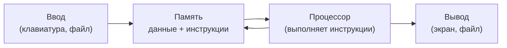

# Что такое программирование

**Предпосылки:** нет.

-> [Ассемблер](assembler.md)

Каждый день вы запускаете десятки программ: открываете браузер, отправляете сообщение, переводите деньги. За каждым действием — тысячи шагов, которые кто-то записал заранее. Но почему компьютер не может разобраться сам?

Потому что компьютер не понимает задач. Он не знает, что такое зарплата, налог или бонус. Он умеет только выполнять элементарные операции: сложить два числа, сравнить два числа, скопировать число из одного места в другое. Когда бухгалтерии нужно посчитать зарплату каждого из десяти тысяч сотрудников — взять оклад, вычесть налог, прибавить бонус — это тридцать тысяч арифметических действий. Человек потратит неделю и допустит ошибки. Компьютер выполнит те же действия за миллисекунды — но только если кто-то заранее разложит задачу на элементарные шаги и запишет их.

Набор таких шагов называется программой. Человек, который записывает эти шаги, — программист. А сам процесс записи — программирование.

## Из чего состоит компьютер (упрощённо)

Чтобы понять, как записывать инструкции для компьютера, нужно знать, из чего он состоит. Полная картина сложна, но для начала достаточно трёх частей:

**Память** хранит данные и инструкции. Можно представить её как длинный ряд пронумерованных ячеек, в каждой из которых лежит число. В одних ячейках — данные (оклады сотрудников, ставка налога), в других — сами инструкции программы.

**Процессор** читает инструкции из памяти одну за другой и выполняет их. Он умеет складывать, вычитать, сравнивать числа и решать, какую инструкцию выполнить следующей. Процессор — единственная часть компьютера, которая что-то вычисляет. Всё остальное — хранение и передача данных.

**Ввод и вывод** — это способ общения компьютера с внешним миром. Клавиатура, файл на диске, сетевое соединение — способы ввода: через них данные попадают в память. Экран, принтер, тот же файл — способы вывода: через них результат попадает к человеку.



Этих трёх частей достаточно, чтобы объяснить любую программу: данные приходят через ввод, ложатся в память, процессор обрабатывает их по инструкциям, результат уходит на вывод. Полная картина устройства процессора — в [Computer](../computer/cpu.md).

## Первая программа

Запишем шаги для задачи «сложить два числа и показать результат». Используем обычный русский язык — процессор его не поймёт, но сначала важно увидеть саму идею:

```text
1. Возьми число из ячейки памяти №1
2. Возьми число из ячейки памяти №2
3. Сложи эти два числа
4. Положи результат в ячейку памяти №3
5. Покажи содержимое ячейки №3 на экране
```

Пять шагов — и задача решена. Каждый шаг элементарен: процессор не складывает «зарплату» и «бонус» — он складывает число из одной ячейки с числом из другой. Слова «зарплата» и «бонус» существуют только в голове программиста.

Для десяти тысяч сотрудников программа будет длиннее, но принцип тот же: каждый шаг — одна элементарная операция. Сложность задачи не в одном шаге, а в том, что шагов тысячи, и каждый должен быть записан правильно.

## Как всё начиналось

Идея записывать инструкции для вычислительной машины появилась задолго до первых компьютеров. В 1843 году Ада Лавлейс (Ada Lovelace) описала последовательность операций для аналитической машины Чарльза Бэббиджа — механического устройства, которое так и не было построено при его жизни. Этот набор шагов считается первой программой в истории.

Через сто лет появились электронные компьютеры. ENIAC (Electronic Numerical Integrator and Computer, 1945) занимал целую комнату и программировался вручную: операторы переключали провода и устанавливали переключатели, чтобы задать последовательность операций. Каждая новая задача требовала физической перенастройки машины.

Следующий шаг — хранимая программа: инструкции записываются в ту же память, что и данные. Компьютер читает инструкции из памяти, а не из проводов. Чтобы сменить задачу, достаточно загрузить в память другой набор инструкций. Эта идея, предложенная Джоном фон Нейманом (John von Neumann) в 1945 году, лежит в основе всех современных компьютеров.

Но сами инструкции записывались в виде чисел — единственном формате, понятном процессору. Программа для сложения двух чисел выглядела как последовательность кодов: `0010 0001`, `0100 0010`, `0001 0011`. Каждый код — одна операция, но человеку они ничего не говорят. Чтение, написание и отладка такой программы превращались в мучительную работу с таблицами кодов. Подробнее о двоичной записи — в [Двоичная система и байты](../foundations/binary-and-bytes.md).

Эта проблема — как сделать инструкции читаемыми для человека, не теряя точности для машины — определила всю дальнейшую историю языков программирования.

## Sources

- Dasgupta, S., 2014, *It Began with Babbage: The Genesis of Computer Science*. Oxford University Press.
- Campbell-Kelly, M. et al., 2013, *Computer: A History of the Information Machine*. Westview Press.

---

-> [Ассемблер](assembler.md)
