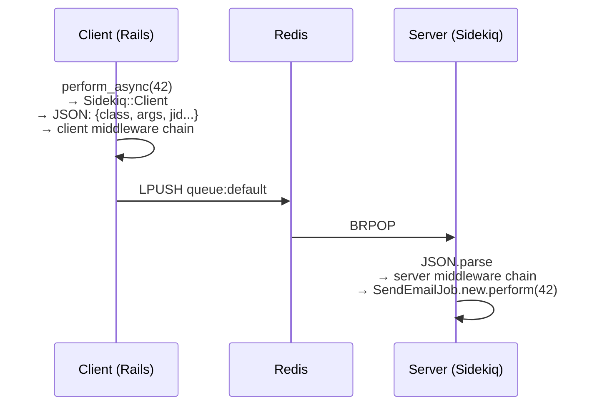

---
tags:
  - domain/rails
  - theme/queues
  - type/concept
aliases:
  - job lifecycle
  - perform_async
  - middleware
order: 1
---

# Жизненный цикл задачи

**Предпосылки:** [архитектура Sidekiq](architecture.md).

<- [Архитектура](architecture.md) | [Гарантии и идемпотентность](guarantees.md) ->

Архитектура — карта: три роли, структуры данных, компоненты процесса. Но что конкретно происходит, когда код вызывает `SendEmailJob.perform_async(user_id)`?

## Client: от вызова до Redis

Вызов `perform_async` запускает цепочку на стороне Rails-приложения:

```ruby
SendEmailJob.perform_async(42)
```

1. Sidekiq::Client создаёт JSON-хеш с описанием задачи. Это не фиксированный «формат на все времена», а базовый payload, который потом может обрасти полями для retry, schedule или ActiveJob:

```json
{
  "class": "SendEmailJob",
  "args": [42],
  "queue": "default",
  "jid": "b4a577edbccf1d805744efa9",
  "created_at": 1712560000123,
  "enqueued_at": 1712560000123,
  "retry": true
}
```

`jid` (job ID) — уникальный идентификатор конкретного вызова, 12 случайных байт в hex (24 символа). `class` указывает, какой Ruby-класс выполнит работу. `args` — аргументы для метода `perform`.

`created_at` фиксирует момент создания job. `enqueued_at` показывает момент попадания в рабочую очередь. Для scheduled job это поле появится позже, когда [[rails/sidekiq/architecture#устройство-серверного-процесса|Poller]] переместит задачу из `schedule` в обычную queue. Формат `*_at` зависит от версии: в Sidekiq 7.x это epoch seconds с дробной частью, в 8.0+ — integer milliseconds.

2. JSON-хеш проходит через **client middleware chain** — цепочку обработчиков, каждый из которых может модифицировать или отклонить задачу. Middleware-обработчик получает хеш, может добавить поля (request_id, tenant_id), вызывает `yield` для передачи дальше по цепочке.

3. После middleware Sidekiq выполняет `LPUSH queue:default '<json>'` — задача в Redis.

## Ограничения аргументов: почему только примитивы

Sidekiq сериализует задачу через `JSON.dump` и десериализует через `JSON.parse`. JSON — текстовый формат, который поддерживает только примитивные типы: String, Integer, Float, Boolean, nil, Array и Hash со строковыми ключами.

Что происходит с типами, которые JSON не знает:

```ruby
# ActiveRecord-объект → бесполезная строка
SendEmailJob.perform_async(User.find(1))
# В Redis: {"args":["#<User:0x000055f1a2b3c4d5>"]}
# perform получит строку "#<User:0x...>", а не объект

# Symbol (:active — легковесный идентификатор Ruby) → строка, ключи тоже строки
SendEmailJob.perform_async(status: :active)
# В Redis: {"args":[{"status":"active"}]}
# perform получит {"status" => "active"}, не {status: :active}

# Time → строка
SendEmailJob.perform_async(Time.now)
# В Redis: {"args":["2024-01-15 10:30:00 +0000"]}
# perform получит строку, не Time-объект
```

Правильный подход — передавать ID и загружать объект из базы внутри `perform`:

```ruby
# Вместо perform_async(user) — передать ID
SendEmailJob.perform_async(user.id)

def perform(user_id)
  user = User.find(user_id)  # свежие данные из БД
  UserMailer.welcome(user).deliver_now
end
```

Побочный бонус: между постановкой задачи и выполнением может пройти время (очередь забита). Загрузка из базы даёт актуальное состояние объекта, а не устаревший снимок.

## Server: от Redis до perform

На стороне серверного процесса [[rails/sidekiq/architecture#устройство-серверного-процесса|Processor]] выполняет зеркальную цепочку:

1. `BRPOP queue:default <timeout>` — [[rails/sidekiq/architecture#устройство-серверного-процесса|Processor]] ждёт задачу из Redis. Если очередь пуста, после короткого timeout он повторяет попытку. Если задача есть — `BRPOP` атомарно извлекает её из списка.

2. `JSON.parse` — десериализация JSON обратно в хеш.

3. Хеш проходит через **server middleware chain**. Server middleware оборачивает выполнение задачи: типичные примеры — логирование (записать начало/конец), метрики (замерить время), восстановление контекста (установить `Current.request_id` из поля задачи).

4. Sidekiq создаёт экземпляр класса (в данном примере `SendEmailJob.new`) и вызывает `perform(42)` с аргументами из JSON.

Полная цепочка:



## Middleware

Client и server middleware работают по одному принципу: каждый обработчик вызывает `yield`, чтобы передать управление следующему в цепочке (или основному действию), и может выполнить код до и после:

```ruby
class LoggingMiddleware
  include Sidekiq::ServerMiddleware

  def call(job_instance, job_payload, queue)
    # CLOCK_MONOTONIC — монотонные часы ОС, не подвержены переводу системного времени
    start = Process.clock_gettime(Process::CLOCK_MONOTONIC)
    yield  # следующий middleware или perform
    duration = Process.clock_gettime(Process::CLOCK_MONOTONIC) - start
    logger.info "#{job_payload['class']} completed in #{duration.round(3)}s"
  end
end
```

Регистрация middleware — в инициализаторе Rails:

```ruby
Sidekiq.configure_server do |config|
  config.server_middleware do |chain|
    chain.add LoggingMiddleware
  end
end
```

Client middleware настраивается и на стороне client (`configure_client`), и на стороне server (`configure_server`) — потому что серверные задачи тоже могут ставить новые задачи (fan-out).

## Отложенные задачи

`perform_in` и `perform_at` не кладут задачу в рабочую очередь. Вместо этого задача попадает в sorted set `schedule`:

```ruby
SendEmailJob.perform_in(5.minutes, user_id)
# → ZADD schedule <Time.now + 300> '<json>'
```

Задача лежит в `schedule`, пока не наступит её время. [[rails/sidekiq/architecture#устройство-серверного-процесса|Poller]]-поток периодически проверяет sorted set: выбирает задачи со score ≤ текущему времени и перемещает их в рабочую очередь (`LPUSH`). После этого задача проходит обычный путь: `BRPOP` → middleware → `perform`.

Интервал проверки [[rails/sidekiq/architecture#устройство-серверного-процесса|Poller]] масштабируется с количеством процессов: чем больше процессов в кластере, тем реже каждый проверяет, чтобы не создавать лишнюю нагрузку на Redis.

---

Задача прошла полный путь и выполнена. Через два часа Sidekiq-процесс убит [[linux/programming/memory-management#OOM killer: последняя линия защиты|OOM-killer]] (механизм ядра Linux, который принудительно завершает процесс при нехватке памяти). Десять задач были в работе. В стандартном fetch-цикле `BRPOP` уже удалил их из Redis — все десять потеряны навсегда.

---

<- [Архитектура](architecture.md) | [Гарантии и идемпотентность](guarantees.md) ->

## Sources

- [Sidekiq Wiki — Getting Started](https://github.com/sidekiq/sidekiq/wiki/Getting-Started)
- [Sidekiq Wiki — Best Practices](https://github.com/sidekiq/sidekiq/wiki/Best-Practices)
- [Sidekiq Wiki — Job Format](https://github.com/sidekiq/sidekiq/wiki/Job-Format)
