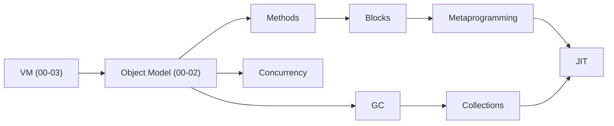

---
tags:
  - domain/ruby
  - theme/internals
  - type/overview
aliases:
  - Ruby Internals
  - YARV
order: 0
---

# Ruby Internals: от исходного кода до исполнения

> [!info]- Предпосылки
> [программирование](../../programming/programming.md) — синтаксис Ruby, классы, модули, блоки; [аппаратное обеспечение](../../computer/computer.md) — CPU, иерархия памяти, ABI, атомарные инструкции; [Linux](../../linux/linux.md) — процессы, потоки, виртуальная память, системные вызовы.

Ruby-программа проходит путь от текста до результата через несколько фаз: парсинг, компиляция в байткод, исполнение виртуальной машиной. По пути VM работает с объектами, классами, модулями, методами и блоками — каждый из которых имеет конкретное представление в C-коде CRuby. Понимание этих представлений объясняет поведение Ruby, которое на уровне языка кажется магическим.

Сама VM — это программа пользовательского уровня на C: для потоков она использует pthread, для аллокации — системный malloc, а для скорости горячего пути полагается на аппаратную иерархию памяти и ABI процессора. Поэтому дальше регулярно встретятся ссылки на [Linux](../../linux/linux.md) и [архитектуру компьютера](../../computer/computer.md).

## Порядок изучения

### VM: от текста до исполнения

Четыре фазы обработки Ruby-кода: текст → токены → AST → байткод → исполнение на стековой виртуальной машине.

- [[ruby/internal/vm/tokenization-and-parsing|Токенизация и парсинг]] — текст → токены → AST
- [[ruby/internal/vm/compilation|Компиляция]] — AST → [[ruby/internal/vm/compilation|ISeq]] (байткод YARV)
- [[ruby/internal/vm/execution|Исполнение]] — фреймы, [[ruby/internal/vm/execution|EP]], стек значений, VM-цикл
- [[ruby/internal/vm/control-flow|Управление потоком]] — if/while, break/return через jump и throw

### Объектная модель

Как Ruby представляет объекты, классы и модули в памяти. Зависит от VM ([[ruby/internal/object-model/objects-and-classes|VALUE]], фреймы).

- [[ruby/internal/object-model/objects-and-classes|Объекты и классы]] — RObject, RClass, метакласс, m_tbl
- [[ruby/internal/object-model/modules|Модули]] — include/prepend, iclass, цепочка super, поиск констант через [[ruby/internal/object-model/modules|CREF]]
- [[ruby/internal/object-model/shapes|Формы (Shapes)]] — [[ruby/internal/object-model/shapes|shape_id]], инлайн-кеш доступа к ivar

*После Object Model — две независимые ветки. Можно читать в любом порядке.*

---

### Ветка A: Методы и метапрограммирование

**Методы.** Жизненный цикл метода: поиск, вызов, определение, удаление. Зависит от объектной модели (m_tbl, цепочка super) и VM (фреймы, [[ruby/internal/vm/compilation|ISeq]]).

- [[ruby/internal/methods/method-dispatch|Диспетчеризация методов]] — поиск метода, типы вызова, method cache
- [[ruby/internal/methods/method-definition|Определение методов]] — def, [[ruby/internal/methods/method-definition|CREF]], definemethod, remove/undef

**Блоки и замыкания.** Замыкания, Proc, lambda. Зависит от VM ([[ruby/internal/vm/execution|EP]], фреймы), компиляции ([[ruby/internal/vm/compilation|ISeq]]) и управления потоком (throw).

- [Блоки](blocks.md) — yield, Proc.new, lambda, stack-to-heap promotion

**Метапрограммирование.** eval, instance_eval, define_method, refinements. Зависит от определения методов ([[ruby/internal/methods/method-definition|CREF]]) и блоков (замыкания, [[ruby/internal/vm/execution|EP]]).

- [Метапрограммирование](metaprogramming.md) — eval, instance_eval, define_method, refinements

---

### Ветка B: Память и коллекции

**Сборка мусора.** Управление памятью: аллокация, mark-sweep, генерации, компактификация. Зависит от VM ([[ruby/internal/object-model/objects-and-classes|VALUE]], стек) и объектной модели (RBasic, flags).

- [GC](gc.md) — mark-sweep, generational, incremental, compaction, VWA

**Коллекции.** Внутреннее устройство встроенных типов Array, Hash, String. Зависит от объектной модели ([[ruby/internal/object-model/objects-and-classes|VALUE]], RBasic), GC (VWA, слоты, write barrier) и [структур данных](../../algorithms-and-data-structures/algorithms-and-data-structures.md).

- [[ruby/internal/collections/array|Array]] — RArray: embedded/heap-хранение, стратегия роста (×1.5), shared-массивы (CoW)
- [[ruby/internal/collections/hash|Hash]] — RHash: AR table (≤8 элементов), ST table (open addressing), переход между ними
- [[ruby/internal/collections/string|String]] — RString: embedded/heap, кодировки, CoW, frozen strings, интернирование (fstring)

---

### JIT-компиляция

JIT — компиляция горячего байткода в машинный код во время работы программы. В этой ветке она зависит от обеих линий: VM ([[ruby/internal/vm/compilation|ISeq]], фреймы), методов (инлайн-кеш, CME), форм ([[ruby/internal/object-model/shapes|shape_id]]), GC (code cache).

- [JIT-компиляция](jit.md) — YJIT (BBV), ZJIT (method-based), охранные проверки, инвалидация, кеш кода

---

### Конкурентность

Как несколько потоков исполняют Ruby-код, какие гарантии даёт GVL, как Fiber и Ractor решают проблемы, которые не решают потоки. Зависит от VM ([[ruby/internal/vm/execution|исполнения]], барьеров памяти), объектной модели (shareable объекты для Ractor) и диспетчеризации методов (атомарность между байткод-инструкциями).

- [Конкурентность](concurrency.md) — Thread, GVL, Fiber, Ractor, серверы (Puma, Falcon, Sidekiq)

## Как всё связано

**VM vs Объектная модель:** VM оперирует значениями типа [[ruby/internal/object-model/objects-and-classes|VALUE]] на стеке. Объектная модель определяет, что стоит за каждым VALUE — RObject с массивом ivar и указателем klass. VM использует klass для диспетчеризации методов, shapes — для доступа к переменным.

**Статическая структура vs Динамическое поведение:** Объектная модель (классы, модули, shapes) задаёт структуру — где лежат методы и переменные. Методы и блоки определяют поведение — как код находится и исполняется. Метапрограммирование размывает эту границу: `define_method` создаёт метод из замыкания, `instance_eval` меняет `self` и лексическую область.

**Кеширование на каждом уровне:** Shapes кешируют доступ к ivar ([[ruby/internal/object-model/shapes|`shape_id`]] → index). Method cache кеширует поиск методов (class serial → method entry). JIT-компилятор добавляет третий уровень — специализированный машинный код, который опирается на shape cache и method cache. Все три механизма оптимизируют горячий путь и инвалидируются при изменении структуры: переопределение метода сбрасывает method cache и JIT-код, изменение формы объекта сбрасывает shape cache и JIT-guard'ы.

**Объектная модель vs Коллекции:** Обобщённый `RObject` хранит ivar в массиве, а klass определяет поведение. Встроенные типы (Array, Hash, String) заменяют `RObject` специализированными структурами (`RArray`, `RHash`, `RString`), оптимизированными под конкретный паттерн доступа. Все начинаются с `RBasic` — поэтому `klass`, GC-флаги и shapes работают одинаково для любого объекта.

**Коллекции vs GC:** VWA из GC напрямую влияет на производительность коллекций: чем крупнее слот, тем больше данных хранится в embedded-режиме без malloc. Write barrier из generational GC срабатывает при каждой записи в массив или хеш. Compaction может переместить коллекцию в больший слот, вернув её из heap в embedded.

## Sources

- CRuby source repository: https://github.com/ruby/ruby
- Pat Shaughnessy, 2013, *Ruby Under a Microscope* — Ruby internals from tokenization to GC
