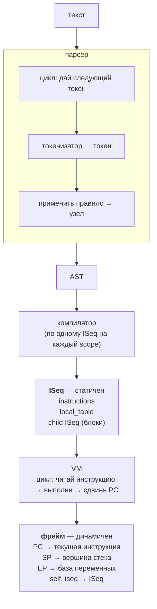

# Исполнение

**Предпосылки:** [Компиляция](compilation.md) — ISeq, local table, стековая машина, два стека (значений и фреймов).

← [Компиляция](compilation.md) | [Управление потоком](control-flow.md) →

Код прошёл три превращения: текст → токены → AST → инструкции YARV. Результат — ISeq: плоский массив инструкций плюс таблица локальных переменных. Но инструкции — это данные. Сами по себе `putobject 2` и `opt_plus` ничего не делают. Нужен механизм, который будет читать их одну за другой и выполнять. Этот механизм — виртуальная машина YARV.

```
текст → токены → AST → инструкции YARV → исполнение
                                          ^^^^^^^^^^
```

## Фрейм: контекст исполнения

Чтобы исполнять инструкции, VM нужно помнить несколько вещей одновременно: какую инструкцию выполнять следующей, где вершина стека значений, кто текущий `self`, где лежат локальные переменные. В любом языке с вызовами функций эту роль играет **фрейм** (frame — «кадр»: один вызов = один кадр со всем состоянием) — снимок состояния одного вызова. В YARV фрейм — C-структура `rb_control_frame_t`, по одному экземпляру на каждый активный вызов в стеке фреймов. Пять ключевых полей фрейма:

- **PC** (Program Counter) — указатель на следующую инструкцию в ISeq. Названия из мира процессоров: PC «считает» позицию в программе.
- **SP** (Stack Pointer) — вершина порции стека значений, принадлежащей этому фрейму. Двигается при каждом push/pop.
- **EP** (Environment Pointer) — дно той же порции: база локальных переменных. Фиксирована на протяжении жизни фрейма.
- **self** — текущий получатель.
- **iseq** — ссылка на ISeq, чьи инструкции исполняются.

Стек значений — один непрерывный регион памяти. Каждый фрейм занимает в нём свою порцию: от EP (локальные переменные) до SP (вершина вычислений). Когда VM вызывает метод, новый фрейм начинает свою порцию там, где остановился SP предыдущего:

```
стек значений (один регион, растёт вверх):

              ┌──────────┐
  SP(puts) →  │  ...     │  рабочие значения puts
              ├──────────┤
  EP(puts) →  │  ...     │  локальные переменные puts
              ╞══════════╡  ← puts вызван, когда SP(main) был здесь
              │    4     │  аргумент puts
              │  self    │  получатель puts
              ├──────────┤
  EP(main) →  │  ...     │  локальные переменные main
              └──────────┘
```

Два фрейма — две порции одного стека. У каждого свои SP и EP, но физически значения лежат друг над другом. Когда `puts` завершится, его порция освободится, и SP вызывающего фрейма вернётся к прежней позиции.

ISeq — это «программа», фрейм — «состояние её выполнения». Один и тот же ISeq может исполняться несколькими фреймами одновременно: при рекурсии каждый вызов создаёт новый фрейм с собственными PC, SP и переменными, но все они ссылаются на один и тот же ISeq.

## Пошаговое исполнение `puts 2+2`

Проследим, как VM исполняет скомпилированные инструкции. На каждом шаге PC указывает на текущую инструкцию, а стек значений меняется:

```
PC →                     стек значений
──────────────────────────────────────────
putself                  [self]
putobject 2              [self, 2]
putobject 2              [self, 2, 2]
opt_plus                 [self, 4]
opt_send_without_block   [nil]
leave                    конец
```

`putself` кладёт текущий `self` на стек — это получатель `puts`. Два `putobject 2` кладут аргументы для `+`. `opt_plus` снимает два верхних значения, складывает, кладёт результат `4`. `opt_send_without_block` снимает `self` и `4`, вызывает `puts(4)` — на консоль выводится `4`, а на стек кладётся возвращаемое значение `nil`. `leave` завершает программу.

Вся работа VM — это цикл: прочитай инструкцию по PC → выполни (это может двигать SP) → сдвинь PC → повтори. Цикл заканчивается на `leave`.

## Вызов метода: новый фрейм

Что происходит на шаге `opt_send_without_block`? VM не может просто «прыгнуть» к коду `puts` — ей нужно запомнить, куда вернуться после того, как `puts` закончит работу. Для этого VM создаёт новый фрейм.

При вызове VM создаёт новый фрейм (**push**): в нём свой PC (начало инструкций вызываемого метода), свой SP, свой EP, свой `self`. **CFP** (Control Frame Pointer — указатель на текущий активный фрейм) переключается на новый. VM продолжает цикл, но теперь исполняет инструкции вызванного метода. Когда метод завершается (`leave`), фрейм удаляется (**pop**), возвращаемое значение кладётся на стек вызывающего фрейма, CFP возвращается назад.

Каждый вызов метода или блока — push фрейма. Каждый возврат — pop. Стек фреймов — это и есть call stack, тот самый, который вы видите в backtrace при ошибке.

## Стек фреймов в действии

Возьмём `10.times do |n| puts n end`. В момент, когда VM исполняет `puts n` внутри блока, стек фреймов выглядит так:

```
CFP → BLOCK   do |n| puts n end
      CFUNC   Integer#times
      EVAL    основная программа
      TOP     начальный фрейм
```

Каждый уровень — отдельный фрейм со своим типом. В основании лежит **TOP** — технический начальный фрейм, который Ruby создаёт при старте. Над ним — **EVAL**, фрейм верхнего уровня программы (ваш скрипт): именно он исполняет инструкции `putobject 10`, `send :times`. Следующий — **CFUNC**: `Integer#times` написан на C, у него нет собственного ISeq, VM вызывает C-код напрямую, и поле `iseq` в таком фрейме пустое. На вершине — **BLOCK**, фрейм блока `do |n| puts n end` со своим ISeq (второй фрагмент, который компилятор создал для блока), своим PC и своим EP с параметром `n`.

`Integer#times` вызывает блок 10 раз. Каждый раз BLOCK-фрейм создаётся и удаляется. В этом стеке видны все четыре уровня, если остановить программу внутри блока — например, через backtrace при ошибке.

Есть ещё тип **METHOD** — для обычных Ruby-методов. Если бы мы вызвали `def greet; puts "hi"; end; greet`, на вершине стека вместо BLOCK был бы METHOD-фрейм с ISeq метода `greet`.

## Локальные переменные

Фрейм резервирует слоты для локальных переменных ниже EP — но сколько слотов резервировать и как соотнести имя переменной с номером слота? Эту информацию содержит local table — часть ISeq. Компилятор, обходя AST, собирает все локальные переменные (сначала параметры метода/блока, потом присваивания) и записывает их в local table с фиксированными индексами. Поле `local_table_size` в ISeq — количество слотов, которое VM выделит на стеке при создании фрейма для этого ISeq. В дизассемблере это видно так:

```
local table (size: 1, argc: 0)
[ 1] name@0
```

`size: 1` — при создании фрейма для `greet` VM зарезервирует один слот ниже EP. Если бы переменных было три — `size: 3`, три слота. Количество известно заранее, на этапе компиляции, и не меняется во время исполнения.

Индексы зафиксированы — и теперь VM может адресовать переменные как смещения от EP. Локальные переменные лежат на стеке значений, в фиксированной части порции текущего фрейма. EP (Environment Pointer) указывает на базу этой области. Инструкция `setlocal idx` берёт значение с вершины стека и записывает в слот `EP - idx`. Инструкция `getlocal idx` читает значение из слота `EP - idx` и кладёт на вершину стека.

Посмотрим на примере:

```ruby
str = "hello"
puts str
```

Инструкции:

```
putstring "hello"            стек: ["hello"]
setlocal_WC_0 str            стек: []           ← "hello" ушло в слот EP-1
                             (суффикс _WC_0 — WC = walk count,
                              уровень вверх по цепочке EP; 0 = текущий фрейм;
                              подробнее уровни разберём в замыканиях)
putself                      стек: [self]
getlocal_WC_0 str            стек: [self, "hello"]  ← поднято из слота
opt_send_without_block :puts стек: [nil]
leave
```

На шаге `getlocal_WC_0 str` стек выглядит так:

```
         SP →  ┌──────────┐
               │ "hello"  │  ← getlocal подняло из слота
               ├──────────┤
               │  self    │  ← putself
         EP →  ├──────────┤
               │ "hello"  │  ← слот str (EP-1)
               └──────────┘
```

Выше EP — рабочая область: значения, которые инструкции кладут и забирают. Ниже EP (включительно) — слоты локальных переменных, неподвижные на протяжении всего фрейма. SP двигается на каждом шаге — значения приходят и уходят. EP остаётся на месте — это фиксированная «база», относительно которой адресуются переменные. EP — «полка» для переменных: фиксированная, на ней всегда лежит одно и то же. SP — «рабочий стол» для промежуточных вычислений: значения приходят и уходят на каждом шаге.

## Динамический доступ: замыкания

До сих пор все переменные были в текущем фрейме. Но что если блок обращается к переменной из окружающего метода?

```ruby
def greet
  name = "Ruby"
  3.times { puts name }
end
```

Внутри блока `{ puts name }` переменная `name` — не параметр блока и не локальная переменная блока. Она объявлена в методе `greet`, то есть в другом фрейме. Как VM её находит?

Каждый block-фрейм хранит ссылку на EP родительского окружения — того scope, в котором блок был создан. Когда VM встречает инструкцию `getlocal idx, 1`, она берёт EP текущего фрейма, переходит по ссылке на один уровень вверх — к EP родительского scope (метода `greet`) — и читает значение по адресу `EP - idx`.

Второй параметр `1` — это количество шагов вверх по цепочке. Для вложенных блоков (блок внутри блока) будет `level=2`, `level=3` и так далее — VM пройдёт по цепочке EP соответствующее число шагов.

Это механизм замыканий: блок «помнит» окружение, в котором был создан, через ссылку на родительский EP. Поэтому `{ puts name }` видит переменную `name` из метода `greet`, даже когда между ними в стеке вызовов стоит C-фрейм `Integer#times`.

Инструкции `getlocal_WC_0` (level=0, текущий фрейм) и `getlocal_WC_1` (level=1, один уровень вверх) — специализированные версии для самых частых случаев.

## Инструменты

Фреймы, EP-цепочки и local table можно наблюдать на практике. Стек фреймов виден через `caller`:

```ruby
def show_frames
  puts caller
end
show_frames
# => -e:1:in `<main>'
```

А инструкции с динамическим доступом — через `RubyVM::InstructionSequence`:

```ruby
code = <<~RUBY
  def greet
    name = "Ruby"
    3.times { puts name }
  end
RUBY
puts RubyVM::InstructionSequence.compile(code).disasm
```

```
== disasm: #<ISeq:greet@<compiled>:1 (1,0)-(4,3)>
local table (size: 1, argc: 0)
[ 1] name@0
0000 putstring                              "Ruby"
0002 setlocal_WC_0                          name@0
0004 putobject                              3
0006 send                                   <calldata!mid:times, argc:0>, block in greet
0009 leave

== disasm: #<ISeq:block in greet@<compiled>:3 (3,10)-(3,23)>
0000 putself
0001 getlocal_WC_1                          name@0
0003 opt_send_without_block                 <calldata!mid:puts, argc:1, FCALL|ARGS_SIMPLE>
0005 leave
```

Два фрагмента — метод `greet` и блок. В заголовке метода — `local table (size: 1, argc: 0)`: одна локальная переменная `name`, один слот ниже EP при создании фрейма. В методе: `setlocal_WC_0 name` — запись переменной в текущий фрейм (level=0). В блоке: `getlocal_WC_1 name` — чтение из родительского фрейма (level=1). Блок не имеет своей local table — переменная `name` принадлежит методу `greet`.

## Путь программы

Три заметки покрыли путь от исходного текста до результата. Вот как связаны ключевые структуры:



ISeq и фрейм — ключевое разделение. ISeq — это «программа»: один на scope, не меняется. Фрейм — это «запуск программы»: один на вызов, у каждого свои PC, SP, EP. При рекурсии десять фреймов ссылаются на один и тот же ISeq.

Для `10.times { |n| puts n }` путь выглядит так: текст → 13 токенов → AST с узлами `call` и `do_block` → два ISeq (программа и блок). При исполнении VM создаёт фреймы TOP → EVAL (исполняет ISeq программы) → CFUNC (`Integer#times`, C-код без ISeq) → BLOCK (исполняет ISeq блока — создаётся и уничтожается 10 раз).

## Sources

- Pat Shaughnessy, 2013, *Ruby Under a Microscope* — глава 3: исполнение.
- Ruby VM stack and frames: https://docs.ruby-lang.org/en/master/contributing/vm_stack_and_frames_md.html
- Ruby contributing glossary (PC, SP, EP, CFP): https://docs.ruby-lang.org/en/master/contributing/glossary_md.html

---

← [Компиляция](compilation.md) | [Управление потоком](control-flow.md) →
