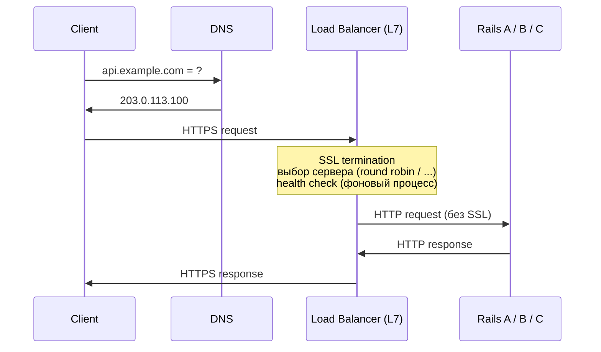

---
tags:
  - domain/system-design
  - theme/performance
  - theme/reliability
  - type/concept
aliases:
  - Load Balancing
  - Load Balancer
order: 7
---

# Load Balancing

**Предпосылки:** клиент-серверная архитектура, DNS (домен → IP), [TCP](../networking/transport/tcp.md)/[HTTP](../networking/application/http.md), горизонтальное масштабирование (несколько одинаковых серверов), понятие отказа узла.

Горизонтальное масштабирование решает проблему пропускной способности: один сервер обрабатывает 100 RPS, три сервера — 300. Но появляется новый вопрос: как клиент узнает, на какой из трёх серверов отправить запрос? При одном сервере DNS возвращает один IP, и клиент идёт туда. При десяти серверах — десять IP. Если клиент выбирает случайно, он продолжит слать запросы на мёртвый сервер и получать таймауты. Load balancer — компонент, который принимает все входящие запросы и распределяет их между живыми серверами.

```
БЕЗ load balancer:              С load balancer:

Клиенты    Серверы               Клиенты         Серверы
   │          │                     │               │
   ├────────> A                     │    ┌───────> A
   ├────────> B                     ├───>│ LB ├──> B
   └────────> C                     │    └───────> C
                                    │
Клиент сам выбирает.             LB выбирает за клиента.
Откуда он знает, кто жив?        LB знает, кто жив.
```

Load balancer выполняет три функции. Распределение нагрузки — раскидывает запросы между серверами, чтобы ни один не был перегружен, пока другие простаивают. Абстракция от количества серверов — клиент знает один адрес (адрес LB), сколько серверов за ним — 2 или 200 — клиенту неважно, серверы добавляются и убираются без изменения клиентов. Исключение мёртвых серверов — если сервер упал, LB перестаёт слать на него запросы, клиенты не видят ошибок (кроме запросов, которые были в полёте в момент падения).

## Health checks: как LB узнаёт, кто жив

Сервер может упасть, зависнуть или перестать отвечать. LB должен обнаружить это и исключить сервер из ротации. Два механизма решают задачу с разных сторон.

**Passive health check** — LB замечает проблему по результатам реальных запросов. Таймаут, connection refused, 5xx — после N неудачных ответов подряд LB помечает сервер как unhealthy и перестаёт слать на него. Цена: несколько клиентских запросов провалятся, прежде чем сервер будет исключён.

**Active health check** — LB сам периодически опрашивает endpoint (обычно `/health` или `/healthz`), не дожидаясь клиентского трафика. Обнаруживает проблему превентивно: клиенты ещё не пострадали, а сервер уже исключён.

```
Passive:                          Active:

Client ──req──► LB ──req──► B     LB ──GET /health──► B
                    timeout              │
LB: "B не ответил,                      200 OK
     счётчик ошибок +1"                  │
                                  LB: "B жив"
```

На практике используют оба: active для раннего обнаружения, passive как страховку на случай, если сервер начал сбоить между проверками.

### Когда /health врёт

Процесс может быть жив, но неспособен обрабатывать запросы. Классический случай: один Puma worker завис в бесконечном цикле, но отдельный worker обслуживает `/health` и возвращает `200 OK`. LB считает сервер здоровым, реальные запросы висят.

Поэтому хороший health check проверяет не просто «процесс жив», а «сервис способен выполнять работу»: подключение к базе данных работает, свободные workers есть, очередь не переполнена. Глубокий health check стоит дороже (каждая проверка нагружает сервер), но даёт более точную картину.

## Алгоритмы распределения

LB знает, что все серверы живы. Пришёл запрос. Как выбрать, на какой из серверов его отправить?

### Round Robin

Серверы выстраиваются в очередь, запросы раздаются по кругу: A → B → C → A → B → C. LB хранит только один счётчик — индекс следующего сервера. Никакого отслеживания нагрузки, никаких сравнений.

Для большинства веб-приложений, где запросы короткие (50–200ms) и примерно одинаковые по тяжести, round robin работает: при большом количестве запросов нагрузка статистически выравнивается.

### Weighted Round Robin

Серверы могут отличаться по мощности. Вес задаёт долю трафика, пропорциональную производительности сервера:

```
A (weight=3): мощный сервер
B (weight=1): слабый сервер

Распределение: A → A → A → B → A → A → A → B → ...
```

На каждые 4 запроса: 3 идут на A, 1 на B.

### Least Connections

Round robin не учитывает текущую нагрузку. Если запросы сильно различаются по длительности — один 10ms, другой 5 секунд — round robin может отправить несколько тяжёлых запросов на один сервер подряд. Least connections отправляет запрос на сервер с наименьшим количеством активных соединений.

Цена: LB становится stateful — отслеживает количество активных соединений на каждом сервере, обновляет счётчик при каждом запросе и ответе.

| Стратегия | Когда хороша | Цена |
|-----------|--------------|------|
| Round Robin | Однородные запросы, одинаковые серверы | Никакой |
| Weighted RR | Серверы разной мощности | Настройка весов |
| Least Connections | Запросы разной длительности | Отслеживание состояния |

## Sticky sessions и stateless-серверы

Round robin и least connections предполагают, что любой сервер может обработать любой запрос. Но если сессия пользователя хранится в памяти сервера A, а следующий запрос попадает на сервер B — пользователя попросят залогиниться заново.

**Sticky sessions** (session affinity) — LB запоминает связь «клиент → сервер» и направляет последующие запросы того же клиента на тот же сервер. Идентификация клиента — по IP-адресу (проблема: за одним IP могут быть тысячи пользователей через NAT — сетевой механизм, позволяющий многим устройствам в локальной сети выходить в интернет через один внешний IP) или по cookie (LB добавляет `Set-Cookie: SERVERID=A`, потом читает его при следующих запросах).

Sticky sessions создают три проблемы. Неравномерная нагрузка: round robin больше не выравнивает, «тяжёлые» пользователи перекашивают сервер. Потеря при падении: если сервер A упал, все его sticky-пользователи теряют сессии — на сервере B их данных нет. Сложность масштабирования: добавление нового сервера не перераспределяет существующих пользователей.

Лучшее решение — убрать состояние из серверов. Сессии хранятся во внешнем хранилище (Redis), любой сервер обслуживает любого пользователя. Sticky sessions не нужны, LB свободен в выборе.

```
Stateful (проблема):            Stateless (решение):
Server A: session в памяти      Server A: без состояния ─┐
Server B: session в памяти      Server B: без состояния  ├──> Redis: все сессии
→ нужны sticky sessions         → любой сервер для      ─┘
                                  любого пользователя
```

Stateless-серверы — фундаментальный принцип масштабируемых систем: сервер не должен хранить ничего, что нельзя потерять при его падении.

## L4 vs L7: на каком уровне работает LB

HTTP-запрос проходит через уровни сетевого стека: IP → TCP → HTTP. LB может работать на разных уровнях, и это определяет его возможности.

**L4 (Transport)** видит IP-адреса, порты и TCP-соединения. Содержимое запроса — просто байты. LB принимает TCP-соединение и пробрасывает его на один из серверов. Быстро, минимум ресурсов, но без понимания, что внутри.

**L7 (Application)** видит HTTP: method, URL path, headers, cookies, body. Это позволяет принимать решения на основе содержимого запроса.

Практические возможности L7, недоступные на L4:

**Роутинг по содержимому.** `/api/*` → backend-серверы, `/static/*` → CDN или file server, `/admin/*` → отдельный защищённый сервер. L4 не знает URL — все запросы на порт 443 для него одинаковы.

**Sticky sessions по cookie.** L7 читает `Cookie: SERVERID=A` и направляет на нужный сервер. L4 не видит cookies — только sticky по IP.

**SSL termination.** L7 расшифровывает HTTPS, видит HTTP внутри, может роутить по URL и headers. Серверы за LB получают обычный HTTP — им не нужно заниматься шифрованием. L4 пробрасывает зашифрованный трафик как есть.

**Умные health checks.** L7 отправляет `GET /health`, проверяет HTTP 200 и содержимое ответа. L4 проверяет только «TCP-порт открыт?» — connect succeeded.

| | L4 | L7 |
|---|----|----|
| Скорость | Быстрее (меньше работы) | Медленнее (парсит HTTP) |
| Возможности | Базовые | Роутинг по URL, cookie, SSL termination |
| Ресурсы | Меньше CPU/RAM | Больше |
| Примеры | AWS NLB, HAProxy (tcp mode) | Nginx, HAProxy (http mode), AWS ALB |

## Высокая доступность самого LB

Load balancer решает проблему отказа серверов — но сам становится единой точкой отказа (single point of failure, SPOF). Если LB упал, все три backend-сервера живы, но клиенты не могут до них достучаться.

### Floating IP

Один «виртуальный» IP-адрес, который может перепрыгивать между машинами. Два LB общаются между собой через heartbeat — периодические сигналы «я жив».

```
Нормальная работа:
  Клиент → 203.0.113.100 → LB1 (активный)
                             LB2 (пассивный, ждёт)

LB1 упал:
  Клиент → 203.0.113.100 → LB2 (забрал IP себе)
```

Если LB1 перестаёт отвечать на heartbeat, LB2 забирает виртуальный IP себе. Клиенты продолжают слать на тот же IP, не замечая подмены. Переключение занимает секунды.

### Active-Passive vs Active-Active

**Active-Passive:** один LB работает, второй простаивает в режиме standby. При падении активного — standby забирает IP. Простой и надёжный, но половина мощности не используется.

**Active-Active:** оба LB работают одновременно, трафик делится между ними (через DNS с несколькими A-записями или через протоколы вроде ECMP на сетевом уровне). Ресурсы не простаивают, но сложнее в настройке: нужна синхронизация состояния между LB (таблицы активных соединений, sticky sessions).

## Полный путь запроса



Клиент знает один адрес. DNS резолвит его в IP load balancer'а. LB расшифровывает HTTPS, выбирает живой сервер по алгоритму распределения, пересылает запрос. Сервер обрабатывает, отвечает LB, LB возвращает ответ клиенту. Health checks работают в фоне — к моменту прихода запроса LB уже знает, кто жив.

## Sources

- Kleppmann, 2017, *Designing Data-Intensive Applications*, Chapter 1 — scalability, load parameters
- Nginx Documentation: HTTP Load Balancing. <https://docs.nginx.com/nginx/admin-guide/load-balancer/http-load-balancer/>
- AWS: What is Elastic Load Balancing. <https://docs.aws.amazon.com/elasticloadbalancing/latest/userguide/what-is-load-balancing.html>
