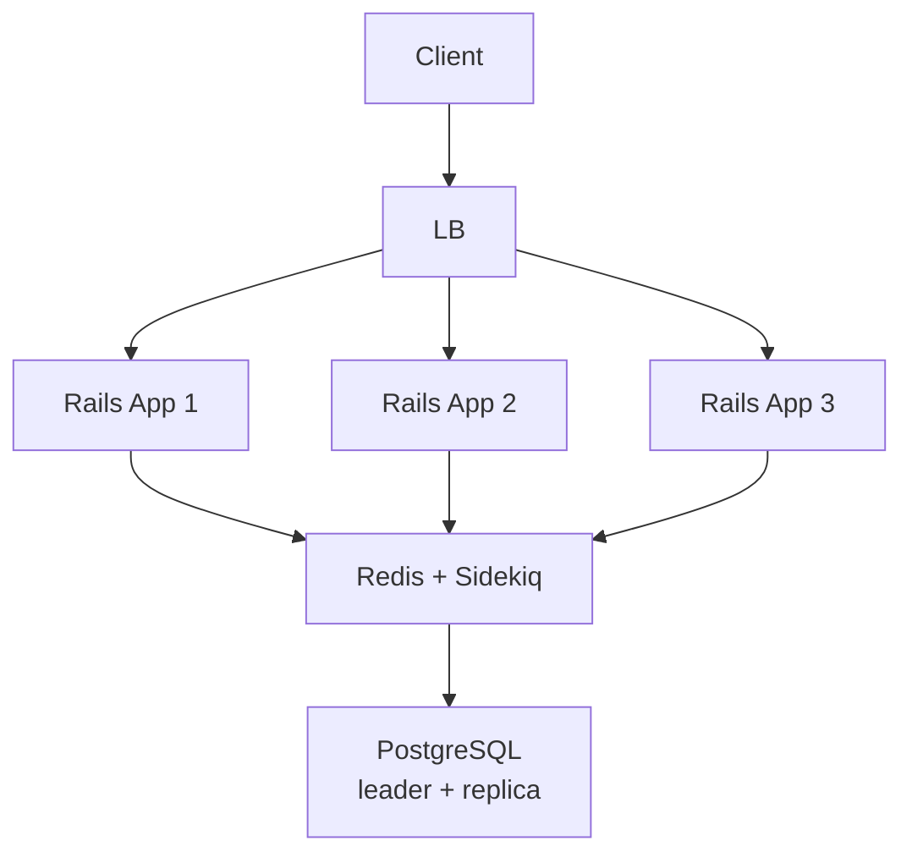

# Микросервисы

**Предпосылки:** [Паттерны надёжности](reliability-patterns.md) (idempotency, circuit breaker, bulkhead), [Message Queues](message-queues.md) (temporal decoupling, pub/sub, consumer groups), [API Design](api-design.md) (REST, gRPC, контракты), базовое понимание SQL-транзакций (ACID, COMMIT/ROLLBACK).

В предыдущей заметке мы определили, как проектировать API — REST для внешних клиентов, gRPC для межсервисного взаимодействия, очереди для асинхронных задач. Но в нашем интернет-магазине всё это пока живёт в одном процессе: `PaymentService.charge(order)` — вызов метода, а не сетевой запрос. Вопрос, который мы ещё не разбирали: когда и зачем этот вызов метода превращается в вызов через сеть к отдельному сервису? И какую цену мы за это платим?

## Монолит, который работает

Интернет-магазин. 50 000 активных пользователей в день (DAU), около 500 запросов в секунду на чтение, 50 на запись. Три инстанса Rails-приложения за load balancer'ом, Redis для кэша и фоновых задач (Sidekiq), PostgreSQL с read replica.



Весь код — один репозиторий, один процесс: Orders, Payments, Inventory, Shipping, Catalog, Analytics, Notification. Оформление заказа выглядит так:

```ruby
class CheckoutService
  def call(user, cart)
    ActiveRecord::Base.transaction do
      order = Order.create!(user: user, items: cart.items)
      InventoryService.new.reserve(order)
      PaymentService.new.charge(order)
    end
    NotificationWorker.perform_async(order.id)
    order
  end
end
```

`InventoryService.reserve` и `PaymentService.charge` — классы в том же процессе. Вызов метода стоит наносекунды. Если `PaymentService.charge` бросает исключение, вся операция откатывается одной транзакцией базы данных: заказ не создан, товар не зарезервирован. Консистентность бесплатная — `ROLLBACK` гарантирует возврат к предыдущему состоянию. Тестирование — один процесс, одна база, обычный RSpec.

Десять разработчиков в одной команде деплоят 3–4 раза в день. Система работает стабильно.

## Что ломается: команда, не сервер

Проходит полтора года. Магазин вырос, компания — с 10 до 60 разработчиков. Появились отдельные команды: Orders (8 человек), Payments (6), Catalog (8), Shipping (7), Analytics (5), Platform (6). Каждая отвечает за свою бизнес-область, но код — один репозиторий, один деплой.

**Конфликты при деплое.** Команда Orders готова выкатить фичу. Но в том же деплое — изменения от Payments, которые ещё не прошли проверку качества. Выбор: ждать Payments (блокировка) или деплоить всё вместе (риск). При шести командах, каждая из которых хочет деплоить 2–3 раза в день — 12–18 деплоев через одну трубу. Feature flags помогают, но усложняют код и не устраняют проблему зависимых миграций базы данных.

**Размытые границы владения.** Разработчик из Shipping добавляет поле в модель `Order` для трекинга. Это ломает тесты в Orders и Payments, потому что `Order` — центральная модель, от которой зависят все. Код разных команд физически живёт в одном процессе и разделяет одни и те же объекты. Кто владеет `Order`? У кого спрашивать разрешение на изменение? При 10 людях это Slack-сообщение и 5 минут. При 60 — митинг, RFC на ревью, цепочка согласований.

**Масштабирование всего сразу.** Black Friday. Каталог выдерживает 10-кратную нагрузку — чтение из кэша. Но оформление заказов захлёбывается: тяжёлые записи в базу, вызовы платёжного шлюза. Чтобы добавить ресурсы для Orders, приходится масштабировать весь монолит — все три инстанса получают больше CPU и RAM, хотя каталогу и аналитике это не нужно.

**Общая база данных.** 60 разработчиков работают с одной PostgreSQL-схемой. 200+ таблиц, миграции от разных команд конфликтуют. Shipping добавляет индекс на таблицу `orders` — миграция блокирует таблицу на время построения (если не использовать `CREATE INDEX CONCURRENTLY`), checkout тормозит.

Сервер не упал. Количество запросов в секунду не превысило лимит. Проблема не в том, что система не справляется с нагрузкой, а в том, что 60 человек не могут эффективно работать с одной кодовой базой. И все четыре проблемы решаемы внутри монолита: хорошее тестовое покрытие ловит поломки от чужих изменений, постепенный деплой с возможностью отката (canary deployment) снижает риск, read replica и отдельные Sidekiq-процессы изолируют нагрузку. Но с ростом команды стоимость этой дисциплины растёт.

## Модульный монолит: границы без сети

Прежде чем разрезать монолит на отдельные процессы с сетевым взаимодействием, можно провести границы внутри него. Модульный монолит — один процесс, один деплой, но с явным разделением на модули, которые общаются через определённые интерфейсы.

В исходном коде `CheckoutService` напрямую обращается к моделям Inventory и Payments — знает их поля, таблицы, внутреннюю структуру. Модульный монолит вводит правило: модули общаются только через публичные интерфейсы, не через внутренние модели друг друга.

```ruby
# modules/orders/services/checkout.rb
module Orders
  class Checkout
    def call(user_id, cart_items)
      order = Order.create!(user_id: user_id)

      Inventory::Api.reserve(
        items: cart_items.map { |i| { sku: i.sku, qty: i.quantity } }
      )
      Payments::Api.charge(
        amount: order.total,
        currency: "USD",
        reference: "order-#{order.id}"
      )

      order
    end
  end
end
```

`Orders::Checkout` не знает, как устроен `Payment` внутри — какие у него модели, таблицы, колонки. Он знает только интерфейс: `Payments::Api.charge(amount:, currency:, reference:)`. Если команда Payments переименует таблицу или перепишет внутреннюю логику — `Orders` не заметит, пока интерфейс стабилен.

Что это даёт. Связанность кода снижается — каждый модуль принадлежит одной команде, изменения внутри модуля не затрагивают чужой код. Риски при деплое уменьшаются — изменение внутренностей Payments не ломает тесты Orders. Появляется подготовка к возможному разделению — если завтра потребуется вынести Payments в отдельный сервис, граница уже определена, интерфейс уже существует.

Чего это не даёт. Все модули — один процесс, одна версия языка, одни и те же зависимости. Независимое масштабирование невозможно: нельзя дать Orders больше ресурсов, не давая их Catalog. Независимый цикл релизов невозможен: деплой одного модуля — это деплой всего монолита. Если команда Analytics хочет использовать Python для моделей машинного обучения — модульный монолит не поможет.

На практике в Rails-экосистеме модульный монолит создаёт трение: фреймворк построен вокруг конвенции «модель = таблица = объект, который путешествует через все слои», и скрытие моделей за публичным API требует отказа от части этих конвенций. Shopify, крупнейший пример модульного монолита на Rails (тысячи разработчиков), использует статический анализатор `packwerk`, который запрещает обращения к приватным классам чужих модулей. Модели внутри модулей остаются обычными ActiveRecord, но cross-module доступ идёт через определённые интерфейсы.

## За пределами модульного монолита

Магазин продолжает расти. 500 000 DAU. 60 разработчиков, 8 модулей. Модульный монолит работает, но появляются новые симптомы — разным частям системы нужны разные характеристики среды выполнения.

**Payments и PCI DSS.** Стандарт обработки карточных данных требует, чтобы компоненты, работающие с картами, были изолированы: отдельный сегмент сети, отдельный аудит, ограниченный доступ. Пока Payments — модуль внутри общего процесса, весь монолит попадает под scope аудита PCI DSS. Каждый из 60 разработчиков формально имеет доступ к коду, обрабатывающему карты.

**Analytics блокирует Orders.** Аналитика запускает тяжёлые агрегации по тем же таблицам, что использует Orders. Длинный `GROUP BY` на таблице orders создаёт конкуренцию за ресурсы, checkout тормозит. Фоновые задачи аналитики занимают 80% пула Sidekiq-воркеров — email-нотификации ждут в очереди. Один процесс — один пул ресурсов, и [bulkhead](reliability-patterns.md) внутри одного процесса ограничен.

**Shipping хочет деплоиться 10 раз в день.** Команда итерирует быстро: A/B тесты алгоритмов доставки, интеграции с новыми курьерскими службами. Каждый их деплой — это деплой всего монолита. Один билд, один CI pipeline на 45 минут, один rollback.

Три разных симптома, но не все требуют одного решения. Проблема Analytics — инфраструктурная: тяжёлые запросы блокируют основную базу. Она решается без нового сервиса — read replica для аналитических запросов, выгрузка в ClickHouse через CDC (change data capture), отдельный Sidekiq-процесс с выделенными очередями. Модуль Analytics остаётся в том же репозитории, но его тяжёлые операции уходят в отдельную инфраструктуру.

Проблемы Payments и Shipping — другие. PCI DSS — внешнее ограничение, которое невозможно удовлетворить внутри общего процесса. Независимый цикл релизов — организационное требование, которое монолит не может дать при одном артефакте деплоя. Это сигнал к выносу в отдельный сервис.

Принцип: инфраструктурные проблемы (нагрузка на базу, нехватка воркеров) решаются инфраструктурно. Организационные и регуляторные проблемы (независимые релизы, compliance) — через границы сервисов.

## Первый сервис

Первым выносится то, что вынуждает внешнее ограничение. Payments и PCI DSS: пока платежи внутри монолита, весь монолит под аудитом. Вынесение Payments сужает PCI scope до одного сервиса — аудит дешевле, доступ ограничен, сетевой сегмент изолирован.

```
┌──────────────────────────────┐     ┌──────────────────┐
│       Rails Monolith         │     │ Payment Service  │
│  ┌────────┐ ┌────────┐      │     │                  │
│  │ Orders │ │Shipping│ ...  │────>│  Payments API    │
│  └────────┘ └────────┘      │gRPC │                  │
│                              │     │  ┌────────────┐  │
│  ┌───────────┐               │     │  │ PostgreSQL │  │
│  │ PostgreSQL│               │     │  │ (отдельная)│  │
│  └───────────┘               │     │  └────────────┘  │
└──────────────────────────────┘     └──────────────────┘
                                       PCI DSS scope ↑
```

Интерфейс `Payments::Api.charge(amount:, currency:, reference:)` не изменился — те же аргументы, та же семантика. Изменилась реализация: вместо вызова метода — gRPC-вызов через сеть.

И в этот момент всё, что даёт монолит бесплатно, становится дорогим.

## Saga: транзакция без транзакции

В монолите `ActiveRecord::Base.transaction` оборачивала `create`, `reserve` и `charge` в одну транзакцию базы данных. Если `charge` упал — `reserve` откатился, заказ не создан. Теперь `Payments::Api.charge` — сетевой вызов к другому сервису с другой базой данных. Транзакция базы данных не пересекает границу сети.

Допустим, `Order.create!` выполнился. `Inventory::Api.reserve` выполнился. `Payments::Api.charge` — сеть оборвалась, ответа нет. Заказ создан, товар зарезервирован, но статус платежа неизвестен — то, что в [паттернах надёжности](reliability-patterns.md) описано как in-doubt state. Деньги могли списаться, а могли нет. `ROLLBACK` невозможен — у каждого сервиса своя база.

Saga (от древнескандинавского «длинная история») — последовательность локальных транзакций, каждая в своём сервисе, с компенсирующими действиями для отката. Вместо одной транзакции — цепочка шагов, где каждый шаг имеет пару: действие и компенсация.

```
Шаг 1: create order         ↔  cancel order
Шаг 2: reserve inventory    ↔  release inventory
Шаг 3: charge payment       ↔  refund payment
```

Если шаг 3 провалился — выполняются компенсации в обратном порядке: `release inventory`, `cancel order`.

```ruby
class CheckoutService
  def call(user_id, cart_items)
    order = Order.create!(user_id: user_id, items: cart_items, status: "pending")

    begin
      Inventory::Api.reserve(order_id: order.id, items: cart_items)
    rescue Inventory::ApiError
      order.update!(status: "failed")
      raise
    end

    begin
      Payments::Api.charge(
        amount: order.total,
        reference: "order-#{order.id}",  # idempotency key
        currency: "USD"
      )
    rescue Payments::ApiError
      Inventory::Api.release(order_id: order.id)  # компенсация шага 2
      order.update!(status: "failed")
      raise
    rescue Payments::NetworkError
      order.update!(status: "payment_unknown")
      PaymentReconciliationWorker.perform_async(order.id)
      raise
    end

    order.update!(status: "confirmed")
    order
  end
end
```

Компенсация `Inventory::Api.release` — тоже сетевой вызов, который сам может упасть. Платёж не прошёл, но товар остался зарезервированным. Два подхода к этой проблеме.

Первый — retry в фоне. Release не прошёл сейчас, Sidekiq попробует через 16 секунд, потом через минуту. Для transient failures этого достаточно.

Второй — reservation с ограниченным временем жизни (TTL). Резервирование автоматически истекает, если не подтверждено в течение N минут. Этот подход убирает необходимость в компенсации вообще: даже если наш сервис упал и никогда не вернулся, через N минут резервирование истечёт само. Паттерн применяется повсеместно: бронирование билетов (15 минут на оплату), корзина в интернет-магазине (товар «держится» 30 минут), банковская авторизация карты (hold отваливается без capture через несколько дней).

Где возможно, самоистекающие состояния (TTL) предпочтительнее явных компенсаций. Компенсация — код, который нужно написать, протестировать, и который сам может упасть. TTL — свойство данных, которое работает без участия вызывающей стороны.

Развёрнутый пример саги с компенсациями, таймаутами и обработкой частичных сбоев — в [case study по бронированию отелей](cases/hotel-booking.md).

## Оркестрация и хореография

`CheckoutService` выше — это **оркестратор**: один компонент вызывает сервисы последовательно, знает порядок шагов, управляет компенсациями. Название — от дирижёра оркестра: он указывает каждому музыканту, когда вступать и когда замолчать. Вся логика в одном файле, одна команда владеет процессом. Для линейной цепочки зависимых шагов (reserve → charge → confirm) это работает.

Но представим, что после оформления заказа нужно уведомить шесть систем: Shipping (создать доставку), Loyalty (начислить баллы), Analytics (записать событие), Notification (отправить email), Fraud (пометить для ревью), Tax (рассчитать налог). Каждая система принадлежит отдельной команде. Если координировать всё через один оркестратор:

```ruby
class OrderCompletedOrchestrator
  def call(order)
    Shipping::Api.create_shipment(order)
    Loyalty::Api.award_points(order)
    Analytics::Api.record(order)
    Notification::Api.send_confirmation(order)
    Fraud::Api.flag_for_review(order)
    Tax::Api.calculate(order)
  end
end
```

Каждый раз, когда новая команда хочет реагировать на «заказ оформлен», она приходит к команде Orders и просит добавить вызов. Команда Orders становится bottleneck — все изменения проходят через их код.

Альтернатива — **хореография**: Orders публикует событие, каждая команда подписывается самостоятельно. Название — от балетной хореографии: хореограф ставит танец заранее, но на сцене дирижёра нет. Каждый танцор знает свою партию и реагирует на музыку и движения других — координация через заранее согласованный протокол (события), а не через команды в реальном времени.

```ruby
# Команда Orders после confirm:
EventBus.publish("order.completed", { order_id: order.id, total: order.total })

# Каждая команда — свой consumer в своём сервисе:
# shipping/consumers/order_completed_consumer.rb
# loyalty/consumers/order_completed_consumer.rb
# notification/consumers/order_completed_consumer.rb
```

Команда Referral хочет реагировать на заказы? Она пишет своего consumer и подписывается на событие через [pub/sub](message-queues.md). Команда Orders даже не знает об этом.

Выбор между оркестрацией и хореографией определяется характером зависимости. Тест: если убрать один из участников — процесс сломается? Убрали Payments — заказ не оплачен, процесс сломан. Это зависимый шаг — оркестрация. Убрали Analytics — заказ всё равно оформлен, доставка начнётся. Это независимая реакция — хореография.

Из шести систем, реагирующих на оформление заказа, три критичны для бизнес-процесса: Fraud (мошеннический заказ нельзя отправлять), Tax (сумма юридически некорректна без налога), Shipping (товар не будет доставлен без записи о доставке). Три остальных — независимые реакции: Notification (email не отправится — заказ всё равно оформлен), Loyalty (баллы можно начислить позже), Analytics (потеря одного события из тысяч не критична).

При этом порядок критичных шагов имеет значение. Fraud-проверка выполняется до резервирования товара и списания денег — если заказ мошеннический, незачем резервировать товар. Tax — до payment, потому что сумма списания должна включать налог.

Итоговая архитектура checkout'а комбинирует оба подхода:

```
┌─────────────────────────────────────────────────────┐
│              CheckoutOrchestrator                    │
│                                                      │
│  fraud check → tax → reserve → charge → shipment     │
│                                                      │
│  При ошибке: компенсации в обратном порядке          │
└──────────────────────┬──────────────────────────────┘
                       │
                       │ после confirm публикует событие
                       v
              "order.completed"
                       │
            ┌──────────┼──────────┐
            v          v          v
       Notification  Loyalty   Analytics
       (подписчик)  (подписчик) (подписчик)
```

Оркестратор управляет критичными шагами с зависимостями и компенсациями. После успешного завершения публикует одно событие. Независимые подписчики реагируют каждый по-своему, каждый в своём сервисе, каждый деплоится отдельно.

Компенсации в хореографической части не нужны — и это следствие архитектуры, а не упущение. Событие `order.completed` публикуется только после того, как оркестратор успешно завершил критичный путь: fraud-проверка пройдена, налог рассчитан, товар зарезервирован, деньги списаны, бронь подтверждена. Откатывать нечего — заказ состоялся. Если Loyalty не начислил баллы или Notification не отправил email, это проблема конкретного подписчика. Каждый справляется сам: retry с backoff до успеха, [dead letter queue](message-queues.md) при исчерпании попыток, ручное разбирательство для критичных случаев. Сбой одного подписчика не затрагивает остальных — это и есть [bulkhead](reliability-patterns.md) на уровне архитектуры.

Оркестратор по сути — state machine. Состояние саги (`pending → fraud_checked → tax_calculated → inventory_reserved → payment_charged → confirmed`) хранится в базе данных. Если оркестратор упал и перезапустился, он читает текущее состояние из базы и продолжает с того шага, на котором остановился.

## Когда выносить, а когда нет

Мы вынесли Payments из-за PCI DSS, разобрались с потерей транзакции через saga, выбрали оркестрацию для критичных шагов и хореографию для независимых реакций. Но каждое из этих решений принималось по конкретной причине — пора обобщить критерии.

Микросервис — сервис, который владеет одной бизнес-областью (bounded context), имеет собственное хранилище данных и общается с другими сервисами только через сеть. Три свойства: собственные данные (никто не читает таблицы напрямую — только через API), независимый деплой, сетевая граница со всеми последствиями (latency, сбои, [in-doubt state](reliability-patterns.md)).

Вынос в отдельный сервис оправдан, когда монолит не может дать то, что нужно.

**Внешнее ограничение.** Compliance, регуляция, требования безопасности, которые невозможно обеспечить в общем процессе. В нашем сценарии — Payments и PCI DSS.

**Несовместимые требования к среде выполнения.** Радикально другой технологический стек (модель машинного обучения на Python в Ruby-монолите), принципиально другой паттерн масштабирования (тысячи инстансов одного компонента при единицах для остальных).

**Независимый цикл релизов при непропорционально высокой стоимости координации.** Команда Shipping итерирует быстро, её изменения не затрагивают другие модули, но каждый деплой проходит через общий CI pipeline в 45 минут. Отдельный сервис — деплой за 5 минут, откат за секунды.

Вынос не оправдан в трёх случаях.

Проблема решается инфраструктурно. Тяжёлые запросы блокируют основную базу — read replica или отдельное хранилище. Фоновые задачи забивают пул воркеров — отдельный Sidekiq-процесс с выделенными очередями ([bulkhead](reliability-patterns.md)). Медленный endpoint — кэш. Всё это делается без сетевой границы и без новых проблем распределённой системы.

Маленькая команда. При 10 разработчиках стоимость координации в монолите низкая, а стоимость распределённой системы — высокая. Дебаг через несколько сервисов, тестирование с сетевыми моками, saga вместо транзакции, мониторинг каждого сервиса — всё это платится из того же бюджета в 10 человек. Amazon, Netflix, Uber перешли к микросервисам при сотнях инженеров. Shopify при тысячах остался на модульном монолите. Basecamp не переходил вообще.

Chatty interface. Если два модуля связаны синхронным взаимодействием на критичном пути — они должны оставаться вместе. Orders и Inventory тесно связаны: оформление вызывает `reserve`, отмена — `release`, изменение — `adjust`, отображение заказа подтягивает остатки для каждого товара. Если Inventory — отдельный сервис, страница списка заказов (20 заказов по 5 товаров) генерирует 100 сетевых вызовов вместо одного SQL JOIN. Batch-endpoint (`GET /inventory?skus=1,2,3,4,5`) уменьшает количество вызовов, но это дополнительный API, который нужно спроектировать и поддерживать. Если два модуля всегда меняются и деплоятся вместе, принадлежат одной команде — их разделение создаёт распределённый монолит: сетевые проблемы микросервисов плюс связанность монолита.

## Итоговая архитектура

```
                              ┌─────────┐
                              │   CDN   │
                              └────┬────┘
                                   │
              ┌──────────┐    ┌────┴────┐
              │  Client  │───>│   LB    │
              └──────────┘    └────┬────┘
                                   │
                    ┌──────────────┼───────────────┐
                    v              v               v
            ┌─────────────┐ ┌───────────┐  ┌─────────────┐
            │   Orders    │ │ Shipping  │  │  Monolith   │
            │  + Inventory│ │  Service  │  │  (Catalog,  │
            │  Service    │ │           │  │  Notif,     │
            │             │ │           │  │  Loyalty)   │
            └──────┬──────┘ └─────┬─────┘  └──────┬──────┘
                   │              │               │
                   │    gRPC      │               │
                   │<─────────────┤               │
                   │              │               │
            ┌──────┴──────┐ ┌─────┴────┐  ┌───────┴─────┐
            │ PostgreSQL  │ │PostgreSQL│  │ PostgreSQL  │
            │ (orders +   │ │(shipping)│  │ (catalog,   │
            │  inventory) │ └──────────┘  │  etc.)      │
            └─────────────┘               └─────────────┘
                   │
              gRPC │    ┌──────────────┐
                   ├───>│   Payment    │
                   │    │   Service    │  ← PCI DSS scope
                   │    │   own DB     │
                   │    └──────────────┘
                   │
                   │    ┌──────────────┐
                   └───>│  ClickHouse  │  ← аналитика
                  CDC   └──────────────┘

         "order.completed" ──> [Message Queue]
                                    │
                          ┌─────────┼─────────┐
                          v         v         v
                    Notification  Loyalty   Analytics
                    (subscriber) (subscr.) (subscr.)
```

Три сервиса вынесены из монолита, каждый по своей причине. Payments — compliance (PCI DSS). Shipping — независимый цикл релизов. Orders и Inventory — вместе, потому что chatty interface и одна команда. Analytics — не отдельный сервис, а отдельное хранилище (инфраструктурное решение для инфраструктурной проблемы). Остальное живёт в модульном монолите, и это нормально.

Путь от монолита к этой архитектуре — не одномоментная миграция, а серия точечных решений. Каждое — ответ на конкретную проблему: compliance, нагрузка на базу, скорость релизов. Каждое создаёт новую сложность: сетевые вызовы вместо методов, saga вместо транзакции, eventual consistency вместо ACID. Микросервис — не цель, а инструмент, оправданный только когда монолит не может дать то, что нужно, и цена распределённой системы ниже цены проблемы.

## Sources

- Newman, 2021, *Building Microservices*, 2nd Edition — декомпозиция по бизнес-доменам, паттерны коммуникации, saga
- Richardson, 2018, *Microservices Patterns* — saga (оркестрация и хореография), CQRS, event sourcing
- Kleppmann, 2017, *Designing Data-Intensive Applications*, Chapter 9 — распределённые транзакции, two-phase commit, ограничения
- Fowler, 2015, *MonolithFirst* — рекомендация начинать с монолита
- Shopify Engineering, *Deconstructing the Monolith* — packwerk и модульный монолит в масштабе
